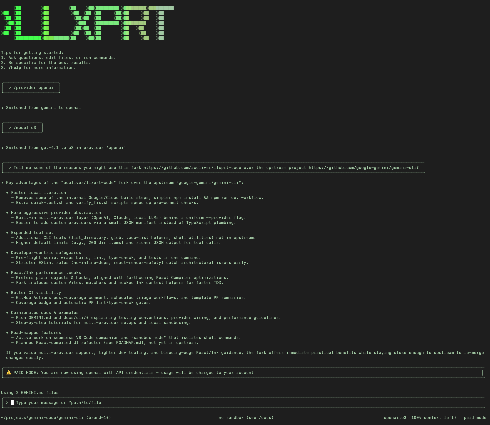

<h1>
  
  <a href="https://vybestack.dev/llxprt-code.html">LLxprt Code</a>
</h1>

[](https://github.com/vybestack/llxprt-code/actions/workflows/ci.yml)
&nbsp;[](https://discord.gg/Wc6dZqWWYv)&nbsp;



**AI-powered coding assistant that works with any LLM provider.** Command-line interface for querying and editing codebases, generating applications, and automating development workflows.

## Free & Subscription Options

Get started immediately with powerful LLM options:

```bash
# Gemini (Google account or API key)
/auth gemini enable
/provider gemini
/model gemini-2.5-flash

# Your Claude Pro / Max subscription
/auth anthropic enable
/provider anthropic
/model claude-opus-4-8

# Your ChatGPT Plus / Pro subscription (Codex)
/auth codex enable
/provider codex
/model gpt-5.5

# Kimi subscription (K2.7 Code, thinking always on)
/provider kimi
/key **************
/model kimi-for-coding
```

## Why Choose LLxprt Code?

- **Use Your Existing Subscriptions**: Use Claude Pro/Max, ChatGPT Plus/Pro (Codex) directly via OAuth. Use Kimi/Synthetic/Chutes subscriptions via keys.
- **Multi-Account Failover**: Configure multiple OAuth accounts that automatically failover on rate limits
- **Load Balancer Profiles**: Balance requests across providers or accounts with automatic failover
- **Free & Low-Cost Tiers**: Start with a Google account (Gemini) or a Qwen account — see [authentication](./docs/cli/authentication.md) for current tier availability
- **Provider Flexibility**: Switch between any Anthropic, Gemini, OpenAI, Kimi, or OpenAI-compatible provider
- **Top Open Models**: Works seamlessly with GLM 5.2, Kimi K2.7 Code, MiniMax M3, and Qwen 3 Coder Next
- **Local Models**: Run models locally with LM Studio, llama.cpp for complete privacy
- **Privacy First**: No telemetry by default, local processing available
- **Subagent Flexibility**: Create agents with different models, providers, or settings
- **Interactive REPL**: Beautiful terminal UI with multiple themes
- **Zed Integration**: Native Zed editor integration for seamless workflow

```bash
# macOS (Homebrew)
brew tap vybestack/homebrew-tap
brew update
brew install llxprt-code

# npm
npm install -g @vybestack/llxprt-code

# Start coding
llxprt

# Try without installing
npx @vybestack/llxprt-code --provider synthetic --model hf:zai-org/GLM-4.7 --keyfile ~/.synthetic_key "simplify the README.md"
```

## What is LLxprt Code?

LLxprt Code is a command-line AI assistant designed for developers who want powerful LLM capabilities without leaving their terminal. Unlike GitHub Copilot or ChatGPT, LLxprt Code works with **any provider** and can run **locally** for complete privacy.

**Key differences:**

- **Open source & community driven**: Not locked into proprietary ecosystems
- **Provider agnostic**: Not locked into one AI service
- **Local-first**: Run entirely offline if needed
- **Developer-centric**: Built specifically for coding workflows
- **Terminal native**: Designed for CLI workflows, not web interfaces

## Quick Start

1. **Prerequisites:** Node.js 24+ installed (not required for Homebrew)
2. **Install:**

   ```bash
   # macOS (Homebrew)
   brew tap vybestack/homebrew-tap
   brew update
   brew install llxprt-code

   # npm
   npm install -g @vybestack/llxprt-code
   # Or try without installing:
   npx @vybestack/llxprt-code
   ```

3. **Run:** `llxprt`
4. **Choose provider:** Use `/provider` to select your preferred LLM service
5. **Start coding:** Ask questions, generate code, or analyze projects

**First session example:**

```bash
cd your-project/
llxprt
> Explain the architecture of this codebase and suggest improvements
> Create a test file for the user authentication module
> Help me debug this error: [paste error message]
```

## Key Features

- **Subscription OAuth** - Use Claude Pro/Max, ChatGPT Plus/Pro (Codex), or Kimi subscriptions directly
- **Free & Low-Cost Tiers** - Gemini (Google account) and Qwen — see [authentication](./docs/cli/authentication.md) for current availability
- **Multi-Account Failover** - Configure multiple OAuth buckets that failover automatically on rate limits
- **Load Balancer Profiles** - Balance across providers/accounts with roundrobin or failover policies
- **Extensive Provider Support** - Anthropic, Gemini, OpenAI, Kimi, and any OpenAI-compatible provider [**Provider Guide →**](./docs/providers/quick-reference.md)
- **Top Open Models** - GLM 5.2, Kimi K2.7 Code, MiniMax M3, Qwen 3 Coder Next
- **Local Model Support** - LM Studio, llama.cpp, Ollama for complete privacy
- **Profile System** - Save provider configurations and model settings
- **Advanced Subagents** - Isolated AI assistants with different models/providers
- **MCP Integration** - Connect to external tools and services
- **Beautiful Terminal UI** - Multiple themes with syntax highlighting

## Interactive vs Non-Interactive Workflows

**Interactive Mode (REPL):**
Perfect for exploration, rapid prototyping, and iterative development:

```bash
# Start interactive session
llxprt

> Explore this codebase and suggest improvements
> Create a REST API endpoint with tests
> Debug this authentication issue
> Optimize this database query
```

**Non-Interactive Mode:**
Ideal for automation, CI/CD, and scripted workflows:

```bash
# Single command with immediate response
llxprt --profile-load zai-glm5 "Refactor this function for better readability"
llxprt "Generate unit tests for payment module" > tests/payment.test.js
```

## Top Open Weight Models

LLxprt Code works seamlessly with the best open-weight models. The specs below are illustrative vendor capabilities, not necessarily the built-in provider defaults — see the [Provider Quick Reference](./docs/providers/quick-reference.md) for the model IDs and context limits LLxprt ships with.

### Kimi K2.7 Code

- **Context Window**: 262,144 tokens (256K)
- **Architecture**: Trillion-parameter MoE (32B active)
- **Strengths**: Long-horizon agentic coding, multi-step tool orchestration, ~30% fewer reasoning tokens than K2.6
- **Special**: Thinking mode is always on (no non-thinking mode; in Kimi Code, disabling thinking falls back to K2.6)

```bash
/provider kimi
/model kimi-for-coding
# Or via Synthetic/Chutes:
/provider synthetic
/model hf:moonshotai/Kimi-K2.7-Code
```

### GLM 5.2

- **Context Window**: 1M tokens (API key)
- **Max Output**: 131,072 tokens
- **Architecture**: Mixture-of-Experts with 744B total parameters (40B active)
- **Strengths**: Long-horizon coding, multi-step planning, flexible thinking effort (High/Max)

### MiniMax M3

- **Context Window**: 1M tokens (API key)
- **Architecture**: MoE with 428B total parameters (23B active)
- **Strengths**: Coding workflows, multi-step agents, tool calling, native multimodal input

### Qwen 3 Coder Next

- **Context Window**: 262,144 tokens (256K native, extendable to ~1M with YaRN)
- **Architecture**: Hybrid-attention MoE with 80B total parameters (3B active)
- **Strengths**: Agentic coding, browser automation, tool usage
- **Performance**: Strong on SWE-bench Verified (~70%)

## Local Models

Run models completely offline for maximum privacy:

```bash
# With LM Studio
/provider openai
/baseurl http://localhost:1234/v1/
/model your-local-model

# With Ollama (OpenAI-compatible endpoint)
/provider openai
/baseurl http://localhost:11434/v1/
/model qwen2.5-coder
```

Supported local providers:

- **LM Studio**: Easy Windows/Mac/Linux setup
- **llama.cpp**: Maximum performance and control
- **Ollama**: Simple model management
- **Any OpenAI-compatible API**: Full flexibility

## Advanced Subagents

Create specialized AI assistants with isolated contexts and different configurations:

```bash
# Subagents run with custom profiles and tool access
# Access via the commands interface
/subagent list
/subagent create <name>
```

Each subagent can be configured with:

- **Different providers** (Gemini vs Anthropic vs Qwen vs Local)
- **Different models** (Flash vs Sonnet vs GLM 5 vs Custom)
- **Different tool access** (Restrict or allow specific tools)
- **Different settings** (Temperature, timeouts, max turns)
- **Isolated runtime context** (No memory or state crossover)

Subagents are designed for:

- **Specialized tasks** (Code review, debugging, documentation)
- **Different expertise areas** (Frontend vs Backend vs DevOps)
- **Tool-limited environments** (Read-only analysis vs Full development)
- **Experimental configurations** (Testing new models or settings)

**[Full Subagent Documentation →](./docs/subagents.md)**

## Zed Integration

LLxprt Code integrates with the [Zed editor](https://zed.dev) using the Agent Communication Protocol (ACP):

```json
{
  "agent_servers": {
    "llxprt": {
      "command": "/opt/homebrew/bin/llxprt",
      "args": ["--experimental-acp", "--profile-load", "my-profile", "--yolo"]
    }
  }
}
```

Configure in Zed's `settings.json` under `agent_servers`. Use `which llxprt` to find your binary path.

Features:

- **In-editor chat**: Direct AI interaction without leaving Zed
- **Code selection**: Ask about specific code selections
- **Project awareness**: Full context of your open workspace
- **Multiple providers**: Configure different agents for Claude, OpenAI, Gemini, etc.

**[Zed Integration Guide →](./docs/zed-integration.md)**

** [Complete Provider Guide →](./docs/cli/providers.md)**

## Advanced Features

- **Settings & Profiles**: Fine-tune model parameters and save configurations
- **Subagents**: Create specialized assistants for different tasks
- **MCP Servers**: Connect external tools and data sources
- **Checkpointing**: Save and resume complex conversations
- **IDE Integration**: Connect to VS Code and other editors

** [Full Documentation →](./docs/index.md)**

## Migration & Resources

- **From Gemini CLI**: [Migration Guide](./docs/gemini-cli-tips.md)
- **Local Models Setup**: [Local Models Guide](./docs/local-models.md)
- **Command Reference**: [CLI Commands](./docs/cli/commands.md)
- **Troubleshooting**: [Common Issues](./docs/troubleshooting.md)

## Privacy & Terms

LLxprt Code does not collect telemetry by default. Your data stays with you unless you choose to send it to external AI providers.

When using external services, their respective terms of service apply:

- [OpenAI Terms](https://openai.com/policies/terms-of-use)
- [Anthropic Terms](https://www.anthropic.com/legal/terms)
- [Google Terms](https://policies.google.com/terms)
