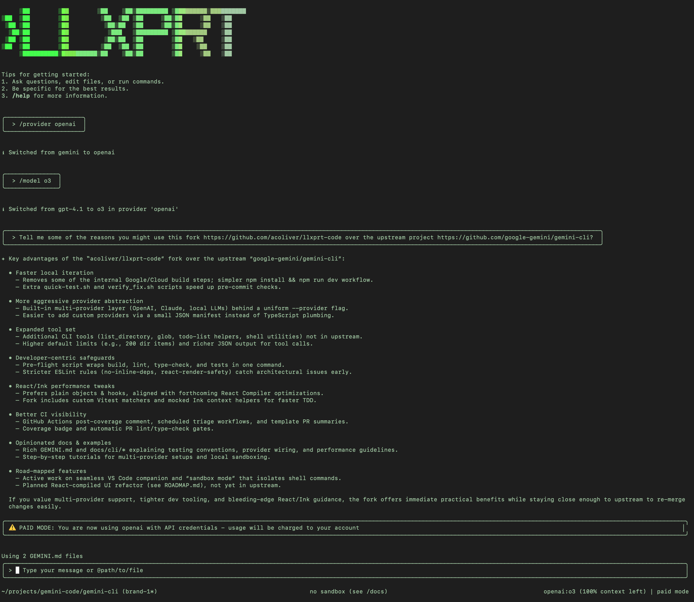

# LLxprt Code

[](https://github.com/vybestack/llxprt-code/actions/workflows/ci.yml)
&nbsp;[](https://github.com/Piebald-AI/awesome-gemini-cli)&nbsp;[](https://discord.gg/Wc6dZqWWYv)



**可与任何LLM提供商一起使用的AI驱动编码助手。** 用于查询和编辑代码库、生成应用程序和自动化开发工作流的命令行界面。

## 免费与订阅选项

立即开始使用强大的LLM选项：

```bash
# 免费的Gemini模型
/auth gemini enable
/provider gemini
/model gemini-2.5-flash

# 免费的Qwen模型
/auth qwen enable
/provider qwen
/model qwen-3-coder

# 您的Claude Pro / Max订阅
/auth anthropic enable
/provider anthropic
/model claude-sonnet-4-5
```

## 为什么选择LLxprt Code？

- **免费层级支持**：立即使用Gemini、Qwen或您现有的Claude账户开始编码
- **提供商灵活性**：在任何Anthropic、Gemini或OpenAI兼容的提供商之间切换
- **顶尖开源模型**：与GLM 4.6、MiniMax-2和Qwen 3 Coder无缝工作
- **本地模型**：使用LM Studio、llama.cpp本地运行模型以获得完全隐私
- **隐私优先**：默认不收集遥测数据，可进行本地处理
- **子代理灵活性**：创建具有不同模型、提供商或设置的代理
- **[ACTION] 实时**：具有美观主题的交互式REPL
- **Zed集成**：原生Zed编辑器集成，实现无缝工作流

```bash
# 安装并开始使用
npm install -g @vybestack/llxprt-code
llxprt

# 无需安装尝试
npx @vybestack/llxprt-code --provider synthetic --model hf:zai-org/GLM-4.6 --keyfile ~/.synthetic_key "简化README.md"
```

## 什么是LLxprt Code？

LLxprt Code是一个专为希望在终端内获得强大LLM功能的开发者设计的命令行AI助手。与GitHub Copilot或ChatGPT不同，LLxprt Code可与**任何提供商**一起工作，并且可以**本地**运行以获得完全隐私。

**主要区别：**

- **开源与社区驱动**：不被锁定在专有生态系统中
- **提供商不可知**：不被锁定在一种AI服务中
- **本地优先**：如需要可完全离线运行
- **以开发者为中心**：专为编码工作流构建
- **终端原生**：为CLI工作流而不是Web界面设计

## 快速开始

1. **先决条件：** 安装Node.js 20+
2. **安装：**
   ```bash
   npm install -g @vybestack/llxprt-code
   # 或者无需安装尝试：
   npx @vybestack/llxprt-code
   ```
3. **运行：** `llxprt`
4. **选择提供商：** 使用`/provider`选择您首选的LLM服务
5. **开始编码：** 提问、生成代码或分析项目

**首次会话示例：**

```bash
cd your-project/
llxprt
> 解释这个代码库的架构并建议改进
> 为用户认证模块创建一个测试文件
> 帮我调试这个错误：[粘贴错误消息]
```

## 主要功能

- **免费与订阅选项** - Gemini、Qwen（免费）、Claude Pro/Max（订阅）
- **广泛的提供商支持** - 任何Anthropic、Gemini或OpenAI兼容的提供商 [**提供商指南 →**](./docs/providers/quick-reference.md)
- **顶尖开源模型** - GLM 4.6、MiniMax-2、Qwen 3 Coder
- **本地模型支持** - LM Studio、llama.cpp、Ollama以获得完全隐私
- **配置文件系统** - 保存提供商配置和模型设置
- **高级子代理** - 具有不同模型/提供商的隔离AI助手
- **MCP集成** - 连接到外部工具和服务
- **美观的终端UI** - 具有语法高亮的多种主题

## 交互式与非交互式工作流

**交互式模式（REPL）：**
非常适合探索、快速原型制作和迭代开发：

```bash
# 开始交互式会话
llxprt

> 探索此代码库并提出改进建议
> 创建一个带有测试的REST API端点
> 调试这个认证问题
> 优化这个数据库查询
```

**非交互式模式：**
非常适合自动化、CI/CD和脚本化工作流：

```bash
# 带有即时响应的单个命令
llxprt --profile-load zai-glm46 "重构这个函数以提高可读性"
llxprt "为支付模块生成单元测试" > tests/payment.test.js
```

## 顶尖开源权重模型

LLxprt Code与最佳开源权重模型无缝工作：

### GLM 4.6

- **上下文窗口**：200,000令牌
- **架构**：具有355B总参数（32B活动）的专家混合模型
- **优势**：编码、多步骤规划、工具集成
- **相比上一代减少15%的令牌**，用于等效任务

### MiniMax-2

- **上下文窗口**：约204,800令牌
- **架构**：具有230B总参数（10B活动）的MoE
- **优势**：编码工作流、多步骤代理、工具调用
- **成本**：仅为Claude Sonnet的8%，速度约快2倍

### Qwen 3 Coder

- **上下文窗口**：256,000令牌（可扩展至1M）
- **架构**：具有480B总参数（35B活动）的MoE
- **优势**：代理编码、浏览器自动化、工具使用
- **性能**：在SWE-bench Verified上达到最先进的水平（69.6%）

## 本地模型

完全离线运行模型以获得最大隐私：

```bash
# 使用LM Studio
/provider openai
/baseurl http://localhost:1234/v1/
/model your-local-model

# 使用Ollama
/provider ollama
/model codellama:13b
```

支持的本地提供商：

- **LM Studio**：简单的Windows/Mac/Linux设置
- **llama.cpp**：最大的性能和控制
- **Ollama**：简单的模型管理
- **任何OpenAI兼容的API**：完全灵活性

## 高级子代理

创建具有隔离上下文和不同配置的专业AI助手：

```bash
# 子代理使用自定义配置文件和工具访问权限运行
# 通过命令界面访问
/subagent list
/subagent create <name>
```

每个子代理可以配置：

- **不同的提供商**（Gemini vs Anthropic vs Qwen vs 本地）
- **不同的模型**（Flash vs Sonnet vs GLM 4.6 vs 自定义）
- **不同的工具访问权限**（限制或允许特定工具）
- **不同的设置**（温度、超时、最大轮次）
- **隔离的运行时上下文**（没有内存或状态交叉）

子代理设计用于：

- **专业任务**（代码审查、调试、文档）
- **不同的专业领域**（前端 vs 后端 vs DevOps）
- **工具限制环境**（只读分析 vs 完全开发）
- **实验配置**（测试新模型或设置）

**[完整子代理文档 →](./docs/subagents.md)**

## Zed集成

原生Zed编辑器支持，实现无缝开发工作流：

```bash
# 安装Zed扩展
zed:install llxprt-code

# 在Zed内使用
# （有关Zed集成设置，请参阅文档）
```

功能：

- **编辑器内聊天**：直接在Zed内进行AI交互，无需离开
- **代码选择**：询问特定代码选择
- **内联建议**：在输入时获得AI帮助
- **项目感知**：打开工作区的完整上下文

**[Zed集成指南 →](./docs/zed-integration.md)**

**[完整提供商指南 →](./docs/cli/providers.md)**

## 高级功能

- **设置与配置文件**：微调模型参数并保存配置
- **子代理**：为不同任务创建专业助手
- **MCP服务器**：连接外部工具和数据源
- **检查点**：保存和恢复复杂对话
- **IDE集成**：连接到VS Code和其他编辑器

**[完整文档 →](./docs/index.md)**

## 迁移与资源

- **从Gemini CLI**：[迁移指南](./docs/gemini-cli-tips.md)
- **本地模型设置**：[本地模型指南](./docs/local-models.md)
- **命令参考**：[CLI命令](./docs/cli/commands.md)
- **故障排除**：[常见问题](./docs/troubleshooting.md)

## 隐私与条款

LLxprt Code默认不收集遥测数据。除非您选择将其发送到外部AI提供商，否则数据将保留在您这里。

使用外部服务时，它们各自的服务条款适用：

- [OpenAI条款](https://openai.com/policies/terms-of-use)
- [Anthropic条款](https://www.anthropic.com/legal/terms)
- [Google条款](https://policies.google.com/terms)
