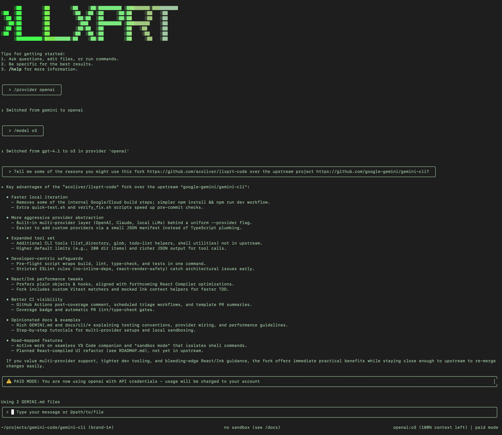

<h1>
  
  <a href="https://vybestack.dev/llxprt-code.html">LLxprt Code</a>
</h1>

[](https://github.com/vybestack/llxprt-code/actions/workflows/ci.yml)
&nbsp;[](https://discord.gg/Wc6dZqWWYv)&nbsp;



**可与任何LLM提供商一起使用的AI驱动编码助手。** 用于查询和编辑代码库、生成应用程序和自动化开发工作流的命令行界面。

## 免费与订阅选项

立即开始使用强大的LLM选项：

```bash
# Gemini（Google账户或API密钥）
/auth gemini enable
/provider gemini
/model gemini-2.5-flash

# 您的Claude Pro / Max订阅
/auth anthropic enable
/provider anthropic
/model claude-opus-4-8

# 您的ChatGPT Plus / Pro订阅（Codex）
/auth codex enable
/provider codex
/model gpt-5.5

# Kimi订阅（Kimi K3，1M上下文，原生视觉，思考模式始终开启）
/provider kimi
/key **************
/model kimi-for-coding
```

## 为什么选择LLxprt Code？

- **使用您现有的订阅**：通过OAuth直接使用Claude Pro/Max、ChatGPT Plus/Pro（Codex）。通过密钥使用Kimi/Synthetic/Chutes订阅
- **多账户故障转移**：配置多个OAuth账户，在达到速率限制时自动故障转移
- **负载均衡配置文件**：在提供商或账户之间平衡请求，并自动故障转移
- **免费与低成本层级**：从Google账户（Gemini）或Qwen账户开始 — 有关当前层级可用性，请参阅[身份验证](./docs/cli/authentication.md)
- **提供商灵活性**：在任何Anthropic、Gemini、OpenAI、Kimi或OpenAI兼容的提供商之间切换
- **顶尖开源模型**：与GLM 5.2、Kimi K3、MiniMax M3和Qwen 3 Coder Next无缝工作
- **本地模型**：使用LM Studio、llama.cpp本地运行模型以获得完全隐私
- **隐私优先**：默认不收集遥测数据，可进行本地处理
- **子代理灵活性**：创建具有不同模型、提供商或设置的代理
- **交互式REPL**：具有多种主题的美观终端UI
- **Zed集成**：原生Zed编辑器集成，实现无缝工作流

```bash
# macOS（Homebrew）
brew tap vybestack/homebrew-tap
brew update
brew install llxprt-code

# npm
npm install -g @vybestack/llxprt-code

# 开始编码
llxprt

# 无需安装尝试
npx @vybestack/llxprt-code --provider synthetic --model hf:zai-org/GLM-4.7 --keyfile ~/.synthetic_key "简化README.md"
```

## 什么是LLxprt Code？

LLxprt Code是一个专为希望在终端内获得强大LLM功能的开发者设计的命令行AI助手。与GitHub Copilot或ChatGPT不同，LLxprt Code可与**任何提供商**一起工作，并且可以**本地**运行以获得完全隐私。

**主要区别：**

- **开源与社区驱动**：不被锁定在专有生态系统中
- **提供商不可知**：不被锁定在一种AI服务中
- **本地优先**：如需要可完全离线运行
- **以开发者为中心**：专为编码工作流构建
- **终端原生**：为CLI工作流而不是Web界面设计

## 快速开始

1. **先决条件：** 安装Node.js 24+（Homebrew安装不需要）

   > **注意：** LLxprt Code在底层运行于[Bun](https://bun.sh)运行时。Node.js仍然是调用的兼容性目标 — 下面的npm/npx/Homebrew安装命令保持不变。发布的包将Bun捆绑为依赖项，因此大多数用户永远不需要单独安装Bun。如果Bun缺失，请参阅[Bun回退](#bun运行时与安装回退)部分。

2. **安装：**

   ```bash
   # macOS（Homebrew）
   brew tap vybestack/homebrew-tap
   brew update
   brew install llxprt-code

   # npm
   npm install -g @vybestack/llxprt-code
   # 或者无需安装尝试：
   npx @vybestack/llxprt-code
   ```

3. **运行：** `llxprt`
4. **选择提供商：** 使用`/provider`选择您首选的LLM服务
5. **开始编码：** 提问、生成代码或分析项目

### Bun运行时与安装回退

LLxprt Code由[Bun](https://bun.sh)运行时驱动。当您运行`llxprt`时，平台原生启动器（`packages/cli/bin/llxprt`）会解析包捆绑的Bun并直接执行TypeScript入口点（`packages/cli/index.ts`）— 在已安装的命令路径上不会启动Node进程。CLI的运行路径不需要预编译的CLI `dist/`工件或已停用的`bundle/llxprt.js`工件。

**Bun解析（生产启动器）：**

1. 包本地：`<package>/node_modules/bun/bin/bun.exe`（包固定的Bun依赖项）
   - **回退：** `@oven/bun-<platform>/bin/bun[.exe]`变体（仅在`bun/bin/bun.exe`不存在时探测 — 见下方[npm v12说明](#npm-v12安装脚本默认拒绝)）
2. 提升（仅限已安装的包）：外层的`node_modules/bun/bin/bun.exe`（npm/Bun提升），在外层`node_modules`边界处停止 — 永远不会爬升到消费者的上级目录
   - **回退：** 外层`node_modules`内的`@oven/bun-<platform>`变体
3. 工作区根目录（仅限源工作区）：当包不在`node_modules`下且仓库根目录是经过验证的llxprt-code工作区（其清单引用此包）时，使用该经过验证的根目录的`node_modules/bun/bin/bun.exe`
   - **回退：** 工作区根目录的`@oven/bun-<platform>`变体

在macOS上，已经存在于`PATH`上且满足固定版本最低要求的Bun优先于以上所有路径（issue #2962），以避免npm重新提取运行中可执行文件导致的凭证访问中断。

启动器永远不会扫描`.bin`符号链接。当包的`package.json`声明了精确的Bun固定版本（例如`1.3.14`）时，`package.json`/版本缺失或不匹配的候选项将被拒绝。

#### npm v12安装脚本默认拒绝

npm v12（RFC 0054）默认禁用依赖安装脚本。`bun`包通过`postinstall`将其二进制文件从`@oven/bun-<platform>`可选依赖移动到`bun/bin/bun.exe`。当安装脚本被阻止时，该二进制文件永远不会出现。LLxprt Code将全部16个`@oven/bun-<platform>`包声明为自己的`optionalDependencies`；这些tarball仅包含`bin/bun[.exe]`且没有安装脚本，因此在默认拒绝下仍会出现。启动器和TypeScript解析器在`bun/bin/bun.exe`不存在时回退到它们。主机检测（CPU特性、ABI）仅在此回退路径上运行 — 正常安装永远不会fork检测子进程。

只有在以上每个候选项都已探测并被拒绝之后 — 包括每一层级及其`@oven`回退，以及macOS的`PATH`优先路径 — 启动器才会打印可操作的错误（退出码43）：

> LLxprt Code: bundled Bun runtime was not found. Reinstall the package with "npm install @vybestack/llxprt-code" to restore the bundled Bun dependency, or visit https://bun.sh

解决方法：

- **npm用户：** 重新运行`npm install @vybestack/llxprt-code`（或`npm install -g @vybestack/llxprt-code`）以恢复捆绑的Bun依赖项。
- **Homebrew用户：** 运行`brew upgrade llxprt-code`获取最新配方，或运行`brew reinstall llxprt-code`恢复损坏的安装。
- **所有用户：** 如果无法恢复捆绑的Bun依赖项，重新安装包是受支持的路径。除上文所述的macOS `PATH`优先路径外，启动器不会使用单独安装的全局Bun。

**Windows pty注意事项：** 在Windows上，`node-pty`模块存在已知的终端调整大小竞争条件（`Cannot resize a pty that has already exited`）。CLI在进程级别静默此特定错误。在POSIX系统上，Bun下使用专用的`bun-pty`适配器（`packages/core/src/utils/bunPtyAdapter.ts`）代替`node-pty`以解决Bun挂起问题。Windows使用`@lydell/node-pty`（以`node-pty`作为回退），而不是Bun适配器。如果您在Windows上遇到终端大小调整问题，请使用兼容的终端模拟器；调整大小竞争在`node-pty`本身中，而不是Bun运行时中。

**首次会话示例：**

```bash
cd your-project/
llxprt
> 解释这个代码库的架构并建议改进
> 为用户认证模块创建一个测试文件
> 帮我调试这个错误：[粘贴错误消息]
```

## 主要功能

- **订阅OAuth** - 直接使用Claude Pro/Max、ChatGPT Plus/Pro（Codex）或Kimi订阅
- **免费与低成本层级** - Gemini（Google账户）和Qwen — 有关当前可用性，请参阅[身份验证](./docs/cli/authentication.md)
- **多账户故障转移** - 配置多个OAuth存储桶，在达到速率限制时自动故障转移
- **负载均衡配置文件** - 使用roundrobin或failover策略在提供商/账户之间平衡
- **广泛的提供商支持** - Anthropic、Gemini、OpenAI、Kimi以及任何OpenAI兼容的提供商 [**提供商指南 →**](./docs/providers/quick-reference.md)
- **顶尖开源模型** - GLM 5.2、Kimi K3、MiniMax M3、Qwen 3 Coder Next
- **本地模型支持** - LM Studio、llama.cpp、Ollama以获得完全隐私
- **配置文件系统** - 保存提供商配置和模型设置
- **高级子代理** - 具有不同模型/提供商的隔离AI助手
- **MCP集成** - 连接到外部工具和服务
- **美观的终端UI** - 具有语法高亮的多种主题

## 交互式与非交互式工作流

**交互式模式（REPL）：**
非常适合探索、快速原型制作和迭代开发：

```bash
# 开始交互式会话
llxprt

> 探索此代码库并提出改进建议
> 创建一个带有测试的REST API端点
> 调试这个认证问题
> 优化这个数据库查询
```

**非交互式模式：**
非常适合自动化、CI/CD和脚本化工作流：

```bash
# 带有即时响应的单个命令
llxprt --profile-load zai-glm5 "重构这个函数以提高可读性"
llxprt "为支付模块生成单元测试" > tests/payment.test.js
```

## 顶尖开源权重模型

LLxprt Code与最佳开源权重模型无缝工作。以下规格是说明性的供应商能力，不一定是内置的提供商默认值 — 有关LLxprt附带的模型ID和上下文限制，请参阅[提供商快速参考](./docs/providers/quick-reference.md)。

### Kimi K3

- **上下文窗口**：1,000,000令牌（1M）
- **架构**：具有始终开启思考模式的前沿MoE
- **优势**：长视野代理编码、多步骤工具编排、原生视觉（图像和视频）
- **特殊**：思考模式始终开启且无法禁用；`reasoning.effort`接受`low` / `high` / `max`（默认`max`）
- **视觉**：原生支持，但需要base64或`ms://<file-id>`输入（不支持公共图像URL）

```bash
# 订阅提供的模型（Kimi Code订阅）
/provider kimi
/model kimi-for-coding

# 或在Moonshot API上按令牌付费（模型ID：kimi-k3）
/provider kimi
/baseurl https://api.moonshot.ai/v1
/keyfile ~/.moonshot_key
/model kimi-k3

# 或通过Synthetic/Chutes：
/provider synthetic
/model hf:moonshotai/Kimi-K3
```

### GLM 5.2

- **上下文窗口**：1M令牌（API密钥）
- **最大输出**：131,072令牌
- **架构**：具有744B总参数（40B活动）的专家混合模型
- **优势**：长视野编码、多步骤规划、灵活的思考力度（High/Max）

### MiniMax M3

- **上下文窗口**：1M令牌（API密钥）
- **架构**：具有428B总参数（23B活动）的MoE
- **优势**：编码工作流、多步骤代理、工具调用、原生多模态输入

### Qwen 3 Coder Next

- **上下文窗口**：262,144令牌（256K原生，通过YaRN可扩展至约1M）
- **架构**：具有80B总参数（3B活动）的混合注意力MoE
- **优势**：代理编码、浏览器自动化、工具使用
- **性能**：在SWE-bench Verified上表现强劲（约70%）

## 本地模型

完全离线运行模型以获得最大隐私：

```bash
# 使用LM Studio
/provider openai
/baseurl http://localhost:1234/v1/
/model your-local-model

# 使用Ollama（OpenAI兼容端点）
/provider openai
/baseurl http://localhost:11434/v1/
/model qwen2.5-coder
```

支持的本地提供商：

- **LM Studio**：简单的Windows/Mac/Linux设置
- **llama.cpp**：最大的性能和控制
- **Ollama**：简单的模型管理
- **任何OpenAI兼容的API**：完全灵活性

## 高级子代理

创建具有隔离上下文和不同配置的专业AI助手：

```bash
# 子代理使用自定义配置文件和工具访问权限运行
# 通过命令界面访问
/subagent list
/subagent create <name>
```

每个子代理可以配置：

- **不同的提供商**（Gemini vs Anthropic vs Qwen vs 本地）
- **不同的模型**（Flash vs Sonnet vs GLM 5 vs 自定义）
- **不同的工具访问权限**（限制或允许特定工具）
- **不同的设置**（温度、超时、最大轮次）
- **隔离的运行时上下文**（没有内存或状态交叉）

子代理设计用于：

- **专业任务**（代码审查、调试、文档）
- **不同的专业领域**（前端 vs 后端 vs DevOps）
- **工具限制环境**（只读分析 vs 完全开发）
- **实验配置**（测试新模型或设置）

**[完整子代理文档 →](./docs/subagents.md)**

## Zed集成

LLxprt Code使用代理通信协议（ACP）与[Zed编辑器](https://zed.dev)集成：

```json
{
  "agent_servers": {
    "llxprt": {
      "command": "/opt/homebrew/bin/llxprt",
      "args": ["--experimental-acp", "--profile-load", "my-profile", "--yolo"]
    }
  }
}
```

在Zed的`settings.json`中的`agent_servers`下进行配置。使用`which llxprt`查找您的二进制文件路径。

功能：

- **编辑器内聊天**：直接在Zed内进行AI交互，无需离开
- **代码选择**：询问特定代码选择
- **项目感知**：打开工作区的完整上下文
- **多提供商**：为Claude、OpenAI、Gemini等配置不同的代理

**[Zed集成指南 →](./docs/zed-integration.md)**

**[完整提供商指南 →](./docs/cli/providers.md)**

## 高级功能

- **设置与配置文件**：微调模型参数并保存配置
- **子代理**：为不同任务创建专业助手
- **MCP服务器**：连接外部工具和数据源
- **检查点**：保存和恢复复杂对话
- **IDE集成**：连接到VS Code和其他编辑器

**[完整文档 →](./docs/index.md)**

## 迁移与资源

- **从Gemini CLI**：[迁移指南](./docs/gemini-cli-tips.md)
- **本地模型设置**：[本地模型指南](./docs/local-models.md)
- **命令参考**：[CLI命令](./docs/cli/commands.md)
- **故障排除**：[常见问题](./docs/troubleshooting.md)

## 隐私与条款

LLxprt Code默认不收集遥测数据。除非您选择将其发送到外部AI提供商，否则数据将保留在您这里。

使用外部服务时，它们各自的服务条款适用：

- [OpenAI条款](https://openai.com/policies/terms-of-use)
- [Anthropic条款](https://www.anthropic.com/legal/terms)
- [Google条款](https://policies.google.com/terms)
