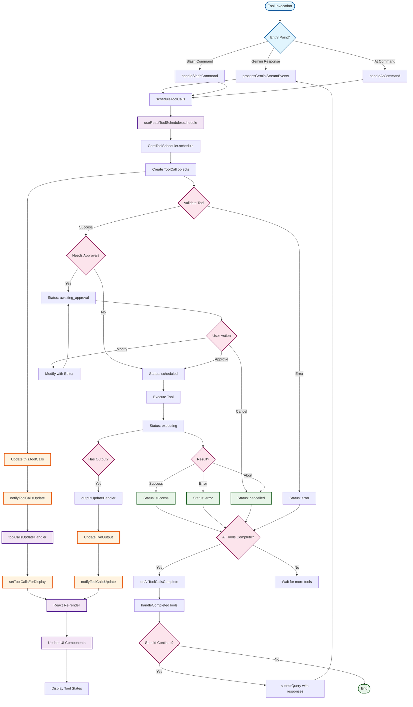

# Tool Execution Flow Diagram

## Visual Flow Representation



## Key State Update Points

### 1. **Initial Tool Creation**
```
CoreToolScheduler.schedule() 
└─> this.toolCalls = [...] 
    └─> notifyToolCallsUpdate() 
        └─> React setState
```

### 2. **Status Transitions**
```
setStatusInternal(callId, newStatus) 
└─> this.toolCalls = this.toolCalls.map(...) 
    └─> notifyToolCallsUpdate() 
        └─> React setState
```

### 3. **Live Output Updates**
```
Tool execution with liveOutputCallback 
└─> outputUpdateHandler(callId, output) 
    ├─> setPendingHistoryItem (React setState)
    └─> this.toolCalls = this.toolCalls.map(...) 
        └─> notifyToolCallsUpdate() 
            └─> React setState
```

### 4. **Completion Flow**
```
All tools complete 
└─> onAllToolCallsComplete(completedTools) 
    └─> handleCompletedTools (in useGeminiStream) 
        └─> submitQuery (continuation) 
            └─> New stream → Potential new tools
```

## Circular Dependency Patterns

### Pattern 1: Tool → Stream → Tool Loop
```
┌─────────────────┐
│   Tool Calls    │
└────────┬────────┘
         │ Complete
         ▼
┌─────────────────┐
│ Submit Response │
└────────┬────────┘
         │ 
         ▼
┌─────────────────┐
│  Gemini Stream  │
└────────┬────────┘
         │ New tool request
         ▼
┌─────────────────┐
│   Tool Calls    │ ← Loop back
└─────────────────┘
```

### Pattern 2: State Update Cascade
```
Tool State Change 
├─> CoreToolScheduler state update
├─> React toolCallsForDisplay update
├─> React pendingHistoryItem update
├─> UI Re-render
└─> Computed streamingState update
    └─> UI Re-render (again)
```

## Guards Against Infinite Loops

1. **isResponding Guard**
   - Prevents new tool scheduling while stream is active
   - Located in handleCompletedTools

2. **Tool State Machine**
   - Tools can only transition forward in states
   - Terminal states (success/error/cancelled) are final

3. **Abort Signal**
   - User can cancel with ESC key
   - Propagates through entire tool chain

4. **Memory Tool Deduplication**
   - processedMemoryToolsRef prevents re-processing
   - Only new memory saves trigger refresh

5. **Model Switch Flag**
   - modelSwitchedFromQuotaError prevents continuation
   - Set when quota errors cause model fallback