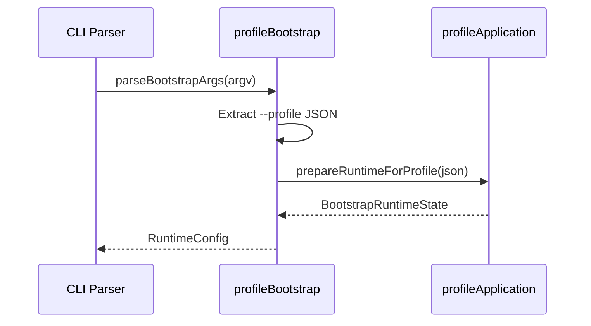

# 🗂️ Autonomous Plan-Creation Guide for Claude Workers

This document defines how to create foolproof implementation plans that prevent Claude fraud and ensure valid TDD implementations through autonomous worker execution.

**CRITICAL**: When executing plans, you MUST follow the coordination rules in [COORDINATING.md](./COORDINATING.md) and use the [PLAN-TEMPLATE.md](./PLAN-TEMPLATE.md) for generating plans.

---

## Core Principles

1. **TDD is MANDATORY** - Every line of production code must be written in response to a failing test
2. **Worker Isolation** - Each phase executed by fresh worker instance with clean context
3. **Architect-First** - All plans begin with architect-written specification
4. **Analysis Before Code** - Mandatory analysis/pseudocode phases before implementation
5. **Aggressive Verification** - Multi-layered fraud detection at every step
6. **No Reverse Testing** - Tests NEVER check for NotYetImplemented or stub behavior
7. **Modify, Don't Duplicate** - Always UPDATE existing files, never create parallel versions
8. **NO ISOLATED FEATURES** - Every feature MUST be integrated into the existing system, not built in isolation
9. **Integration-First Testing** - Integration tests written BEFORE unit tests to verify component contracts
10. **Preflight Verification** - All assumptions verified BEFORE implementation begins
11. **Semantic over Structural** - Verify features WORK, not just that files/markers exist

---

## CRITICAL: Phase Numbering and Execution

### Sequential Execution is MANDATORY

**PROBLEM**: Coordinators skip phase numbers (executing 03, 06, 09, 16 instead of 03, 04, 05, 06, 07, 08, 09, 10, 11, 12, 13, 14, 15, 16).

**SOLUTION**:

1. **NEVER SKIP NUMBERS** - Phases must be executed in exact numerical sequence
2. **USE PLAN IDS** - Every plan gets `PLAN-YYYYMMDD-FEATURE` ID
3. **TAG EVERYTHING** - Every implementation must include `@plan:PLAN-ID.P##` markers

### Required Plan Structure

```markdown
Plan ID: PLAN-20250113-FEATURE
Phases: 03, 04, 05, 06, 07, 08, 09, 10, 11, 12, 13, 14, 15, 16

Execution MUST be:
✅ P03 → Verify → P04 → Verify → P05 → Verify → P06 → Verify → P07...
❌ P03 → P06 → P09 → P16 (WRONG - skipped phases)
```

### Code Traceability Requirements

Every function, test, and class MUST include:

```typescript
/**
 * @plan PLAN-20250113-FEATURE.P07
 * @requirement REQ-003.1
 * @pseudocode lines 42-74
 */
```

### Phase Verification Before Proceeding

Before starting Phase N, coordinator MUST verify:

```bash
# Check previous phase exists
grep -r "@plan:PLAN-ID.P$((N-1))" . || exit 1

# Cannot skip from P06 to P09
# Must do P07, P08 first
```

See [COORDINATING.md](./COORDINATING.md) for detailed execution rules.

---

## CRITICAL: Pseudocode Usage Requirements

### Pseudocode MUST Be Used

**PROBLEM**: Claude frequently creates pseudocode then ignores it completely during implementation.

**SOLUTION**: Implementation phases MUST explicitly reference pseudocode line numbers:

```bash
# WRONG - Pseudocode ignored
"Implement the updateSettings method based on requirements"

# CORRECT - Pseudocode enforced
"Implement updateSettings method (from pseudocode lines 23-34):
- Line 23: VALIDATE changes with provider validator
- Line 24: BEGIN transaction
- Line 25: CLONE current settings
..."
```

### Verification of Pseudocode Compliance

Every implementation phase MUST have verification that compares implementation to pseudocode:

```bash
claude --dangerously-skip-permissions -p "
Compare implementation with pseudocode and verify:
1. Every pseudocode step is implemented
2. Algorithm matches exactly (no shortcuts)
3. Order of operations preserved
4. Error handling matches pseudocode
Report deviations to verification-report.txt
"
```

---

## CRITICAL: Integration Requirements - STOP BUILDING ISOLATED FEATURES

### The Problem Claude Keeps Repeating

**PROBLEM**: Claude constantly builds perfect features in isolation that don't actually solve the problem because they're never connected to the existing system. This is like building a perfect new engine and leaving it in the garage while the broken engine stays in the car.

**EXAMPLES OF THIS STUPIDITY**:

- Building SettingsService but not replacing Config's scattered settings
- Creating authentication system but not connecting it to existing endpoints
- Writing perfect tool handlers but not registering them with the tool registry
- Implementing caching layer but not using it in actual API calls

### MANDATORY Integration Analysis Phase

Every plan MUST include an integration analysis that answers:

1. **What existing code will USE this feature?**
   - List specific files and functions that need to call the new code
   - If answer is "nothing", the feature is useless

2. **What existing code needs to be REPLACED?**
   - Identify the buggy/scattered code being fixed
   - Plan how to deprecate and remove old implementation

3. **How will users ACCESS this feature?**
   - What commands/APIs/UI will invoke it?
   - If users can't reach it, it doesn't exist

4. **What needs to be MIGRATED?**
   - Existing data that needs conversion
   - Existing configs that need updating
   - Existing tests that need modification

5. **Integration Test Requirements**
   - Tests that verify the feature works WITH the existing system
   - Not just unit tests of the feature in isolation

### Required Integration Phases

Every plan MUST include these phases AFTER implementation:

```
06-integration-stub.md         # Wire feature into existing system
06a-integration-stub-verification.md
07-integration-tdd.md          # Tests that feature works IN CONTEXT
07a-integration-tdd-verification.md
08-integration-impl.md         # Actually connect to existing code
08a-integration-impl-verification.md
09-migration.md                # Migrate existing data/config
09a-migration-verification.md
10-deprecation.md              # Remove old implementation
10a-deprecation-verification.md
```

### Integration Checklist

Before ANY implementation starts, verify:

- [ ] Identified all touch points with existing system
- [ ] Listed specific files that will import/use the feature
- [ ] Identified old code to be replaced/removed
- [ ] Planned migration path for existing data
- [ ] Created integration tests that verify end-to-end flow
- [ ] User can actually access the feature through existing UI/CLI

**RED FLAG**: If the feature can be completely implemented without modifying ANY existing files except adding exports, it's probably built in isolation and won't solve the actual problem.

---

## Plan Structure

```
project-plans/<feature-slug>/
  specification.md           ← Architect-written specification
  analysis/                  ← Analysis artifacts
    domain-model.md
    pseudocode/
      component-001.md      ← MUST be referenced in implementation
      component-002.md      ← Line numbers cited in phases
  plan/
    00-overview.md          ← Generated from specification
    01-analysis.md          ← Domain analysis phase
    01a-analysis-verification.md
    02-pseudocode.md        ← Pseudocode development
    02a-pseudocode-verification.md
    03-<feature>-stub.md    ← Feature implementation phases
    03a-<feature>-stub-verification.md
    04-<feature>-tdd.md
    04a-<feature>-tdd-verification.md
    05-<feature>-impl.md    ← MUST reference pseudocode lines
    05a-<feature>-impl-verification.md
    ...
```

---

## Phase 0: Architect Specification (specification.md)

Written by architect worker BEFORE any implementation planning.

### Required Sections:

```markdown
# Feature Specification: <Name>

## Purpose

Clear statement of why this feature exists and what problem it solves.

## Architectural Decisions

- **Pattern**: (e.g., MVC, Event-Driven, Repository)
- **Technology Stack**: Specific versions and libraries
- **Data Flow**: How data moves through the system
- **Integration Points**: External systems/APIs

## Project Structure
```

src/
<module>/
types.ts # Type definitions
service.ts # Business logic
repository.ts # Data access
test/
<module>/
service.spec.ts
repository.spec.ts

````

## Technical Environment
- **Type**: CLI Tool | Web Service | IDE Extension | Library
- **Runtime**: Node.js 20.x | Browser | Electron
- **Dependencies**: List with exact versions

## Integration Points (MANDATORY SECTION)

### Existing Code That Will Use This Feature
- `/src/routes/api.ts` - Will call authentication middleware
- `/src/commands/login.ts` - Will use auth service
- `/src/middleware/protected.ts` - Will validate tokens

### Existing Code To Be Replaced
- `/src/auth/oldAuth.js` - Legacy auth system to be removed
- `/src/utils/tokenHelper.js` - Scattered token logic to consolidate
- Direct database queries in routes - Replace with service calls

### User Access Points
- CLI: `/login` command
- API: `POST /api/auth/login` endpoint
- UI: Login dialog component

### Migration Requirements
- Existing user sessions need migration to new format
- API keys in old format need conversion
- Configuration files need schema update

## Formal Requirements
[REQ-001] User Authentication
  [REQ-001.1] Email/password login with rate limiting
  [REQ-001.2] JWT tokens with 1hr expiry and refresh
  [REQ-001.3] Password reset via email token
  [REQ-001.4] Session tracking with Redis
[REQ-INT-001] Integration Requirements
  [REQ-INT-001.1] Replace existing auth in all API routes
  [REQ-INT-001.2] Update CLI commands to use new auth
  [REQ-INT-001.3] Migrate existing sessions without logout
  [REQ-INT-001.4] Deprecate and remove old auth system

## Data Schemas
```typescript
// User entity
const UserSchema = z.object({
  id: z.string().uuid(),
  email: z.string().email(),
  passwordHash: z.string().min(60),
  createdAt: z.date(),
  updatedAt: z.date()
});

// API request/response
const LoginRequestSchema = z.object({
  email: z.string().email(),
  password: z.string().min(8)
});
````

## Example Data

```json
{
  "validLogin": {
    "email": "user@example.com",
    "password": "SecurePass123!"
  },
  "invalidLogin": {
    "email": "user@example.com",
    "password": "wrong"
  }
}
```

## Constraints

- No external HTTP calls in unit tests
- All async operations must have timeouts
- Password hashing must use bcrypt with cost 12
- Database transactions for multi-table operations

## Performance Requirements

- Login endpoint: <200ms p95 latency
- Token validation: <10ms
- Concurrent users: 1000

````

---

## Phase 0.5: Preflight Verification (MANDATORY)

**PURPOSE**: Verify ALL assumptions before writing any code. This phase prevents the most common planning failures: missing dependencies, wrong types, and impossible call patterns.

### Why This Phase Exists

Historical analysis of plan failures shows that 60%+ of remediation work traces back to incorrect assumptions made during planning:
- Dependencies assumed to exist but not installed
- Type interfaces assumed to match actual code
- Call patterns assumed possible but architecturally blocked
- Test infrastructure assumed present but missing

### Required Verifications

#### 1. Dependency Verification
```bash
# For each library referenced in the plan:
npm ls <dependency-name>    # Must show installed version
grep -r "<dependency>" package.json  # Must find entry

# Example:
npm ls fast-check           # Verify testing library exists
npm ls zod                  # Verify validation library exists
```

**If any dependency is missing**: STOP. Update the plan to either:
- Add the dependency installation as Phase 0.6
- Remove reliance on the missing dependency

#### 2. Type/Interface Verification
```bash
# For each type referenced in the plan, verify it exists and matches expectations:
grep -A 30 "interface <InterfaceName>" packages/*/src/**/*.ts

# Example:
grep -A 20 "interface BootstrapRuntimeState" packages/cli/src/config/profileBootstrap.ts
# Expected: providerName, modelName, warnings
# Verify this MATCHES what the plan says
```

**If types don't match plan assumptions**: STOP. Update the plan to use actual types.

#### 3. Call Path Verification
```bash
# Verify the code paths described in the plan actually exist:
grep -r "<functionName>" packages/*/src --include="*.ts"

# Example:
grep -r "prepareRuntimeForProfile" packages/cli/src --include="*.ts"
# Verify: Called from where? Returns what? Takes what params?
```

**If call paths are impossible**: STOP. Redesign the plan.

#### 4. Test Infrastructure Verification
```bash
# Verify test files exist for components being modified:
ls packages/<package>/src/<path>/__tests__/

# Verify test patterns:
grep -r "describe\|it\|test" packages/<package>/src/<path>/__tests__/*.test.ts | head -5

# Verify test framework setup:
npm run test -- --listTests | grep "<component>"
```

**If test infrastructure is missing**: Add a phase to create it BEFORE implementation.

### Preflight Verification Checklist

Create `plan/00a-preflight-verification.md` with:

```markdown
# Preflight Verification Results

## Dependencies Verified
- [ ] `<dep1>`: `npm ls <dep1>` output: [paste]
- [ ] `<dep2>`: `npm ls <dep2>` output: [paste]

## Types Verified
- [ ] `<TypeName>`: Actual definition matches plan? [yes/no]
  - Expected: [what plan says]
  - Actual: [what code shows]

## Call Paths Verified
- [ ] `<function>`: Can be called from `<caller>`? [yes/no]
  - Evidence: [grep output]

## Test Infrastructure Verified
- [ ] Test file exists: `<path>/__tests__/<file>.test.ts`
- [ ] Test patterns work: [sample output]

## Blocking Issues Found
[List any issues that require plan modification before proceeding]
```

### Verification Gate

**This phase MUST pass before ANY implementation phase begins.**
- If ANY verification fails, update the plan FIRST
- Do NOT proceed with "we'll fix it later" mentality
- The coordinator MUST review preflight results before approving Phase 1

---

## Phase 1: Analysis Phase

### Worker Launch:
```bash
claude --dangerously-skip-permissions -p "
Read specification.md and create detailed domain analysis.
Output to analysis/domain-model.md
Include:
- Entity relationships
- State transitions
- Business rules
- Edge cases
- Error scenarios
" &
````

### Verification Must Check:

- All REQ tags addressed
- No implementation details
- Complete edge case coverage
- Clear business rule definitions

---

## Phase 2: Pseudocode Phase

### Worker Launch:

```bash
claude --dangerously-skip-permissions -p "
Based on specification.md and analysis/domain-model.md,
create detailed pseudocode for each component.
Output to analysis/pseudocode/<component>.md

REQUIREMENTS:
1. Number each line of pseudocode
2. Use clear algorithmic steps
3. Include all error handling
4. Mark transaction boundaries
5. Note where validation occurs

Example format:
```

10: METHOD updateSettings(provider, changes)
11: VALIDATE changes against schema
12: IF validation fails
13: THROW ValidationError with details
14: BEGIN TRANSACTION
15: CLONE current settings
16: MERGE changes into clone
17: PERSIST to repository
18: COMMIT TRANSACTION
19: ON ERROR
20: ROLLBACK TRANSACTION
21: THROW PersistenceError
22: EMIT settings-changed event
23: RETURN updated settings

```

DO NOT write actual TypeScript, only numbered pseudocode
" &
```

### Verification Must Check:

- Pseudocode covers all requirements
- Every line is numbered
- No actual implementation code
- Clear algorithm documentation
- All error paths defined

### Contract-First Pseudocode Requirements (MANDATORY)

Every pseudocode file MUST include three sections:

#### 1. Interface Contracts

```typescript
// INPUTS this component receives:
interface ChatServiceInput {
  message: string;
  conversationId: string;
}

// OUTPUTS this component produces:
interface ChatServiceOutput {
  response: string;
  tokens_used: number;
}

// DEPENDENCIES this component requires (NEVER stubbed):
interface Dependencies {
  openaiService: OpenAIService; // Real dependency, injected
  todoStore: TodoStore; // Real dependency, injected
}
```

#### 2. Integration Points (Line-by-Line)

```
Line 15: CALL openaiService.complete(prompt)
         - openaiService MUST be injected, not hardcoded
         - Return value MUST be awaited (async)
         - Errors MUST propagate, not be swallowed

Line 23: EMIT event to messagebus('chat.response', response)
         - EventBus MUST be injected dependency
         - Event MUST match schema in events/chat.schema.ts
```

#### 3. Anti-Pattern Warnings

```
[ERROR] DO NOT: return "Hello, I'm your assistant"  // Hardcoded response
[OK] DO: return await this.openaiService.complete(prompt)

[ERROR] DO NOT: const response = "TODO: implement"  // Deferred implementation
[OK] DO: throw new NotImplementedError('ChatService.respond')

[ERROR] DO NOT: this.mockDb.save(data)  // Test double in production
[OK] DO: await this.database.save(data)  // Real injected dependency
```

### Why This Matters

Historical failures show pseudocode that "describes behavior" leads to implementations that work in isolation but fail on integration. Contract-first pseudocode forces explicit definition of:

1. What data flows between components
2. What each component expects as input
3. What each component produces as output
4. Which dependencies are real vs test doubles

---

## Phase 2.5: Integration Contract Definition (RECOMMENDED)

For complex features involving 3+ components, add an integration contract phase BEFORE implementation.

### Required Artifacts

#### 1. Component Interaction Diagram (Mermaid REQUIRED)



#### 2. Interface Boundary Tests

Tests that verify ONLY the contract between components:

```typescript
describe('Integration: CLI → Bootstrap', () => {
  it('passes profileJson from CLI to bootstrap', () => {
    // This test verifies the BOUNDARY, not implementation details
    const mockBootstrap = vi.fn();
    runCLI(['--profile', '{"x":1}'], { bootstrap: mockBootstrap });
    expect(mockBootstrap).toHaveBeenCalledWith(
      expect.objectContaining({ profileJson: '{"x":1}' }),
    );
  });
});
```

#### 3. Lifecycle Documentation

Document the ORDER in which components are called:

```markdown
1. CLI parses `--profile` argument (SYNC)
2. Bootstrap validates JSON syntax (SYNC)
3. Bootstrap calls profileApplication (ASYNC)
4. profileApplication returns state (ASYNC)
5. Bootstrap returns to CLI (ASYNC)

WARNING: CRITICAL: Step 3 MUST be awaited. Fire-and-forget will break token persistence.
```

---

## Phase 3+: Implementation Cycles

Each feature follows strict 3-phase TDD cycle:

### A. Stub Phase

**Goal**: Create minimal skeleton that compiles

**CRITICAL RULES**:

- Stubs can throw `new Error('NotYetImplemented')` OR return empty values
- Tests MUST NOT expect/catch NotYetImplemented (no reverse testing)
- Tests will fail naturally when stub throws or returns empty
- NEVER create `ServiceV2` or `ServiceNew` - UPDATE existing files

**Worker Prompt**:

```bash
claude --dangerously-skip-permissions -p "
Implement stub for <feature> based on:
- specification.md section <X>
- analysis/pseudocode/<component>.md

Requirements:
1. UPDATE existing files (do not create new versions)
2. Methods can either:
   - Throw new Error('NotYetImplemented')
   - OR return empty values of correct type
3. If returning empty values:
   - Objects: return {} as any
   - Arrays: return []
   - Promises: return Promise.resolve()
   - Strings: return ''
   - Numbers: return 0
4. Maximum 100 lines total
5. Must compile with strict TypeScript

FORBIDDEN:
- Creating ServiceV2 or parallel versions
- TODO comments in production code

Output status to workers/phase-03.json
"
```

**Verification MUST**:

```bash
# Check for TODO comments (NotYetImplemented is OK in stubs)
grep -r "TODO" src/
[ $? -eq 0 ] && echo "FAIL: TODO comments found"

# Check for version duplication
find src -name "*V2*" -o -name "*New*" -o -name "*Copy*"
[ $? -eq 0 ] && echo "FAIL: Duplicate versions created"

# Verify TypeScript compiles
npm run typecheck || exit 1

# Verify tests don't EXPECT NotYetImplemented (reverse testing)
grep -r "expect.*NotYetImplemented\|toThrow.*NotYetImplemented" test/
[ $? -eq 0 ] && echo "FAIL: Tests expecting NotYetImplemented (reverse testing)"
```

### B. TDD Phase

**CRITICAL**: This phase determines success/failure of implementation

**MANDATORY RULES**:

- Tests expect REAL BEHAVIOR that doesn't exist yet
- NO testing for NotYetImplemented
- NO reverse tests (expect().not.toThrow())
- Tests naturally fail with "Cannot read property" or "is not a function"

**Worker Prompt**:

```bash
claude --dangerously-skip-permissions -p "
Write comprehensive BEHAVIORAL tests for <feature> based on:
- specification.md requirements [REQ-X]
- analysis/pseudocode/<component>.md
- Example data from specification

MANDATORY RULES:
1. Test ACTUAL BEHAVIOR with real data flows
2. NEVER test for NotYetImplemented or stub behavior
3. Each test must transform INPUT → OUTPUT based on requirements
4. NO tests that just verify mocks were called
5. NO tests that only check object structure exists
6. NO reverse tests (expect().not.toThrow())
7. Each test must have Behavior-Driven comment:
   /**
    * @requirement REQ-001.1
    * @scenario Valid user login
    * @given { email: 'user@example.com', password: 'Valid123!' }
    * @when loginUser() is called
    * @then Returns { success: true, token: JWT }
    * @and Token contains correct claims and expiry
    */

FORBIDDEN PATTERNS:
- expect(mockService.method).toHaveBeenCalled()
- expect(result).toHaveProperty('field')
- expect(() => fn()).not.toThrow()
- expect(fn).toThrow('NotYetImplemented')
- Tests that pass with empty implementations

Create 15-20 BEHAVIORAL tests covering:
- Input → Output transformations for each requirement
- State changes and side effects
- Error conditions with specific error types/messages
- Integration between components (real, not mocked)
- Performance assertions if specified

Include 30% PROPERTY-BASED tests:
test.prop([fc.integer()])('handles any valid input', (input) => {
  const result = process(input);
  expect(result).toBeGreaterThan(0);
});

Output status to workers/phase-04.json
"
```

**Verification MUST**:

```bash
# Check for mock theater (sophisticated fraud)
grep -r "toHaveBeenCalled\|toHaveBeenCalledWith" test/ && echo "FAIL: Mock verification found"

# Check for reverse testing
grep -r "toThrow('NotYetImplemented')\|expect.*not\.toThrow()" test/ && echo "FAIL: Reverse testing found"

# Check for structure-only testing
grep -r "toHaveProperty\|toBeDefined\|toBeUndefined" test/ | \
  grep -v "with specific value" && echo "FAIL: Structure-only test found"

# Verify behavioral assertions
for test in $(find test -name "*.spec.ts"); do
  grep -E "toBe\(|toEqual\(|toMatch\(|toContain\(" $test > /dev/null || \
    echo "FAIL: $test has no behavioral assertions"
done

# Verify 30% property-based tests
TOTAL=$(grep -c "test\(" test/*.spec.ts)
PROPERTY=$(grep -c "test\.prop\(" test/*.spec.ts)
PERCENTAGE=$((PROPERTY * 100 / TOTAL))
[ $PERCENTAGE -lt 30 ] && echo "FAIL: Only $PERCENTAGE% property tests (need 30%)"

# Run tests - should fail naturally
npm test 2>&1 | head -20
# Should see: "Cannot read property 'X' of undefined"
# NOT: "Error: NotYetImplemented"
```

### C. Implementation Phase

**CRITICAL**: Must follow pseudocode line-by-line

**Worker Prompt**:

```bash
claude --dangerously-skip-permissions -p "
Implement <feature> to make ALL tests pass.

UPDATE packages/core/src/<feature>.ts
(MODIFY existing file - do not create new)

MANDATORY: Follow pseudocode EXACTLY from analysis/pseudocode/<component>.md:

Example for updateSettings method:
- Line 11: VALIDATE changes against schema
  → Use Zod: schema.parse(changes)
- Line 14: BEGIN TRANSACTION
  → const backup = this.settings
- Line 15: CLONE current settings
  → const clone = structuredClone(this.settings)
- Line 16: MERGE changes into clone
  → Object.assign(clone.providers[provider], changes)
- Line 17: PERSIST to repository
  → await this.repository.save(clone)
- Line 19-21: ON ERROR ROLLBACK
  → catch(e) { this.settings = backup; throw e; }

Requirements:
1. Do NOT modify any existing tests
2. UPDATE existing files (no new versions)
3. Implement EXACTLY what pseudocode specifies
4. Reference pseudocode line numbers in comments
5. All tests must pass
6. No console.log or debug code
7. No TODO comments

Run 'npm test test/<feature>' and ensure all pass.
Output status to workers/phase-05.json
"
```

**Verification MUST**:

```bash
# All tests pass
npm test test/<feature> || exit 1

# No test modifications
git diff test/ | grep -E "^[+-]" | grep -v "^[+-]{3}" && echo "FAIL: Tests modified"

# Verify pseudocode was followed
claude --dangerously-skip-permissions -p "
Compare src/<feature> with analysis/pseudocode/<component>.md
Check every numbered line is implemented
Report missing steps to verification-report.txt
"

# No debug code
grep -r "console\.\|TODO\|FIXME\|XXX" src/

# Mutation testing
npx stryker run --mutate src/<feature>
MUTATION_SCORE=$(jq -r '.metrics.mutationScore' .stryker-tmp/reports/mutation-report.json)
[ $MUTATION_SCORE -lt 80 ] && echo "FAIL: Mutation score only $MUTATION_SCORE%"

# No duplicate files
find src -name "*V2*" -o -name "*Copy*" && echo "FAIL: Duplicate versions found"
```

---

## Advanced Verification Patterns

### 1. Semantic Analysis

```bash
# Verify implementation matches pseudocode
claude --dangerously-skip-permissions -p "
Compare src/<feature> with analysis/pseudocode/<component>.md
Report any algorithmic differences to verification-report.txt
Check:
1. Function signatures match
2. Algorithm steps followed IN ORDER
3. Error handling implemented as designed
4. No shortcuts or simplifications
5. Line numbers can be traced from pseudocode to code
"
```

### 2. Integration Coherence

```bash
# Verify components work together
claude --dangerously-skip-permissions -p "
Analyze integration between implemented components.
Check:
1. Data flows correctly between modules
2. Error propagation works
3. Transaction boundaries respected
4. No resource leaks
Report to integration-analysis.txt
"
```

### 3. Sophisticated Fraud Pattern Detection

**Basic Fraud Patterns** (Easy to Detect):

```typescript
// FRAUD: Fake implementation
function processData(items: Item[]): Result[] {
  return []; // Returns empty instead of processing
}

// FRAUD: Test expecting stubs
it('should throw NotYetImplemented', () => {
  expect(() => service.method()).toThrow('NotYetImplemented');
});
```

**Sophisticated Fraud Patterns** (Harder to Detect):

```typescript
// FRAUD: Mock Theater - Test verifies mock configuration
it('should fetch user data', async () => {
  mockDb.getUser.mockResolvedValue({ id: '123', name: 'Test' });
  const result = await service.getUser('123');
  expect(result.name).toBe('Test'); // Just testing the mock!
});

// FRAUD: Structure Theater - Only verifies shape, not values
it('should return user profile', async () => {
  const result = await service.getUserProfile('123');
  expect(result).toHaveProperty('id');
  expect(result).toHaveProperty('name');
  expect(result).toHaveProperty('email');
  // Could return { id: null, name: null, email: null }
});

// FRAUD: No-Op Verification - Tests that don't test
it('should handle errors gracefully', async () => {
  const result = await service.processData([]);
  expect(() => result).not.toThrow();
  // Empty function would pass
});

// FRAUD: Implementation Testing - Tests internals not behavior
it('should process items correctly', () => {
  const spy = jest.spyOn(service, '_transformData');
  service.processItems([1, 2, 3]);
  expect(spy).toHaveBeenCalledWith([1, 2, 3]);
  expect(spy).toHaveReturnedWith(expect.any(Array));
});

// FRAUD: Mock-Only Integration - No real integration
it('should integrate with payment system', async () => {
  mockPayment.charge.mockResolvedValue({ success: true });
  mockEmail.send.mockResolvedValue({ sent: true });

  const result = await service.processOrder(order);

  expect(mockPayment.charge).toHaveBeenCalled();
  expect(mockEmail.send).toHaveBeenCalled();
  expect(result.success).toBe(true);
  // Never tests actual integration!
});

// FRAUD: Duplicate Version Creation
// Creating UserServiceV2.ts instead of updating UserService.ts
// Creating SettingsServiceNew.ts alongside SettingsService.ts
```

### 3.5 Deferred Implementation Detection (MANDATORY after impl phases)

After ANY implementation phase, the verification phase MUST scan for deferred work patterns:

```bash
# MANDATORY: Run this check after every implementation phase
grep -rn -E "(TODO|FIXME|HACK|STUB|XXX|TEMPORARY|TEMP|WIP)" packages/*/src --include="*.ts" | grep -v node_modules | grep -v ".test.ts"

# MANDATORY: Detect "in a real" / "in production" / "ideally" cop-outs
grep -rn -E "(in a real|in production|ideally|for now|placeholder|not yet|will be|should be)" packages/*/src --include="*.ts" | grep -v node_modules | grep -v ".test.ts"

# MANDATORY: Detect empty/trivial implementations
grep -rn -E "return \[\]|return \{\}|return null|return undefined|throw new Error\('Not" packages/*/src --include="*.ts" | grep -v node_modules | grep -v ".test.ts"
```

**If ANY of these patterns are found in implemented code (not stubs), the phase FAILS.**

Common Claude fraud patterns to detect:

| Pattern                  | Example                               | Why It's Fraud                |
| ------------------------ | ------------------------------------- | ----------------------------- |
| `// TODO: implement`     | Left in "implemented" code            | Work was deferred, not done   |
| `// HACK: temporary fix` | Quick workaround                      | Real solution not implemented |
| `// In a real system...` | Comment explaining what SHOULD happen | Admission of incomplete work  |
| `return []`              | Empty array return                    | Fake implementation           |
| `// placeholder`         | Marker for future work                | Work was skipped              |
| `// STUB`                | Left after impl phase                 | Stub wasn't replaced          |
| `// for now`             | Temporary solution                    | Permanent hack incoming       |

### 4. Behavioral Contract Verification

**Required**: TypeScript-based verification tools in `verification/` directory:

```typescript
// verification/behavioral-contract.ts
interface BehaviorProof {
  requirement: string; // REQ-001.1
  scenario: string; // "Valid user login"
  given: Record<string, any>; // Input data
  when: () => Promise<any>; // Action to execute
  then: {
    // Expected outcomes
    output?: any;
    stateChanges?: Record<string, any>;
    sideEffects?: string[];
  };
}

export async function verifyBehavior(
  test: TestCase,
  implementation: Function,
): Promise<ValidationResult> {
  // Extract behavior proof from test
  const proof = extractBehaviorProof(test);

  // Run implementation with real data
  const actualOutput = await implementation(proof.given);

  // Verify behavior matches specification
  if (!deepEqual(actualOutput, proof.then.output)) {
    return {
      valid: false,
      reason: `Output mismatch: expected ${proof.then.output}, got ${actualOutput}`,
    };
  }

  // Verify no mocks involved
  if (detectMockUsage(test)) {
    return {
      valid: false,
      reason: 'Test relies on mocks instead of real behavior',
    };
  }

  return { valid: true };
}
```

### 5. Integration Test Requirements

**Mandatory for features with external dependencies**:

```bash
# verification/integration-validator.ts
export function validateIntegrationTests(testDir: string): ValidationResult {
  const integrationTests = glob.sync(`${testDir}/integration/**/*.spec.ts`);

  for (const testFile of integrationTests) {
    const content = fs.readFileSync(testFile, 'utf8');

    // Fail if mocks found in integration tests
    if (content.includes('jest.mock') || content.includes('mockImplementation')) {
      return {
        valid: false,
        reason: `Integration test ${testFile} contains mocks`
      };
    }

    // Verify real database/service usage
    if (!content.includes('TEST_DATABASE_URL') &&
        !content.includes('TEST_SERVICE_URL')) {
      return {
        valid: false,
        reason: `Integration test ${testFile} doesn't use real services`
      };
    }
  }

  return { valid: true };
}
```

### 6. Mutation Testing Requirements

```bash
# Add to verification phase
npm install --save-dev @stryker-mutator/core @stryker-mutator/typescript-checker

# stryker.conf.js must specify:
module.exports = {
  mutate: ['src/**/*.ts', '!src/**/*.spec.ts'],
  testRunner: 'vitest',
  thresholds: { high: 80, low: 60, break: 50 },
  reporters: ['json', 'html'],
  disableTypeChecks: false
};

# Verification must check mutation score
MUTATION_SCORE=$(jq -r '.metrics.mutationScore' .stryker-tmp/reports/mutation-report.json)
if (( $(echo "$MUTATION_SCORE < 80" | bc -l) )); then
  echo "FAIL: Mutation score $MUTATION_SCORE% is below 80%"
  exit 1
fi
```

### 7. Property-Based Testing Enforcement

```typescript
// At least 30% of tests must use property-based testing
// verification/property-test-validator.ts
export function validatePropertyTests(testDir: string): ValidationResult {
  const allTests = glob.sync(`${testDir}/**/*.spec.ts`);
  let totalTests = 0;
  let propertyTests = 0;

  for (const testFile of allTests) {
    const content = fs.readFileSync(testFile, 'utf8');
    const testCount = (content.match(/it\(/g) || []).length;
    const propertyTestCount = (content.match(/fc\.assert|fc\.property/g) || [])
      .length;

    totalTests += testCount;
    propertyTests += propertyTestCount;
  }

  const percentage = (propertyTests / totalTests) * 100;
  if (percentage < 30) {
    return {
      valid: false,
      reason: `Only ${percentage.toFixed(1)}% property-based tests (minimum 30%)`,
    };
  }

  return { valid: true };
}
```

### 7. Semantic Verification Checklist (MANDATORY for all verification phases)

**CRITICAL**: Structural verification (files exist, markers present) catches only 20% of fraud. The verifier MUST go beyond markers and actually verify the behavior exists.

#### Verification Phase Mandate

The verification worker MUST:

1. **READ the actual implementation code** - not just check for file existence
2. **TRACE the code path** - follow the logic from entry point to result
3. **VERIFY behavior matches requirement** - not just that something was written
4. **IDENTIFY missing pieces** - what should be there but isn't?
5. **BLOCK progression** if implementation is incomplete or fraudulent

#### Questions the Verifier MUST Answer

Before marking a phase complete, the verifier must answer YES to ALL of these:

```markdown
## Behavioral Verification Questions

1. **Does the code DO what the requirement says?**
   - [ ] Read the requirement text
   - [ ] Read the implementation
   - [ ] Can you trace HOW the requirement is fulfilled?
   - If you can't explain the mechanism, it's not implemented.

2. **Is this a REAL implementation or a placeholder?**
   - [ ] Run deferred implementation detection (grep for TODO/HACK/STUB/etc)
   - [ ] Check for empty returns (return [], return {}, return null)
   - [ ] Look for "will be implemented" comments
   - If any found, FAIL the phase.

3. **Does the test actually TEST the behavior?**
   - [ ] Read the test assertions
   - [ ] Would the test fail if the implementation was removed?
   - [ ] Does the test verify OUTPUTS, not just that code ran?
   - If test would pass with empty implementation, it's fraud.

4. **Is the feature INTEGRATED, not isolated?**
   - [ ] Is the new code called from existing code paths?
   - [ ] Can a user actually trigger this feature?
   - [ ] Is there a path from UI/CLI/API to this code?
   - If code exists but is unreachable, it's incomplete.

5. **Are there obvious gaps?**
   - [ ] Error handling implemented?
   - [ ] Edge cases covered?
   - [ ] Cleanup/disposal handled?
   - List any gaps found and require fixes before proceeding.
```

#### Feature Actually Works

```bash
# Manual test command (run and paste actual output):
node scripts/start.js --profile '{"provider":"openai","model":"gpt-4"}'
# Expected: Starts with openai/gpt-4 active
# Actual: [PASTE OUTPUT HERE]

# The verifier MUST run this command and confirm expected behavior
```

#### Integration Points Verified

```markdown
- [ ] Caller component passes correct data type (verified by reading both files)
- [ ] Callee component receives and processes it (verified by tracing call)
- [ ] Return value flows back correctly (verified by checking usage)
- [ ] Error handling works at boundaries (verified by inducing error)
```

#### Lifecycle Verified

```markdown
- [ ] Components initialize in correct order
- [ ] Async operations are properly awaited (no fire-and-forget)
- [ ] Cleanup/disposal happens correctly
- [ ] No race conditions in concurrent access
```

#### Edge Cases Verified

```markdown
- [ ] Empty input handled gracefully
- [ ] Invalid input rejected with clear error message
- [ ] Boundary values work correctly
- [ ] Resource limits respected (memory, file handles, connections)
```

### 8. Vertical Slice Testing Strategy

**The old approach (unit-first, integration-last) is DEPRECATED because it discovers integration issues too late.**

#### Old Approach (AVOID)

1. Test Component A in isolation with unit tests
2. Test Component B in isolation with unit tests
3. Write integration test at the end (discovers fundamental contract mismatches too late)

#### New Approach: Vertical Slice (REQUIRED for features with 3+ components)

Integration tests and unit tests work TOGETHER, but integration tests are DEFINED first to establish the contract:

1. **Create stubs** for Component A and B (they compile but throw NotImplementedError)
2. **Write integration test** that exercises A -> B flow (test fails because stubs don't work)
3. **Write unit tests for A**, then implement A (A's unit tests pass, integration still fails)
4. **Write unit tests for B**, then implement B (B's unit tests pass, integration NOW passes)
5. Integration test passing = feature works end-to-end

#### Why Both Test Types Are Necessary

| Test Type       | Purpose                                                          | When Written                            |
| --------------- | ---------------------------------------------------------------- | --------------------------------------- |
| **Integration** | Verify components connect correctly, data flows, contracts match | FIRST (after stubs exist)               |
| **Unit**        | Verify edge cases, error handling, internal logic, performance   | During implementation of each component |

**Integration tests CANNOT replace unit tests because:**

- Edge cases are impractical to trigger through full stack
- Error handling paths need isolated verification
- Performance-critical logic needs focused benchmarks
- Internal algorithms need exhaustive input coverage

**Unit tests CANNOT replace integration tests because:**

- Mocked dependencies hide contract mismatches
- Lifecycle/ordering issues only appear in real composition
- Data transformation bugs compound across boundaries

#### Example: Chat + OpenAI + Todo System

**FIRST TEST (write this BEFORE any component implementation):**

```typescript
describe('Chat System Integration', () => {
  it('creates todo from natural language via LLM', async () => {
    // This test exercises the ENTIRE flow
    const system = await createChatSystem({
      openai: new OpenAIService(testConfig), // REAL service with mocked HTTP
      todoStore: new TodoStore(),
    });

    // Mock the OpenAI API response (HTTP level, not service level)
    mockOpenAIHTTP.mockResponse({
      tool_calls: [{ name: 'create_todo', arguments: { title: 'Buy milk' } }],
    });

    // Execute the chat
    await system.handleMessage('Remind me to buy milk');

    // Verify end-to-end behavior
    expect(system.todoStore.getAll()).toContainEqual(
      expect.objectContaining({ title: 'Buy milk' }),
    );
  });
});
```

#### Practical Workflow for TDD Phases

Given the existing stub -> TDD -> impl phase structure:

```
Phase 03: Stub A          - Create stub that compiles, throws NotImplementedError
Phase 04: Stub B          - Create stub that compiles, throws NotImplementedError
Phase 05: Integration TDD - Write integration test (A -> B), fails on stubs
Phase 06: Unit TDD A      - Write unit tests for A's internal logic
Phase 07: Impl A          - Implement A, unit tests pass, integration still fails
Phase 08: Unit TDD B      - Write unit tests for B's internal logic
Phase 09: Impl B          - Implement B, unit tests pass, integration NOW passes
Phase 10: Verification    - Run full suite, verify semantic correctness
```

**Key insight**: Integration test is written AFTER stubs exist but BEFORE unit tests. This ensures:

1. Stubs can be instantiated (they compile)
2. The contract between components is defined before implementation details
3. Unit tests focus on internal logic, not on guessing how components connect

---

## Worker Execution Protocol

### 1. Parallel Analysis

```bash
# Launch analysis workers in parallel
claude --dangerously-skip-permissions -p "Analyze domain..." &
claude --dangerously-skip-permissions -p "Create pseudocode for auth..." &
claude --dangerously-skip-permissions -p "Create pseudocode for user..." &
sleep 600
```

### 2. Sequential Implementation

```bash
# Each 3-phase cycle must complete before next
./execute-phase.sh 03 03a  # auth-stub + verification
./execute-phase.sh 04 04a  # auth-tdd + verification
./execute-phase.sh 05 05a  # auth-impl + verification

# Only then move to next feature
./execute-phase.sh 06 06a  # user-stub + verification
```

### 3. Enhanced Verification Gates

```bash
#!/bin/bash
# execute-phase.sh
PHASE=$1
VERIFICATION=$2

# Execute implementation
claude --dangerously-skip-permissions \
  -p "Execute plan/${PHASE}-*.md" &
WORKER_PID=$!
sleep 300

# Check completion
if ! wait $WORKER_PID; then
  echo "Implementation failed"
  exit 1
fi

# For TDD phase, run behavioral verification
if [[ "$PHASE" == *"-tdd"* ]]; then
  echo "Running behavioral test verification..."

  # Check for mock theater
  npx tsx verification/mock-theater-detector.ts test/
  [ $? -eq 0 ] || { echo "Mock theater detected"; exit 1; }

  # Check for reverse testing
  grep -r "NotYetImplemented" test/
  [ $? -eq 0 ] && { echo "Reverse testing detected"; exit 1; }

  # Validate behavioral contracts
  npx tsx verification/behavioral-contract.ts test/
  [ $? -eq 0 ] || { echo "Behavioral contracts invalid"; exit 1; }

  # Check integration tests if applicable
  if [ -d "test/integration" ]; then
    npx tsx verification/integration-validator.ts test/
    [ $? -eq 0 ] || { echo "Integration tests invalid"; exit 1; }
  fi

  # Run mutation testing
  npx stryker run
  MUTATION_SCORE=$(jq -r '.metrics.mutationScore' .stryker-tmp/reports/mutation-report.json)
  if (( $(echo "$MUTATION_SCORE < 80" | bc -l) )); then
    echo "FAIL: Mutation score $MUTATION_SCORE% is below 80%"
    exit 1
  fi
fi

# For implementation phase, verify pseudocode compliance
if [[ "$PHASE" == *"-impl"* ]]; then
  echo "Verifying pseudocode compliance..."

  claude --dangerously-skip-permissions -p "
  Compare implementation with pseudocode
  Verify every numbered line is implemented
  Report to pseudocode-compliance.json
  "

  COMPLIANCE=$(jq -r '.compliant' pseudocode-compliance.json)
  [ "$COMPLIANCE" != "true" ] && { echo "Pseudocode not followed"; exit 1; }
fi

# Execute standard verification
claude --dangerously-skip-permissions \
  -p "Execute plan/${VERIFICATION}-*.md"

# Check verification passed
STATUS=$(jq -r .status workers/phase-${VERIFICATION}.json)
if [ "$STATUS" != "pass" ]; then
  echo "Verification failed"
  exit 1
fi
```

---

## Plan Creation Workflow with TodoWrite

When creating a plan, you MUST use TodoWrite to track the process:

```typescript
// Initial todo creation
TodoWrite({
  todos: [
    { id: '1', content: 'Create specification.md', status: 'pending' },
    { id: '2', content: 'Create domain analysis', status: 'pending' },
    {
      id: '3',
      content: 'Create pseudocode with line numbers',
      status: 'pending',
    },
    {
      id: '4',
      content: 'Create stub phases (no NotYetImplemented)',
      status: 'pending',
    },
    {
      id: '5',
      content: 'Create TDD phases (no reverse testing)',
      status: 'pending',
    },
    {
      id: '6',
      content: 'Create implementation phases (reference pseudocode)',
      status: 'pending',
    },
    { id: '7', content: 'Create verification phases', status: 'pending' },
    {
      id: '8',
      content: 'Run plan evaluation with subagent',
      status: 'pending',
    },
  ],
});
```

The LAST todo item MUST be plan evaluation:

```bash
# Todo item 8: Plan evaluation
Task(
  description="Evaluate plan quality",
  prompt="Evaluate the plan in project-plans/<feature>/ against PLAN.md requirements:

  CRITICAL - Check integration FIRST (if this fails, reject entire plan):
  1. Does plan list SPECIFIC existing files that will use the feature?
  2. Does plan identify EXACT old code to be replaced/removed?
  3. Does plan show how users will ACCESS the feature?
  4. Does plan include integration phases (not just unit tests)?
  5. Can feature be built in COMPLETE ISOLATION? (If yes, REJECT)

  Then check implementation quality:
  6. Pseudocode has line numbers and is referenced in implementation
  7. No NotYetImplemented patterns in stubs
  8. No reverse testing in TDD phases
  9. Implementation phases reference pseudocode line numbers
  10. Verification includes mutation testing (80% minimum)
  11. Property-based testing requirement (30% minimum)
  12. All files are UPDATED not created as new versions
  13. Behavioral contract verification in place

  Output evaluation to plan-evaluation.json with:
  - compliant: true/false
  - has_integration_plan: true/false
  - builds_in_isolation: true/false (true = BAD = REJECT)
  - violations: []
  - specific_files_to_modify: []
  - user_access_points: []
  - old_code_to_remove: []
  - pseudocode_used: true/false
  - reverse_testing_found: true/false
  - mutation_testing: true/false
  - property_testing: true/false

  If builds_in_isolation is true, IMMEDIATELY REJECT THE ENTIRE PLAN.
  The feature is useless if it doesn't integrate with existing system.
  ",
  subagent_type="general-purpose"
)
```

---

## Plan Evaluation Checklist

After creating a plan, a subagent MUST evaluate it for:

### 1. Integration Analysis (MUST CHECK FIRST - MOST CRITICAL)

- [ ] **Lists specific existing files that will use the feature**
- [ ] **Identifies exact code to be replaced/removed**
- [ ] **Shows how users will access the feature**
- [ ] **Includes migration plan for existing data**
- [ ] **Has integration test phases (not just unit tests)**
- [ ] **Feature CANNOT work without modifying existing files**
- [ ] **If feature builds in isolation, REJECT THE PLAN**

### 2. Pseudocode Compliance

- [ ] Pseudocode files have numbered lines
- [ ] Implementation phases reference line numbers
- [ ] Verification checks pseudocode was followed
- [ ] No unused pseudocode files

### 3. Stub Implementation

- [ ] Stubs can throw NotYetImplemented OR return empty values
- [ ] Tests MUST NOT expect/catch NotYetImplemented
- [ ] Tests fail naturally when encountering stubs
- [ ] Files are UPDATED not created as new versions

### 4. TDD Phase

- [ ] Tests expect real behavior
- [ ] No testing for NotYetImplemented
- [ ] No reverse tests (expect().not.toThrow())
- [ ] 30% property-based tests minimum
- [ ] Behavioral assertions (toBe, toEqual) not structure checks
- [ ] **Includes integration tests that verify feature works in context**

### 5. Implementation Phase

- [ ] References pseudocode line numbers
- [ ] Updates existing files (no V2 versions)
- [ ] Verification compares to pseudocode
- [ ] No test modifications allowed

### 6. Integration Phase (MANDATORY - NOT OPTIONAL)

- [ ] **Connects feature to existing system**
- [ ] **Replaces old implementation**
- [ ] **Updates all consumer code**
- [ ] **Migrates existing data**
- [ ] **Verifies end-to-end flow works**
- [ ] **User can actually use the feature**

### 7. Verification Phase

- [ ] Mutation testing with 80% score minimum
- [ ] Property test percentage check
- [ ] Behavioral contract validation
- [ ] Mock theater detection
- [ ] Reverse testing detection
- [ ] Pseudocode compliance check
- [ ] **Integration verification - feature is actually accessible**

### 8. Anti-Patterns Detected

- [ ] No `ServiceV2` or `ServiceNew` files
- [ ] No `ConfigButNewVersion` patterns
- [ ] No parallel implementations
- [ ] No test modifications during implementation
- [ ] No mock-only tests

### 7. Success Metrics

- [ ] All REQ tags covered by tests
- [ ] > 90% code coverage from behavioral tests
- [ ] > 80% mutation score
- [ ] > 30% property-based tests
- [ ] Zero test modifications between phases
- [ ] Pseudocode fully implemented

## Red Flags Requiring Plan Rejection

If ANY of these are found, the plan MUST be rejected and recreated:

1. **ISOLATED FEATURE** - Feature can be built without modifying ANY existing files (except exports)
2. **NO INTEGRATION PLAN** - Missing specific files that will use the feature
3. **NO USER ACCESS** - No clear path for users to actually use the feature
4. **NO REPLACEMENT PLAN** - Doesn't identify what old code gets removed
5. **Pseudocode not used** - Implementation doesn't reference line numbers
6. **Reverse testing** - Tests check for/expect NotYetImplemented or stub behavior
7. **Version duplication** - Creating ServiceV2 instead of updating Service
8. **Test modification** - Tests changed during implementation
9. **Mock theater** - Tests only verify mocks were called
10. **Missing verification** - No mutation/property testing requirements
11. **Ignored pseudocode** - Pseudocode created but never referenced

**THE BIGGEST RED FLAG**: If you can implement the entire feature without touching ANY existing code except adding exports, you're building a useless isolated feature that won't solve the actual problem. This is like building a perfect new engine and leaving it in the garage.

Remember: The TDD phase is the most critical. Tests must prove behavior through actual data transformation, not mock verification. Time invested in comprehensive behavioral tests prevents all downstream issues.

---

## Example: Authentication Feature Plan

### Phase 03-05: Login Endpoint

```
03-auth-login-stub.md              # Empty returns, no errors
03a-auth-login-stub-verification.md
04-auth-login-tdd.md               # 20 behavioral tests, no reverse testing
04a-auth-login-tdd-verification.md
05-auth-login-impl.md              # References pseudocode lines 10-45
05a-auth-login-impl-verification.md
```

### Phase 06-08: Token Management

```
06-auth-token-stub.md
06a-auth-token-stub-verification.md
07-auth-token-tdd.md               # 15 tests for JWT handling
07a-auth-token-tdd-verification.md
08-auth-token-impl.md              # References pseudocode lines 46-78
08a-auth-token-impl-verification.md
```

### Phase 09-11: Password Reset

```
09-auth-reset-stub.md
09a-auth-reset-stub-verification.md
10-auth-reset-tdd.md               # 18 tests for reset flow
10a-auth-reset-tdd-verification.md
11-auth-reset-impl.md              # References pseudocode lines 79-125
11a-auth-reset-impl-verification.md
```

---

## Success Metrics

A well-executed plan will have:

1. **Zero test modifications** between TDD and implementation phases
2. **>90% code coverage** from behavioral tests
3. **>80% mutation score** - tests kill most code mutations
4. **All REQ tags** covered by behavioral tests with actual assertions
5. **No mock theater** - tests verify real behavior, not mock returns
6. **No structure-only tests** - all tests assert actual values
7. **Integration tests use real services** - no mocks in integration layer
8. **30%+ property-based tests** - generative testing for edge cases
9. **Pseudocode match** - every line traceable between design and implementation
10. **Clean worker execution** with no context overflow
11. **No duplicate versions** - all updates to existing files
12. **No reverse testing** - tests never check for NotYetImplemented

**Red Flags of Fraudulent Implementation**:

- Tests that only verify mocks were called
- Tests that only check properties exist
- Tests that pass with empty implementations
- Circular mock dependencies (mock returns X, test verifies X)
- No integration tests with real dependencies
- Low mutation score despite high coverage
- Pseudocode ignored during implementation
- ServiceV2 or parallel versions created
- Tests checking for NotYetImplemented
- Test modifications during implementation

Remember: Pseudocode is not optional decoration - it's the blueprint that implementation MUST follow line by line. Every implementation phase must reference specific pseudocode line numbers, and verification must confirm compliance.
