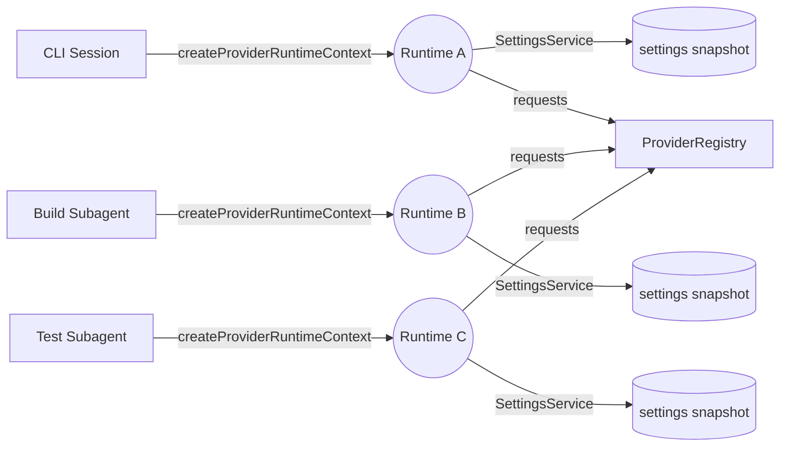
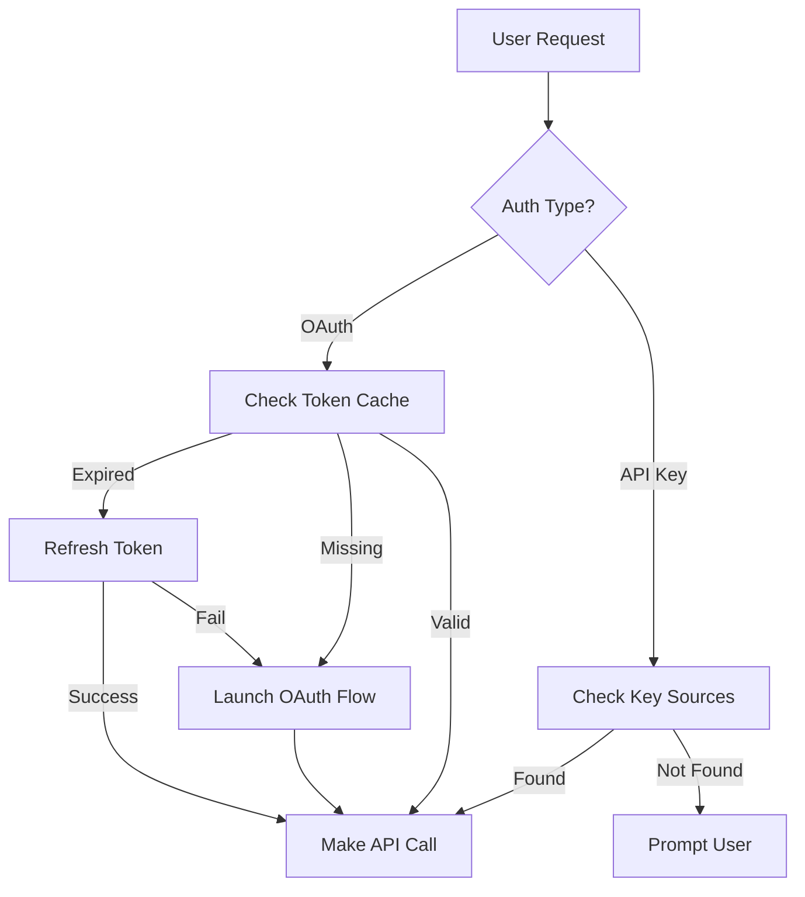

# LLxprt Code Architecture Overview

<!-- @plan:PLAN-20251018-STATELESSPROVIDER2.P20 @requirement:REQ-SP2-005 -->

This document explains how LLxprt Code's stateless provider runtime, authentication, and tooling layers fit together after the PLAN-20251018-STATELESSPROVIDER2 rollout.

## Core components

The LLxprt Code is primarily composed of two main packages, along with a suite of tools that can be used by the system in the course of handling command-line input:

1.  **CLI package (`packages/cli`):**
    - **Purpose:** This contains the user-facing portion of the LLxprt Code, such as handling the initial user input, presenting the final output, and managing the overall user experience.
    - **Key functions contained in the package:**
      - [Input processing](./cli/commands.md)
      - History management
      - Display rendering
      - [Theme and UI customization](./cli/themes.md)
      - [CLI configuration settings](./cli/configuration.md)

2.  **Core package (`packages/core`):**
    - **Purpose:** This acts as the backend for the LLxprt Code. It receives requests sent from `packages/cli`, orchestrates interactions with the Gemini API, and manages the execution of available tools.
    - **Key functions contained in the package:**
      - API client for communicating with the Google Gemini API
      - Prompt construction and management
      - Tool registration and execution logic
      - State management for conversations or sessions
      - Server-side configuration

3.  **Tools (`packages/core/src/tools/`):**
    - **Purpose:** These are individual modules that extend the capabilities of the Gemini model, allowing it to interact with the local environment (e.g., file system, shell commands, web fetching).
    - **Interaction:** `packages/core` invokes these tools based on requests from the Gemini model.

## Interaction Flow

A typical interaction with the LLxprt Code follows this flow:

1.  **User input:** The user types a prompt or command into the terminal, which is managed by `packages/cli`.
2.  **Request to core:** `packages/cli` sends the user's input to `packages/core`.
3.  **Request processed:** The core package:
    - Constructs an appropriate prompt for the Gemini API, possibly including conversation history and available tool definitions.
    - Sends the prompt to the Gemini API.
4.  **Gemini API response:** The Gemini API processes the prompt and returns a response. This response might be a direct answer or a request to use one of the available tools.
5.  **Tool execution (if applicable):**
    - When the Gemini API requests a tool, the core package prepares to execute it.
    - If the requested tool can modify the file system or execute shell commands, the user is first given details of the tool and its arguments, and the user must approve the execution.
    - Read-only operations, such as reading files, might not require explicit user confirmation to proceed.
    - Once confirmed, or if confirmation is not required, the core package executes the relevant action within the relevant tool, and the result is sent back to the Gemini API by the core package.
    - The Gemini API processes the tool result and generates a final response.
6.  **Response to CLI:** The core package sends the final response back to the CLI package.
7.  **Display to user:** The CLI package formats and displays the response to the user in the terminal.

## Provider System Architecture

LLxprt Code's stateless multi-provider architecture enables seamless switching between different LLM providers while giving each runtime (CLI session, subagent, automation harness) an isolated state envelope. This system is built on several key components:

### Provider Registry

The provider registry (`packages/core/src/providers/`) maintains a collection of provider implementations:

- **Provider Interface:** Each provider implements a common interface for generating completions, handling streaming, and managing tool calls.
- **Runtime Binding:** Providers receive a `ProviderRuntimeContext` instance when they are invoked, giving access to runtime-specific configuration, logging, and telemetry without relying on global singletons.
- **Dynamic Loading:** Providers are loaded on-demand when selected via `/provider` command, CLI arguments, or subagent configuration.
- **Provider Types:**
  - `gemini`: Google Gemini models (default)
  - `openai`: OpenAI GPT models with Responses API support
  - `anthropic`: Anthropic Claude models
  - `qwen`: Alibaba Cloud Qwen models
  - `groq`, `together`, `xai`: Additional cloud providers
  - Custom providers via base URL configuration

### Provider Switching

The provider system supports multiple switching mechanisms:

1. **Runtime Switching:** `/provider <name>` command changes the active provider for the current runtime context without touching other contexts.
2. **Model Selection:** `/model <name>` switches models within the current provider.
3. **API Key Management:** `/key` and `/keyfile` commands set provider credentials that are stored on a per-runtime `SettingsService`.
4. **Base URL Override:** `/baseurl` allows custom endpoints (local LLMs, proxies) scoped to the active runtime.

### Stateless Provider Runtime

The stateless provider runtime is centred around `ProviderRuntimeContext`, a lightweight container that bundles the `SettingsService`, telemetry emitters, logging channels, and contextual metadata for a single request pipeline. Contexts are created with `createProviderRuntimeContext` and registered with `setActiveProviderRuntimeContext`, and they can be nested or swapped without leaking state between callers.



Each runtime context exposes:

- `settingsService`: a scoped `SettingsService` instance with per-runtime overrides.
- `metadata`: runtime identifiers (CLI session id, subagent name, automation worker id) plus runtime-auth scope diagnostics.
- `telemetry`: a channel used by providers and tooling to emit runtime-scoped events.
- `logger`: an adapter that captures provider-level diagnostics without mixing logs across contexts.

### Runtime-scoped Authentication

Runtime isolation now extends to provider authentication. The auth precedence resolver (`packages/core/src/auth/precedence.ts`) derives a `runtimeAuthScopeId` from each context's `runtimeId`, then caches credentials per `{runtimeAuthScopeId, providerId, profileId}` tuple. Scope metadata is attached to `ProviderRuntimeContext.metadata.runtimeAuthScope`, giving downstream tools enough data to emit audits or flush tokens.

- **Credential lifecycle** – When CLI helpers or providers request credentials, the resolver first checks the scoped cache. Cache misses invoke provider-specific authenticators (API keys, OAuth, device flow) annotated with runtime metadata so audit logs can track which actor minted a token.
- **Automatic revocation** – `SettingsService` event listeners monitor provider switches, profile swaps, and settings clears. Matching scoped tokens are invalidated immediately, ensuring credentials from subagents or temporary automations do not leak back to the CLI.
- **Nested runtimes** – `activateIsolatedRuntimeContext` in `runtimeSettings.ts` calls `enterRuntimeScope` to push a child runtime. Nested scopes inherit metadata, but each receives a distinct `runtimeAuthScopeId` so revocation remains precise.
- **OAuth managers** – The CLI registers an `OAuthManager` per runtime. Providers fetch tokens via the manager, which stores refresh state inside the runtime registry rather than global singletons.

Authentication details are covered in the migration guide below.

### Multi-context Orchestration

Multiple contexts can operate simultaneously—for example when the CLI launches subagents or when automation scripts fan out provider workloads. The helper `withProviderRuntimeContext` (see `packages/cli/src/runtime/runtimeSettings.ts`) wraps asynchronous work, restoring the previous context on completion. Requests issued from different contexts remain isolated, and context switching is constant time.

```ts
import {
  createProviderRuntimeContext,
  setActiveProviderRuntimeContext,
  clearActiveProviderRuntimeContext,
} from '@vybestack/llxprt-code-core';
import { withProviderRuntime } from '../runtime/runtimeSettings';

await withProviderRuntime(async () => {
  const runtime = createProviderRuntimeContext({
    metadata: { origin: 'cli-subagent', agentId: 'reviewer' },
  });
  setActiveProviderRuntimeContext(runtime);
  try {
    await runSubagentJob(runtime);
  } finally {
    clearActiveProviderRuntimeContext();
  }
});
```

The snippet above demonstrates two contexts operating concurrently: the primary CLI context and a reviewer subagent. Each context captures its own provider credentials, tool settings, and telemetry buffers, and the runtime-scoped auth cache keeps those credentials segregated.

> See the [Stateless Provider v2 migration guide](./migration/stateless-provider-v2.md) for integration details and upgrade guidance.

## Ephemeral Settings System

The ephemeral settings system provides session-scoped configuration that doesn't persist to disk unless explicitly saved:

### Architecture Components

1. **Settings Hierarchy:**

   ```
   CLI Arguments → Ephemeral Settings → Profile Settings → User Settings → System Settings → Defaults
   ```

   Higher priority sources override lower ones.

2. **Ephemeral Store:**
   - In-memory key-value store for session settings
   - Accessed via `/set` and `/set unset` commands
   - Categories:
     - **Model Parameters:** temperature, max_tokens, top_p, etc.
     - **Context Settings:** context-limit, compression-threshold
     - **Tool Settings:** tool-output-max-items, tool-output-truncate-mode
     - **Provider Settings:** base-url, api-version, custom-headers

3. **Setting Types:**
   - **Scalars:** Simple values (numbers, strings, booleans)
   - **Nested Objects:** Model parameters with sub-keys
   - **Dynamic Validation:** Type checking and range validation

### Implementation Flow

1. User executes `/set modelparam temperature 0.7`
2. Command parser validates the setting key and value
3. Value stored in ephemeral settings map
4. Provider receives merged settings on next API call
5. Settings persist for session duration unless saved to profile

## Authentication System Architecture

The authentication system supports multiple authentication methods across providers:

### OAuth Authentication

1. **Provider-Specific OAuth Flows:**
   - `gemini`: Google OAuth with Code Assist integration
   - `anthropic`: Anthropic OAuth (when available)
   - `qwen`: Alibaba Cloud OAuth
2. **Lazy Authentication:**
   - OAuth flow triggered on first API request, not on `/auth enable`
   - Reduces friction and prevents unnecessary browser launches
   - Token stored in secure system keychain when available

3. **Token Management:**
   - Access tokens cached in memory
   - Refresh tokens stored securely
   - Automatic token refresh on expiry

### API Key Authentication

1. **Key Sources (Priority Order):**
   - Command-line: `--key` or `--keyfile`
   - Session: `/key` command
   - Environment: `OPENAI_API_KEY`, `ANTHROPIC_API_KEY`, etc.
   - Key files: `~/.openai_key`, `~/.anthropic_key`
   - Settings: `providerApiKeys` in settings.json

2. **Key Security:**
   - Keys never logged or displayed
   - Masked in debug output
   - Session keys cleared on exit

### Authentication Flow



## Profile System Architecture

The profile system enables saving and restoring complete session configurations:

### Profile Components

1. **Profile Storage:**
   - Location: `~/.llxprt/profiles/`
   - Format: JSON files with `.profile.json` extension
   - Content: Complete session state snapshot

2. **Profile Contents:**

   ```json
   {
     "provider": "anthropic",
     "model": "claude-3-opus-20240229",
     "modelParams": {
       "temperature": 0.7,
       "max_tokens": 4096
     },
     "ephemeralSettings": {
       "context-limit": 100000,
       "compression-threshold": 0.7
     },
     "apiKey": "encrypted-or-keyfile-reference"
   }
   ```

3. **Profile Operations:**
   - **Save:** `/profile save "name"` - Captures current session state
   - **Load:** `/profile load "name"` - Restores saved configuration
   - **Delete:** `/profile delete "name"` - Removes profile
   - **Set Default:** `/profile set-default "name"` - Auto-load on startup
   - **List:** `/profile list` - Shows available profiles

### Profile Loading Sequence

1. **Startup Loading:**

   ```
   CLI Start → Check defaultProfile → Load if exists → Apply --profile-load → Apply CLI args
   ```

2. **Runtime Loading:**

   ```
   /profile load → Validate profile → Clear ephemeral → Apply profile → Update session
   ```

3. **Profile Merging:**
   - Profile settings override user/system settings
   - CLI arguments override profile settings
   - Ephemeral settings preserved unless explicitly in profile

### Profile Use Cases

1. **Project-Specific Configurations:**
   - Different models for different projects
   - Custom temperature/token settings per task
2. **Provider Switching:**
   - Quick switch between OpenAI and Anthropic
   - Maintain optimal settings per provider
3. **Team Sharing:**
   - Export profiles for team consistency
   - Standardize AI interactions across developers

## System Integration

These systems work together to provide a flexible configuration experience:

1. **Provider → Auth:** Each provider has specific auth requirements
2. **Auth → Profile:** Profiles store auth method preferences
3. **Profile → Ephemeral:** Profiles populate ephemeral settings
4. **Ephemeral → Provider:** Settings passed to provider on each call

## Key Design Principles

- **Modularity:** Separating the CLI (frontend) from the Core (backend) allows for independent development and potential future extensions (e.g., different frontends for the same backend).
- **Extensibility:** The tool system is designed to be extensible, allowing new capabilities to be added.
- **User experience:** The CLI focuses on providing a rich and interactive terminal experience.
- **Multi-provider flexibility:** Architecture supports adding new providers with minimal changes.
- **Configuration flexibility:** Multiple configuration levels allow both simplicity and power.
- **Security-first:** Authentication tokens and API keys handled with security best practices.
