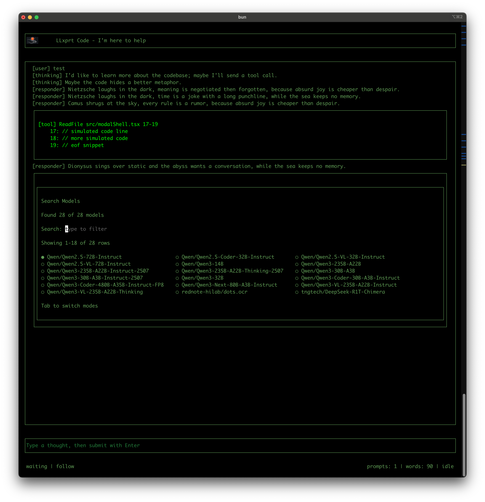

# LLxprt Code – New UI Prototype

This repo is a prototype terminal UI for LLxprt Code built with OpenTUI (React). It exercises streaming chat, slash menu tooling, completions, modal dialogs, theming, and mock tool-call rendering so we can harden the experience before folding it into the main product.



## Highlights

- Chat layout: header, scrollback, multi-line input, status bar; streaming responses, thinking lines, and mock tool calls (batch + streaming) with scrollable tool output.
- Slash/`@` completions: file fake service, slash commands with multi-level parameters, history navigation, and /theme dialog with theme previews (Green Screen and other LLxprt themes).
- Modals: reusable shell plus search/select dialogs for models/providers/themes and OAuth toggle dialog.
- Input ergonomics: Enter submits, modifier+Enter for newline, numpad Enter support, ESC to cancel stream or clear input, selection clipboard support.
- Theming: all colors pulled from JSON themes; Green Screen theme matches LLxprt’s retro palette.
- Header: OpenTUI image rendering support (kitty/iTerm2) for the LLxprt logo alongside title text.

## Running

```bash
npm install
npm start   # uses bun run src/main.tsx
```

## Notes

- Requires a terminal with OpenTUI graphics support (tested on iTerm2/kitty) for the logo image; falls back to text where images aren’t supported.
- Reference checkouts for upstreams live under `reference/` (opentui, opencode, llxprt-code) and are ignored by git. Use `reference/opentui-clip` for clipping repro work; `reference/opentui` holds the image-support branch.
