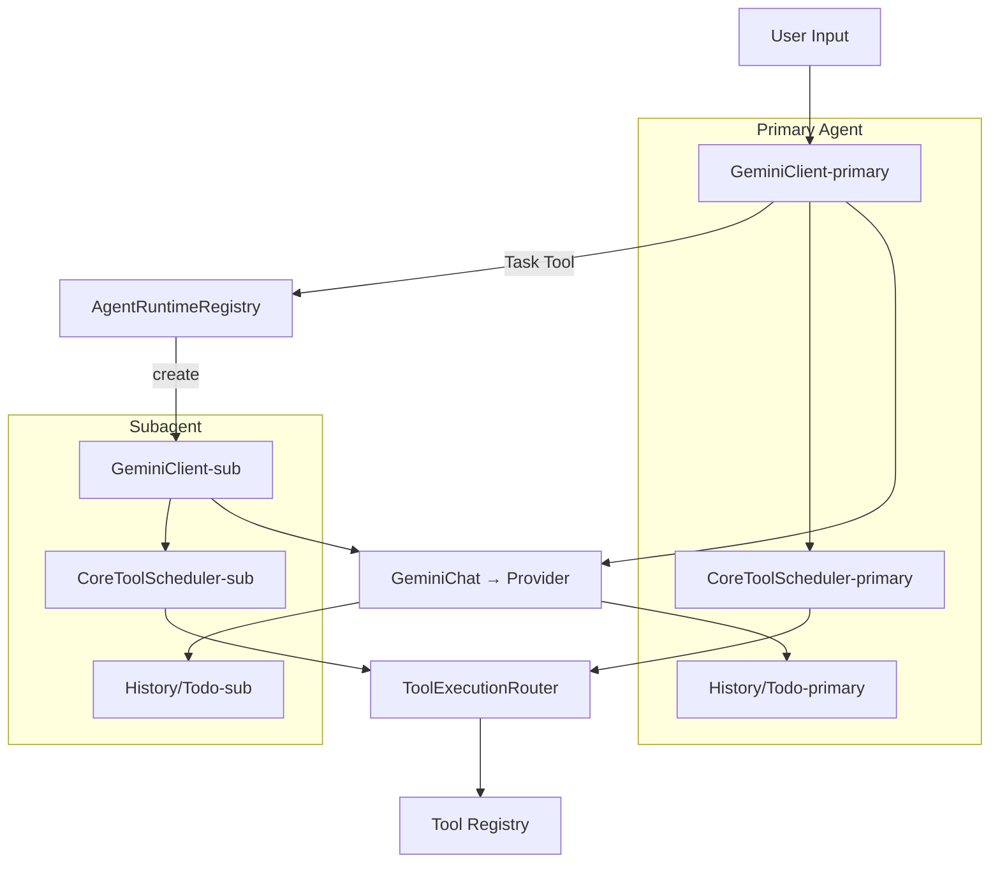

# Subagentic Objectives & Flow Overview

## Objectives
- Enable primary agent to delegate work to isolated subagents via `Task(name, prompt)` tool invocations.
- Load subagent persona, model configuration, and tool permissions from dedicated profile + subagent config files without mutating the primary agent’s runtime.
- Route tool execution responses according to agent id so UI, history, approvals, and telemetry stay consistent per agent.
- Preserve halo features (todo lists, reminders, loop detection) per-agent to avoid cross-contamination of state.
- Respect profile-driven tool enable/disable lists for both primary and subagents, ensuring disabled tools never reach providers nor execute locally.

## Current Architecture Snapshot
- Single GeminiClient + CoreToolScheduler instance tied to the foreground Config.
- Tool execution path (`executeToolCall`, `CoreToolScheduler`) assumes one agent and uses the same Config for registry, telemetry, and approvals.
- HistoryService/todo reminder services are shared across the session, scoped to primary agent.
- `/tools` command lists tools but offers no enable/disable controls; provider schemas expose all registered tools.

```mermaid
graph TD
  A[User Input / CLI] --> B[GeminiClient (primary)]
  B --> C[CoreToolScheduler]
  C --> D[Tool Registry / Tools]
  D --> E[Tool Execution]
  B --> F[GeminiChat → Provider]
  F --> G[HistoryService + Todo]
```

## Target Architecture with Subagents
- Introduce `AgentId` concept so every tool request carries its originating agent identifier.
- Maintain an `AgentRuntimeRegistry` mapping agent ids to `AgentRuntimeContext`, `GeminiClient`, `HistoryService`, and todo tracker instances.
- `Task` tool spins up subagents by loading subagent config (`~/.llxprt/subagents/<name>.json`), resolving its profile, and constructing an isolated runtime bundle.
- Tool scheduler/executor layer routes calls based on agent id, ensuring only enabled tools are served to providers and executed locally.
- UI/CLI surfaces (tool approvals, history panes, `/tools` command) display status per agent, leveraging friendly tool names while persisting canonical ids.



## Key Obstacles to Address
- Tool execution pipeline lacks agent awareness; need to extend `ToolCallRequestInfo` and scheduler APIs with `agentId`.
- SubAgentScope still leans on foreground Config for tool registry and env context; must inject isolated runtime resources.
- No loader ties `SubagentConfig` and profile ephemerals to runtime—the Task tool must orchestrate this.
- Shared todo reminders and history would mix contexts; require separate instances per agent.
- Provider schema currently exposes all tools globally; must filter on per-agent allowed list before sending to models.

## Required Code Changes
- Extend runtime/profile ephemerals to include `tools.allowed` / `tools.disabled` so `/profile load` controls foreground tools and subagents inherit restrictions.
- Update `ToolCallRequestInfo`, `CoreToolScheduler`, `executeToolCall`, and UI hooks to propagate agent id and reject disabled tools.
- Build `SubagentRuntimeLoader` that constructs isolated `AgentRuntimeContext` from subagent profile and config, including history + todo services.
- Enhance `/tools` command with `list`, `enable`, `disable`, and interactive picker using friendly ↔ canonical mapping.
- Modify Gemini chat invocation (primary & subagent) to pass filtered tool schemas to the provider based on the active agent’s allowed list.

## Supporting Structures to Introduce
- `AgentId` / `AgentDescriptor` types encapsulating ids, labels, and profile names.
- `AgentRuntimeRegistry` service to register / fetch runtime bundles per agent.
- `ToolNameResolver` utility for friendly/canonical name resolution.
- `ToolExecutionRouter` acting as a façade over schedulers/executors keyed by agent id.
- Enhanced telemetry hooks that log agent id alongside tool executions for approval/history surfaces.

## Tool Configuration Enhancements
- Profiles and subagent configs persist tool selections under `ephemeralSettings.tools.allowed/disabled`.
- `/tools` CLI subcommands manipulate these lists and sync with profile files; non-interactive commands (`/tools disable Edit`) map friendly names to ids.
- Runtime enforcement ensures disabled tools never reach provider schemas or local executor, guarding against hallucinated calls.

## Summary
This overview aggregates the architectural targets, known gaps, and required structural changes to evolve LLxprt into a multi-agent system with per-profile tool governance. The diagrams illustrate the transition from a single-agent flow to an agent-aware execution pipeline supporting Task-triggered subagents and profile-driven tool controls.
