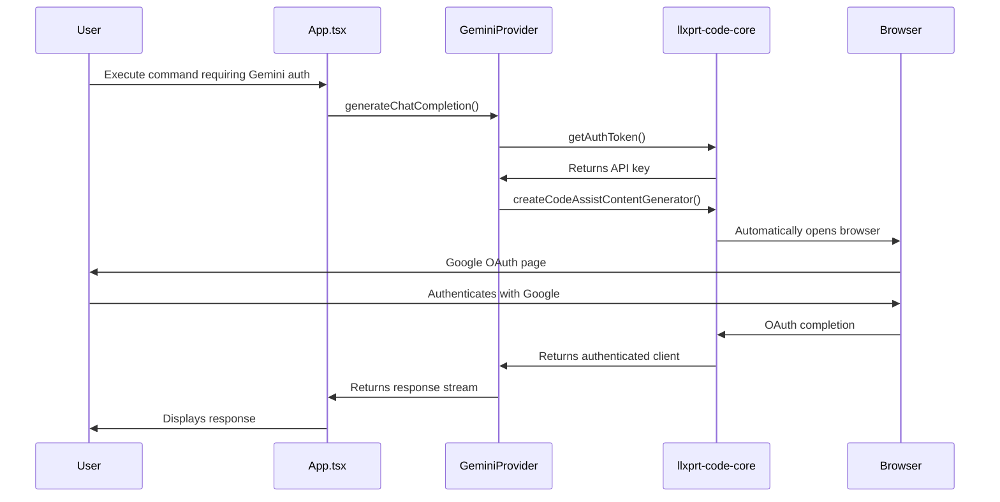
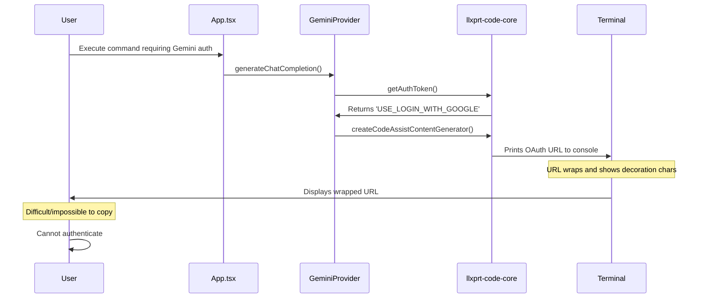
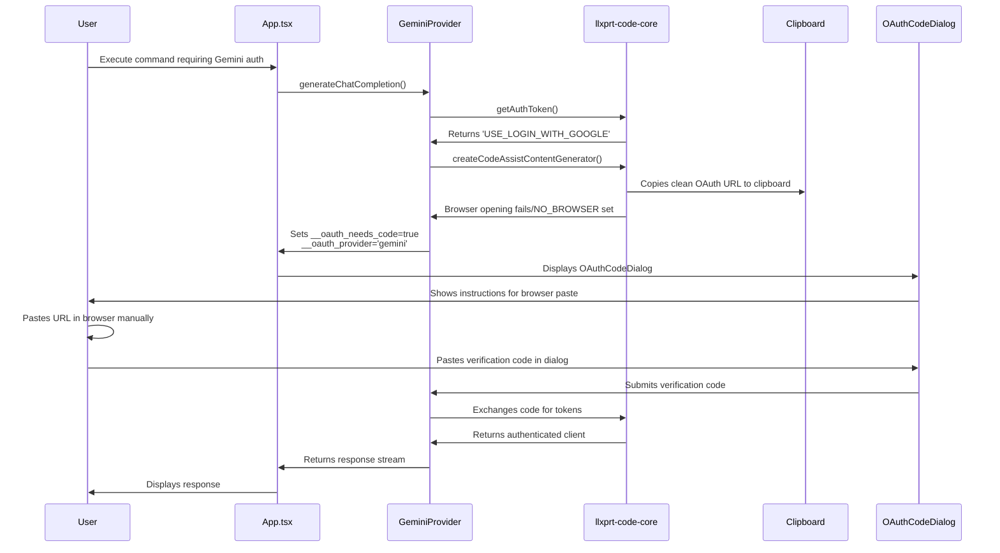
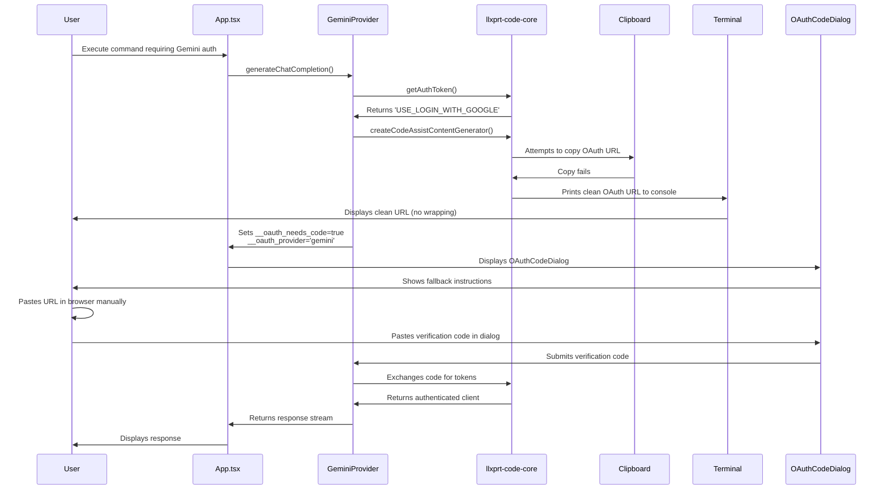
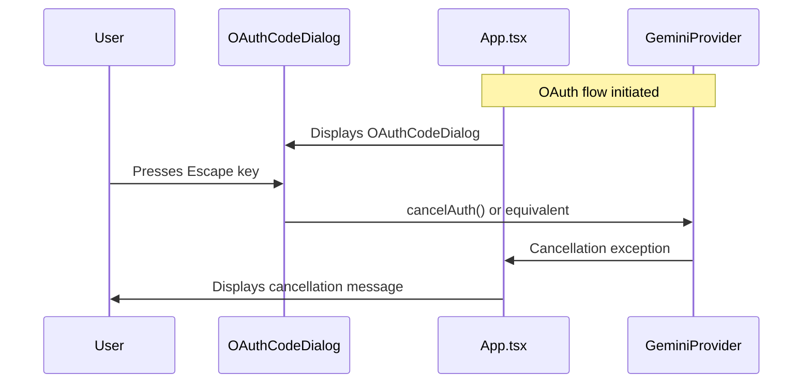
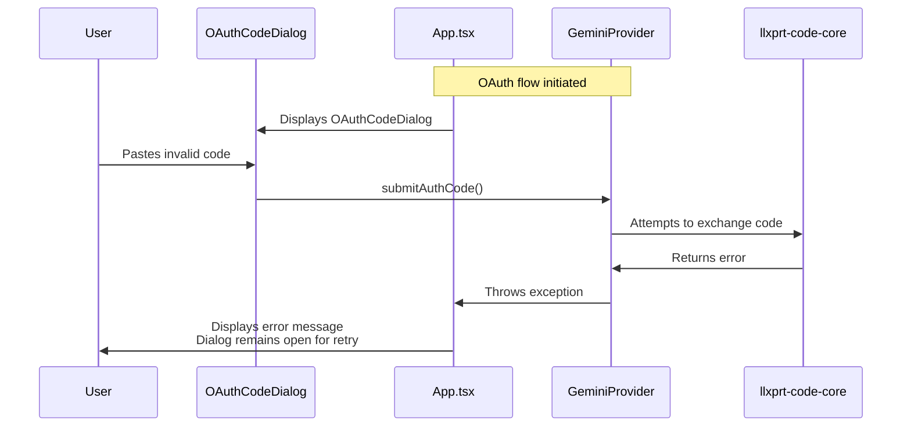

# Sequence Diagrams for Gemini OAuth Fallback Implementation

## 1. Normal Authentication Flow (Without Fallback)

## 2. Current OAuth Fallback Flow

## 3. Enhanced OAuth Fallback Flow (Proposed)

## 4. Clipboard Copy Failure Flow

## 5. Dialog Cancellation Flow

## 6. Invalid Verification Code Flow

