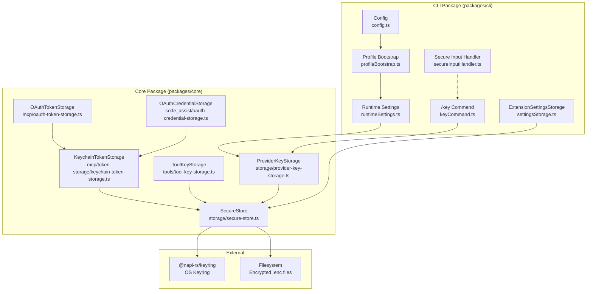

=== TRACEABILITY MATRIX (plan/00-overview.md) ===
# Plan: SecureStore + Named API Key Management

Plan ID: PLAN-20260211-SECURESTORE
Generated: 2026-02-11
Total Phases: 19 (P01–P19)
Issues: #1350, #1353, #1355, #1356
Parent Epic: #1349 (Unified Credential Management — Keyring-First)

Requirements: R1, R2, R3, R4, R5, R6, R7, R7A, R7B, R7C, R8, R9, R10, R11, R12, R13, R14, R15, R16, R17, R18, R19, R20, R21, R22, R23, R24, R25, R26, R27

---

## Critical Reminders

Before implementing ANY phase, ensure you have:

1. Completed preflight verification (Phase 01)
2. Defined integration contracts for multi-component features
3. Written integration tests BEFORE unit tests
4. Verified all dependencies and types exist as assumed
5. Read and understood the pseudocode for the component being implemented

---

## Architecture Overview

### Component Diagram



### Command Routing Clarification

This plan involves two **separate** slash commands that must not be confused:

- **`/key`** (`packages/cli/src/ui/commands/keyCommand.ts`) — The **provider API key** command.
  Currently handles only ephemeral `/key <raw-key>` to set/clear the session API key.
  **This plan ADDS subcommand parsing** to this file (`save`, `load`, `show`, `list`, `delete`)
  so that `/key save myanthropic sk-ant-...` stores a named key, `/key load myanthropic`
  activates it for the session, etc. The existing legacy `/key <raw-key>` behavior is preserved
  as a fallback when the first token is not a recognized subcommand (R12.3).

- **`/toolkey`** (`packages/cli/src/ui/commands/toolkeyCommand.ts`) — A **separate** command
  for tool-specific API keys (Exa search, etc.). It has its own argument schema, its own
  validation (tool name enum), and its own `ToolKeyStorage` backend.
  **This plan does NOT modify `toolkeyCommand.ts`** — the only change to `/toolkey`'s stack
  is that its underlying `ToolKeyStorage` class becomes a thin wrapper over `SecureStore`
  (P08), replacing its internal keyring/encryption logic. The command surface is unchanged.

These are **two different command surfaces** serving different purposes and they are **not being merged**.

### Data Flow

```
User: /key save myanthropic sk-ant-...
  → KeyCommand.action(args)
    → ProviderKeyStorage.saveKey('myanthropic', 'sk-ant-...')
      → SecureStore.set('myanthropic', trimmed_value)
        → keytar.setPassword('llxprt-code-provider-keys', 'myanthropic', value)
        OR → AES-256-GCM encrypt → ~/.llxprt/provider-keys/myanthropic.enc

User: llxprt --key-name myanthropic
  → ProfileBootstrap.parseBootstrapArgs(['--key-name', 'myanthropic'])
    → { keyNameOverride: 'myanthropic' }
  → RuntimeSettings.applyCliArgumentOverrides(...)
    → ProviderKeyStorage.getKey('myanthropic')
      → SecureStore.get('myanthropic')
        → keytar.getPassword(...) → value
    → runtime.updateActiveProviderApiKey(value)
```

---

## Phase Summary

| # | Phase | Type | Requirements | Pseudocode |
|---|-------|------|-------------|------------|
| 01 | Preflight Verification | Preflight | — | — |
| 02 | Domain Analysis | Analysis | All | — |
| 02a | Analysis Verification | Verification | — | — |
| 03 | Pseudocode Development | Pseudocode | All | All files |
| 03a | Pseudocode Verification | Verification | — | — |
| 04 | SecureStore Stub | Stub | R1, R2, R3, R4, R5, R6 | secure-store.md |
| 04a | SecureStore Stub Verification | Verification | — | — |
| 05 | SecureStore TDD | TDD | R1–R6, R7B, R8, R27.1 | secure-store.md |
| 05a | SecureStore TDD Verification | Verification | — | — |
| 06 | SecureStore Implementation | Implementation | R1–R6, R7B, R8 | secure-store.md L1–441 |
| 06a | SecureStore Implementation Verification | Verification | — | — |
| 07 | Thin Wrapper Contract Tests | TDD | R7, R7A, R7C | — |
| 07a | Thin Wrapper Contract Verification | Verification | — | — |
| 08 | Thin Wrapper Refactoring | Implementation | R7.1–R7.7, R7A.1, R7C.1 | — |
| 08a | Thin Wrapper Refactoring Verification | Verification | — | — |
| 09 | Eliminate FileTokenStorage + HybridTokenStorage | Implementation | R7.3, R7.4 | — |
| 09a | Elimination Verification | Verification | — | — |
| 10 | ProviderKeyStorage Stub | Stub | R9, R10, R11 | provider-key-storage.md |
| 10a | ProviderKeyStorage Stub Verification | Verification | — | — |
| 11 | ProviderKeyStorage TDD | TDD | R9, R10, R11 | provider-key-storage.md |
| 11a | ProviderKeyStorage TDD Verification | Verification | — | — |
| 12 | ProviderKeyStorage Implementation | Implementation | R9, R10, R11 | provider-key-storage.md L1–80 |
| 12a | ProviderKeyStorage Implementation Verification | Verification | — | — |
| 13 | /key Commands Stub | Stub | R12–R20 | key-commands.md |
| 13a | /key Commands Stub Verification | Verification | — | — |
| 14 | /key Commands TDD | TDD | R12–R20, R27.2 | key-commands.md |
| 14a | /key Commands TDD Verification | Verification | — | — |
| 15 | /key Commands Implementation | Implementation | R12–R20 | key-commands.md L1–282 |
| 15a | /key Commands Implementation Verification | Verification | — | — |
| 16 | auth-key-name Stub | Stub | R21–R26 | auth-key-name.md |
| 16a | auth-key-name Stub Verification | Verification | — | — |
| 17 | auth-key-name TDD | TDD | R21–R26, R27.3 | auth-key-name.md |
| 17a | auth-key-name TDD Verification | Verification | — | — |
| 18 | auth-key-name Implementation | Implementation | R21–R26 | auth-key-name.md L1–140 |
| 18a | auth-key-name Implementation Verification | Verification | — | — |
| 19 | Final Integration Verification | Verification | All | All |

---

## Traceability Matrix

Every requirement mapped to the phase(s) where it is tested and implemented.

| Requirement | Description | TDD Phase | Impl Phase | Pseudocode Lines |
|-------------|-------------|-----------|------------|-----------------|
| R1.1 | SecureStore keyring access via @napi-rs/keyring | P05 | P06 | secure-store.md L1–6, L49–81 |
| R1.2 | Module-not-found detection | P05 | P06 | secure-store.md L71–79 |
| R1.3 | keytarLoader injection for testing | P05 | P06 | secure-store.md L27–33 |
| R2.1 | Availability probe via set-get-delete | P05 | P06 | secure-store.md L82–116 |
| R2.2 | Probe cache with 60-second TTL | P05 | P06 | secure-store.md L84–89 |
| R2.3 | Transient error cache invalidation | P05 | P06 | secure-store.md L108–113 |
| R3.1a | set() with keyring available | P05 | P06 | secure-store.md L117–134 |
| R3.1b | set() with keyring unavailable (fallback) | P05 | P06 | secure-store.md L136–147 |
| R3.2 | get() from keyring | P05 | P06 | secure-store.md L149–166 |
| R3.3 | get() from fallback file | P05 | P06 | secure-store.md L168–173 |
| R3.4 | get() returns null when not found | P05 | P06 | secure-store.md L175–177 |
| R3.5 | get() keyring wins over fallback | P05 | P06 | secure-store.md L153 |
| R3.6 | delete() from both stores | P05 | P06 | secure-store.md L179–210 |
| R3.7 | list() with deduplication | P05 | P06 | secure-store.md L211–247 |
| R3.8 | has() returns false/throws on error | P05 | P06 | secure-store.md L248–276 |
| R4.1 | Encrypted file fallback (allow policy) | P05 | P06 | secure-store.md L277–316 |
| R4.2 | Fallback denied throws UNAVAILABLE | P05 | P06 | secure-store.md L137–143 |
| R4.3 | Async scrypt key derivation | P05 | P06 | secure-store.md L281–285, L433–440 |
| R4.4 | One file per key ({key}.enc) | P05 | P06 | secure-store.md L384–386 |
| R4.5 | Versioned envelope format | P05 | P06 | secure-store.md L293–299 |
| R4.6 | Unrecognized version error | P05 | P06 | secure-store.md L341–348 |
| R4.7 | Atomic writes (temp+fsync+rename) | P05 | P06 | secure-store.md L301–315 |
| R4.8 | Create fallbackDir with 0o700 | P05 | P06 | secure-store.md L279 |
| R5.1 | No backward compatibility | P05 | P06 | secure-store.md L330–339 |
| R5.2 | Corrupt format detection | P05 | P06 | secure-store.md L330–339 |
| R6.1 | Error taxonomy mapping | P05 | P06 | secure-store.md L7–16, L393–431 |
| R7.1 | ToolKeyStorage → SecureStore wrapper | P07 | P08 | — |
| R7.2 | KeychainTokenStorage → SecureStore wrapper | P07 | P08 | — |
| R7.3 | FileTokenStorage eliminated | — | P09 | — |
| R7.4 | HybridTokenStorage eliminated | — | P09 | — |
| R7.5 | ExtensionSettingsStorage → SecureStore | P07 | P08 | — |
| R7.6 | Contract tests for thin wrappers | P07 | P08 | — |
| R7.7 | No duplicate keyring imports | — | P09 | — |
| R7A.1 | Behavioral delta audit | P02 | — | — |
| R7B.1 | Mid-session keyring unavailability | P05 | P06 | secure-store.md L130–133 |
| R7B.2 | Atomic write prevents corruption | P05 | P06 | secure-store.md L301–315 |
| R7B.3 | Concurrent writers via atomic rename | P05 | P06 | secure-store.md L309 |
| R7C.1 | Legacy data startup messaging | P07 | P08 | — |
| R8.1 | Structured debug logs | P05 | P06 | secure-store.md L120, L151, etc. |
| R8.2 | No secret value logging | P05 | P06 | secure-store.md L388–391 |
| R9.1 | ProviderKeyStorage backed by SecureStore | P11 | P12 | provider-key-storage.md L11–25 |
| R9.2 | saveKey with trim/normalize | P11 | P12 | provider-key-storage.md L26–40 |
| R9.3 | getKey returns value or null | P11 | P12 | provider-key-storage.md L41–47 |
| R9.4 | deleteKey returns boolean | P11 | P12 | provider-key-storage.md L48–54 |
| R9.5 | listKeys sorted/deduplicated | P11 | P12 | provider-key-storage.md L55–58 |
| R9.6 | hasKey returns boolean | P11 | P12 | provider-key-storage.md L59–65 |
| R10.1 | Key name validation regex | P11 | P12 | provider-key-storage.md L1–10 |
| R10.2 | Invalid name error message | P11 | P12 | provider-key-storage.md L4–9 |
| R11.1 | No case normalization | P11 | P12 | provider-key-storage.md (documented) |
| R11.2 | Case sensitivity as known limitation — documented, no normalization | P11 | P12 | provider-key-storage.md (documented) |
| R12.1 | Subcommand parsing | P14 | P15 | key-commands.md L2–30 |
| R12.2 | Subcommand dispatch | P14 | P15 | key-commands.md L17–26 |
| R12.3 | Legacy fallback for raw key | P14 | P15 | key-commands.md L28–29 |
| R12.4 | No args shows status | P14 | P15 | key-commands.md L7–10 |
| R12.5 | Case-sensitive subcommand matching | P14 | P15 | key-commands.md L17 |
| R12.6 | Whitespace trimming (command args); saveKey trims API key values | P11, P14 | P12, P15 | provider-key-storage.md L26–40, key-commands.md L4 |
| R13.1 | /key save stores key | P14 | P15 | key-commands.md L31–84 |
| R13.2 | Overwrite confirmation (interactive) | P14 | P15 | key-commands.md L56–70 |
| R13.3 | Overwrite fail (non-interactive) | P14 | P15 | key-commands.md L59–62 |
| R13.4 | Empty key value error | P14 | P15 | key-commands.md L47–51 |
| R13.5 | Missing args error | P14 | P15 | key-commands.md L33–36 |
| R14.1 | /key load sets session key | P14 | P15 | key-commands.md L85–111 |
| R14.2 | /key load not found error | P14 | P15 | key-commands.md L99–102 |
| R14.3 | /key load missing name error | P14 | P15 | key-commands.md L87–90 |
| R15.1 | /key show masked display | P14 | P15 | key-commands.md L112–137 |
| R15.2 | /key show not found error | P14 | P15 | key-commands.md L126–129 |
| R16.1 | /key list shows all keys | P14 | P15 | key-commands.md L138–164 |
| R16.2 | /key list empty message | P14 | P15 | key-commands.md L145–148 |
| R17.1 | /key delete with confirmation | P14 | P15 | key-commands.md L165–203 |
| R17.2 | /key delete non-interactive fail | P14 | P15 | key-commands.md L175–178 |
| R17.3 | /key delete not found error | P14 | P15 | key-commands.md L184–188 |
| R17.4 | /key delete missing name error | P14 | P15 | key-commands.md L167–170 |
| R18.1 | Storage failure actionable error | P14 | P15 | key-commands.md L221–234 |
| R19.1 | Autocomplete for load/show/delete | P14 | P15 | key-commands.md L235–259 |
| R19.2 | Autocomplete for save (overwrite) | P14 | P15 | key-commands.md L247 |
| R19.3 | Autocomplete returns empty on error | P14 | P15 | key-commands.md L253–255 |
| R20.1 | Secure input masking for save | P14 | P15 | key-commands.md L260–278 |
| R20.2 | Legacy masking unchanged | P14 | P15 | key-commands.md L272–275 |
| R21.1 | auth-key-name profile resolution | P17 | P18 | auth-key-name.md L74–88 |
| R21.2 | auth-key-name valid ephemeral setting | P17 | P18 | auth-key-name.md L18–24 |
| R21.3 | Bootstrap passes metadata only | P17 | P18 | auth-key-name.md L25–36 |
| R22.1 | --key-name CLI flag resolution | P17 | P18 | auth-key-name.md L62–72 |
| R22.2 | --key-name parsed in bootstrap | P17 | P18 | auth-key-name.md L1–17 |
| R23.1 | API key precedence order | P17 | P18 | auth-key-name.md L37–94 |
| R23.2 | --key wins over --key-name | P17 | P18 | auth-key-name.md L49–60 |
| R23.3 | Resolution in applyCliArgumentOverrides | P17 | P18 | auth-key-name.md L37–44 |
| R24.1 | Named key not found fails fast | P17 | P18 | auth-key-name.md L96–118 |
| R24.2 | Non-interactive fail with exit code | P17 | P18 | auth-key-name.md L128–140 |
| R25.1 | Debug log with auth source | P17 | P18 | auth-key-name.md L51, L66, L79 |
| R25.2 | Debug log for overridden sources | P17 | P18 | auth-key-name.md L53–58, L68–70, L81–86 |
| R26.1 | No deprecations | P17 | P18 | auth-key-name.md L90–93 |
| R27.1 | SecureStore fault-injection tests | P05 | — | — |
| R27.2 | /key parser table-driven tests | P14 | — | — |
| R27.3 | Precedence test matrix | P17 | — | — |

---

## Integration Analysis

### Existing Code That Will USE This Feature

| File | Usage |
|------|-------|
| `packages/cli/src/ui/commands/keyCommand.ts` | Uses ProviderKeyStorage for /key save/load/show/list/delete |
| `packages/cli/src/runtime/runtimeSettings.ts` | Uses ProviderKeyStorage to resolve --key-name and auth-key-name |
| `packages/cli/src/config/profileBootstrap.ts` | Parses --key-name flag, passes to runtime settings |
| `packages/cli/src/config/config.ts` | Recognizes auth-key-name as valid ephemeral setting |
| `packages/core/src/tools/tool-key-storage.ts` | Refactored to use SecureStore internally |
| `packages/core/src/mcp/token-storage/keychain-token-storage.ts` | Refactored to use SecureStore internally |
| `packages/core/src/mcp/oauth-token-storage.ts` | Updated to use KeychainTokenStorage directly |
| `packages/core/src/code_assist/oauth-credential-storage.ts` | Updated to use KeychainTokenStorage directly |
| `packages/cli/src/config/extensions/settingsStorage.ts` | Refactored to use SecureStore internally |

### Existing Code To Be Replaced/Removed

| File | What's Removed |
|------|----------------|
| `tool-key-storage.ts` | ~300 lines: keyring loading, encryption, file I/O, probe |
| `keychain-token-storage.ts` | Keytar loading, probe logic |
| `file-token-storage.ts` | Entire file eliminated |
| `hybrid-token-storage.ts` | Entire file eliminated |
| `settingsStorage.ts` | ~60 lines: module-level keytar loading |

### User Access Points

| Access Point | Description |
|-------------|-------------|
| `/key save <name> <key>` | Store named API key |
| `/key load <name>` | Load named key for session |
| `/key show <name>` | Show masked key preview |
| `/key list` | List all saved keys |
| `/key delete <name>` | Delete a saved key |
| `--key-name <name>` | CLI flag to use named key |
| `auth-key-name` in profile JSON | Profile field to reference named key |

### Migration Requirements

- No data migration (R5.1 — clean cut, no backward compatibility)
- Users must re-save keys after upgrade
- Startup messaging when old data detected (R7C.1)

---

## Phase Execution Order

```
P01 (Preflight) → P02 (Analysis) → P02a → P03 (Pseudocode) → P03a →
P04 (SS Stub) → P04a → P05 (SS TDD) → P05a → P06 (SS Impl) → P06a →
P07 (Wrapper TDD) → P07a → P08 (Wrapper Impl) → P08a →
P09 (Eliminate FTS/HTS) → P09a →
P10 (PKS Stub) → P10a → P11 (PKS TDD) → P11a → P12 (PKS Impl) → P12a →
P13 (Key Cmd Stub) → P13a → P14 (Key Cmd TDD) → P14a → P15 (Key Cmd Impl) → P15a →
P16 (AKN Stub) → P16a → P17 (AKN TDD) → P17a → P18 (AKN Impl) → P18a →
P19 (Final Verification)
```

NEVER skip phases. Execute in exact numerical order.

=== PSEUDOCODE: secure-store.md ===
# Pseudocode: SecureStore

Plan ID: PLAN-20260211-SECURESTORE
Requirements: R1, R2, R3, R4, R5, R6, R7B, R8

---

## Interface Contracts

```typescript
// INPUTS this component receives:
interface SecureStoreOptions {
  fallbackDir?: string;           // Directory for AES-256-GCM fallback files
  fallbackPolicy?: 'allow' | 'deny'; // What to do when keyring unavailable
  keytarLoader?: () => Promise<KeytarAdapter | null>; // Injectable for testing
}

// OUTPUTS this component produces:
// set(): Promise<void> — stores value, throws on failure
// get(): Promise<string | null> — retrieves value or null
// delete(): Promise<boolean> — true if deleted, false if not found
// list(): Promise<string[]> — array of key names
// has(): Promise<boolean> — true if exists, throws on error (not NOT_FOUND)
// isKeychainAvailable(): Promise<boolean> — cached probe result

// DEPENDENCIES this component requires:
interface Dependencies {
  keytarAdapter: KeytarAdapter | null;  // Injected via keytarLoader, NEVER hardcoded
  fs: typeof import('node:fs/promises');  // Real filesystem, injected in tests via temp dirs
  crypto: typeof import('node:crypto');   // Real crypto, never mocked
  os: typeof import('node:os');           // For hostname/username in key derivation
}
```

---

## KeytarAdapter Interface

```
1:  INTERFACE KeytarAdapter
2:    METHOD getPassword(service: string, account: string) → Promise<string | null>
3:    METHOD setPassword(service: string, account: string, password: string) → Promise<void>
4:    METHOD deletePassword(service: string, account: string) → Promise<boolean>
5:    METHOD findCredentials?(service: string) → Promise<Array<{account, password}>>
6:  END INTERFACE
```

---

## SecureStore Error Class

```
7:   CLASS SecureStoreError EXTENDS Error
8:     PROPERTY code: 'UNAVAILABLE' | 'LOCKED' | 'DENIED' | 'CORRUPT' | 'TIMEOUT' | 'NOT_FOUND'
9:     PROPERTY remediation: string
10:    CONSTRUCTOR(message, code, remediation)
11:      CALL super(message)
12:      SET this.code = code
13:      SET this.remediation = remediation
14:      SET this.name = 'SecureStoreError'
15:    END CONSTRUCTOR
16:  END CLASS
```

---

## Constructor

```
17:  CLASS SecureStore
18:    PRIVATE serviceName: string
19:    PRIVATE fallbackDir: string
20:    PRIVATE fallbackPolicy: 'allow' | 'deny'
21:    PRIVATE keytarLoader: () → Promise<KeytarAdapter | null>
22:    PRIVATE keytarInstance: KeytarAdapter | null | undefined = undefined
23:    PRIVATE keytarLoadAttempted: boolean = false
24:    PRIVATE probeCache: { available: boolean, timestamp: number } | null = null
25:    PRIVATE PROBE_TTL_MS: number = 60000
25a:   PRIVATE consecutiveKeyringFailures: number = 0
25b:   PRIVATE KEYRING_FAILURE_THRESHOLD: number = 3  // Invalidate probe cache after N failures
26:
27:    CONSTRUCTOR(serviceName: string, options?: SecureStoreOptions)
28:      VALIDATE serviceName is non-empty string
29:      SET this.serviceName = serviceName
30:      SET this.fallbackDir = options?.fallbackDir ?? path.join(os.homedir(), '.llxprt', 'secure-store', serviceName)
31:      SET this.fallbackPolicy = options?.fallbackPolicy ?? 'allow'
32:      SET this.keytarLoader = options?.keytarLoader ?? defaultKeytarLoader
33:    END CONSTRUCTOR
```

---

## Keytar Loading (R1.1, R1.2, R1.3)

```
34:    PRIVATE ASYNC METHOD getKeytar() → KeytarAdapter | null
35:      IF this.keytarLoadAttempted THEN
36:        RETURN this.keytarInstance ?? null
37:      END IF
38:      SET this.keytarLoadAttempted = true
39:      TRY
40:        SET adapter = AWAIT this.keytarLoader()
41:        SET this.keytarInstance = adapter
42:        RETURN adapter
43:      CATCH error
44:        LOG debug: 'Failed to load keytar adapter', error.message
45:        SET this.keytarInstance = null
46:        RETURN null
47:      END TRY
48:    END METHOD
```

Integration point — Line 40: `this.keytarLoader()` MUST be injected, not hardcoded.

---

## Default Keytar Loader (R1.1, R1.2)

```
49:  ASYNC FUNCTION defaultKeytarLoader() → KeytarAdapter | null
50:    TRY
51:      SET module = AWAIT dynamic import('@napi-rs/keyring')
52:      SET keyring = module.default ?? module
53:      RETURN {
54:        getPassword: ASYNC (service, account) →
55:          SET entry = new keyring.AsyncEntry(service, account)
56:          RETURN AWAIT entry.getPassword()
57:        setPassword: ASYNC (service, account, password) →
58:          SET entry = new keyring.AsyncEntry(service, account)
59:          AWAIT entry.setPassword(password)
60:        deletePassword: ASYNC (service, account) →
61:          SET entry = new keyring.AsyncEntry(service, account)
62:          RETURN AWAIT entry.deleteCredential()
63:        findCredentials: ASYNC (service) →
64:          TRY
65:            SET creds = AWAIT keyring.findCredentials(service)
66:            RETURN creds
67:          CATCH
68:            RETURN []    // findCredentials may not be available
69:          END TRY
70:      }
71:    CATCH error
72:      IF error.code IN ['ERR_MODULE_NOT_FOUND', 'MODULE_NOT_FOUND', 'ERR_DLOPEN_FAILED']
73:         OR error.message CONTAINS '@napi-rs/keyring'
74:      THEN
75:        LOG debug: 'Keyring module not available'
76:        RETURN null
77:      END IF
78:      LOG debug: 'Unexpected keytar load error', error
79:      RETURN null
80:    END TRY
81:  END FUNCTION
```

Anti-pattern warnings:
```
[ERROR] DO NOT: hardcode `require('@napi-rs/keyring')` — must use dynamic import
[OK]    DO: const module = await import('@napi-rs/keyring')

[ERROR] DO NOT: return a fake adapter when module is missing
[OK]    DO: return null to indicate keyring unavailable

[ERROR] DO NOT: catch all errors silently — log at debug level
[OK]    DO: catch, classify (module-not-found vs unexpected), log, return null
```

---

## Availability Probe (R2.1, R2.2, R2.3)

```
82:    PUBLIC ASYNC METHOD isKeychainAvailable() → boolean
83:      // Check cache (R2.2)
84:      IF this.probeCache IS NOT null THEN
85:        SET elapsed = Date.now() - this.probeCache.timestamp
86:        IF elapsed < this.PROBE_TTL_MS THEN
87:          RETURN this.probeCache.available
88:        END IF
89:      END IF
90:
91:      // Perform probe (R2.1)
92:      SET adapter = AWAIT this.getKeytar()
93:      IF adapter IS null THEN
94:        SET this.probeCache = { available: false, timestamp: Date.now() }
95:        RETURN false
96:      END IF
97:
98:      SET testAccount = '__securestore_probe__' + crypto.randomUUID().substring(0, 8)
99:      SET testValue = 'probe-' + Date.now()
100:     TRY
101:       AWAIT adapter.setPassword(this.serviceName, testAccount, testValue)
102:       SET retrieved = AWAIT adapter.getPassword(this.serviceName, testAccount)
103:       AWAIT adapter.deletePassword(this.serviceName, testAccount)
104:       SET available = (retrieved === testValue)
105:       SET this.probeCache = { available, timestamp: Date.now() }
106:       RETURN available
107:     CATCH error
108:       // Transient error → invalidate cache (R2.3)
109:       IF isTransientError(error) THEN
110:         SET this.probeCache = null
111:       ELSE
112:         SET this.probeCache = { available: false, timestamp: Date.now() }
113:       END IF
114:       RETURN false
115:     END TRY
116:   END METHOD
```

---

## CRUD: set() (R3.1a, R3.1b, R4.1, R4.2)

```
117:   PUBLIC ASYNC METHOD set(key: string, value: string) → void
118:     VALIDATE key is non-empty string
119:     VALIDATE value is string
120:     LOG debug: 'SecureStore.set', { service: this.serviceName, key: hashForLog(key) }
121:
122:     SET available = AWAIT this.isKeychainAvailable()
123:
124:     IF available THEN
125:       TRY
126:         SET adapter = AWAIT this.getKeytar()
127:         AWAIT adapter!.setPassword(this.serviceName, key, value)
128:         LOG debug: 'Stored in keyring', { key: hashForLog(key) }
128a:       SET this.consecutiveKeyringFailures = 0  // Reset on success
129:         RETURN
130:       CATCH error
131:         LOG debug: 'Keyring write failed, trying fallback', { error: error.message }
131a:       SET this.consecutiveKeyringFailures += 1
131b:       // Invalidate probe cache after repeated failures (mid-session keyring lock/unlock)
131c:       IF this.consecutiveKeyringFailures >= this.KEYRING_FAILURE_THRESHOLD THEN
131d:         SET this.probeCache = null
131e:         LOG debug: 'Probe cache invalidated after repeated keyring failures'
131f:       END IF
132:         // Fall through to fallback if policy allows (R7B.1)
133:       END TRY
134:     END IF
135:
136:     // Keyring unavailable or write failed — check fallback policy
137:     IF this.fallbackPolicy === 'deny' THEN
138:       THROW new SecureStoreError(
139:         'Keyring is unavailable and fallback is denied',
140:         'UNAVAILABLE',
141:         'Use --key, install a keyring backend, or change fallbackPolicy to allow'
142:       )
143:     END IF
144:
145:     // Write to fallback file (R4.1)
146:     AWAIT this.writeFallbackFile(key, value)
147:     LOG debug: 'Stored in fallback file', { key: hashForLog(key) }
148:   END METHOD
```

---

## CRUD: get() (R3.2, R3.3, R3.4, R3.5)

```
149:   PUBLIC ASYNC METHOD get(key: string) → string | null
150:     VALIDATE key is non-empty string
151:     LOG debug: 'SecureStore.get', { service: this.serviceName, key: hashForLog(key) }
152:
153:     // Try keyring first (R3.5 — keyring wins when both exist)
154:     SET adapter = AWAIT this.getKeytar()
155:     IF adapter IS NOT null THEN
156:       TRY
157:         SET value = AWAIT adapter.getPassword(this.serviceName, key)
158:         IF value IS NOT null THEN
159:           LOG debug: 'Found in keyring', { key: hashForLog(key) }
159a:         SET this.consecutiveKeyringFailures = 0  // Reset on success
160:           RETURN value
161:         END IF
162:       CATCH error
163:         LOG debug: 'Keyring read failed, trying fallback', { error: error.message }
163a:       SET this.consecutiveKeyringFailures += 1
163b:       IF this.consecutiveKeyringFailures >= this.KEYRING_FAILURE_THRESHOLD THEN
163c:         SET this.probeCache = null
163d:         LOG debug: 'Probe cache invalidated after repeated keyring failures'
163e:       END IF
164:         // Fall through to fallback
165:       END TRY
166:     END IF
167:
168:     // Try fallback file (R3.3)
169:     SET fallbackValue = AWAIT this.readFallbackFile(key)
170:     IF fallbackValue IS NOT null THEN
171:       LOG debug: 'Found in fallback file', { key: hashForLog(key) }
172:       RETURN fallbackValue
173:     END IF
174:
175:     // Not found anywhere (R3.4)
176:     LOG debug: 'Key not found', { key: hashForLog(key) }
177:     RETURN null
178:   END METHOD
```

---

## CRUD: delete() (R3.6)

```
179:   PUBLIC ASYNC METHOD delete(key: string) → boolean
180:     VALIDATE key is non-empty string
181:     LOG debug: 'SecureStore.delete', { service: this.serviceName, key: hashForLog(key) }
182:
183:     SET deletedFromKeyring = false
184:     SET deletedFromFile = false
185:
186:     // Delete from keyring
187:     SET adapter = AWAIT this.getKeytar()
188:     IF adapter IS NOT null THEN
189:       TRY
190:         SET deletedFromKeyring = AWAIT adapter.deletePassword(this.serviceName, key)
191:       CATCH error
192:         LOG debug: 'Keyring delete failed', { error: error.message }
193:       END TRY
194:     END IF
195:
196:     // Delete fallback file
197:     SET filePath = this.getFallbackFilePath(key)
198:     TRY
199:       AWAIT fs.unlink(filePath)
200:       SET deletedFromFile = true
201:     CATCH error
202:       IF error.code !== 'ENOENT' THEN
203:         LOG debug: 'Fallback file delete failed', { error: error.message }
204:       END IF
205:     END TRY
206:
207:     SET deleted = deletedFromKeyring OR deletedFromFile
208:     LOG debug: 'Delete result', { key: hashForLog(key), deleted }
209:     RETURN deleted
210:   END METHOD
```

---

## CRUD: list() (R3.7)

```
211:   PUBLIC ASYNC METHOD list() → string[]
212:     LOG debug: 'SecureStore.list', { service: this.serviceName }
213:
214:     SET keys = new Set<string>()
215:
216:     // Enumerate from keyring (if findCredentials available)
217:     SET adapter = AWAIT this.getKeytar()
218:     IF adapter IS NOT null AND adapter.findCredentials IS defined THEN
219:       TRY
220:         SET creds = AWAIT adapter.findCredentials(this.serviceName)
221:         FOR EACH cred IN creds
222:           IF NOT cred.account.startsWith('__securestore_probe__') THEN
223:             ADD cred.account TO keys
224:           END IF
225:         END FOR
226:       CATCH error
227:         LOG debug: 'Keyring enumeration failed', { error: error.message }
228:       END TRY
229:     END IF
230:
231:     // Enumerate from fallback directory
232:     TRY
233:       SET files = AWAIT fs.readdir(this.fallbackDir)
234:       FOR EACH file IN files
235:         IF file.endsWith('.enc') THEN
236:           SET keyName = file.slice(0, -4)  // Remove .enc suffix
237:           // Validate filename against key rules before including
238:           TRY
239:             CALL this.validateKey(keyName)
 240:             ADD keyName TO keys
 241:           CATCH
 242:             LOG debug: 'Skipping malformed fallback filename', { file }
 243:           END TRY
 244:         END IF
 245:       END FOR
 246:     CATCH error
 247:       IF error.code !== 'ENOENT' THEN
 248:         LOG debug: 'Fallback dir scan failed', { error: error.message }
 249:       END IF
 250:     END TRY
 251:
 252:     RETURN Array.from(keys).sort()
 253:   END METHOD
```

---

## CRUD: has() (R3.8)

```
 254:   PUBLIC ASYNC METHOD has(key: string) → boolean
 255:     VALIDATE key is non-empty string
 256:
 257:     // Try keyring first
 258:     SET adapter = AWAIT this.getKeytar()
 259:     IF adapter IS NOT null THEN
 260:       TRY
 261:         SET value = AWAIT adapter.getPassword(this.serviceName, key)
 262:         IF value IS NOT null THEN
 263:           RETURN true
 264:         END IF
 265:       CATCH error
 266:         // Rethrow non-NOT_FOUND errors (R3.8)
 267:         SET classified = classifyError(error)
 268:         IF classified !== 'NOT_FOUND' THEN
 269:           THROW new SecureStoreError(error.message, classified, getRemediation(classified))
 270:         END IF
 271:       END TRY
 272:     END IF
 273:
 274:     // Try fallback file
 275:     SET filePath = this.getFallbackFilePath(key)
 276:     TRY
 277:       AWAIT fs.access(filePath, fs.constants.F_OK)
 278:       RETURN true
 279:     CATCH
 280:       RETURN false
 281:     END TRY
 282:   END METHOD
```

---

## Encrypted File Fallback: Write (R4.3, R4.4, R4.5, R4.7, R4.8)

```
 283:   PRIVATE ASYNC METHOD writeFallbackFile(key: string, value: string) → void
 284:     // Ensure fallback directory exists (R4.8)
 285:     AWAIT fs.mkdir(this.fallbackDir, { recursive: true, mode: 0o700 })
 286:
 287:     // Derive encryption key (R4.3 — hostname + username HASH, not raw)
 288:     SET salt = crypto.randomBytes(16)
 289:     SET machineId = crypto.createHash('sha256').update(os.hostname() + os.userInfo().username).digest('hex')
 290:     SET kdfInput = this.serviceName + '-' + machineId
 291:     SET encKey = AWAIT scryptAsync(kdfInput, salt, 32, { N: 16384, r: 8, p: 1 })
 292:
 293:     // Encrypt with AES-256-GCM
 294:     SET iv = crypto.randomBytes(12)
 295:     SET cipher = crypto.createCipheriv('aes-256-gcm', encKey, iv)
 296:     SET encrypted = Buffer.concat([cipher.update(value, 'utf8'), cipher.final()])
 297:     SET authTag = cipher.getAuthTag()
 298:
 299:     // Build versioned envelope (R4.5)
 300:     SET ciphertext = Buffer.concat([salt, iv, authTag, encrypted])
 301:     SET envelope = {
 302:       v: 1,
 303:       crypto: { alg: 'aes-256-gcm', kdf: 'scrypt', N: 16384, r: 8, p: 1, saltLen: 16 },
 304:       data: ciphertext.toString('base64')
 305:     }
 306:
 307:     // Atomic write (R4.7)
 308:     SET finalPath = this.getFallbackFilePath(key)
 309:     SET tempPath = finalPath + '.tmp.' + crypto.randomUUID().substring(0, 8)
 310:     SET fd = AWAIT fs.open(tempPath, 'w', 0o600)
 311:     TRY
 312:       AWAIT fd.writeFile(JSON.stringify(envelope))
 313:       AWAIT fd.sync()                          // fsync (R4.7)
 314:       AWAIT fd.close()
 315:       AWAIT fs.rename(tempPath, finalPath)     // atomic rename (R4.7)
 316:       AWAIT fs.chmod(finalPath, 0o600)         // set permissions (R4.7)
 317:     CATCH error
 318:       AWAIT fd.close().catch(() => {})
 319:       AWAIT fs.unlink(tempPath).catch(() => {})  // cleanup temp file
 320:       THROW error
 321:     END TRY
 322:   END METHOD
```

---

## Encrypted File Fallback: Read (R4.5, R4.6, R5.1, R5.2)

```
 323:   PRIVATE ASYNC METHOD readFallbackFile(key: string) → string | null
 324:     SET filePath = this.getFallbackFilePath(key)
 325:
 326:     TRY
 327:       SET content = AWAIT fs.readFile(filePath, 'utf8')
 328:     CATCH error
 329:       IF error.code === 'ENOENT' THEN
 330:         RETURN null
 331:       END IF
 332:       THROW error
 333:     END TRY
 334:
 335:     // Parse envelope
 336:     TRY
 337:       SET envelope = JSON.parse(content)
 338:     CATCH
 339:       // Not valid JSON — could be legacy format (R5.2)
 340:       THROW new SecureStoreError(
 341:         'Fallback file is corrupt or uses an unrecognized format',
 342:         'CORRUPT',
 343:         'Re-save the key or re-authenticate'
 344:       )
 345:     END TRY
 346:
 347:     // Check envelope version (R4.6)
 348:     IF envelope.v !== 1 THEN
 349:       THROW new SecureStoreError(
 350:         'Unrecognized envelope version: ' + envelope.v + '. This file may require a newer version.',
 351:         'CORRUPT',
 352:         'Upgrade to the latest version or re-save the key'
 353:       )
 354:     END IF
 355:
 356:     // Validate envelope structure
 357:     IF NOT isValidEnvelope(envelope) THEN
 358:       THROW new SecureStoreError(
 359:         'Fallback file envelope is malformed',
 360:         'CORRUPT',
 361:         'Re-save the key or re-authenticate'
 362:       )
 363:     END IF
 364:
 365:     // Decrypt
 366:     SET ciphertext = Buffer.from(envelope.data, 'base64')
 367:     SET salt = ciphertext.subarray(0, 16)
 368:     SET iv = ciphertext.subarray(16, 28)
 369:     SET authTag = ciphertext.subarray(28, 44)
 370:     SET encrypted = ciphertext.subarray(44)
 371:
 372:     // Derive decryption key (same KDF params — R4.3 hostname + username HASH)
 373:     SET machineId = crypto.createHash('sha256').update(os.hostname() + os.userInfo().username).digest('hex')
 374:     SET kdfInput = this.serviceName + '-' + machineId
 375:     SET decKey = AWAIT scryptAsync(kdfInput, salt, 32, { N: 16384, r: 8, p: 1 })
 376:
 377:     TRY
 378:       SET decipher = crypto.createDecipheriv('aes-256-gcm', decKey, iv)
 379:       decipher.setAuthTag(authTag)
 380:       SET decrypted = Buffer.concat([decipher.update(encrypted), decipher.final()])
 381:       RETURN decrypted.toString('utf8')
 382:     CATCH error
 383:       THROW new SecureStoreError(
 384:         'Failed to decrypt fallback file',
 385:         'CORRUPT',
 386:         'Re-save the key or re-authenticate. The file may have been created on a different machine.'
 387:       )
 388:     END TRY
 389:   END METHOD
```

---

## Helper Functions

```
 390:   PRIVATE METHOD validateKey(key: string) → void
 391:     // Reject keys with path separators, null bytes, or relative-path components
 392:     // This protects SecureStore regardless of what callers pass
 393:     IF key CONTAINS '/' OR key CONTAINS '\' THEN
 394:       THROW new SecureStoreError(
 395:         'Key contains path separator: ' + key,
 396:         'CORRUPT',
 397:         'Key names must not contain path separators'
 398:       )
 399:     END IF
 400:     IF key CONTAINS '\0' THEN
 401:       THROW new SecureStoreError(
 402:         'Key contains null byte',
 403:         'CORRUPT',
 404:         'Key names must not contain null bytes'
 405:       )
 406:     END IF
 407:     IF key === '.' OR key === '..' OR key.startsWith('./') OR key.startsWith('../') THEN
 408:       THROW new SecureStoreError(
 409:         'Key contains relative-path component: ' + key,
 410:         'CORRUPT',
 411:         'Key names must not be "." or ".." or start with "./" or "../"'
 412:       )
 413:     END IF
 414:   END METHOD
 415:
 416:   PRIVATE METHOD getFallbackFilePath(key: string) → string
 417:     CALL this.validateKey(key)
 418:     RETURN path.join(this.fallbackDir, key + '.enc')    // R4.4
 419:   END METHOD
 420:
 421:   PRIVATE METHOD hashForLog(key: string) → string
 422:     // Hash key for privacy in debug logs (R8.1)
 423:     RETURN crypto.createHash('sha256').update(key).digest('hex').substring(0, 8)
 424:   END METHOD
 425:
 426:   PRIVATE FUNCTION classifyError(error: Error) → ErrorTaxonomyCode
 427:     IF error.message CONTAINS 'locked' OR error.message CONTAINS 'Locked' THEN
 428:       RETURN 'LOCKED'
 429:     ELSE IF error.message CONTAINS 'denied' OR error.message CONTAINS 'permission' THEN
 430:       RETURN 'DENIED'
 431:     ELSE IF error.message CONTAINS 'timeout' OR error.message CONTAINS 'timed out' THEN
 432:       RETURN 'TIMEOUT'
 433:     ELSE IF error.message CONTAINS 'not found' OR error.code === 'ENOENT' THEN
 434:       RETURN 'NOT_FOUND'
 435:     ELSE
 436:       RETURN 'UNAVAILABLE'
 437:     END IF
 438:   END FUNCTION
 439:
 440:   PRIVATE FUNCTION isTransientError(error: Error) → boolean
 441:     SET classified = classifyError(error)
 442:     RETURN classified === 'TIMEOUT'
 443:   END FUNCTION
 444:
 445:   PRIVATE FUNCTION isValidEnvelope(envelope: unknown) → boolean
 446:     RETURN typeof envelope === 'object'
 447:       AND envelope !== null
 448:       AND envelope.v === 1
 449:       AND typeof envelope.crypto === 'object'
 450:       AND envelope.crypto.alg === 'aes-256-gcm'
 451:       AND envelope.crypto.kdf === 'scrypt'
 452:       AND typeof envelope.data === 'string'
 453:   END FUNCTION
 454:
 455:   PRIVATE FUNCTION getRemediation(code: ErrorTaxonomyCode) → string
 456:     MATCH code
 457:       'UNAVAILABLE' → 'Use --key, install a keyring backend, or use seatbelt mode'
 458:       'LOCKED'      → 'Unlock your keyring'
 459:       'DENIED'      → 'Check permissions, run as correct user'
 460:       'CORRUPT'     → 'Re-save the key or re-authenticate'
 461:       'TIMEOUT'     → 'Retry, check system load'
 462:       'NOT_FOUND'   → 'Save the key first'
 463:     END MATCH
 464:   END FUNCTION
 465:
 466:   PRIVATE ASYNC FUNCTION scryptAsync(password, salt, keyLen, options) → Buffer
 467:     // Promisified scrypt (R4.3 — async, not scryptSync)
 468:     RETURN new Promise((resolve, reject) →
 469:       crypto.scrypt(password, salt, keyLen, options, (err, key) →
 470:         IF err THEN reject(err) ELSE resolve(key)
 471:       )
 472:     )
 473:   END FUNCTION
 474:
 475:  END CLASS
```

---

## Startup Legacy Messaging (R7C.1)

This helper runs once at startup, outside the SecureStore class. It checks for the
existence of legacy plaintext credential files and logs an actionable warning.
It does NOT read, migrate, or delete the legacy files.

```
476:  ASYNC FUNCTION checkForLegacyCredentialFiles() → void
477:    SET legacyPaths = [
478:      { glob: path.join(os.homedir(), '.llxprt', 'oauth', '*.json'), label: 'OAuth tokens' },
479:      { glob: path.join(os.homedir(), '.llxprt', 'keys', '*'), label: 'API keys' },
480:    ]
481:
482:    SET foundLegacy: string[] = []
483:
484:    FOR EACH entry IN legacyPaths
485:      TRY
486:        SET parentDir = path.dirname(entry.glob)
487:        SET pattern = path.basename(entry.glob)
488:        SET files = AWAIT fs.readdir(parentDir)
489:        SET matches = files.filter(f → matchesGlob(f, pattern))
490:        IF matches.length > 0 THEN
491:          ADD entry.label + ' (' + matches.length + ' file(s) in ' + parentDir + ')' TO foundLegacy
492:        END IF
493:      CATCH error
494:        IF error.code === 'ENOENT' THEN
495:          // Directory does not exist — no legacy data here
496:          CONTINUE
497:        END IF
498:        LOG debug: 'Error checking legacy path', { path: parentDir, error: error.message }
499:      END TRY
500:    END FOR
501:
502:    IF foundLegacy.length > 0 THEN
503:      LOG warn: ' Legacy credential files detected:'
504:      FOR EACH description IN foundLegacy
505:        LOG warn: '  • ' + description
506:      END FOR
507:      LOG warn: 'These files are no longer used. Credentials are now stored in the OS keyring.'
508:      LOG warn: 'To migrate: re-authenticate (OAuth) or re-save keys (/key save <name> <key>).'
509:      LOG warn: 'You may then safely delete the legacy files.'
510:    END IF
511:  END FUNCTION
```

Note: `matchesGlob` uses a simple glob pattern match (e.g., `*.json` or `*`).
This function should be called during application startup (e.g., in the session
initialization path) and is NOT part of the SecureStore class.

---

## Anti-Pattern Warnings

```
[ERROR] DO NOT: use scryptSync — must use async scrypt (R4.3)
[OK]    DO: crypto.scrypt(password, salt, keyLen, options, callback)

[ERROR] DO NOT: write directly to final path — must use atomic write (R4.7)
[OK]    DO: write temp → fsync → rename → chmod

[ERROR] DO NOT: cache probe permanently (like existing implementations)
[OK]    DO: 60-second TTL with immediate invalidation on transient errors

[ERROR] DO NOT: attempt to read legacy encrypted file formats (R5.1)
[OK]    DO: treat unrecognized format as CORRUPT

[ERROR] DO NOT: log actual key values (R8.2)
[OK]    DO: log hashed key identifiers via hashForLog()

[ERROR] DO NOT: swallow errors silently
[OK]    DO: classify errors into taxonomy and throw with remediation

[ERROR] DO NOT: hardcode keytar import path
[OK]    DO: use injected keytarLoader for testability (R1.3)
```

=== PSEUDOCODE: provider-key-storage.md ===
# Pseudocode: ProviderKeyStorage

Plan ID: PLAN-20260211-SECURESTORE
Requirements: R9, R10, R11

---

## Interface Contracts

```typescript
// INPUTS this component receives:
interface ProviderKeyStorageOptions {
  secureStore?: SecureStore;  // Injectable for testing
}

// OUTPUTS this component produces:
// saveKey(name, apiKey): Promise<void> — stores key after validation and trimming
// getKey(name): Promise<string | null> — retrieves key or null
// deleteKey(name): Promise<boolean> — true if deleted, false if not found
// listKeys(): Promise<string[]> — sorted, deduplicated key names
// hasKey(name): Promise<boolean> — true if exists

// DEPENDENCIES this component requires (NEVER stubbed):
interface Dependencies {
  secureStore: SecureStore;  // Real SecureStore instance, injected
}
```

---

## Key Name Validation (R10.1, R10.2)

```
1:   CONSTANT KEY_NAME_REGEX = /^[a-zA-Z0-9._-]{1,64}$/
2:
3:   FUNCTION validateKeyName(name: string) → void
4:     IF NOT KEY_NAME_REGEX.test(name) THEN
5:       THROW new Error(
6:         "Key name '" + name + "' is invalid. " +
7:         "Use only letters, numbers, dashes, underscores, and dots (1-64 chars)."
8:       )
9:     END IF
10:  END FUNCTION
```

---

## Constructor

```
11:  CLASS ProviderKeyStorage
12:    PRIVATE secureStore: SecureStore
13:    CONSTANT SERVICE_NAME = 'llxprt-code-provider-keys'
14:    CONSTANT FALLBACK_DIR = path.join(os.homedir(), '.llxprt', 'provider-keys')
15:
16:    CONSTRUCTOR(options?: ProviderKeyStorageOptions)
17:      IF options?.secureStore IS defined THEN
18:        SET this.secureStore = options.secureStore
19:      ELSE
20:        SET this.secureStore = new SecureStore(SERVICE_NAME, {
21:          fallbackDir: FALLBACK_DIR,
22:          fallbackPolicy: 'allow'
23:        })
24:      END IF
25:    END CONSTRUCTOR
```

---

## saveKey (R9.2)

```
26:    PUBLIC ASYNC METHOD saveKey(name: string, apiKey: string) → void
27:      // Validate name (R10.1, R10.2)
28:      CALL validateKeyName(name)
29:
30:      // Trim and normalize input (R9.2)
31:      SET trimmedKey = apiKey.trim()
32:      SET normalizedKey = trimmedKey.replace(/[\r\n]+$/, '')
33:
34:      IF normalizedKey.length === 0 THEN
35:        THROW new Error('API key value cannot be empty.')
36:      END IF
37:
38:      // Store via SecureStore (R9.1)
39:      AWAIT this.secureStore.set(name, normalizedKey)
40:    END METHOD
```

Integration point — Line 39: `this.secureStore.set()` MUST be the real SecureStore, not a mock.

---

## getKey (R9.3)

```
41:    PUBLIC ASYNC METHOD getKey(name: string) → string | null
42:      // Validate name
43:      CALL validateKeyName(name)
44:
45:      // Retrieve via SecureStore (R9.3)
46:      RETURN AWAIT this.secureStore.get(name)
47:    END METHOD
```

---

## deleteKey (R9.4)

```
48:    PUBLIC ASYNC METHOD deleteKey(name: string) → boolean
49:      // Validate name
50:      CALL validateKeyName(name)
51:
52:      // Delete via SecureStore (R9.4)
53:      RETURN AWAIT this.secureStore.delete(name)
54:    END METHOD
```

---

## listKeys (R9.5)

```
55:    PUBLIC ASYNC METHOD listKeys() → string[]
56:      // List via SecureStore — already sorted and deduplicated (R9.5)
57:      RETURN AWAIT this.secureStore.list()
58:    END METHOD
```

---

## hasKey (R9.6)

```
59:    PUBLIC ASYNC METHOD hasKey(name: string) → boolean
60:      // Validate name
61:      CALL validateKeyName(name)
62:
63:      // Check via SecureStore (R9.6)
64:      RETURN AWAIT this.secureStore.has(name)
65:    END METHOD
66:
67:  END CLASS
```

---

## Module-Level Singleton

```
68:  LET providerKeyStorageInstance: ProviderKeyStorage | null = null
69:
70:  FUNCTION getProviderKeyStorage() → ProviderKeyStorage
71:    IF providerKeyStorageInstance IS null THEN
72:      SET providerKeyStorageInstance = new ProviderKeyStorage()
73:    END IF
74:    RETURN providerKeyStorageInstance
75:  END FUNCTION
76:
77:  FUNCTION resetProviderKeyStorage() → void
78:    // For testing only
79:    SET providerKeyStorageInstance = null
80:  END FUNCTION
```

---

## Anti-Pattern Warnings

```
[ERROR] DO NOT: store keys without validation — always call validateKeyName first
[OK]    DO: validateKeyName(name) before any operation

[ERROR] DO NOT: normalize key names (case-folding, trimming, etc.) — R10.1 says case-sensitive, as-is
[OK]    DO: store names exactly as provided after regex validation

[ERROR] DO NOT: trim or normalize the key NAME (only the API key VALUE is trimmed)
[OK]    DO: apiKey.trim().replace(/[\r\n]+$/, '') for the value only

[ERROR] DO NOT: create a separate encryption/storage mechanism — use SecureStore
[OK]    DO: delegate all storage to this.secureStore

[ERROR] DO NOT: catch and swallow SecureStore errors — let them propagate
[OK]    DO: let SecureStoreError propagate to the caller (command handler handles display)

[ERROR] DO NOT: attempt case normalization for Windows compatibility (R11.1)
[OK]    DO: document the limitation, store as-is
```

=== PSEUDOCODE: key-commands.md ===
# Pseudocode: /key Commands

Plan ID: PLAN-20260211-SECURESTORE
Requirements: R12, R13, R14, R15, R16, R17, R18, R19, R20

---

## Interface Contracts

```typescript
// INPUTS this component receives:
interface KeyCommandInput {
  args: string;         // Raw argument string after "/key "
  context: CommandContext; // CLI session context with runtime, interactive mode, etc.
}

// OUTPUTS this component produces:
// Displays messages to the user via context output methods
// Sets session API key via runtime.updateActiveProviderApiKey()
// Returns void (output is side-effect via display)

// DEPENDENCIES this component requires (NEVER stubbed):
interface Dependencies {
  providerKeyStorage: ProviderKeyStorage;  // Real instance, injected or singleton
  runtime: Runtime;                        // Real runtime for API key updates
  maskKeyForDisplay: (key: string) => string; // From tool-key-storage.ts
  isInteractive: boolean;                  // From session context
}
```

---

## Subcommand Constants

```
1:   CONSTANT SUBCOMMANDS = ['save', 'load', 'show', 'list', 'delete']
```

---

## Main Command Handler (R12.1, R12.2, R12.3, R12.4, R12.5, R12.6)

```
2:   ASYNC FUNCTION keyCommandAction(args: string, context: CommandContext) → void
3:     // Trim input (R12.6)
4:     SET trimmedArgs = args.trim()
5:
6:     // No args → show status (R12.4)
7:     IF trimmedArgs.length === 0 THEN
8:       AWAIT showKeyStatus(context)
9:       RETURN
10:    END IF
11:
12:    // Split by whitespace
13:    SET tokens = trimmedArgs.split(/\s+/)
14:    SET subcommand = tokens[0]
15:
16:    // Check for subcommand match (R12.1, R12.2, R12.5 — case-sensitive)
17:    IF SUBCOMMANDS.includes(subcommand) THEN
18:      MATCH subcommand
19:        'save'   → AWAIT handleSave(tokens.slice(1), context)
20:        'load'   → AWAIT handleLoad(tokens.slice(1), context)
21:        'show'   → AWAIT handleShow(tokens.slice(1), context)
22:        'list'   → AWAIT handleList(context)
23:        'delete' → AWAIT handleDelete(tokens.slice(1), context)
24:      END MATCH
25:      RETURN
26:    END IF
27:
28:    // No subcommand match → legacy behavior (R12.3)
29:    AWAIT handleLegacyKey(trimmedArgs, context)
30:  END FUNCTION
```

---

## /key save (R13.1, R13.2, R13.3, R13.4, R13.5)

```
31:  ASYNC FUNCTION handleSave(tokens: string[], context: CommandContext) → void
32:    // Missing name and key (R13.5)
33:    IF tokens.length === 0 THEN
34:      DISPLAY error: 'Usage: /key save <name> <api-key>'
35:      RETURN
36:    END IF
37:
38:    SET name = tokens[0]
39:
40:    // Validate name (delegates to ProviderKeyStorage validation)
41:    TRY
42:      // We'll validate via saveKey, but check proactively for better UX
43:      // Name validation regex: ^[a-zA-Z0-9._-]{1,64}$
44:    END TRY
45:
46:    // Missing API key (R13.4)
47:    SET apiKey = tokens.slice(1).join(' ')
48:    IF apiKey.trim().length === 0 THEN
49:      DISPLAY error: 'API key value cannot be empty.'
50:      RETURN
51:    END IF
52:
53:    SET storage = getProviderKeyStorage()
54:
55:    // Check for existing key — prompt overwrite (R13.2, R13.3)
56:    TRY
57:      SET exists = AWAIT storage.hasKey(name)
58:      IF exists THEN
59:        IF NOT context.isInteractive THEN
60:          // Non-interactive: fail (R13.3)
61:          DISPLAY error: "Key '" + name + "' already exists. Overwriting requires interactive confirmation."
62:          RETURN
63:        END IF
64:        // Interactive: prompt confirmation (R13.2)
65:        SET confirmed = AWAIT context.promptConfirm("Key '" + name + "' already exists. Overwrite?")
66:        IF NOT confirmed THEN
67:          DISPLAY: 'Cancelled.'
68:          RETURN
69:        END IF
70:      END IF
71:    CATCH error
72:      // Storage check failed — proceed with save attempt
73:      LOG debug: 'hasKey check failed, proceeding with save', { error: error.message }
74:    END TRY
75:
76:    // Save the key (R13.1)
77:    TRY
78:      AWAIT storage.saveKey(name, apiKey)
79:      SET masked = maskKeyForDisplay(apiKey.trim())
80:      DISPLAY: "Saved key '" + name + "' (" + masked + ")"
81:    CATCH error
82:      DISPLAY error: formatStorageError(error)
83:    END TRY
84:  END FUNCTION
```

Integration point — Line 78: `storage.saveKey()` MUST be real ProviderKeyStorage.

---

## /key load (R14.1, R14.2, R14.3)

```
85:  ASYNC FUNCTION handleLoad(tokens: string[], context: CommandContext) → void
86:    // Missing name (R14.3)
87:    IF tokens.length === 0 THEN
88:      DISPLAY error: 'Usage: /key load <name>'
89:      RETURN
90:    END IF
91:
92:    SET name = tokens[0]
93:    SET storage = getProviderKeyStorage()
94:
95:    TRY
96:      SET key = AWAIT storage.getKey(name)
97:
98:      // Key not found (R14.2)
99:      IF key IS null THEN
100:       DISPLAY error: "Key '" + name + "' not found. Use '/key list' to see saved keys."
101:       RETURN
102:     END IF
103:
104:     // Set as active session key (R14.1 — same effect as /key <raw-key>)
105:     AWAIT context.runtime.updateActiveProviderApiKey(key)
106:     SET masked = maskKeyForDisplay(key)
107:     DISPLAY: "Loaded key '" + name + "' (" + masked + ") — active for this session"
108:   CATCH error
109:     DISPLAY error: formatStorageError(error)
110:   END TRY
111: END FUNCTION
```

---

## /key show (R15.1, R15.2)

```
112: ASYNC FUNCTION handleShow(tokens: string[], context: CommandContext) → void
113:   // Missing name
114:   IF tokens.length === 0 THEN
115:     DISPLAY error: 'Usage: /key show <name>'
116:     RETURN
117:   END IF
118:
119:   SET name = tokens[0]
120:   SET storage = getProviderKeyStorage()
121:
122:   TRY
123:     SET key = AWAIT storage.getKey(name)
124:
125:     // Key not found (R15.2)
126:     IF key IS null THEN
127:       DISPLAY error: "Key '" + name + "' not found. Use '/key list' to see saved keys."
128:       RETURN
129:     END IF
130:
131:     // Display masked preview (R15.1)
132:     SET masked = maskKeyForDisplay(key)
133:     DISPLAY: name + ': ' + masked + ' (' + key.length + ' chars)'
134:   CATCH error
135:     DISPLAY error: formatStorageError(error)
136:   END TRY
137: END FUNCTION
```

---

## /key list (R16.1, R16.2)

```
138: ASYNC FUNCTION handleList(context: CommandContext) → void
139:   SET storage = getProviderKeyStorage()
140:
141:   TRY
142:     SET names = AWAIT storage.listKeys()
143:
144:     // No keys stored (R16.2)
145:     IF names.length === 0 THEN
146:       DISPLAY: "No saved keys. Use '/key save <name> <api-key>' to store one."
147:       RETURN
148:     END IF
149:
150:     // Display each key with masked value (R16.1)
151:     DISPLAY: 'Saved keys:'
152:     FOR EACH name IN names
153:       SET key = AWAIT storage.getKey(name)
154:       IF key IS NOT null THEN
155:         SET masked = maskKeyForDisplay(key)
156:         DISPLAY: '  ' + name + '  ' + masked
157:       ELSE
158:         DISPLAY: '  ' + name + '  (unable to retrieve)'
159:       END IF
160:     END FOR
161:   CATCH error
162:     DISPLAY error: formatStorageError(error)
163:   END TRY
164: END FUNCTION
```

**N+1 retrieval tradeoff**: `/key list` performs one `listKeys()` call followed by one
`getKey()` per name (for masking). This N+1 pattern is acceptable because:
1. The number of saved provider keys is typically small (single digits).
2. The `SecureStore` keyring API does not support batch retrieval — `findCredentials`
   returns account names but not all backends reliably return values with them.
3. Keyring operations are local OS calls and fast on all supported platforms (macOS
   Keychain, Linux Secret Service, Windows Credential Vault).

---

## /key delete (R17.1, R17.2, R17.3, R17.4)

```
165: ASYNC FUNCTION handleDelete(tokens: string[], context: CommandContext) → void
166:   // Missing name (R17.4)
167:   IF tokens.length === 0 THEN
168:     DISPLAY error: 'Usage: /key delete <name>'
169:     RETURN
170:   END IF
171:
172:   SET name = tokens[0]
173:
174:   // Non-interactive check (R17.2)
175:   IF NOT context.isInteractive THEN
176:     DISPLAY error: "Deleting keys requires interactive confirmation."
177:     RETURN
178:   END IF
179:
180:   SET storage = getProviderKeyStorage()
181:
182:   TRY
183:     // Check if key exists (R17.3)
184:     SET exists = AWAIT storage.hasKey(name)
185:     IF NOT exists THEN
186:       DISPLAY error: "Key '" + name + "' not found. Use '/key list' to see saved keys."
187:       RETURN
188:     END IF
189:
190:     // Prompt for confirmation (R17.1)
191:     SET confirmed = AWAIT context.promptConfirm("Delete key '" + name + "'?")
192:     IF NOT confirmed THEN
193:       DISPLAY: 'Cancelled.'
194:       RETURN
195:     END IF
196:
197:     // Delete (R17.1)
198:     AWAIT storage.deleteKey(name)
199:     DISPLAY: "Deleted key '" + name + "'"
200:   CATCH error
201:     DISPLAY error: formatStorageError(error)
202:   END TRY
203: END FUNCTION
```

---

## Legacy Behavior and Status

```
204: ASYNC FUNCTION handleLegacyKey(rawKey: string, context: CommandContext) → void
205:   // Existing behavior — set ephemeral session key (R12.3)
206:   AWAIT context.runtime.updateActiveProviderApiKey(rawKey)
207:   SET masked = maskKeyForDisplay(rawKey)
208:   DISPLAY: 'API key set for this session (' + masked + ')'
209: END FUNCTION
210:
211: ASYNC FUNCTION showKeyStatus(context: CommandContext) → void
212:   // Show current key status for active provider (R12.4)
213:   SET provider = context.runtime.getActiveProvider()
214:   SET hasKey = context.runtime.hasActiveProviderApiKey()
215:   IF hasKey THEN
216:     DISPLAY: 'Current provider: ' + provider.name + ' — API key is set'
217:   ELSE
218:     DISPLAY: 'Current provider: ' + provider.name + ' — No API key set'
219:   END IF
220: END FUNCTION
```

---

## Error Formatting (R18.1)

```
221: FUNCTION formatStorageError(error: Error) → string
222:   IF error IS SecureStoreError THEN
223:     IF error.code === 'UNAVAILABLE' THEN
224:       RETURN "Cannot access keyring. Keys cannot be saved. Use '/key <raw-key>' for ephemeral session key."
225:     ELSE
226:       RETURN error.message + ' — ' + error.remediation
227:     END IF
228:   ELSE IF error.message CONTAINS 'invalid' THEN
229:     // Key name validation error
230:     RETURN error.message
231:   ELSE
232:     RETURN 'Key operation failed: ' + error.message
233:   END IF
234: END FUNCTION
```

---

## Autocomplete (R19.1, R19.2, R19.3)

```
235: ASYNC FUNCTION getKeyCompletions(partial: string) → string[]
236:   SET tokens = partial.trim().split(/\s+/)
237:
238:   // First token completion (subcommand names)
239:   IF tokens.length <= 1 THEN
240:     SET prefix = tokens[0] ?? ''
241:     RETURN SUBCOMMANDS.filter(cmd → cmd.startsWith(prefix))
242:   END IF
243:
244:   SET subcommand = tokens[0]
245:
246:   // Second token completion (key names for load/show/delete/save)
247:   IF tokens.length === 2 AND ['load', 'show', 'delete', 'save'].includes(subcommand) THEN
248:     SET prefix = tokens[1]
249:     TRY
250:       SET names = AWAIT getProviderKeyStorage().listKeys()
251:       RETURN names.filter(name → name.startsWith(prefix))
252:     CATCH
253:       // Keyring unavailable during autocomplete (R19.3)
254:       RETURN []
255:     END TRY
256:   END IF
257:
258:   RETURN []
259: END FUNCTION
```

---

## Secure Input Masking Update (R20.1, R20.2)

```
260: // Update secureInputHandler.ts regex patterns
261: // BEFORE: /^(\/key\s+)(.+)$/  — masks everything after /key
262: // AFTER: Add specific patterns for subcommands
263:
264: FUNCTION maskSecureInput(input: string) → { display: string, original: string }
265:   // /key save <name> <api-key> — mask only the api-key (R20.1)
266:   SET saveMatch = input.match(/^(\/key\s+save\s+\S+\s+)(.+)$/)
267:   IF saveMatch THEN
268:     RETURN { display: saveMatch[1] + '****', original: input }
269:   END IF
270:
271:   // /key <raw-key> — legacy masking (R20.2)
272:   SET legacyMatch = input.match(/^(\/key\s+)(.+)$/)
273:   IF legacyMatch AND NOT isSubcommand(legacyMatch[2].split(/\s+/)[0]) THEN
274:     RETURN { display: legacyMatch[1] + '****', original: input }
275:   END IF
276:
277:   RETURN { display: input, original: input }
278: END FUNCTION
279:
280: FUNCTION isSubcommand(token: string) → boolean
281:   RETURN SUBCOMMANDS.includes(token)
282: END FUNCTION
```

---

## Anti-Pattern Warnings

```
[ERROR] DO NOT: match subcommands case-insensitively (R12.5)
[OK]    DO: exact case-sensitive match against lowercase subcommand names

[ERROR] DO NOT: proceed with overwrite without confirmation in interactive mode (R13.2)
[OK]    DO: check exists → prompt confirmation → then save

[ERROR] DO NOT: silently skip confirmation in non-interactive mode (R13.3, R17.2)
[OK]    DO: return error explaining confirmation is required

[ERROR] DO NOT: display raw API key values in output (R8.2)
[OK]    DO: always use maskKeyForDisplay() for any key shown to user

[ERROR] DO NOT: create a new masking function — reuse existing maskKeyForDisplay
[OK]    DO: import from tool-key-storage.ts

[ERROR] DO NOT: throw errors on autocomplete failure (R19.3)
[OK]    DO: return empty array when keyring is unavailable during autocomplete

[ERROR] DO NOT: treat "SAVE" or "Load" as subcommands (R12.5)
[OK]    DO: only recognize lowercase: save, load, show, list, delete
```

=== PSEUDOCODE: auth-key-name.md ===
# Pseudocode: auth-key-name Integration

Plan ID: PLAN-20260211-SECURESTORE
Requirements: R21, R22, R23, R24, R25, R26

---

## Interface Contracts

```typescript
// INPUTS this component receives:
interface BootstrapProfileArgs {
  // Existing fields:
  keyOverride: string | null;       // From --key
  keyfileOverride: string | null;   // From --keyfile
  // NEW field:
  keyNameOverride: string | null;   // From --key-name
}

// Profile ephemeral settings (in profile JSON):
interface ProfileEphemeralSettings {
  'auth-key'?: string;       // Existing: inline API key
  'auth-keyfile'?: string;   // Existing: path to key file
  'auth-key-name'?: string;  // NEW: named key reference
}

// OUTPUTS this component produces:
// API key resolved and set via updateActiveProviderApiKey()
// Debug logs showing auth source selection

// DEPENDENCIES this component requires (NEVER stubbed):
interface Dependencies {
  providerKeyStorage: ProviderKeyStorage;  // Real instance for key resolution
  runtime: Runtime;                        // Real runtime for API key updates
}
```

---

## Bootstrap Argument Parsing (R22.2)

```
1:   // In profileBootstrap.ts parseBootstrapArgs()
2:   // Add alongside existing --key and --keyfile parsing
3:
4:   FUNCTION parseBootstrapArgs(argv: string[]) → BootstrapProfileArgs
5:     SET result = { ...existingDefaults, keyNameOverride: null }
6:
7:     FOR EACH arg IN argv
8:       MATCH arg
9:         '--key-name' →
10:          SET result.keyNameOverride = NEXT_ARG()
11:          // DO NOT resolve the key here — just store the name
12:        // ... existing --key, --keyfile, --profile handling unchanged ...
13:      END MATCH
14:    END FOR
15:
16:    RETURN result
17:  END FUNCTION
```

Integration point — Line 10: `keyNameOverride` is stored as metadata only. Resolution happens in `applyCliArgumentOverrides()`.

---

## Profile Field Recognition (R21.2)

```
18:  // In config.ts VALID_EPHEMERAL_SETTINGS
19:  // Add 'auth-key-name' to the valid ephemeral keys array
20:
21:  CONSTANT VALID_EPHEMERAL_SETTINGS = [
22:    ...existingKeys,
23:    'auth-key-name'    // NEW (R21.2)
24:  ]
```

---

## Synthetic Profile Creation (R21.3, R22.2)

```
25:  // In config.ts, where synthetic profiles are created from bootstrap args
26:
27:  FUNCTION createSyntheticProfile(bootstrapArgs: BootstrapProfileArgs) → Profile
28:    SET profile = { ...existingProfileCreation }
29:
30:    // Pass keyNameOverride as ephemeral setting (R21.3)
31:    IF bootstrapArgs.keyNameOverride IS NOT null THEN
32:      SET profile.ephemeralSettings['auth-key-name'] = bootstrapArgs.keyNameOverride
33:    END IF
34:
35:    RETURN profile
36:  END FUNCTION
```

---

## API Key Precedence Resolution (R23.1, R23.2, R23.3)

```
37:  // In runtimeSettings.ts applyCliArgumentOverrides()
38:  // This is the SINGLE authoritative stage for all key resolution
39:
40:  ASYNC FUNCTION applyCliArgumentOverrides(
41:    runtime: Runtime,
42:    bootstrapArgs: BootstrapProfileArgs,
43:    profile: Profile | null
44:  ) → void
45:
46:    // === API KEY RESOLUTION (R23.1 precedence order) ===
47:
48:    // 1. --key (highest precedence) (R23.1, R23.2)
49:    IF bootstrapArgs.keyOverride IS NOT null THEN
50:      AWAIT runtime.updateActiveProviderApiKey(bootstrapArgs.keyOverride)
51:      LOG debug: '[auth] Using API key from: --key (raw CLI flag)'
52:      // Log overridden sources (R25.2)
53:      IF bootstrapArgs.keyNameOverride IS NOT null THEN
54:        LOG debug: '[auth] Ignoring --key-name (overridden by --key)'
55:      END IF
56:      IF profile?.ephemeralSettings?.['auth-key-name'] THEN
57:        LOG debug: '[auth] Ignoring profile auth-key-name (overridden by --key)'
58:      END IF
59:      RETURN
60:    END IF
61:
62:    // 2. --key-name (CLI flag, named key from keyring) (R22.1)
63:    IF bootstrapArgs.keyNameOverride IS NOT null THEN
64:      SET resolvedKey = AWAIT resolveNamedKey(bootstrapArgs.keyNameOverride)
65:      AWAIT runtime.updateActiveProviderApiKey(resolvedKey)
66:      LOG debug: "[auth] Using API key from: --key-name '" + bootstrapArgs.keyNameOverride + "' (keyring)"
67:      // Log overridden sources (R25.2)
68:      IF profile?.ephemeralSettings?.['auth-key-name'] THEN
69:        LOG debug: '[auth] Ignoring profile auth-key-name (overridden by --key-name)'
70:      END IF
71:      RETURN
72:    END IF
73:
74:    // 3. auth-key-name (profile field, named key from keyring) (R21.1)
75:    SET profileKeyName = profile?.ephemeralSettings?.['auth-key-name'] ?? null
76:    IF profileKeyName IS NOT null THEN
77:      SET resolvedKey = AWAIT resolveNamedKey(profileKeyName)
78:      AWAIT runtime.updateActiveProviderApiKey(resolvedKey)
79:      LOG debug: "[auth] Using API key from: profile auth-key-name '" + profileKeyName + "' (keyring)"
80:      // Log overridden sources (R25.2)
81:      IF profile?.ephemeralSettings?.['auth-keyfile'] THEN
82:        LOG debug: '[auth] Ignoring profile auth-keyfile (overridden by auth-key-name)'
83:      END IF
84:      IF profile?.ephemeralSettings?.['auth-key'] THEN
85:        LOG debug: '[auth] Ignoring profile auth-key (overridden by auth-key-name)'
86:      END IF
87:      RETURN
88:    END IF
89:
90:    // 4. auth-keyfile (profile field, read from file path) — EXISTING, UNCHANGED (R26.1)
91:    // 5. auth-key (profile field, inline in profile JSON) — EXISTING, UNCHANGED (R26.1)
92:    // 6. Environment variables — EXISTING, UNCHANGED (R26.1)
93:    // ... existing resolution logic continues unchanged ...
94:
95:  END FUNCTION
```

---

## Named Key Resolution with Error Handling (R24.1, R24.2)

```
96:  ASYNC FUNCTION resolveNamedKey(name: string) → string
97:    SET storage = getProviderKeyStorage()
98:
99:    TRY
100:     SET key = AWAIT storage.getKey(name)
101:   CATCH error
102:     // Storage access error — fail with actionable message
103:     THROW new Error(
104:       "Failed to access keyring while resolving named key '" + name + "': " + error.message +
105:       ". Use '/key save " + name + " <key>' to store it, or use --key to provide the key directly."
106:     )
107:   END TRY
108:
109:   // Key not found — fail fast (R24.1)
110:   IF key IS null THEN
111:     THROW new Error(
112:       "Named key '" + name + "' not found. " +
113:       "Use '/key save " + name + " <key>' to store it."
114:     )
115:   END IF
116:
117:   // R24.1: Do NOT silently fall through to lower-precedence auth sources
118:   RETURN key
119: END FUNCTION
```

Integration point — Line 100: `storage.getKey()` MUST be real ProviderKeyStorage, not mocked.

---

## Startup Diagnostics (R25.1, R25.2)

```
120: // Debug log format (R25.1)
121: // These are emitted inline within applyCliArgumentOverrides (see lines 51-88 above)
122: //
123: // Format: '[auth] Using API key from: <source>'
124: // Format: '[auth] Ignoring <source> (overridden by <winner>)'
125: //
126: // NEVER log the actual key value (R8.2)
127: // ONLY log the source type and name/path identifiers
```

---

## Non-Interactive Failure (R24.2)

```
128: // In the calling code that invokes applyCliArgumentOverrides:
129: // When resolveNamedKey throws and the session is non-interactive:
130:
131: FUNCTION handleKeyResolutionError(error: Error, isInteractive: boolean) → void
132:   IF NOT isInteractive THEN
133:     // Fail fast with exit code (R24.2)
134:     STDERR: error.message
135:     EXIT with code 1
136:   ELSE
137:     // Interactive — display error but allow session to continue
138:     DISPLAY error: error.message
139:   END IF
140: END FUNCTION
```

---

## Integration Points Summary

```
Files modified:
  1. packages/cli/src/config/profileBootstrap.ts
     - Line 19-28: Add keyNameOverride to BootstrapProfileArgs
     - Line ~222-232: Add --key-name case to argument parsing

  2. packages/cli/src/config/config.ts
     - Line 1710-1721: Add 'auth-key-name' to VALID_EPHEMERAL_SETTINGS
     - Line 1461-1476: Add keyNameOverride handling in synthetic profile

  3. packages/cli/src/runtime/runtimeSettings.ts
     - Line 2289-2345: Add --key-name / auth-key-name resolution in applyCliArgumentOverrides

Files that remain unchanged by the auth-key-name integration (this pseudocode):
  - keyCommand.ts legacy behavior (`/key <raw-key>` ephemeral session set) is unchanged
    by the auth-key-name integration. Note: keyCommand.ts IS modified by Phase P13-P15
    (/key commands) to add subcommand dispatch — that work is separate from the
    auth-key-name integration.
  - --key handling (R26.1)
  - --keyfile handling (R26.1)
  - auth-key handling (R26.1)
  - auth-keyfile handling (R26.1)
  - Environment variable handling (R26.1)
```

---

## Anti-Pattern Warnings

```
[ERROR] DO NOT: resolve named keys in profileBootstrap.ts (R21.3, R23.3)
[OK]    DO: pass keyNameOverride as metadata, resolve in applyCliArgumentOverrides

[ERROR] DO NOT: silently fall through to lower-precedence auth on key-not-found (R24.1)
[OK]    DO: throw with actionable error message

[ERROR] DO NOT: log API key values in startup diagnostics (R8.2)
[OK]    DO: log source type and name only ('[auth] Using API key from: --key-name "mykey" (keyring)')

[ERROR] DO NOT: deprecate --key or --keyfile (R26.1)
[OK]    DO: keep all existing auth mechanisms fully supported

[ERROR] DO NOT: allow --key-name to override --key (R23.2)
[OK]    DO: --key always wins when both are specified

[ERROR] DO NOT: duplicate key resolution logic in multiple places (R23.3)
[OK]    DO: single authoritative resolution stage in applyCliArgumentOverrides

[ERROR] DO NOT: resolve auth-key-name in profile bootstrap (R21.3)
[OK]    DO: profile bootstrap passes metadata only; runtimeSettings resolves
```
