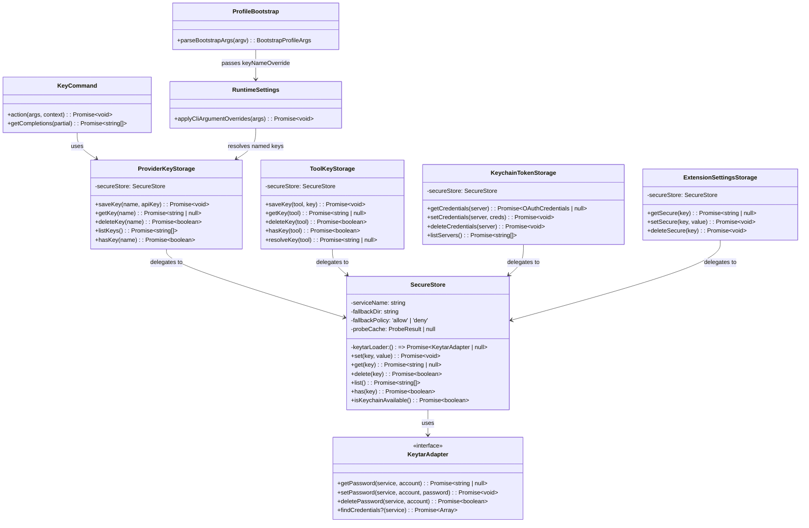

=== REQUIREMENTS (requirements.md) ===
# Requirements (EARS Format)

Issues: #1350, #1353, #1355, #1356
Parent Epic: #1349 (Unified Credential Management — Keyring-First)

EARS patterns used:
- **Ubiquitous**: The [system] shall [behavior].
- **Event-driven**: When [trigger], the [system] shall [behavior].
- **State-driven**: While [state], the [system] shall [behavior].
- **Unwanted behavior**: If [condition], then the [system] shall [behavior].
- **Optional**: Where [feature/condition], the [system] shall [behavior].

---

## R1: SecureStore — Keyring Access

### R1.1 — Ubiquitous

SecureStore shall dynamically import `@napi-rs/keyring` and wrap `AsyncEntry` instances to provide `getPassword`, `setPassword`, `deletePassword`, and optionally `findCredentials` operations against the OS keyring.

### R1.2 — Event-Driven

When `@napi-rs/keyring` cannot be loaded (module not found, dlopen failed), SecureStore shall detect the failure via error codes `ERR_MODULE_NOT_FOUND`, `MODULE_NOT_FOUND`, `ERR_DLOPEN_FAILED`, or error messages containing `'@napi-rs/keyring'`, and shall treat the keyring as unavailable.

### R1.3 — Ubiquitous

SecureStore shall accept a `keytarLoader` option in its constructor to allow injection of a mock keyring adapter for testing.

---

## R2: SecureStore — Availability Probing

### R2.1 — Event-Driven

When `isKeychainAvailable()` is called, SecureStore shall perform a set-get-delete test cycle using a randomly-named test account to determine whether the OS keyring is functional.

### R2.2 — Ubiquitous

SecureStore shall cache the availability probe result for 60 seconds. Subsequent calls to `isKeychainAvailable()` within the TTL shall return the cached result without re-probing.

### R2.3 — Event-Driven

When a transient error (timeout) occurs during probing, SecureStore shall immediately invalidate the cached probe result so a subsequent call can retry without waiting for the TTL to expire.

---

## R3: SecureStore — CRUD Operations

### R3.1a — Event-Driven

When `set(key, value)` is called and the OS keyring is available, SecureStore shall store the value in the OS keyring under the configured `serviceName` and the provided `key`.

### R3.1b — Event-Driven

When `set(key, value)` is called and the OS keyring is unavailable, SecureStore shall store the value in the encrypted fallback file (subject to `fallbackPolicy` per R4.1 and R4.2).

### R3.2 — Event-Driven

When `get(key)` is called and the key exists in the OS keyring, SecureStore shall return the value from the keyring.

### R3.3 — Event-Driven

When `get(key)` is called and the key does not exist in the keyring but exists in the encrypted fallback file, SecureStore shall return the value from the fallback file.

### R3.4 — Event-Driven

When `get(key)` is called and the key exists in neither the keyring nor the fallback file, SecureStore shall return `null`.

### R3.5 — Event-Driven

When both the keyring and the encrypted fallback file contain a value for the same key and `get(key)` is called, SecureStore shall return the keyring value. The keyring is the primary store; the fallback file is a safety net.

### R3.6 — Event-Driven

When `delete(key)` is called, SecureStore shall remove the key from both the OS keyring and the encrypted fallback file.

### R3.7 — Event-Driven

When `list()` is called, SecureStore shall return a best-effort enumeration of all keys by combining keyring enumeration (via `findCredentials` if available) with a directory scan of fallback files, deduplicated by key name.

### R3.8 — Event-Driven

When `has(key)` is called and the key does not exist, SecureStore shall return `false`. When `has(key)` is called and an error other than not-found occurs (unavailable, locked, denied, corrupt), SecureStore shall throw with the appropriate error taxonomy code.

---

## R4: SecureStore — Encrypted File Fallback

### R4.1 — State-Driven

While the OS keyring is unavailable and `fallbackPolicy` is `'allow'` (the default), SecureStore shall store and retrieve values using AES-256-GCM encrypted files in the configured `fallbackDir`.

### R4.2 — State-Driven

While the OS keyring is unavailable and `fallbackPolicy` is `'deny'`, SecureStore shall throw an error with taxonomy code `UNAVAILABLE` and actionable remediation message. It shall not fall back to encrypted files.

### R4.3 — Ubiquitous

SecureStore shall use async `scrypt` (not `scryptSync`) for key derivation with parameters N=16384, r=8, p=1. The key derivation input shall include a machine-specific identifier (hostname + username hash).

### R4.4 — Ubiquitous

SecureStore shall store each key as a separate encrypted file named `{key}.enc` in the `fallbackDir`.

### R4.5 — Ubiquitous

All encrypted fallback files shall use a versioned envelope format:

    {"v":1, "crypto":{"alg":"aes-256-gcm","kdf":"scrypt","N":16384,"r":8,"p":1,"saltLen":16}, "data":"<base64 ciphertext>"}

### R4.6 — Unwanted Behavior

If SecureStore reads a fallback file with an unrecognized envelope version, it shall emit a clear error with upgrade instructions rather than attempting to parse the data or silently returning null.

### R4.7 — Ubiquitous

SecureStore shall write fallback files atomically: write to a temporary file in the same directory, `fsync` the file descriptor, `rename` to the final path, and set permissions to `0o600`.

### R4.8 — Ubiquitous

SecureStore shall create the `fallbackDir` with permissions `0o700` if it does not exist.

---

## R5: SecureStore — No Backward Compatibility

### R5.1 — Ubiquitous

SecureStore shall use its own envelope format exclusively. It shall not read, parse, or attempt to migrate encrypted files created by previous implementations (ToolKeyStorage `.key` files, FileTokenStorage `mcp-oauth-tokens-v2.json`). There are no migration shims, no legacy format readers, and no backward compatibility adapters.

### R5.2 — Unwanted Behavior

If SecureStore encounters a fallback file that does not match the expected versioned envelope format, it shall treat the file as corrupt (taxonomy code `CORRUPT`) and shall not attempt legacy format detection or migration.

---

## R6: SecureStore — Error Taxonomy

### R6.1 — Ubiquitous

SecureStore shall map all errors to the following taxonomy codes and include the corresponding remediation text in user-facing messages:

| Code | Meaning | Remediation |
|------|---------|-------------|
| `UNAVAILABLE` | Keyring backend not present | Use `--key`, install keyring, or use seatbelt mode |
| `LOCKED` | Keyring present but locked | Unlock your keyring |
| `DENIED` | Permission denied | Check permissions, run as correct user |
| `CORRUPT` | Stored data failed validation | Re-save the key or re-authenticate |
| `TIMEOUT` | Operation timed out | Retry, check system load |
| `NOT_FOUND` | Key does not exist | Save the key first |

---

## R7: SecureStore — Existing Store Refactoring

### R7.1 — Ubiquitous

After SecureStore is created, `ToolKeyStorage` shall be refactored into a thin wrapper around `SecureStore('llxprt-code-tool-keys')`. It shall retain its registry validation, keyfile path resolution, and `resolveKey()` chain. All keyring loading, probing, encryption, and file I/O logic shall be removed from `ToolKeyStorage`.

### R7.2 — Ubiquitous

After SecureStore is created, `KeychainTokenStorage` shall be refactored into a thin wrapper around `SecureStore('llxprt-cli-mcp-oauth')`. It shall retain its JSON serialization, credential validation, and `sanitizeServerName()` logic.

### R7.3 — Ubiquitous

`FileTokenStorage` shall be eliminated. Its encrypted-file role is absorbed by SecureStore's fallback path. Tests for `FileTokenStorage` shall be deleted.

### R7.4 — Ubiquitous

`HybridTokenStorage` shall be eliminated. SecureStore handles the keyring-to-fallback orchestration internally. Tests for `HybridTokenStorage` shall be deleted. Consumers (`OAuthTokenStorage`, `OAuthCredentialStorage`) shall be updated to use the refactored `KeychainTokenStorage` directly.

### R7.5 — Ubiquitous

After SecureStore is created, `ExtensionSettingsStorage` shall be refactored to use `SecureStore` for sensitive settings storage. Its module-level keytar loading code shall be removed. Non-sensitive `.env` file logic shall remain unchanged.

### R7.6 — Ubiquitous

Each surviving refactored thin wrapper (`ToolKeyStorage`, `KeychainTokenStorage`, `ExtensionSettingsStorage`) shall pass contract tests proving identical observable behavior to the original implementation for all public-facing operations. This does not apply to eliminated components (`FileTokenStorage`, `HybridTokenStorage`) whose tests are deleted per R7.3 and R7.4.

### R7.7 — Ubiquitous

After refactoring, no duplicate `@napi-rs/keyring` import/wrapping code shall remain outside of SecureStore.

---

## R7A: SecureStore — Behavioral Delta Audit

### R7A.1 — Ubiquitous

Before the four existing store implementations are refactored, the semantic differences between them (naming conventions, serialization, retry/fallback triggers, error handling) shall be audited and documented. Intentional behavioral differences shall be preserved in the thin wrappers; unintentional differences shall be resolved.

---

## R7B: SecureStore — Resilience

### R7B.1 — Event-Driven

When the OS keyring becomes unavailable mid-session (e.g., daemon restart, keyring locked after startup) and `fallbackPolicy` is `'allow'`, SecureStore shall fall back to encrypted files for subsequent operations rather than crashing.

### R7B.2 — Unwanted Behavior

If a fallback file write is interrupted (process kill, disk full), SecureStore's atomic write contract (R4.7) shall prevent partial or corrupt files from being left in the `fallbackDir`. A concurrent reader shall see either the old complete value or the new complete value, never a partial write.

### R7B.3 — Unwanted Behavior

If two processes write to the same fallback file concurrently, SecureStore's atomic rename shall ensure no data is lost — one write wins, and neither produces a corrupt file.

---

## R7C: SecureStore — Legacy Data Startup Messaging

### R7C.1 — Event-Driven

When SecureStore detects an unreadable fallback file at a path previously used by a legacy implementation (e.g., ToolKeyStorage `.key` file, FileTokenStorage `mcp-oauth-tokens-v2.json`), it shall treat the file as corrupt per R5.2 and emit a user-facing message with actionable remediation (e.g., "Re-save your key with /toolkey set" or "Re-authenticate with /auth login for MCP servers").

---

## R8: SecureStore — Observability

### R8.1 — Ubiquitous

All SecureStore operations shall emit structured debug logs including: operation type (keyring read/write/delete, fallback used, probe result), key identifiers (hashed for privacy in debug logs), timing information, failure reasons, fallback triggers, and error taxonomy code.

### R8.2 — Unwanted Behavior

If any code path within SecureStore or its consumers logs a secret value (API key, token, password) at any log level, this is a defect. SecureStore and its consumers shall not emit secret values to any log output. Masked key previews (via `maskKeyForDisplay`) are acceptable in user-facing output only, never in log files.

---

## R9: ProviderKeyStorage — Named API Key CRUD

### R9.1 — Ubiquitous

`ProviderKeyStorage` shall be backed by a `SecureStore` instance with service name `llxprt-code-provider-keys` and fallback directory `~/.llxprt/provider-keys/` with fallback policy `'allow'`.

### R9.2 — Event-Driven

When `saveKey(name, apiKey)` is called with a valid name, ProviderKeyStorage shall trim leading/trailing whitespace and trailing newline/carriage return characters from the API key value, then store the result via SecureStore.

### R9.3 — Event-Driven

When `getKey(name)` is called and the named key exists, ProviderKeyStorage shall return the stored API key string. When it does not exist, it shall return `null`.

### R9.4 — Event-Driven

When `deleteKey(name)` is called, ProviderKeyStorage shall remove the key from SecureStore and return `true` if deleted, `false` if not found.

### R9.5 — Event-Driven

When `listKeys()` is called, ProviderKeyStorage shall return all stored key names from SecureStore, sorted alphabetically and deduplicated.

### R9.6 — Event-Driven

When `hasKey(name)` is called, ProviderKeyStorage shall return `true` if the named key exists, `false` otherwise.

---

## R10: ProviderKeyStorage — Key Name Validation

### R10.1 — Ubiquitous

ProviderKeyStorage shall validate key names against the regex `^[a-zA-Z0-9._-]{1,64}$`. Names are case-sensitive and stored as-is with no normalization.

### R10.2 — Unwanted Behavior

If a key name does not match the validation regex, ProviderKeyStorage shall reject the operation with a descriptive error message: `Key name '<name>' is invalid. Use only letters, numbers, dashes, underscores, and dots (1-64 chars).`

---

## R11: ProviderKeyStorage — Platform Limitations

### R11.1 — Ubiquitous

ProviderKeyStorage shall not normalize key name casing. On platforms where keyring backends are case-insensitive (Windows Credential Manager), two key names differing only by case may collide. ProviderKeyStorage shall not attempt to detect or mitigate this.

---

## R12: /key Commands — Subcommand Parsing

### R12.1 — Event-Driven

When the user enters `/key` followed by arguments, the command handler shall split the arguments by whitespace and check the first token against the subcommand names: `save`, `load`, `show`, `list`, `delete`.

### R12.2 — Event-Driven

When the first token matches a subcommand name, the command handler shall dispatch to the corresponding subcommand handler.

### R12.3 — Event-Driven

When the first token does not match any subcommand name, the command handler shall treat the entire argument string as a raw API key and invoke the existing legacy behavior (ephemeral session key set).

### R12.4 — Event-Driven

When `/key` is entered with no arguments, the command handler shall show the current key status for the active provider.

### R12.5 — Ubiquitous

Subcommand name matching shall be case-sensitive. `save` is a subcommand; `SAVE` is treated as a raw key via the legacy path.

### R12.6 — Ubiquitous

The command handler shall trim leading and trailing whitespace from the argument string before parsing tokens.

---

## R13: /key save

### R13.1 — Event-Driven

When `/key save <name> <api-key>` is entered, the command handler shall validate the name, then store the key via `ProviderKeyStorage.saveKey()`, and confirm with a masked display using `maskKeyForDisplay`.

### R13.2 — Event-Driven

When `/key save <name>` is entered for a name that already exists in the keyring and the session is interactive, the command handler shall prompt the user for confirmation before overwriting.

### R13.3 — State-Driven

While the session is non-interactive (piped input, `--prompt` flag), `/key save` with an existing name shall fail with an error. Overwriting requires interactive confirmation.

### R13.4 — Unwanted Behavior

If `/key save <name>` is entered without an API key value, the command handler shall return an error: `API key value cannot be empty.`

### R13.5 — Unwanted Behavior

If `/key save` is entered without a name or key, the command handler shall return an error with a usage hint.

---

## R14: /key load

### R14.1 — Event-Driven

When `/key load <name>` is entered and the named key exists, the command handler shall retrieve the key via `ProviderKeyStorage.getKey()` and set it as the active provider API key for the session (same effect as `/key <raw-key>`).

### R14.2 — Unwanted Behavior

If `/key load <name>` is entered and the named key does not exist, the command handler shall return: `Key '<name>' not found. Use '/key list' to see saved keys.`

### R14.3 — Unwanted Behavior

If `/key load` is entered without a name, the command handler shall return an error with a usage hint.

---

## R15: /key show

### R15.1 — Event-Driven

When `/key show <name>` is entered and the named key exists, the command handler shall display a masked preview of the key using `maskKeyForDisplay` and the key length: `<name>: <masked> (<length> chars)`.

### R15.2 — Unwanted Behavior

If `/key show <name>` is entered and the named key does not exist, the command handler shall return: `Key '<name>' not found. Use '/key list' to see saved keys.`

---

## R16: /key list

### R16.1 — Event-Driven

When `/key list` is entered, the command handler shall retrieve all key names via `ProviderKeyStorage.listKeys()` and display each name with its masked value using `maskKeyForDisplay`, sorted alphabetically.

### R16.2 — Event-Driven

When `/key list` is entered and no keys are stored, the command handler shall display a message indicating no saved keys exist.

---

## R17: /key delete

### R17.1 — Event-Driven

When `/key delete <name>` is entered in an interactive session and the named key exists, the command handler shall prompt for confirmation, then remove the key via `ProviderKeyStorage.deleteKey()` and confirm: `Deleted key '<name>'`.

### R17.2 — State-Driven

While the session is non-interactive, `/key delete` shall fail with an error. Deletion requires interactive confirmation.

### R17.3 — Unwanted Behavior

If `/key delete <name>` is entered and the named key does not exist, the command handler shall return: `Key '<name>' not found. Use '/key list' to see saved keys.`

### R17.4 — Unwanted Behavior

If `/key delete` is entered without a name, the command handler shall return an error with a usage hint.

---

## R18: /key — Storage Failure

### R18.1 — Unwanted Behavior

If both the OS keyring and the encrypted file fallback are unavailable when any `/key` subcommand (`save`, `load`, `show`, `list`, `delete`) is invoked (i.e., `ProviderKeyStorage` operations throw), the command handler shall return an actionable error. When the keyring is unavailable but encrypted file fallback is functional, `/key` subcommands shall continue to work via the fallback path.

---

## R19: /key — Autocomplete

### R19.1 — Event-Driven

When the user is typing `/key load`, `/key show`, or `/key delete`, the command handler shall provide autocomplete suggestions from `ProviderKeyStorage.listKeys()`.

### R19.2 — Event-Driven

When the user is typing `/key save`, the command handler shall autocomplete the first argument against existing key names (for overwrite awareness).

### R19.3 — Unwanted Behavior

If the keyring is unavailable during autocomplete, the command handler shall return an empty list rather than an error.

---

## R20: /key — Secure Input Handling

### R20.1 — Event-Driven

When `/key save <name> <api-key>` is entered, the secure input handler shall mask the API key value (third token) in display/transcript while leaving the subcommand and name visible.

### R20.2 — Ubiquitous

The existing secure input masking for `/key <raw-key>` (legacy path) shall continue to function unchanged.

---

## R21: auth-key-name Profile Field

### R21.1 — Event-Driven

When a profile containing `auth-key-name` is loaded, the system shall resolve the named key via `ProviderKeyStorage.getKey(name)` during `applyCliArgumentOverrides()` and use it as the provider API key for the session.

### R21.2 — Ubiquitous

`auth-key-name` shall be recognized as a valid ephemeral setting in profile definitions.

### R21.3 — Ubiquitous

Profile bootstrap shall parse `auth-key-name` from profile JSON and pass it through as metadata. It shall not resolve the named key — resolution happens in `runtimeSettings.ts` `applyCliArgumentOverrides()`.

---

## R22: --key-name CLI Flag

### R22.1 — Event-Driven

When `--key-name <name>` is provided on the CLI, the system shall resolve the named key via `ProviderKeyStorage.getKey(name)` during `applyCliArgumentOverrides()` and use it as the provider API key for the session.

### R22.2 — Ubiquitous

`--key-name` shall be parsed by the bootstrap argument parser alongside `--key` and `--keyfile`, and stored in `BootstrapProfileArgs` as `keyNameOverride`.

---

## R23: API Key Precedence

### R23.1 — Ubiquitous

The system shall determine the API key for a session using this precedence order (highest first):

1. `--key` (CLI flag, raw key)
2. `--key-name` (CLI flag, named key from keyring)
3. `auth-key-name` (profile field, named key from keyring)
4. `auth-keyfile` (profile field, read from file)
5. `auth-key` (profile field, inline in profile JSON)
6. Environment variables (`GEMINI_API_KEY`, etc.)

### R23.2 — Event-Driven

When both `--key` and `--key-name` are specified on the CLI, `--key` shall win (explicit raw key beats named key lookup).

### R23.3 — Ubiquitous

All precedence resolution shall happen in `runtimeSettings.ts` `applyCliArgumentOverrides()`. Profile bootstrap passes metadata only and does not resolve named keys.

---

## R24: Named Key — Error Handling

### R24.1 — Unwanted Behavior

If `auth-key-name` or `--key-name` references a named key that does not exist in the keyring, the system shall fail with an actionable error: `Named key '<name>' not found. Use '/key save <name> <key>' to store it.` It shall NOT silently fall through to lower-precedence auth sources.

### R24.2 — State-Driven

While the session is non-interactive and a named key is not found, the system shall fail fast with an exit code and the same error message.

---

## R25: Named Key — Startup Diagnostics

### R25.1 — State-Driven

While debug mode is enabled, the system shall emit a log line identifying the selected auth source by type (without the key value):

    [auth] Using API key from: --key-name '<name>' (keyring)
    [auth] Using API key from: profile '<profile>' auth-keyfile '<path>'
    [auth] Using API key from: environment variable GEMINI_API_KEY

### R25.2 — State-Driven

While debug mode is enabled and a lower-precedence auth source is present but overridden, the system shall log at debug level:

    [auth] Ignoring profile auth-key (overridden by --key-name)

---

## R26: No Deprecations

### R26.1 — Ubiquitous

`--key`, `--keyfile`, `auth-key`, and `auth-keyfile` shall remain fully supported and unchanged in behavior. The new `--key-name` and `auth-key-name` options are purely additive.

---

## R27: Test Acceptance Criteria

These requirements reflect explicit acceptance criteria from the GitHub issues that mandate specific test coverage.

### R27.1 — Ubiquitous

SecureStore shall have fault-injection tests covering: write interruption mid-fsync, keyring error after successful fallback write, and lock contention between concurrent writers (per #1350 acceptance criteria).

### R27.2 — Ubiquitous

The `/key` command parser shall have table-driven tests covering each subcommand, the legacy fallback path, and edge cases including missing arguments, case sensitivity, and whitespace handling (per #1355 acceptance criteria).

### R27.3 — Ubiquitous

The API key precedence resolution shall have a test matrix covering every combination of auth sources: CLI flags only (`--key`, `--key-name`), profile fields only (`auth-key-name`, `auth-keyfile`, `auth-key`), environment variables only, and combinations of multiple sources at different precedence levels (per #1356 acceptance criteria).

---

## Known Limitations (Out of Scope)

- **Windows case-insensitive keyring** (R11.1): On Windows Credential Manager, key names that differ only by case may collide. Not mitigated.
- **`list()` completeness**: Some keyring backends do not support enumeration. `/key list` may not show keys that only exist in the keyring on those platforms. Fallback file directory scan supplements this.
- **Encrypted file portability**: Fallback files are not portable between machines — key derivation includes hostname and username.
- **Quoted key names**: `/key save "my key"` is not supported. Key names with spaces or special characters are rejected by R10.1.
- **Phase B credential proxy**: `RATE_LIMITED` and `UNAUTHORIZED` taxonomy codes, sandbox credential isolation, Unix socket IPC — all out of scope for this work.

=== PHASE: 01-preflight.md ===
# Phase 01: Preflight Verification

## Phase ID

`PLAN-20260211-SECURESTORE.P01`

## Purpose

Verify ALL assumptions before writing any code. This phase prevents planning failures from missing dependencies, wrong types, impossible call patterns, and missing test infrastructure.

## Prerequisites

- Required: Plan documents exist (overview.md, technical-overview.md, requirements.md)
- Required: Pseudocode files exist in analysis/pseudocode/

---

## Dependency Verification

| Dependency | Command | Expected | Status |
|------------|---------|----------|--------|
| `@napi-rs/keyring` | `npm ls @napi-rs/keyring` | Installed (optional dep) | [ ] |
| `vitest` | `npm ls vitest` | Installed (dev dep) | [ ] |
| `node:crypto` | Built-in | Available | [ ] |
| `node:fs/promises` | Built-in | Available | [ ] |
| `node:os` | Built-in | Available | [ ] |

```bash
# Run these commands and paste output:
npm ls @napi-rs/keyring 2>&1 || echo "NOT FOUND (expected as optional)"
npm ls vitest 2>&1 | head -5
node -e "require('crypto'); require('fs'); require('os'); console.log('Built-ins OK')"
```

## Type/Interface Verification

| Type Name | Expected Location | Expected Shape | Actual Shape | Match? |
|-----------|-------------------|----------------|--------------|--------|
| `KeytarAdapter` | `packages/core/src/tools/tool-key-storage.ts` L130-138 | `getPassword`, `setPassword`, `deletePassword` | [verify] | [ ] |
| `findCredentials` in keytar | `packages/core/src/mcp/token-storage/keychain-token-storage.ts` L20-22 | `findCredentials(service): Promise<Array<{account, password}>>` | [verify] | [ ] |
| `CommandContext` | `packages/cli/src/ui/commands/` | Has runtime, isInteractive | [verify] | [ ] |
| `BootstrapProfileArgs` | `packages/cli/src/config/profileBootstrap.ts` L19-28 | Has keyOverride, keyfileOverride | [verify] | [ ] |
| `VALID_EPHEMERAL_SETTINGS` | `packages/cli/src/config/config.ts` L1710-1721 | Array of strings including auth-key, auth-keyfile | [verify] | [ ] |

```bash
# Verify types exist:
grep -n "interface KeytarAdapter\|type KeytarAdapter" packages/core/src/tools/tool-key-storage.ts
grep -n "findCredentials" packages/core/src/mcp/token-storage/keychain-token-storage.ts
grep -n "BootstrapProfileArgs" packages/cli/src/config/profileBootstrap.ts | head -5
grep -n "VALID_EPHEMERAL_SETTINGS\|ephemeralKeys\|validEphemeral" packages/cli/src/config/config.ts | head -5
```

## Call Path Verification

| Function | Expected Location | Expected Caller | Evidence |
|----------|-------------------|-----------------|----------|
| `updateActiveProviderApiKey` | Runtime class | keyCommand, runtimeSettings | [verify] |
| `applyCliArgumentOverrides` | runtimeSettings.ts L2289-2345 | Config/bootstrap flow | [verify] |
| `maskKeyForDisplay` | tool-key-storage.ts L104-110 | keyCommand, toolkeyCommand | [verify] |
| `getToolKeyStorage` | tool-key-storage.ts L114-125 | Module-level singleton | [verify] |

```bash
# Verify call paths:
grep -rn "updateActiveProviderApiKey" packages/cli/src --include="*.ts" | head -5
grep -rn "applyCliArgumentOverrides" packages/cli/src --include="*.ts" | head -5
grep -rn "maskKeyForDisplay" packages/core/src --include="*.ts" | head -5
grep -rn "getToolKeyStorage" packages/core/src --include="*.ts" | head -5
```

## File Existence Verification

| File | Expected | Purpose |
|------|----------|---------|
| `packages/core/src/storage/` | Directory exists | Target for SecureStore |
| `packages/core/src/tools/tool-key-storage.ts` | Exists | Refactoring target |
| `packages/core/src/tools/tool-key-storage.test.ts` | Exists | Must continue passing |
| `packages/core/src/mcp/token-storage/keychain-token-storage.ts` | Exists | Refactoring target |
| `packages/core/src/mcp/token-storage/file-token-storage.ts` | Exists | Elimination target |
| `packages/core/src/mcp/token-storage/hybrid-token-storage.ts` | Exists | Elimination target |
| `packages/cli/src/config/extensions/settingsStorage.ts` | Exists | Refactoring target |
| `packages/cli/src/ui/commands/keyCommand.ts` | Exists | Modification target |
| `packages/cli/src/config/profileBootstrap.ts` | Exists | Modification target |
| `packages/cli/src/runtime/runtimeSettings.ts` | Exists | Modification target |
| `packages/cli/src/ui/utils/secureInputHandler.ts` | Exists | Modification target |

```bash
# Verify all files exist:
ls -la packages/core/src/storage/
ls -la packages/core/src/tools/tool-key-storage.ts
ls -la packages/core/src/tools/tool-key-storage.test.ts
ls -la packages/core/src/mcp/token-storage/keychain-token-storage.ts
ls -la packages/core/src/mcp/token-storage/file-token-storage.ts
ls -la packages/core/src/mcp/token-storage/hybrid-token-storage.ts
ls -la packages/cli/src/config/extensions/settingsStorage.ts
ls -la packages/cli/src/ui/commands/keyCommand.ts
ls -la packages/cli/src/config/profileBootstrap.ts
ls -la packages/cli/src/runtime/runtimeSettings.ts
ls -la packages/cli/src/ui/utils/secureInputHandler.ts
```

## Test Infrastructure Verification

| Component | Test File | Patterns Work? |
|-----------|-----------|---------------|
| ToolKeyStorage | `tool-key-storage.test.ts` | [verify] |
| KeychainTokenStorage | `keychain-token-storage.test.ts` or similar | [verify] |
| Commands | `packages/cli/src/ui/commands/*.test.ts` pattern | [verify] |

```bash
# Verify test patterns:
find packages/core/src -name "*.test.ts" -path "*tool-key*" -o -name "*.test.ts" -path "*token-storage*" | head -10
find packages/cli/src -name "*.test.ts" -path "*command*" | head -10
npm test -- --listTests 2>&1 | grep -i "tool-key\|token-storage\|command" | head -10
```

## Core Export Verification

```bash
# Verify how existing exports are structured:
grep -n "ToolKeyStorage\|isValidToolKeyName\|maskKeyForDisplay" packages/core/src/index.ts 2>/dev/null || \
  find packages/core/src -name "index.ts" -exec grep -ln "export" {} \; | head -5
```

## Interactive Prompt Pattern Verification

```bash
# Verify how other commands handle user prompts/confirmation:
grep -rn "prompt\|confirm\|readline\|question" packages/cli/src/ui/commands/*.ts | head -10
grep -rn "isInteractive\|interactive" packages/cli/src --include="*.ts" | head -10
```

---

## Blocking Issues Found

[To be filled during execution]

## Verification Gate

- [ ] All dependencies verified (or documented as optional)
- [ ] All types match expectations (or plan updated)
- [ ] All call paths are possible (or plan redesigned)
- [ ] All files exist at expected locations
- [ ] Test infrastructure ready
- [ ] Core export pattern understood
- [ ] Interactive prompt pattern identified

**IF ANY CHECKBOX IS UNCHECKED**: STOP and update plan before proceeding to Phase 02.

## Phase Completion Marker

Create: `project-plans/issue1350_1353_1355_1356/.completed/P01.md`
Contents: Paste of all verification command outputs and checklist results.

=== DOMAIN MODEL ===
# Domain Model: SecureStore + Named API Key Management

Plan ID: PLAN-20260211-SECURESTORE

---

## Entity Relationships



---

## State Transitions

### SecureStore Keyring Availability State

```
                    ┌─────────────────────┐
                    │     UNPROBED         │
                    │  (probeCache=null)   │
                    └──────────┬──────────┘
                               │ isKeychainAvailable() called
                               ▼
                    ┌─────────────────────┐
                    │     PROBING          │
                    │  (set-get-delete)    │
                    └──────┬──────┬───────┘
                   success │      │ failure
                           ▼      ▼
              ┌────────────────┐  ┌─────────────────┐
              │   AVAILABLE    │  │   UNAVAILABLE    │
              │ cached 60 sec  │  │  cached 60 sec   │
              └───────┬────────┘  └────────┬─────────┘
                      │ TTL expires         │ TTL expires
                      ▼                     ▼
              ┌─────────────────────────────────────┐
              │          UNPROBED (re-probe)         │
              └─────────────────────────────────────┘

   On transient error (TIMEOUT): immediate cache invalidation → UNPROBED
```

### SecureStore CRUD Decision Flow

```
  set(key, value)
       │
       ▼
  isKeychainAvailable()?
       │
  ┌────┴─────┐
  │ yes      │ no
  ▼          ▼
  Store in   Check fallbackPolicy
  keyring    ┌────┴─────┐
  │          │ 'allow'  │ 'deny'
  │          ▼          ▼
  │          Store in   Throw UNAVAILABLE
  │          fallback   with remediation
  │          file
  ▼          ▼
  Done       Done

  get(key)
       │
       ▼
  Try keyring
       │
  ┌────┴─────┐
  │ found    │ not found / unavailable
  ▼          ▼
  Return     Try fallback file
  value      ┌────┴─────┐
             │ found    │ not found
             ▼          ▼
             Return     Return null
             value
```

### /key Command Parsing State

```
  User enters "/key ..."
       │
       ▼
  Trim args, split by whitespace
       │
       ▼
  Check first token
       │
  ┌────┼────┬─────┬────┬─────┬──────┐
  │    │    │     │    │     │      │
  save load show list delete (other) (empty)
  │    │    │     │    │     │      │
  ▼    ▼    ▼     ▼    ▼     ▼      ▼
  P13  P14  P15   P16  P17  legacy  status
```

### API Key Precedence Resolution

```
  Start resolution (in applyCliArgumentOverrides)
       │
       ▼
  --key present? ──yes──→ Use raw key from --key, DONE
       │ no
       ▼
  --key-name present? ──yes──→ Resolve via ProviderKeyStorage
       │ no                          │
       ▼                        ┌────┴────┐
  auth-key-name in profile?     found    not found
       │ no            │          │         │
       ▼          yes──┘          ▼         ▼
  auth-keyfile in profile?   Use resolved  FAIL with
       │ no                  key, DONE     actionable
       ▼                                  error
  auth-key in profile?
       │ no
       ▼
  Environment variable?
       │ no
       ▼
  No key (provider may not need one)
```

---

## Business Rules

### BR-1: Keyring Priority
The OS keyring is always the preferred storage location. When both keyring and fallback file contain the same key, the keyring value wins. Fallback files exist only as a safety net for environments without a keyring.

### BR-2: Atomic Writes
Fallback file writes MUST be atomic (temp → fsync → rename) to prevent corruption from interrupted writes or concurrent access. A reader must see either the complete old value or the complete new value, never a partial write.

### BR-3: No Backward Compatibility
SecureStore's envelope format is new. Existing encrypted files from legacy implementations are NOT readable. Users must re-save keys and re-authenticate. Startup messaging must be clear when old data is detected.

### BR-4: Name Validation
Key names must match `^[a-zA-Z0-9._-]{1,64}$`. Names are case-sensitive. No normalization is applied.

### BR-5: Callers Own Serialization
SecureStore stores raw strings. Consumers like KeychainTokenStorage handle their own JSON serialization/deserialization. ProviderKeyStorage stores raw API key strings. ToolKeyStorage stores raw key strings.

### BR-6: Callers Own Fallback Policy
SecureStore provides the mechanism (fallbackPolicy: 'allow' | 'deny'). Each consumer decides whether fallback is acceptable. ProviderKeyStorage uses 'allow'. Others choose based on their security requirements.

### BR-7: Fast-Fail Over Silent Degradation
When something breaks, error immediately with actionable message. Named key not found? Error, don't fall through. Keyring unavailable with deny policy? Error, don't silently degrade.

### BR-8: No Secret Logging
API keys, tokens, and passwords are NEVER logged at any level. Masked previews (maskKeyForDisplay: first 2 + last 2 chars) are acceptable in user-facing output only.

### BR-9: Subcommand Case Sensitivity
`/key save` is a subcommand. `/key SAVE` is treated as a raw key via the legacy path. Subcommand matching is case-sensitive.

### BR-10: Non-Interactive Safety
Operations requiring confirmation (overwrite, delete) fail in non-interactive mode rather than proceeding without confirmation.

---

## Edge Cases

### EC-1: Keyring Becomes Unavailable Mid-Session
If the keyring daemon restarts or the keyring is locked after initial probe, SecureStore falls back to encrypted files (if fallbackPolicy is 'allow') rather than crashing. The probe cache TTL (60 seconds) means recovery happens automatically.

### EC-2: Concurrent Fallback File Access
Two processes writing to the same fallback file simultaneously. Atomic rename ensures one write wins cleanly — no corruption.

### EC-3: Disk Full During Write
Atomic write to temp file fails. Original file is untouched. Error propagates to caller.

### EC-4: findCredentials Not Available
Some keyring backends don't support enumeration. `list()` falls back to directory scan of fallback files only. This means keys stored only in the keyring won't appear in the list.

### EC-5: Key Name Collisions on Windows
Windows Credential Manager is case-insensitive. Two names differing only by case (`MyKey` vs `mykey`) may collide. Not mitigated — documented as known limitation.

### EC-6: Empty API Key Value
`/key save mykey ` (empty value after name) → error: "API key value cannot be empty." Whitespace-only values are trimmed to empty and rejected.

### EC-7: Legacy Encrypted Files
SecureStore encounters old ToolKeyStorage `.key` files or FileTokenStorage `mcp-oauth-tokens-v2.json`. Treats as CORRUPT per R5.2. Emits actionable remediation message per R7C.1.

### EC-8: Probe Timeout
Keyring probe times out (transient error). Cache is immediately invalidated so next call retries. This prevents a single timeout from permanently marking keyring as unavailable.

### EC-9: Unrecognized Envelope Version
Fallback file with `{"v":99,...}`. Clear error with upgrade instructions rather than attempting to parse.

### EC-10: --key and --key-name Both Specified
`--key` wins per R23.2. `--key-name` is silently overridden. Debug log notes the override.

---

## Error Scenarios

### ES-1: SecureStore Error Taxonomy Mapping

| Scenario | Taxonomy Code | User Message |
|----------|---------------|--------------|
| `@napi-rs/keyring` not installed | UNAVAILABLE | Use `--key`, install keyring, or use seatbelt mode |
| Keyring daemon not running | UNAVAILABLE | Use `--key`, install keyring, or use seatbelt mode |
| macOS Keychain locked | LOCKED | Unlock your keyring |
| Linux keyring access denied | DENIED | Check permissions, run as correct user |
| Fallback file fails to decrypt | CORRUPT | Re-save the key or re-authenticate |
| Keyring operation exceeds timeout | TIMEOUT | Retry, check system load |
| Key not in keyring or fallback | NOT_FOUND | Save the key first |
| Unrecognized envelope version | CORRUPT | Upgrade instructions in error |
| Legacy format detected | CORRUPT | Re-save with new commands |

### ES-2: /key Command Error Messages

| Condition | Message |
|-----------|---------|
| Invalid key name | `Key name '<name>' is invalid. Use only letters, numbers, dashes, underscores, and dots (1-64 chars).` |
| Key not found (load/show/delete) | `Key '<name>' not found. Use '/key list' to see saved keys.` |
| Empty key value | `API key value cannot be empty.` |
| Missing arguments (save) | Usage hint showing syntax |
| Missing arguments (load/show/delete) | Usage hint showing syntax |
| Keyring unavailable | `Cannot access keyring. Keys cannot be saved. Use '/key <raw-key>' for ephemeral session key.` |
| Non-interactive overwrite | Error explaining confirmation needed |
| Non-interactive delete | Error explaining confirmation needed |

### ES-3: Named Key Resolution Errors

| Condition | Context | Behavior |
|-----------|---------|----------|
| Named key not found | Interactive | Error: `Named key '<name>' not found. Use '/key save <name> <key>' to store it.` |
| Named key not found | Non-interactive | Fail fast with exit code and same message |
| Keyring unavailable | auth-key-name | Fall through to encrypted file fallback, then error if not found |

---

## Data Flow: Named Key Save → Load via Profile

```
1. User: /key save myanthropic sk-ant-api03-abc123
   │
   ├─ KeyCommand parses: subcommand=save, name=myanthropic, value=sk-ant-api03-abc123
   ├─ KeyCommand validates name (regex match)
   ├─ KeyCommand calls ProviderKeyStorage.saveKey('myanthropic', 'sk-ant-api03-abc123')
   │   ├─ ProviderKeyStorage trims value
   │   └─ ProviderKeyStorage calls SecureStore.set('myanthropic', trimmed_value)
   │       ├─ SecureStore checks keyring availability
   │       ├─ If available: keytar.setPassword('llxprt-code-provider-keys', 'myanthropic', value)
   │       └─ If unavailable: encrypt to ~/.llxprt/provider-keys/myanthropic.enc
   └─ KeyCommand displays: "Saved key 'myanthropic' (sk***23)"

2. User creates profile: { "name": "my-anthro", "provider": "anthropic", "auth-key-name": "myanthropic" }

3. User starts session: llxprt --profile my-anthro
   │
   ├─ ProfileBootstrap parses profile JSON
   │   └─ Finds auth-key-name: 'myanthropic' → passes as metadata (does NOT resolve)
   ├─ RuntimeSettings.applyCliArgumentOverrides()
   │   ├─ Checks --key → not present
   │   ├─ Checks --key-name / auth-key-name → 'myanthropic'
   │   ├─ Calls ProviderKeyStorage.getKey('myanthropic')
   │   │   └─ SecureStore.get('myanthropic') → returns key value
   │   └─ Calls updateActiveProviderApiKey(resolved_key)
   └─ Session starts with resolved API key
```

=== EXECUTION TRACKER ===
# Execution Tracker: SecureStore + Named API Key Management

Plan ID: PLAN-20260211-SECURESTORE
Issues: #1350, #1353, #1355, #1356

## Execution Status

| Phase | ID | File | Status | Started | Completed | Verified | Semantic? | Notes |
|-------|-----|------|--------|---------|-----------|----------|-----------|-------|
| 01 | P01 | 01-preflight.md | [ ] | - | - | - | N/A | Preflight verification |
| 02 | P02 | 02-analysis.md | [ ] | - | - | - | N/A | Domain analysis |
| 02a | P02a | 02a-analysis-verification.md | [ ] | - | - | - | N/A | Analysis verification |
| 03 | P03 | 03-pseudocode.md | [ ] | - | - | - | N/A | Pseudocode development |
| 03a | P03a | 03a-pseudocode-verification.md | [ ] | - | - | - | N/A | Pseudocode verification |
| 04 | P04 | 04-securestore-stub.md | [ ] | - | - | - | [ ] | SecureStore stub |
| 04a | P04a | 04a-securestore-stub-verification.md | [ ] | - | - | - | [ ] | Stub verification |
| 05 | P05 | 05-securestore-tdd.md | [ ] | - | - | - | [ ] | SecureStore TDD (25+ tests) |
| 05a | P05a | 05a-securestore-tdd-verification.md | [ ] | - | - | - | [ ] | TDD verification |
| 06 | P06 | 06-securestore-impl.md | [ ] | - | - | - | [ ] | SecureStore implementation |
| 06a | P06a | 06a-securestore-impl-verification.md | [ ] | - | - | - | [ ] | Implementation verification |
| 07 | P07 | 07-wrapper-contract-tests.md | [ ] | - | - | - | [ ] | Thin wrapper contract tests |
| 07a | P07a | 07a-wrapper-contract-verification.md | [ ] | - | - | - | [ ] | Contract test verification |
| 08 | P08 | 08-wrapper-refactoring.md | [ ] | - | - | - | [ ] | Wrapper refactoring |
| 08a | P08a | 08a-wrapper-refactoring-verification.md | [ ] | - | - | - | [ ] | Refactoring verification |
| 09 | P09 | 09-eliminate-legacy.md | [ ] | - | - | - | [ ] | Eliminate FTS+HTS |
| 09a | P09a | 09a-eliminate-legacy-verification.md | [ ] | - | - | - | [ ] | Elimination verification |
| 10 | P10 | 10-provider-key-storage-stub.md | [ ] | - | - | - | [ ] | PKS stub |
| 10a | P10a | 10a-provider-key-storage-stub-verification.md | [ ] | - | - | - | [ ] | PKS stub verification |
| 11 | P11 | 11-provider-key-storage-tdd.md | [ ] | - | - | - | [ ] | PKS TDD (15+ tests) |
| 11a | P11a | 11a-provider-key-storage-tdd-verification.md | [ ] | - | - | - | [ ] | PKS TDD verification |
| 12 | P12 | 12-provider-key-storage-impl.md | [ ] | - | - | - | [ ] | PKS implementation |
| 12a | P12a | 12a-provider-key-storage-impl-verification.md | [ ] | - | - | - | [ ] | PKS impl verification |
| 13 | P13 | 13-key-commands-stub.md | [ ] | - | - | - | [ ] | /key commands stub |
| 13a | P13a | 13a-key-commands-stub-verification.md | [ ] | - | - | - | [ ] | /key stub verification |
| 14 | P14 | 14-key-commands-tdd.md | [ ] | - | - | - | [ ] | /key TDD (25+ tests) |
| 14a | P14a | 14a-key-commands-tdd-verification.md | [ ] | - | - | - | [ ] | /key TDD verification |
| 15 | P15 | 15-key-commands-impl.md | [ ] | - | - | - | [ ] | /key implementation |
| 15a | P15a | 15a-key-commands-impl-verification.md | [ ] | - | - | - | [ ] | /key impl verification |
| 16 | P16 | 16-auth-key-name-stub.md | [ ] | - | - | - | [ ] | auth-key-name stub |
| 16a | P16a | 16a-auth-key-name-stub-verification.md | [ ] | - | - | - | [ ] | auth-key-name stub verification |
| 17 | P17 | 17-auth-key-name-tdd.md | [ ] | - | - | - | [ ] | auth-key-name TDD (20+ tests) |
| 17a | P17a | 17a-auth-key-name-tdd-verification.md | [ ] | - | - | - | [ ] | auth-key-name TDD verification |
| 18 | P18 | 18-auth-key-name-impl.md | [ ] | - | - | - | [ ] | auth-key-name implementation |
| 18a | P18a | 18a-auth-key-name-impl-verification.md | [ ] | - | - | - | [ ] | auth-key-name impl verification |
| 19 | P19 | 19-final-verification.md | [ ] | - | - | - | [ ] | Final integration verification |

Note: "Semantic?" column tracks whether semantic verification (feature actually works, not just files exist) was performed.

## Phase Grouping

| Group | Phases | Component | Issue |
|-------|--------|-----------|-------|
| Preflight | P01 | All | All |
| Analysis | P02–P03a | All | All |
| SecureStore Core | P04–P06a | SecureStore | #1350 |
| Thin Wrappers | P07–P09a | ToolKeyStorage, KeychainTS, ExtSettingsStorage | #1350 |
| ProviderKeyStorage | P10–P12a | ProviderKeyStorage | #1353 |
| /key Commands | P13–P15a | keyCommand.ts | #1355 |
| auth-key-name | P16–P18a | profileBootstrap, config, runtimeSettings | #1356 |
| Final | P19 | All | All |

## Completion Markers

- [ ] All phases have @plan markers in code
- [ ] All requirements have @requirement markers in code
- [ ] All pseudocode referenced by implementation
- [ ] Verification script passes for each phase
- [ ] No phases skipped in sequence
- [ ] Final verification (P19) passed

## Completion Summary

Total phases: 33 (19 implementation + 14 verification)
Completed: 0/33
Requirements covered: 0/93
Tests written: 0 (target: 85+)
