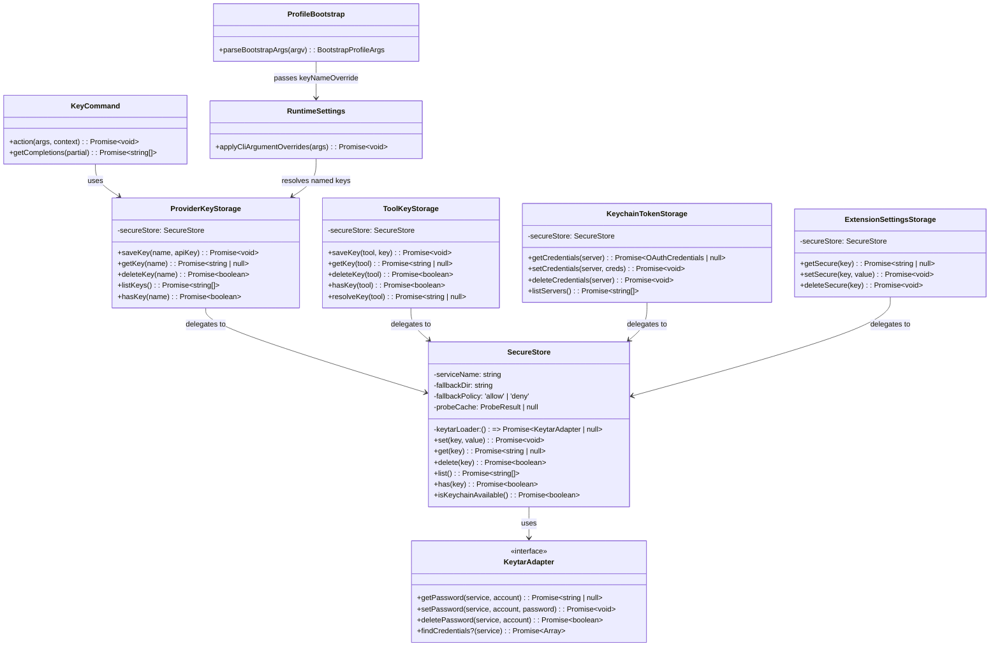

# Domain Model: SecureStore + Named API Key Management

Plan ID: PLAN-20260211-SECURESTORE

---

## Entity Relationships



---

## State Transitions

### SecureStore Keyring Availability State

```
                    ┌─────────────────────┐
                    │     UNPROBED         │
                    │  (probeCache=null)   │
                    └──────────┬──────────┘
                               │ isKeychainAvailable() called
                               ▼
                    ┌─────────────────────┐
                    │     PROBING          │
                    │  (set-get-delete)    │
                    └──────┬──────┬───────┘
                   success │      │ failure
                           ▼      ▼
              ┌────────────────┐  ┌─────────────────┐
              │   AVAILABLE    │  │   UNAVAILABLE    │
              │ cached 60 sec  │  │  cached 60 sec   │
              └───────┬────────┘  └────────┬─────────┘
                      │ TTL expires         │ TTL expires
                      ▼                     ▼
              ┌─────────────────────────────────────┐
              │          UNPROBED (re-probe)         │
              └─────────────────────────────────────┘

   On transient error (TIMEOUT): immediate cache invalidation → UNPROBED
```

### SecureStore CRUD Decision Flow

```
  set(key, value)
       │
       ▼
  isKeychainAvailable()?
       │
  ┌────┴─────┐
  │ yes      │ no
  ▼          ▼
  Store in   Check fallbackPolicy
  keyring    ┌────┴─────┐
  │          │ 'allow'  │ 'deny'
  │          ▼          ▼
  │          Store in   Throw UNAVAILABLE
  │          fallback   with remediation
  │          file
  ▼          ▼
  Done       Done

  get(key)
       │
       ▼
  Try keyring
       │
  ┌────┴─────┐
  │ found    │ not found / unavailable
  ▼          ▼
  Return     Try fallback file
  value      ┌────┴─────┐
             │ found    │ not found
             ▼          ▼
             Return     Return null
             value
```

### /key Command Parsing State

```
  User enters "/key ..."
       │
       ▼
  Trim args, split by whitespace
       │
       ▼
  Check first token
       │
  ┌────┼────┬─────┬────┬─────┬──────┐
  │    │    │     │    │     │      │
  save load show list delete (other) (empty)
  │    │    │     │    │     │      │
  ▼    ▼    ▼     ▼    ▼     ▼      ▼
  P13  P14  P15   P16  P17  legacy  status
```

### API Key Precedence Resolution

```
  Start resolution (in applyCliArgumentOverrides)
       │
       ▼
  --key present? ──yes──→ Use raw key from --key, DONE
       │ no
       ▼
  --key-name present? ──yes──→ Resolve via ProviderKeyStorage
       │ no                          │
       ▼                        ┌────┴────┐
  auth-key-name in profile?     found    not found
       │ no            │          │         │
       ▼          yes──┘          ▼         ▼
  auth-keyfile in profile?   Use resolved  FAIL with
       │ no                  key, DONE     actionable
       ▼                                  error
  auth-key in profile?
       │ no
       ▼
  Environment variable?
       │ no
       ▼
  No key (provider may not need one)
```

---

## Business Rules

### BR-1: Keyring Priority
The OS keyring is always the preferred storage location. When both keyring and fallback file contain the same key, the keyring value wins. Fallback files exist only as a safety net for environments without a keyring.

### BR-2: Atomic Writes
Fallback file writes MUST be atomic (temp → fsync → rename) to prevent corruption from interrupted writes or concurrent access. A reader must see either the complete old value or the complete new value, never a partial write.

### BR-3: No Backward Compatibility
SecureStore's envelope format is new. Existing encrypted files from legacy implementations are NOT readable. Users must re-save keys and re-authenticate. Startup messaging must be clear when old data is detected.

### BR-4: Name Validation
Key names must match `^[a-zA-Z0-9._-]{1,64}$`. Names are case-sensitive. No normalization is applied.

### BR-5: Callers Own Serialization
SecureStore stores raw strings. Consumers like KeychainTokenStorage handle their own JSON serialization/deserialization. ProviderKeyStorage stores raw API key strings. ToolKeyStorage stores raw key strings.

### BR-6: Callers Own Fallback Policy
SecureStore provides the mechanism (fallbackPolicy: 'allow' | 'deny'). Each consumer decides whether fallback is acceptable. ProviderKeyStorage uses 'allow'. Others choose based on their security requirements.

### BR-7: Fast-Fail Over Silent Degradation
When something breaks, error immediately with actionable message. Named key not found? Error, don't fall through. Keyring unavailable with deny policy? Error, don't silently degrade.

### BR-8: No Secret Logging
API keys, tokens, and passwords are NEVER logged at any level. Masked previews (maskKeyForDisplay: first 2 + last 2 chars) are acceptable in user-facing output only.

### BR-9: Subcommand Case Sensitivity
`/key save` is a subcommand. `/key SAVE` is treated as a raw key via the legacy path. Subcommand matching is case-sensitive.

### BR-10: Non-Interactive Safety
Operations requiring confirmation (overwrite, delete) fail in non-interactive mode rather than proceeding without confirmation.

---

## Edge Cases

### EC-1: Keyring Becomes Unavailable Mid-Session
If the keyring daemon restarts or the keyring is locked after initial probe, SecureStore falls back to encrypted files (if fallbackPolicy is 'allow') rather than crashing. The probe cache TTL (60 seconds) means recovery happens automatically.

### EC-2: Concurrent Fallback File Access
Two processes writing to the same fallback file simultaneously. Atomic rename ensures one write wins cleanly — no corruption.

### EC-3: Disk Full During Write
Atomic write to temp file fails. Original file is untouched. Error propagates to caller.

### EC-4: findCredentials Not Available
Some keyring backends don't support enumeration. `list()` falls back to directory scan of fallback files only. This means keys stored only in the keyring won't appear in the list.

### EC-5: Key Name Collisions on Windows
Windows Credential Manager is case-insensitive. Two names differing only by case (`MyKey` vs `mykey`) may collide. Not mitigated — documented as known limitation.

### EC-6: Empty API Key Value
`/key save mykey ` (empty value after name) → error: "API key value cannot be empty." Whitespace-only values are trimmed to empty and rejected.

### EC-7: Legacy Encrypted Files
SecureStore encounters old ToolKeyStorage `.key` files or FileTokenStorage `mcp-oauth-tokens-v2.json`. Treats as CORRUPT per R5.2. Emits actionable remediation message per R7C.1.

### EC-8: Probe Timeout
Keyring probe times out (transient error). Cache is immediately invalidated so next call retries. This prevents a single timeout from permanently marking keyring as unavailable.

### EC-9: Unrecognized Envelope Version
Fallback file with `{"v":99,...}`. Clear error with upgrade instructions rather than attempting to parse.

### EC-10: --key and --key-name Both Specified
`--key` wins per R23.2. `--key-name` is silently overridden. Debug log notes the override.

---

## Error Scenarios

### ES-1: SecureStore Error Taxonomy Mapping

| Scenario | Taxonomy Code | User Message |
|----------|---------------|--------------|
| `@napi-rs/keyring` not installed | UNAVAILABLE | Use `--key`, install keyring, or use seatbelt mode |
| Keyring daemon not running | UNAVAILABLE | Use `--key`, install keyring, or use seatbelt mode |
| macOS Keychain locked | LOCKED | Unlock your keyring |
| Linux keyring access denied | DENIED | Check permissions, run as correct user |
| Fallback file fails to decrypt | CORRUPT | Re-save the key or re-authenticate |
| Keyring operation exceeds timeout | TIMEOUT | Retry, check system load |
| Key not in keyring or fallback | NOT_FOUND | Save the key first |
| Unrecognized envelope version | CORRUPT | Upgrade instructions in error |
| Legacy format detected | CORRUPT | Re-save with new commands |

### ES-2: /key Command Error Messages

| Condition | Message |
|-----------|---------|
| Invalid key name | `Key name '<name>' is invalid. Use only letters, numbers, dashes, underscores, and dots (1-64 chars).` |
| Key not found (load/show/delete) | `Key '<name>' not found. Use '/key list' to see saved keys.` |
| Empty key value | `API key value cannot be empty.` |
| Missing arguments (save) | Usage hint showing syntax |
| Missing arguments (load/show/delete) | Usage hint showing syntax |
| Keyring unavailable | `Cannot access keyring. Keys cannot be saved. Use '/key <raw-key>' for ephemeral session key.` |
| Non-interactive overwrite | Error explaining confirmation needed |
| Non-interactive delete | Error explaining confirmation needed |

### ES-3: Named Key Resolution Errors

| Condition | Context | Behavior |
|-----------|---------|----------|
| Named key not found | Interactive | Error: `Named key '<name>' not found. Use '/key save <name> <key>' to store it.` |
| Named key not found | Non-interactive | Fail fast with exit code and same message |
| Keyring unavailable | auth-key-name | Fall through to encrypted file fallback, then error if not found |

---

## Data Flow: Named Key Save → Load via Profile

```
1. User: /key save myanthropic sk-ant-api03-abc123
   │
   ├─ KeyCommand parses: subcommand=save, name=myanthropic, value=sk-ant-api03-abc123
   ├─ KeyCommand validates name (regex match)
   ├─ KeyCommand calls ProviderKeyStorage.saveKey('myanthropic', 'sk-ant-api03-abc123')
   │   ├─ ProviderKeyStorage trims value
   │   └─ ProviderKeyStorage calls SecureStore.set('myanthropic', trimmed_value)
   │       ├─ SecureStore checks keyring availability
   │       ├─ If available: keytar.setPassword('llxprt-code-provider-keys', 'myanthropic', value)
   │       └─ If unavailable: encrypt to ~/.llxprt/provider-keys/myanthropic.enc
   └─ KeyCommand displays: "Saved key 'myanthropic' (sk***23)"

2. User creates profile: { "name": "my-anthro", "provider": "anthropic", "auth-key-name": "myanthropic" }

3. User starts session: llxprt --profile my-anthro
   │
   ├─ ProfileBootstrap parses profile JSON
   │   └─ Finds auth-key-name: 'myanthropic' → passes as metadata (does NOT resolve)
   ├─ RuntimeSettings.applyCliArgumentOverrides()
   │   ├─ Checks --key → not present
   │   ├─ Checks --key-name / auth-key-name → 'myanthropic'
   │   ├─ Calls ProviderKeyStorage.getKey('myanthropic')
   │   │   └─ SecureStore.get('myanthropic') → returns key value
   │   └─ Calls updateActiveProviderApiKey(resolved_key)
   └─ Session starts with resolved API key
```
