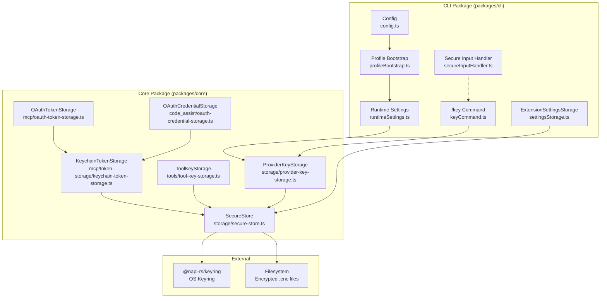

# Plan: SecureStore + Named API Key Management

Plan ID: PLAN-20260211-SECURESTORE
Generated: 2026-02-11
Total Phases: 19 (P01–P19)
Issues: #1350, #1353, #1355, #1356
Parent Epic: #1349 (Unified Credential Management — Keyring-First)

Requirements: R1, R2, R3, R4, R5, R6, R7, R7A, R7B, R7C, R8, R9, R10, R11, R12, R13, R14, R15, R16, R17, R18, R19, R20, R21, R22, R23, R24, R25, R26, R27

---

## Critical Reminders

Before implementing ANY phase, ensure you have:

1. Completed preflight verification (Phase 01)
2. Defined integration contracts for multi-component features
3. Written integration tests BEFORE unit tests
4. Verified all dependencies and types exist as assumed
5. Read and understood the pseudocode for the component being implemented

---

## Architecture Overview

### Component Diagram



### Command Routing Clarification

This plan involves two **separate** slash commands that must not be confused:

- **`/key`** (`packages/cli/src/ui/commands/keyCommand.ts`) — The **provider API key** command.
  Currently handles only ephemeral `/key <raw-key>` to set/clear the session API key.
  **This plan ADDS subcommand parsing** to this file (`save`, `load`, `show`, `list`, `delete`)
  so that `/key save myanthropic sk-ant-...` stores a named key, `/key load myanthropic`
  activates it for the session, etc. The existing legacy `/key <raw-key>` behavior is preserved
  as a fallback when the first token is not a recognized subcommand (R12.3).

- **`/toolkey`** (`packages/cli/src/ui/commands/toolkeyCommand.ts`) — A **separate** command
  for tool-specific API keys (Exa search, etc.). It has its own argument schema, its own
  validation (tool name enum), and its own `ToolKeyStorage` backend.
  **This plan does NOT modify `toolkeyCommand.ts`** — the only change to `/toolkey`'s stack
  is that its underlying `ToolKeyStorage` class becomes a thin wrapper over `SecureStore`
  (P08), replacing its internal keyring/encryption logic. The command surface is unchanged.

These are **two different command surfaces** serving different purposes and they are **not being merged**.

### Data Flow

```
User: /key save myanthropic sk-ant-...
  → KeyCommand.action(args)
    → ProviderKeyStorage.saveKey('myanthropic', 'sk-ant-...')
      → SecureStore.set('myanthropic', trimmed_value)
        → keytar.setPassword('llxprt-code-provider-keys', 'myanthropic', value)
        OR → AES-256-GCM encrypt → ~/.llxprt/provider-keys/myanthropic.enc

User: llxprt --key-name myanthropic
  → ProfileBootstrap.parseBootstrapArgs(['--key-name', 'myanthropic'])
    → { keyNameOverride: 'myanthropic' }
  → RuntimeSettings.applyCliArgumentOverrides(...)
    → ProviderKeyStorage.getKey('myanthropic')
      → SecureStore.get('myanthropic')
        → keytar.getPassword(...) → value
    → runtime.updateActiveProviderApiKey(value)
```

---

## Phase Summary

| # | Phase | Type | Requirements | Pseudocode |
|---|-------|------|-------------|------------|
| 01 | Preflight Verification | Preflight | — | — |
| 02 | Domain Analysis | Analysis | All | — |
| 02a | Analysis Verification | Verification | — | — |
| 03 | Pseudocode Development | Pseudocode | All | All files |
| 03a | Pseudocode Verification | Verification | — | — |
| 04 | SecureStore Stub | Stub | R1, R2, R3, R4, R5, R6 | secure-store.md |
| 04a | SecureStore Stub Verification | Verification | — | — |
| 05 | SecureStore TDD | TDD | R1–R6, R7B, R8, R27.1 | secure-store.md |
| 05a | SecureStore TDD Verification | Verification | — | — |
| 06 | SecureStore Implementation | Implementation | R1–R6, R7B, R8 | secure-store.md L1–441 |
| 06a | SecureStore Implementation Verification | Verification | — | — |
| 07 | Thin Wrapper Contract Tests | TDD | R7, R7A, R7C | — |
| 07a | Thin Wrapper Contract Verification | Verification | — | — |
| 08 | Thin Wrapper Refactoring | Implementation | R7.1–R7.7, R7A.1, R7C.1 | — |
| 08a | Thin Wrapper Refactoring Verification | Verification | — | — |
| 09 | Eliminate FileTokenStorage + HybridTokenStorage | Implementation | R7.3, R7.4 | — |
| 09a | Elimination Verification | Verification | — | — |
| 10 | ProviderKeyStorage Stub | Stub | R9, R10, R11 | provider-key-storage.md |
| 10a | ProviderKeyStorage Stub Verification | Verification | — | — |
| 11 | ProviderKeyStorage TDD | TDD | R9, R10, R11 | provider-key-storage.md |
| 11a | ProviderKeyStorage TDD Verification | Verification | — | — |
| 12 | ProviderKeyStorage Implementation | Implementation | R9, R10, R11 | provider-key-storage.md L1–80 |
| 12a | ProviderKeyStorage Implementation Verification | Verification | — | — |
| 13 | /key Commands Stub | Stub | R12–R20 | key-commands.md |
| 13a | /key Commands Stub Verification | Verification | — | — |
| 14 | /key Commands TDD | TDD | R12–R20, R27.2 | key-commands.md |
| 14a | /key Commands TDD Verification | Verification | — | — |
| 15 | /key Commands Implementation | Implementation | R12–R20 | key-commands.md L1–282 |
| 15a | /key Commands Implementation Verification | Verification | — | — |
| 16 | auth-key-name Stub | Stub | R21–R26 | auth-key-name.md |
| 16a | auth-key-name Stub Verification | Verification | — | — |
| 17 | auth-key-name TDD | TDD | R21–R26, R27.3 | auth-key-name.md |
| 17a | auth-key-name TDD Verification | Verification | — | — |
| 18 | auth-key-name Implementation | Implementation | R21–R26 | auth-key-name.md L1–140 |
| 18a | auth-key-name Implementation Verification | Verification | — | — |
| 19 | Final Integration Verification | Verification | All | All |

---

## Traceability Matrix

Every requirement mapped to the phase(s) where it is tested and implemented.

| Requirement | Description | TDD Phase | Impl Phase | Pseudocode Lines |
|-------------|-------------|-----------|------------|-----------------|
| R1.1 | SecureStore keyring access via @napi-rs/keyring | P05 | P06 | secure-store.md L1–6, L49–81 |
| R1.2 | Module-not-found detection | P05 | P06 | secure-store.md L71–79 |
| R1.3 | keytarLoader injection for testing | P05 | P06 | secure-store.md L27–33 |
| R2.1 | Availability probe via set-get-delete | P05 | P06 | secure-store.md L82–116 |
| R2.2 | Probe cache with 60-second TTL | P05 | P06 | secure-store.md L84–89 |
| R2.3 | Transient error cache invalidation | P05 | P06 | secure-store.md L108–113 |
| R3.1a | set() with keyring available | P05 | P06 | secure-store.md L117–134 |
| R3.1b | set() with keyring unavailable (fallback) | P05 | P06 | secure-store.md L136–147 |
| R3.2 | get() from keyring | P05 | P06 | secure-store.md L149–166 |
| R3.3 | get() from fallback file | P05 | P06 | secure-store.md L168–173 |
| R3.4 | get() returns null when not found | P05 | P06 | secure-store.md L175–177 |
| R3.5 | get() keyring wins over fallback | P05 | P06 | secure-store.md L153 |
| R3.6 | delete() from both stores | P05 | P06 | secure-store.md L179–210 |
| R3.7 | list() with deduplication | P05 | P06 | secure-store.md L211–247 |
| R3.8 | has() returns false/throws on error | P05 | P06 | secure-store.md L248–276 |
| R4.1 | Encrypted file fallback (allow policy) | P05 | P06 | secure-store.md L277–316 |
| R4.2 | Fallback denied throws UNAVAILABLE | P05 | P06 | secure-store.md L137–143 |
| R4.3 | Async scrypt key derivation | P05 | P06 | secure-store.md L281–285, L433–440 |
| R4.4 | One file per key ({key}.enc) | P05 | P06 | secure-store.md L384–386 |
| R4.5 | Versioned envelope format | P05 | P06 | secure-store.md L293–299 |
| R4.6 | Unrecognized version error | P05 | P06 | secure-store.md L341–348 |
| R4.7 | Atomic writes (temp+fsync+rename) | P05 | P06 | secure-store.md L301–315 |
| R4.8 | Create fallbackDir with 0o700 | P05 | P06 | secure-store.md L279 |
| R5.1 | No backward compatibility | P05 | P06 | secure-store.md L330–339 |
| R5.2 | Corrupt format detection | P05 | P06 | secure-store.md L330–339 |
| R6.1 | Error taxonomy mapping | P05 | P06 | secure-store.md L7–16, L393–431 |
| R7.1 | ToolKeyStorage → SecureStore wrapper | P07 | P08 | — |
| R7.2 | KeychainTokenStorage → SecureStore wrapper | P07 | P08 | — |
| R7.3 | FileTokenStorage eliminated | — | P09 | — |
| R7.4 | HybridTokenStorage eliminated | — | P09 | — |
| R7.5 | ExtensionSettingsStorage → SecureStore | P07 | P08 | — |
| R7.6 | Contract tests for thin wrappers | P07 | P08 | — |
| R7.7 | No duplicate keyring imports | — | P09 | — |
| R7A.1 | Behavioral delta audit | P02 | — | — |
| R7B.1 | Mid-session keyring unavailability | P05 | P06 | secure-store.md L130–133 |
| R7B.2 | Atomic write prevents corruption | P05 | P06 | secure-store.md L301–315 |
| R7B.3 | Concurrent writers via atomic rename | P05 | P06 | secure-store.md L309 |
| R7C.1 | Legacy data startup messaging | P07 | P08 | — |
| R8.1 | Structured debug logs | P05 | P06 | secure-store.md L120, L151, etc. |
| R8.2 | No secret value logging | P05 | P06 | secure-store.md L388–391 |
| R9.1 | ProviderKeyStorage backed by SecureStore | P11 | P12 | provider-key-storage.md L11–25 |
| R9.2 | saveKey with trim/normalize | P11 | P12 | provider-key-storage.md L26–40 |
| R9.3 | getKey returns value or null | P11 | P12 | provider-key-storage.md L41–47 |
| R9.4 | deleteKey returns boolean | P11 | P12 | provider-key-storage.md L48–54 |
| R9.5 | listKeys sorted/deduplicated | P11 | P12 | provider-key-storage.md L55–58 |
| R9.6 | hasKey returns boolean | P11 | P12 | provider-key-storage.md L59–65 |
| R10.1 | Key name validation regex | P11 | P12 | provider-key-storage.md L1–10 |
| R10.2 | Invalid name error message | P11 | P12 | provider-key-storage.md L4–9 |
| R11.1 | No case normalization | P11 | P12 | provider-key-storage.md (documented) |
| R11.2 | Case sensitivity as known limitation — documented, no normalization | P11 | P12 | provider-key-storage.md (documented) |
| R12.1 | Subcommand parsing | P14 | P15 | key-commands.md L2–30 |
| R12.2 | Subcommand dispatch | P14 | P15 | key-commands.md L17–26 |
| R12.3 | Legacy fallback for raw key | P14 | P15 | key-commands.md L28–29 |
| R12.4 | No args shows status | P14 | P15 | key-commands.md L7–10 |
| R12.5 | Case-sensitive subcommand matching | P14 | P15 | key-commands.md L17 |
| R12.6 | Whitespace trimming (command args); saveKey trims API key values | P11, P14 | P12, P15 | provider-key-storage.md L26–40, key-commands.md L4 |
| R13.1 | /key save stores key | P14 | P15 | key-commands.md L31–84 |
| R13.2 | Overwrite confirmation (interactive) | P14 | P15 | key-commands.md L56–70 |
| R13.3 | Overwrite fail (non-interactive) | P14 | P15 | key-commands.md L59–62 |
| R13.4 | Empty key value error | P14 | P15 | key-commands.md L47–51 |
| R13.5 | Missing args error | P14 | P15 | key-commands.md L33–36 |
| R14.1 | /key load sets session key | P14 | P15 | key-commands.md L85–111 |
| R14.2 | /key load not found error | P14 | P15 | key-commands.md L99–102 |
| R14.3 | /key load missing name error | P14 | P15 | key-commands.md L87–90 |
| R15.1 | /key show masked display | P14 | P15 | key-commands.md L112–137 |
| R15.2 | /key show not found error | P14 | P15 | key-commands.md L126–129 |
| R16.1 | /key list shows all keys | P14 | P15 | key-commands.md L138–164 |
| R16.2 | /key list empty message | P14 | P15 | key-commands.md L145–148 |
| R17.1 | /key delete with confirmation | P14 | P15 | key-commands.md L165–203 |
| R17.2 | /key delete non-interactive fail | P14 | P15 | key-commands.md L175–178 |
| R17.3 | /key delete not found error | P14 | P15 | key-commands.md L184–188 |
| R17.4 | /key delete missing name error | P14 | P15 | key-commands.md L167–170 |
| R18.1 | Storage failure actionable error | P14 | P15 | key-commands.md L221–234 |
| R19.1 | Autocomplete for load/show/delete | P14 | P15 | key-commands.md L235–259 |
| R19.2 | Autocomplete for save (overwrite) | P14 | P15 | key-commands.md L247 |
| R19.3 | Autocomplete returns empty on error | P14 | P15 | key-commands.md L253–255 |
| R20.1 | Secure input masking for save | P14 | P15 | key-commands.md L260–278 |
| R20.2 | Legacy masking unchanged | P14 | P15 | key-commands.md L272–275 |
| R21.1 | auth-key-name profile resolution | P17 | P18 | auth-key-name.md L74–88 |
| R21.2 | auth-key-name valid ephemeral setting | P17 | P18 | auth-key-name.md L18–24 |
| R21.3 | Bootstrap passes metadata only | P17 | P18 | auth-key-name.md L25–36 |
| R22.1 | --key-name CLI flag resolution | P17 | P18 | auth-key-name.md L62–72 |
| R22.2 | --key-name parsed in bootstrap | P17 | P18 | auth-key-name.md L1–17 |
| R23.1 | API key precedence order | P17 | P18 | auth-key-name.md L37–94 |
| R23.2 | --key wins over --key-name | P17 | P18 | auth-key-name.md L49–60 |
| R23.3 | Resolution in applyCliArgumentOverrides | P17 | P18 | auth-key-name.md L37–44 |
| R24.1 | Named key not found fails fast | P17 | P18 | auth-key-name.md L96–118 |
| R24.2 | Non-interactive fail with exit code | P17 | P18 | auth-key-name.md L128–140 |
| R25.1 | Debug log with auth source | P17 | P18 | auth-key-name.md L51, L66, L79 |
| R25.2 | Debug log for overridden sources | P17 | P18 | auth-key-name.md L53–58, L68–70, L81–86 |
| R26.1 | No deprecations | P17 | P18 | auth-key-name.md L90–93 |
| R27.1 | SecureStore fault-injection tests | P05 | — | — |
| R27.2 | /key parser table-driven tests | P14 | — | — |
| R27.3 | Precedence test matrix | P17 | — | — |

---

## Integration Analysis

### Existing Code That Will USE This Feature

| File | Usage |
|------|-------|
| `packages/cli/src/ui/commands/keyCommand.ts` | Uses ProviderKeyStorage for /key save/load/show/list/delete |
| `packages/cli/src/runtime/runtimeSettings.ts` | Uses ProviderKeyStorage to resolve --key-name and auth-key-name |
| `packages/cli/src/config/profileBootstrap.ts` | Parses --key-name flag, passes to runtime settings |
| `packages/cli/src/config/config.ts` | Recognizes auth-key-name as valid ephemeral setting |
| `packages/core/src/tools/tool-key-storage.ts` | Refactored to use SecureStore internally |
| `packages/core/src/mcp/token-storage/keychain-token-storage.ts` | Refactored to use SecureStore internally |
| `packages/core/src/mcp/oauth-token-storage.ts` | Updated to use KeychainTokenStorage directly |
| `packages/core/src/code_assist/oauth-credential-storage.ts` | Updated to use KeychainTokenStorage directly |
| `packages/cli/src/config/extensions/settingsStorage.ts` | Refactored to use SecureStore internally |

### Existing Code To Be Replaced/Removed

| File | What's Removed |
|------|----------------|
| `tool-key-storage.ts` | ~300 lines: keyring loading, encryption, file I/O, probe |
| `keychain-token-storage.ts` | Keytar loading, probe logic |
| `file-token-storage.ts` | Entire file eliminated |
| `hybrid-token-storage.ts` | Entire file eliminated |
| `settingsStorage.ts` | ~60 lines: module-level keytar loading |

### User Access Points

| Access Point | Description |
|-------------|-------------|
| `/key save <name> <key>` | Store named API key |
| `/key load <name>` | Load named key for session |
| `/key show <name>` | Show masked key preview |
| `/key list` | List all saved keys |
| `/key delete <name>` | Delete a saved key |
| `--key-name <name>` | CLI flag to use named key |
| `auth-key-name` in profile JSON | Profile field to reference named key |

### Migration Requirements

- No data migration (R5.1 — clean cut, no backward compatibility)
- Users must re-save keys after upgrade
- Startup messaging when old data detected (R7C.1)

---

## Phase Execution Order

```
P01 (Preflight) → P02 (Analysis) → P02a → P03 (Pseudocode) → P03a →
P04 (SS Stub) → P04a → P05 (SS TDD) → P05a → P06 (SS Impl) → P06a →
P07 (Wrapper TDD) → P07a → P08 (Wrapper Impl) → P08a →
P09 (Eliminate FTS/HTS) → P09a →
P10 (PKS Stub) → P10a → P11 (PKS TDD) → P11a → P12 (PKS Impl) → P12a →
P13 (Key Cmd Stub) → P13a → P14 (Key Cmd TDD) → P14a → P15 (Key Cmd Impl) → P15a →
P16 (AKN Stub) → P16a → P17 (AKN TDD) → P17a → P18 (AKN Impl) → P18a →
P19 (Final Verification)
```

NEVER skip phases. Execute in exact numerical order.
