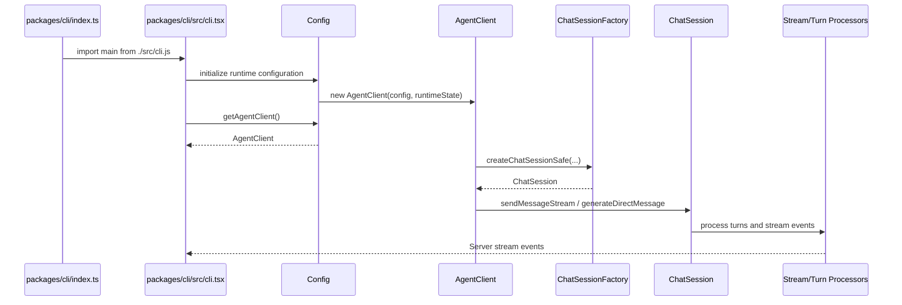

# Integration Contract: Issue #1423 Renames

Plan ID: PLAN-20260608-ISSUE1423

## Component Interaction Diagram

## Interface Boundaries

### Core public API

- `packages/core/src/index.ts` line 80: `export * from './core/geminiChat.js'` → `export * from './core/chatSession.js'`.
- `packages/core/src/index.ts` line 77: `export * from './core/client.js'` — export path unchanged; the class exported as `GeminiClient` becomes `AgentClient` in the source file.
- `packages/core/src/index.ts` line 85: `export * from './core/geminiRequest.js'` — **NOT changed** (provider-specific, out of scope).
- `packages/core/package.json` line 27: `"./core/geminiChat.js": "./dist/src/core/geminiChat.js"` → `"./core/chatSession.js": "./dist/src/core/chatSession.js"`. Old subpath entry MUST be removed entirely, not supplemented.
- No export named `GeminiClient` or `GeminiChat` remains.
- No subpath export for `./core/geminiChat.js` remains.

### Core internal imports (geminiChatTypes.js → chatSessionTypes.js)

The following files import from `./geminiChatTypes.js` or `../core/geminiChatTypes.js` and must update their import paths:
- `packages/core/src/core/geminiChat.ts` lines 46, 51, 57 (also renames to `chatSession.ts`)
- `packages/core/src/core/ConversationManager.ts` line 26
- `packages/core/src/core/DirectMessageProcessor.ts` line 34
- `packages/core/src/core/MessageConverter.ts` line 34
- `packages/core/src/core/StreamProcessor.ts` line 53
- `packages/core/src/core/TurnProcessor.ts` line 48
- `packages/core/src/core/StreamProcessor.retryBoundary.test.ts` line 16
- `packages/core/src/utils/generateContentResponseUtilities.ts` lines 23, 90

### Config boundary

- `ConfigBaseCore` line 119: `protected geminiClient!: GeminiClient` → `protected agentClient!: AgentClient`.
- `ConfigBaseCore` line 494: `getGeminiClient(): GeminiClient` → `getAgentClient(): AgentClient`.
- `Config` line 17: `import { GeminiClient } from '../core/client.js'` → `import { AgentClient } from '../core/client.js'`.
- `Config` lines 198, 315: `this.geminiClient = new GeminiClient(...)` → `this.agentClient = new AgentClient(...)`.
- `Config` lines 274, 283, 300, 315, 319, 325, 345: `newGeminiClient` parameter/local → `newAgentClient`; lines 235, 237, 240, 241, 310, 331, 332, 335: `previousGeminiClient` → `previousAgentClient`.
- Callers in CLI (33 files), A2A (1 file), core (35 files), and providers shift from `getGeminiClient()` to `getAgentClient()`.

### CLI boundary

- `packages/cli/index.ts` line 11: `import { main } from './src/gemini.js'` → `import { main } from './src/cli.js'`.
- `packages/cli/src/commands/skills.tsx` line 13: `import { initializeOutputListenersAndFlush } from '../gemini.js'` → `import { initializeOutputListenersAndFlush } from '../cli.js'`.
- `packages/cli/src/gemini.provider-init.test.ts` line 8: `import * as gemini from './gemini.js'` → `import * as cli from './cli.js'`.
- `packages/cli/src/gemini.startInteractiveUI.test.tsx` line 8: `import { ... } from './gemini.js'` → `import { ... } from './cli.js'`.
- `packages/cli/src/gemini.renderOptions.test.tsx` lines 114, 150: `await import('./gemini.js')` → `await import('./cli.js')`.
- All `GeminiClient`/`geminiClient`/`getGeminiClient` references in CLI hooks, commands, and tests → `AgentClient`/`agentClient`/`getAgentClient`. Verified 72 unique files with `getGeminiClient`, 57 with `GeminiClient`, and 39 with `geminiClient` (field/variable) across CLI, core, A2A, and providers.
- CLI command files (chatCommand, clearCommand, compressCommand, mcpCommand, profileCommand, toolsCommand, bugCommand) all call `config.getGeminiClient()` → must become `config.getAgentClient()`.
- Mock/test helper `mockGeminiClient` appears in 10 CLI test files and 4 core test files → must become `mockAgentClient`.
- `getRuntimeGeminiClient()` helper in `zedIntegration.ts` (lines 132-135, 266, 335) → `getRuntimeAgentClient()`.

#### geminiStream directory contents policy

The `packages/cli/src/ui/hooks/geminiStream/` directory name and `useGeminiStream` hook name are out of scope and MUST NOT be renamed. However, files inside this directory that reference provider-agnostic client symbols MUST be updated:

- `useGeminiStreamOrchestration.ts`: `GeminiClient` type import (line 11), `geminiClient` field (line 35), call-site args (lines 118, 147, 176, 256) → `AgentClient`/`agentClient`.
- `toolCompletionHandler.ts`: `GeminiClient` type import (line 19), `geminiClient` parameter (lines 105, 171, 277), call-sites, and JSDoc (line 268) → `AgentClient`/`agentClient`.
- `useSubmitQuery.ts`: `GeminiClient` type import (line 17), `geminiClient` field (line 42), call-site (line 433) → `AgentClient`/`agentClient`.
- `checkpointPersistence.ts`: `GeminiClient` type import (line 23), `geminiClient` parameter (lines 58, 142), call-sites, and JSDoc (line 49) → `AgentClient`/`agentClient`.
- `useGeminiStreamLifecycle.ts`: `GeminiClient` type import (line 12), parameters (lines 79, 118, 177), call-sites → `AgentClient`/`agentClient`.
- `useGeminiStream.ts`: `GeminiClient` type import → `AgentClient`.
- `__tests__/toolCompletionHandler.test.ts`: `GeminiClient` type import (line 26), `mockGeminiClient` local (lines 265, 270, 282, 303, 318, 337, 350, 367) and `let mockGeminiClient: GeminiClient` (line 367) → `mockAgentClient`/`AgentClient`.
- `__tests__/checkpointPersistence.test.ts`: `GeminiClient` type import (line 23), `makeGeminiClient()` helper (line 118) → `makeAgentClient()`, `geminiClient` local variable → `agentClient` (lines 131, 139, 162, 170, 189, 197, 223, 251, 266, 291, 316, 341, 359, 373, 403, 421, 487, 499, 525, 537).

`geminiStreamLogger` (toolCompletionHandler.ts line 29) stays unchanged.

### A2A boundary

- `packages/a2a-server/src/agent/task.ts`: `import { GeminiClient, ... }` → `import { AgentClient, ... }`; field `geminiClient: GeminiClient` → `agentClient: AgentClient`; constructor `new GeminiClient(...)` → `new AgentClient(...)`; all `this.geminiClient` call-sites (lines 286, 589, 734, 772, 822) → `this.agentClient`.
- `packages/a2a-server/src/agent/executor.ts`: `import { GeminiClient } from '@vybestack/llxprt-code-core'` → `import { AgentClient } from '@vybestack/llxprt-code-core'`. Note: also imports `GeminiEventType` and `ServerGeminiStreamEvent` — these stay as-is (out of scope). Field references `runtimeTask.geminiClient.initialize(...)` (lines 132, 159) → `runtimeTask.agentClient.initialize(...)`.
- `packages/a2a-server/src/utils/testing_utils.ts` line 254: `getGeminiClient: vi.fn()` → `getAgentClient: vi.fn()`.
- `packages/a2a-server/src/agent/task.test.ts` line 416-418: `(task as any).geminiClient = {...}` → `(task as any).agentClient = {...}`.
- `packages/a2a-server/src/http/app.test.ts` lines 100, 108: `GeminiClient: vi.fn()` mock → `AgentClient: vi.fn()`.
- `packages/a2a-server/src/http/endpoints.test.ts` line 52: `geminiClient = {...}` → `agentClient = {...}`.

### Provider test boundary

- `packages/providers/src/openai/OpenAIStreamProcessor.stopReason.test.ts`:
  - Line 11: `import { GeminiChat } from '@vybestack/llxprt-code-core/core/geminiChat.js'` → `import { ChatSession } from '@vybestack/llxprt-code-core/core/chatSession.js'`.
  - Line 29: `function createGeminiChat(): GeminiChat` → `function createChatSession(): ChatSession`.
  - Line 79: `return new GeminiChat(...)` → `return new ChatSession(...)`.
  - Lines 83+: `let geminiChat: GeminiChat` → `let chatSession: ChatSession`; all `geminiChat` local variable Usages → `chatSession`.
  - Lines 37, 40: `gemini-embedding` and `gemini-1.5-pro` model name strings — **NOT changed** (provider-specific strings).

### Core test utilities boundary

- `packages/core/src/test-utils/runtime.ts`:
  - Interface `GeminiChatConfigShape` (line 225) → `ChatSessionConfigShape`.
  - Interface `GeminiChatRuntimeOptions` (line 246) → `ChatSessionRuntimeOptions`.
  - Interface `GeminiChatRuntimeResult` (line 255) → `ChatSessionRuntimeResult`.
  - Function `createGeminiChatRuntime()` (line 283) → `createChatSessionRuntime()`.
  - Runtime ID `'test.geminiChat.runtime'` → `'test.chatSession.runtime'`.
  - Source comment `'test-utils#createGeminiChatRuntime'` → `'test-utils#createChatSessionRuntime'`.
  - All 7+ core test files importing `createGeminiChatRuntime` must update: `compression-retry.test.ts`, `compression-recency.test.ts`, `geminiChat.hook-control.test.ts`, `geminiChat.contextlimit.test.ts`, `geminiChat.tokenSync.test.ts`, `geminiChat.thinking-spacing.test.ts`, `__tests__/geminiChat-density.test.ts`.

### Core internal importers of ChatSession module

These 47 files import from `geminiChat.js` or reference `GeminiChat` and must update:
- Core: `agents/executor.ts`, `core/client.ts`, `ChatSessionFactory.ts`, `MessageStreamOrchestrator.ts`, `StreamProcessor.ts`, `ConversationManager.ts`, `DirectMessageProcessor.ts`, `MessageConverter.ts`, `TurnProcessor.ts`, `subagent.ts`, `subagentRuntimeSetup.ts`, `turn.ts`, `turnLogging.ts`, `bucketFailoverIntegration.ts`, `baseLlmClient.ts`, `core/compression/MiddleOutStrategy.ts`, `core/compression/utils.ts`, `core/compression/CompressionHandler.ts`, `services/history/HistoryService.ts`, `utils/extensionLoader.ts`, plus 15+ test files.
- CLI: `compression-settings-apply.integration.test.ts`, `compression-todo.integration.test.ts`, `ephemeral-settings.integration.test.ts`, `ui/commands/setCommand.ts`, `ui/commands/compressCommand.ts`, `ui/hooks/useGeminiStream.test.tsx`, `ui/hooks/useGeminiStream.dedup.test.tsx`.
- Providers: `OpenAIStreamProcessor.stopReason.test.ts`.

### Out-of-scope items preserved at integration boundary

These names contain "Gemini" but represent protocol-level or provider-specific concerns and must NOT be renamed:

| Name | Type | Reference Count | Location | Reason |
|------|------|-----------------|----------|--------|
| `GeminiEventType` | enum | 456 refs | `packages/core/src/core/turn.ts:78` | Stream protocol event type enum — deeply embedded API contract |
| `ServerGeminiStreamEvent` | type | 160 refs | `packages/core/src/core/turn.ts:315` | Server stream event union type — protocol-level |
| `ServerGeminiChatCompressedEvent` | type | 7 refs | `packages/core/src/core/turn.ts:248` | Compression event subtype — protocol-level |
| `GeminiCLIExtension` | interface | 223 refs | `packages/core/src/config/configTypes.ts:134` | CLI extension type — consumed across extension system |
| `GeminiOAuthProvider` | class | N/A | `packages/cli/src/auth/gemini-oauth-provider.ts` | Gemini provider-specific auth |
| `geminiRequest.ts` | module | N/A | `packages/core/src/core/geminiRequest.ts` | Gemini provider-specific request utilities |
| `gemini.config` | file | N/A | `packages/cli/src/providers/aliases/gemini.config` | Gemini provider alias config |
| `geminiStream/` | directory | 16+ files | `packages/cli/src/ui/hooks/geminiStream/` | UI stream hook module scope |
| `useGeminiStream` | hook | N/A | `packages/cli/src/ui/hooks/geminiStream/useGeminiStream.ts` | Hook name bound to directory scope |
| `geminiStreamLogger` | logger | 4 refs | `packages/cli/src/ui/hooks/geminiStream/toolCompletionHandler.ts:29` | Module-scoped debug logger |
| `setServerGeminiMdFilename` | import alias | 3 refs | `packages/cli/src/config/interactiveContext.ts:9` | Alias for already-renamed `setLlxprtMdFilename` |
| `gemini-1.5-pro`, `gemini-embedding` | string literals | N/A | `OpenAIStreamProcessor.stopReason.test.ts:37,40` | Actual Gemini model identifiers |

## Lifecycle Documentation

1. CLI binary loads `cli.tsx` synchronously through ESM import from `packages/cli/index.ts`.
2. CLI startup initializes config and providers using existing async flow.
3. Config constructs `AgentClient` after runtime provider/model state is valid.
4. CLI/UI/A2A callers retrieve the agent client through `getAgentClient()`.
5. `AgentClient` creates `ChatSession` as needed.
6. Chat/session processing delegates to existing processors and returns existing stream events.
7. Stream events continue to use `ServerGeminiStreamEvent`, `GeminiEventType`, and `ServerGeminiChatCompressedEvent` without change.

## Contract Tests / Verification

- Naming regression test/script verifies old provider-agnostic filenames and exported symbols are absent from source and package public API.
- Existing config and CLI tests verify `getAgentClient()` is callable through real config/test contexts.
- Existing chat/session tests continue to exercise chat behavior under renamed files.
- Existing non-interactive and smoke flows verify user access remains intact.
- Provider test (`OpenAIStreamProcessor.stopReason.test.ts`) continues exercising stream behavior through `ChatSession`.

## Anti-Pattern Warnings

- Do not create `geminiChat.ts` that re-exports from `chatSession.ts`.
- Do not export `GeminiChat = ChatSession`.
- Do not export `GeminiClient = AgentClient`.
- Do not leave `getGeminiClient()` as an alias for `getAgentClient()`.
- Do not create `AgentClientV2`, `ChatSessionNew`, or similar duplicates.
- Do not rename Gemini provider-specific files or auth/provider implementation just to satisfy a broad text scan.
- Do not rename `GeminiEventType`, `ServerGeminiStreamEvent`, `ServerGeminiChatCompressedEvent`, `GeminiCLIExtension`, or `setServerGeminiMdFilename` — these are protocol-level or provider-specific names outside issue scope.
- Do not rename the `geminiStream/` directory, `useGeminiStream` hook, `geminiStreamLogger`, or literal Gemini model name strings like `gemini-1.5-pro`.
- Do not update `packages/core/src/index.ts` line 85 (`export * from './core/geminiRequest.js'`) — that export is provider-specific.
- Do not leave `mockGeminiClient`, `makeGeminiClient`, `createGeminiChatRuntime`, `GeminiChatConfigShape`, `previousGeminiClient`, or `newGeminiClient` as old-name aliases — all must be renamed to their agent-client/chat-session equivalents.
- Do not skip files inside `geminiStream/` because the directory name is out of scope — all `GeminiClient`/`geminiClient`/`getGeminiClient` references inside those files must still be updated while the directory name, `useGeminiStream` hook name, and `geminiStreamLogger` stay unchanged.
