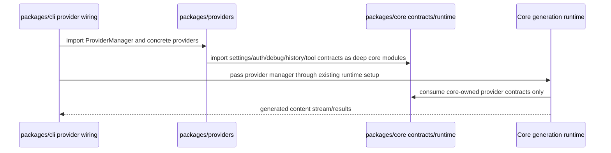

# Integration Contract: Provider Package Extraction

Plan ID: PLAN-20260603-ISSUE1584

## Component Interaction Diagram



## Package Dependency Direction

The final dependency direction is a strict DAG. No production cycle may exist between packages.

```
packages/providers  →  packages/core (deep modules, interim)
packages/cli        →  packages/providers
packages/cli        →  packages/core
packages/core       ⊥  packages/providers (FORBIDDEN in production)
```

| Package | May Depend On | Must Not Depend On | Enforcement |
|---------|--------------|--------------------|-------------|
| `packages/providers` | `@vybestack/llxprt-code-core` + direct provider SDK deps | `@vybestack/llxprt-code` (CLI) | `providers/package.json` dependencies, `anti-shim-policy.md` scans |
| `packages/cli` | `@vybestack/llxprt-code-core`, `@vybestack/llxprt-code-providers` | (none restricted) | `cli/package.json` dependencies |
| `packages/core` | (no providers package) | `@vybestack/llxprt-code-providers` | `core/package.json` + `core/tsconfig.json` zero providers reference; forbidden import scans per `anti-shim-policy.md` |

**No production core→providers dependency** is the defining constraint of this extraction. Every explicit contract below exists to make this constraint achievable without breaking existing behavior.

### Enforcement Commands

```bash
# Package metadata: core must not reference providers
node -e "const p=require('./packages/core/package.json'); if ((p.dependencies||{})['@vybestack/llxprt-code-providers']) process.exit(1)"
node -e "const c=require('./packages/core/tsconfig.json'); if ((c.references||[]).some(r => String(r.path).includes('providers'))) process.exit(1)"
# Import scans: core production code must not import providers
rg -n "from ['\"].*providers/|from ['\"]@vybestack/llxprt-code-core/providers|from ['\"]@vybestack/llxprt-code-providers" packages/core/src --glob '*.ts' --glob '!**/*.test.ts' --glob '!**/*.spec.ts'
# CLI must not deep-import core providers path
rg -n "from ['\"].*core/src/providers/|from ['\"]@vybestack/llxprt-code-core/providers" packages/cli/src --glob '*.ts' --glob '!**/*.test.ts' --glob '!**/*.spec.ts'
```

Per `analysis/package-metadata-constraints.md` and `analysis/anti-shim-policy.md`.

---

## Explicit Integration Contracts

Each contract specifies: which package owns the boundary, what crosses it, dependency direction, and the relevant P01 blocker/pseudocode reference.

### IC-01: CLI → Providers Import Contract

**Boundary:** CLI imports concrete provider types and implementations from the providers package public API.

**Owner:** `packages/providers` (exports) ← `packages/cli` (imports)

**Crosses:**
- `IProvider`, `IProviderManager`, `ITool`, `IModel` (provider contract interfaces)
- `ProviderManager` (concrete manager)
- `OpenAIProvider`, `AnthropicProvider`, `GeminiProvider`, `FakeProvider`, `LoadBalancingProvider` (concrete providers)
- `ProviderContentGenerator` (provider content generation implementation)
- `OpenAITokenizer`, `AnthropicTokenizer`, `ITokenizer` (provider tokenizers)
- `ProviderConfigurationError`, `AuthError`, `RateLimitError` (provider-specific errors)
- Provider config types and utilities

**Direction:** `cli → providers`

**P01 Blocker:** Blocker 10 (index.ts re-exports)

**Pseudocode References:**
- `package-boundary.md` C-PB-01 (providers public API)
- `consumer-migration.md` C-CM-06 (CLI import migration), lines 10–11
- `component-boundaries.md` lines 110–114 (CLI provider wiring)

**Behavior:** CLI constructs `ProviderManager` using providers package exports, then passes the resulting structural values into core runtime through core-owned contracts. CLI does NOT deep-import into `@vybestack/llxprt-code-core/providers/...` after migration.

**Verification:** `rg -n "from ['\"].*core/src/providers/|from ['\"]@vybestack/llxprt-code-core/providers" packages/cli/src --glob '*.ts' --glob '!**/*.test.ts' --glob '!**/*.spec.ts'` returns zero matches post-migration.

### IC-02: Providers → Core Deep Import Contract

**Boundary:** Provider production code imports selected deep modules from core. Deep imports are allowed as an interim measure because auth/settings/debug/tools/history sub-packages are not yet extracted.

**Owner:** `packages/core` (provides) → `packages/providers` (consumes)

**Allowed Prefixes** (per `analysis/core-deep-import-policy.md`):
- `@vybestack/llxprt-code-core/auth/`
- `@vybestack/llxprt-code-core/config/`
- `@vybestack/llxprt-code-core/core/`
- `@vybestack/llxprt-code-core/debug/`
- `@vybestack/llxprt-code-core/models/`
- `@vybestack/llxprt-code-core/parsers/`
- `@vybestack/llxprt-code-core/prompt-config/`
- `@vybestack/llxprt-code-core/runtime/`
- `@vybestack/llxprt-code-core/services/`
- `@vybestack/llxprt-code-core/settings/`
- `@vybestack/llxprt-code-core/telemetry/`
- `@vybestack/llxprt-code-core/tools/`
- `@vybestack/llxprt-code-core/types/`
- `@vybestack/llxprt-code-core/utils/`

**Direction:** `providers → core`

**P01 Evidence:** `analysis/dependency-audit.md` counts 144 provider→core subsystem production imports (42 debug, 32 services, 22 tools, 20 utils, 7 config, 6 auth, 5 prompt-config, 5 core, 3 parsers, 1 settings, 1 runtime).

**Pseudocode References:**
- `package-boundary.md` C-PB-03 (dependency direction), lines 16–18
- `component-boundaries.md` lines 120–125 (dependency direction enforcement)

**Behavior:** Provider file compilation and runtime resolution works through `@vybestack/llxprt-code-core/...` subpath imports after `npm install` workspace link resolution. Deep imports require both packages to be built.

**Verification:**
```bash
rg -n "@vybestack/llxprt-code-core/" packages/providers/src --glob '*.ts'  # Must resolve
npm run build --workspace @vybestack/llxprt-code-core
npm run build --workspace @vybestack/llxprt-code-providers
node -e "import('@vybestack/llxprt-code-providers').then(()=>console.log('providers import ok'))"
```

Per `analysis/core-deep-import-policy.md`.

### IC-03: Core Runtime Structural Contracts

**Boundary:** Core owns internal structural runtime contracts that describe what core needs at runtime. These are NOT public provider API compatibility types and MUST NOT re-export provider package symbols.

**Owner:** `packages/core`

**Contracts and Locations** (per `analysis/core-structural-contracts.md`):

| Contract | Core Location | Used By | P01 Blocker |
|----------|--------------|---------|-------------|
| `RuntimeProvider` | `packages/core/src/runtime/contracts/RuntimeProvider.ts` | Core runtime/generation | Blocker 6/8 |
| `RuntimeProviderManager` | `packages/core/src/runtime/contracts/RuntimeProviderManager.ts` | Core runtime/config | Blocker 5 |
| `RuntimeTokenizer` | `packages/core/src/runtime/contracts/RuntimeTokenizer.ts` | HistoryService | Blocker 1 |
| `RuntimeTokenizerFactory` | `packages/core/src/runtime/contracts/RuntimeTokenizerFactory.ts` | CLI provider wiring | Blocker 1 |
| `RuntimeContentGeneratorFactory` | `packages/core/src/runtime/contracts/RuntimeContentGeneratorFactory.ts` | Core contentGenerator | Blocker 3 |
| `MissingRuntimeProviderError` | `packages/core/src/runtime/errors/MissingRuntimeProviderError.ts` | Core runtime context | Blocker 4 |
| `RuntimeModel` | `packages/core/src/runtime/contracts/` (within RuntimeModel draft) | Core model hydration | Blocker 6 |
| `TelemetryContext` | `packages/core/src/telemetry/types.ts` | Core telemetry | Blocker 7 |
| `ReasoningOutput` | `packages/core/src/runtime/contracts/` (structural) | Core compression | Blocker 8 |
| `MediaBlock` / `MediaBlockType` | `packages/core/src/runtime/contracts/` (structural) | Core compression utils | Blocker 9 |
| `BucketFailureReason` | `packages/core/src/config/types.ts` or `packages/core/src/types/` | Core config | Blocker 5 |
| `RuntimeProviderManager` (config) | `packages/core/src/runtime/contracts/` | Core config | Blocker 5 |

**Direction:** `providers → core` (providers may implement/adapter to these contracts but core never imports providers)

**Pseudocode References:**
- `package-boundary.md` C-PB-06 (core runtime contracts), C-PB-05 (core-owned utilities)
- `consumer-migration.md` C-CM-01 through C-CM-05
- `component-boundaries.md` C-CB-01 through C-CB-09

**Behavior:** Core compiles in isolation without any provider package dependency. Provider implementations are structurally compatible with these contracts without importing from core contract files (structural typing). CLI constructs concrete provider types and passes them into core runtime through these contracts.

**Forbidden Names** (per `analysis/core-structural-contracts.md`):
- `IProviderV2`, `ProviderManagerCompat`, or any `V2`/`Compat`/`New`/`Copy` suffixed contract
- Files under `packages/core/src/providers/` named as compatibility wrappers

**Verification:**
```bash
find packages/core/src -path '*providers*' -type f | sort  # Must be empty post-cleanup
find packages/core/src -type f | rg '/(IProvider|IProviderManager|ProviderManager|ProviderContentGenerator)(V2|Compat|New|Copy)?\.ts$'  # Zero matches
rg -n "@vybestack/llxprt-code-providers|from ['\"].*/providers/" packages/core/src/runtime/contracts packages/core/src/runtime/errors --glob '*.ts'  # Zero matches
```

### IC-04: HistoryService Tokenizer Injection

**Boundary:** Core `HistoryService` receives tokenizer behavior via injection; never constructs or imports provider tokenizer implementations.

**Owner:** `packages/core` (contract) ← `packages/providers` + `packages/cli` (injection)

**Contract:** `RuntimeTokenizer` with `countTokens(content: unknown): number | Promise<number>` and `RuntimeTokenizerFactory` with `getTokenizer(providerName: string, model?: string): RuntimeTokenizer | undefined`

**Injection Path:**
1. Core `HistoryService` constructor/options accept `RuntimeTokenizer` or `RuntimeTokenizerFactory`
2. CLI/providers runtime constructs `OpenAITokenizer`/`AnthropicTokenizer` from `@vybestack/llxprt-code-providers`
3. CLI passes concrete tokenizer to `HistoryService` through `RuntimeTokenizerFactory`

**Direction:** `providers → core` (providers supply implementation; core receives through contract)

**P01 Blocker:** Blocker 1

**Current Problem:** `HistoryService.ts` lines 27–29 import `ITokenizer`, `OpenAITokenizer`, `AnthropicTokenizer` from provider paths and constructs them based on provider name strings.

**Pseudocode References:**
- `component-boundaries.md` C-CB-01, lines 10–15
- `consumer-migration.md` C-CM-01, line 12
- `package-boundary.md` C-PB-05 (core-owned shared utilities ordering)

**Behavioral Expectation:** HistoryService token counting remains deterministic and identical. Core no longer constructs or references provider tokenizer types. Provider tokenizers are tested in the providers package. HistoryService tests use a deterministic fake `RuntimeTokenizer`.

**Test:** Core history tests use `{ countTokens: async () => 42 }` or similar fake. Provider tokenizer tests verify actual OpenAI/Anthropic counting in providers package.

### IC-05: ToolIdStrategy Utility Relocation

**Boundary:** `normalizeToOpenAIToolId` is a core-owned shared utility, not a provider implementation concern.

**Owner:** `packages/core` (owns the utility)

**Move:** `packages/core/src/providers/utils/toolIdNormalization.ts` → `packages/core/src/tools/toolIdNormalization.ts`

**Direction:** `providers → core` (provider code like `OpenAIRequestBuilder.ts`, `buildResponsesInputFromContent.ts`, `OpenAIStreamProcessor.ts` imports this utility from core)

**P01 Blocker:** Blocker 2

**P01 Classification:** Explicit exception in P01 provider file classification — core-owned shared utility, not provider implementation

**Pseudocode References:**
- `component-boundaries.md` C-CB-02, lines 20–24
- `consumer-migration.md` C-CM-02, line 13
- `package-boundary.md` C-PB-05

**Behavioral Expectation:** OpenAI-safe tool IDs are normalized identically before and after the move. Core `ToolIdStrategy.ts` imports from core-owned path. Provider code imports the same core utility when needed. `toolIdNormalization.test.ts` moves with the utility to core test path.

**Test:** Existing tool ID normalization tests pass unchanged from new location. Provider request conversion tests still verify tool ID behavior after move.

### IC-06: ProviderContentGenerator Factory Inversion

**Boundary:** Core `contentGenerator.ts` does NOT import or construct `ProviderContentGenerator`. It receives a `ContentGenerator` created via `RuntimeContentGeneratorFactory`.

**Owner:** `packages/core` (contract) ← `packages/providers` + `packages/cli` (construction/injection)

**Contract:** `RuntimeContentGeneratorFactory<TGenerator = unknown>` with `createContentGenerator(manager: RuntimeProviderManager): TGenerator`

**Injection Path:**
1. Core `contentGenerator.ts` receives factory/structural generator instead of constructing provider class
2. CLI/providers wiring constructs `ProviderContentGenerator` from providers package
3. CLI injects the provider-backed generator into core content generation path

**Direction:** `providers → core` (providers supply implementation; core receives through contract)

**P01 Blocker:** Blocker 3

**Current Problem:** `contentGenerator.ts` lines 20–21 directly import `IProviderManager as ProviderManager` and `ProviderContentGenerator` from provider paths.

**Pseudocode References:**
- `component-boundaries.md` C-CB-03, lines 30–34
- `consumer-migration.md` C-CM-03, line 14
- `package-boundary.md` C-PB-06

**Behavioral Expectation:** Provider-backed content generation produces the same response through existing call path. FakeProvider + ProviderContentGenerator integration works through CLI/runtime path. Core production code scan shows zero provider imports in `contentGenerator.ts`.

**Test:** Core content generator tests use a structural fake `ContentGenerator`. Provider package tests verify `ProviderContentGenerator` with `FakeProvider`. CLI integration test verifies the full wiring path.

### IC-07: Telemetry/Model/Config/Runtime Contracts

**Boundary:** Core defines structural contracts for telemetry, model hydration, config, and runtime that replace direct provider type imports.

**Owner:** `packages/core` (contracts) ← `packages/providers` (mappings/adapters)

**Sub-contracts:**

| Sub-contract | Core Contract | Replaces | P01 Blocker | Pseudocode |
|-------------|---------------|----------|-------------|------------|
| Telemetry | `TelemetryContext` (fields: `providerName`, `modelId`, `tokenUsage`, `latencyMs`, `timestamp`) | `ProviderTelemetryContext` from `providers/types/providerRuntime.ts` | Blocker 7 | C-CB-07, lines 70–73, C-CM-05 (telemetry), line 18 |
| Model Hydration | `RuntimeModel` (fields: `id`, `name`, `provider`, `capabilities`, `contextWindow`) | `IModel` from `providers/IModel.ts` | Blocker 6 | C-CB-06, lines 60–63, C-CM-05 (models), line 17 |
| Config Providers | `BucketFailureReason` (core enum/union) + `RuntimeProviderManager` (methods: `getAvailableModels()`, `getActiveProvider()`, `getActiveProviderName()`) | `BucketFailureReason` from `providers/errors.ts` + `ProviderManager`/`IProviderManager` | Blocker 5 | C-CB-05, lines 50–54, C-CM-05 (config), lines 16 |
| Runtime Errors | `MissingRuntimeProviderError` in `packages/core/src/runtime/errors/` | `MissingProviderRuntimeError` from `providers/errors.ts` | Blocker 4 | C-CB-04, lines 40–44, C-CM-04, line 15 |
| Compression | `ReasoningOutput` + `MediaBlock`/`MediaBlockType` in `packages/core/src/runtime/contracts/` | `reasoningUtils` + `classifyMediaBlock` from providers | Blockers 8–9 | C-CB-08, C-CB-09, lines 80–85, C-CM-05 (compression), line 19 |

**Direction:** `providers → core` for all sub-contracts (providers map/implement; core specifies)

**Behavioral Expectation:**
- Core telemetry types compile in isolation without any provider package dependency
- Core model hydration works with plain `RuntimeModel` objects
- Core config tests use fake `RuntimeProviderManager` that does not import providers
- Core `CompressionHandler` receives `ReasoningOutput` through `RuntimeProvider` contract, not by importing provider `reasoningUtils`
- Core compression utils receive already-classified `MediaBlock` objects rather than importing `classifyMediaBlock`

**Verification per sub-contract:**
- Telemetry: `npx tsc --noEmit packages/core/src/telemetry/types.ts` compiles without provider imports
- Model: model hydration tests use plain `RuntimeModel` objects
- Config: config tests use fake `RuntimeProviderManager`
- Runtime: runtime context tests verify `MissingRuntimeProviderError` without importing provider package
- Compression: compression tests use fake `ReasoningOutput` and explicit `MediaBlock` typed objects

### IC-08: Package Metadata and Workspace Boundaries

**Boundary:** npm workspace and package.json dependency declarations enforce the architectural dependency direction at the package level, not just at the import level.

**Owner:** Repository root + each package's `package.json`

**Required Final State** (per `analysis/package-metadata-constraints.md`):

| File | Required Content | Required Absence |
|------|-----------------|-----------------|
| Root `package.json` | `workspaces` includes `packages/providers` | — |
| `packages/providers/package.json` | `name`: `@vybestack/llxprt-code-providers`; `dependencies` includes `@vybestack/llxprt-code-core` + direct provider SDK deps (openai, @anthropic-ai/sdk, @google/genai, @dqbd/tiktoken, zod, ai, @ai-sdk/openai, @ai-sdk/provider-utils) | No CLI dependency |
| `packages/cli/package.json` | `dependencies` includes `@vybestack/llxprt-code-core` AND `@vybestack/llxprt-code-providers` (value `file:../providers`) | — |
| `packages/core/package.json` | — | No `@vybestack/llxprt-code-providers` in dependencies |
| `packages/core/tsconfig.json` | — | No providers in references |

**Direction:** Enforced by package metadata per `analysis/package-metadata-constraints.md`

**Pseudocode References:**
- `component-boundaries.md` lines 120–125
- `verification.md` C-V-06, lines 32–35
- `package-boundary.md` lines 21, 22, 23

**Behavioral Expectation:** `npm install` resolves workspace links without errors. `npm run build` succeeds for each package independently in dependency order (core → providers → cli). Package metadata is the first line of defense against accidental cycles.

**Verification commands** per `analysis/package-metadata-constraints.md` required checks.

### IC-09: Anti-Shim Public API Removal

**Boundary:** Core `index.ts` stops re-exporting any provider package API. No compatibility wrappers exist anywhere in core.

**Owner:** `packages/core` (removes) + `packages/providers` (provides own public API)

**Removal Surface** (per `analysis/core-import-remediation.md` Blocker 10):
- `IProvider`, `ITool`, `IModel`, `IProviderManager` (provider contract interfaces)
- `ContentGeneratorRole`, `ProviderContentGenerator` (provider content generation)
- `ProviderManager` (concrete provider manager)
- `OpenAIProvider`, `AnthropicProvider`, `GeminiProvider`, `FakeProvider`, `LoadBalancingProvider` (concrete providers)
- Provider errors, tokenizers, usage info, `apiKeyQuotaResolver`, provider utilities
- All re-export lines from `packages/core/src/index.ts` (currently lines 304–357)

**Forbidden After Migration:**
- Any `export ... from './providers/...'` in core `index.ts`
- Any wrapper files under `packages/core/src/providers/` that forward to `@vybestack/llxprt-code-providers`
- Any `V2`, `Compat`, `New`, `Copy` suffixed files or types (per `analysis/anti-shim-policy.md`)

**Direction:** `cli → providers` (for provider public API), `cli → core` (for core contracts)

**P01 Blocker:** Blocker 10

**Pseudocode References:**
- `component-boundaries.md` C-CB-10, lines 90–94
- `consumer-migration.md` C-CM-07, line 20
- `package-boundary.md` C-PB-04 (no shims), C-PB-01 (providers public API)

**Behavioral Expectation:** Core `index.ts` compiles without any provider imports after removal. Provider package `index.ts` provides the complete public API that core previously re-exported. CLI and external consumers import provider types from `@vybestack/llxprt-code-providers`.

**Verification:**
```bash
rg -n "export .*providers|from ['\"].*providers/" packages/core/src/index.ts packages/core/src --glob '*.ts'  # Zero matches
find packages/core/src/providers -type f 2>/dev/null | sort  # Empty or only explicitly justified exceptions per P15a
```

### IC-10: Core-Owned Shared Utility Migration Ordering

**Boundary:** Core-owned shared utilities and contracts MUST be established BEFORE provider implementation files are moved, so no core production import is stranded.

**Owner:** `packages/core` (creates first) → `packages/providers` (moves second)

**Ordering Constraint:**
1. Core-owned contracts (`RuntimeTokenizer`, `RuntimeContentGeneratorFactory`, `RuntimeModel`, `TelemetryContext`, `ReasoningOutput`, `MediaBlock`, `MissingRuntimeProviderError`, `BucketFailureReason`, `RuntimeProviderManager`) are created in core first (P03–P07).
2. Core-owned shared utilities (`toolIdNormalization.ts`) move to core paths first (P05/P07).
3. THEN provider implementation files move to providers package (P09–P11).
4. THEN CLI consumer imports are updated (P14).
5. THEN core index re-exports and old provider files are removed (P15).

**P01 Blocker:** All Blockers 1–10 (requires pre-move contract establishment)

**Pseudocode References:**
- `package-boundary.md` line 12 (create migration task BEFORE moving provider file)
- `consumer-maries.md` lines 12–20 (per-blocker replacement before move)
- `component-boundaries.md` lines 10–94 (each blocker section specifies contract creation before move)

**Behavioral Expectation:** At no point during migration does a core production import point to a file that no longer exists in core and has not yet moved to providers. Build succeeds after each phase step, not just at the end.

---

## Behavioral Verification Expectations

The following behaviors must remain reachable and correct through the extraction. These are verified by the tests enumerated in `analysis/behavioral-regression-matrix.md` and the verification pseudocode in `analysis/pseudocode/verification.md`.

### BVE-01: CLI Provider Manager Creation

**Observable Behavior:** CLI can create the same providers (`OpenAIProvider`, `AnthropicProvider`, `GeminiProvider`, `FakeProvider`, `LoadBalancingProvider`) and `ProviderManager` after import migration.

**Current Flow:** CLI imports from `@vybestack/llxprt-code-core` index which re-exports provider types.

**Post-Migration Flow:** CLI imports from `@vybestack/llxprt-code-providers` public API or package subpaths.

**Test Locations:** Existing CLI provider tests + new test near `packages/cli/src/providers/providerManagerInstance.*`

**Allowed Mock Boundary:** Environment/settings/profile data may be faked; provider classes should be real.

**Pseudocode Reference:** `verification.md` C-V-01, `component-boundaries.md` lines 110–114

### BVE-02: Provider Switching Command

**Observable Behavior:** Provider command changes active provider as before. The `providerCommand.ts` flow works identically.

**Current Flow:** CLI imports `ProviderManager` from core re-export.

**Post-Migration Flow:** CLI imports `ProviderManager` from `@vybestack/llxprt-code-providers`.

**Test Locations:** Existing/new test near `packages/cli/src/ui/commands/providerCommand.*`

**Allowed Mock Boundary:** UI shell may be harnessed; no fake-only provider manager if real `FakeProvider` can be used.

**Pseudocode Reference:** `verification.md` C-V-01, `component-boundaries.md` line 114

### BVE-03: Smoke Command Startup

**Observable Behavior:** `node scripts/start.js --profile-load ollamakimi "write me a haiku and nothing else"` completes without error after extraction.

**Current Flow:** Startup uses core providers through core import paths.

**Post-Migration Flow:** Startup uses providers through `@vybestack/llxprt-code-providers` workspace package.

**Test Locations:** Phase 16 command (smoke test)

**Allowed Mock Boundary:** Real configured `ollamakimi` profile; external service behavior only where existing smoke requires it.

**Pseudocode Reference:** `verification.md` C-V-05, line 27

### BVE-04: History Token Accounting

**Observable Behavior:** HistoryService token counting remains deterministic and core does not construct provider tokenizers.

**Current Flow:** `HistoryService` imports and constructs `OpenAITokenizer`/`AnthropicTokenizer` based on provider name.

**Post-Migration Flow:** `HistoryService` receives `RuntimeTokenizer` via constructor injection; CLI provides concrete tokenizer.

**Test Locations:** Existing `HistoryService` tests + new injection tests in core

**Allowed Mock Boundary:** Tokenizer can be a small deterministic test tokenizer; provider tokenizers tested in providers package.

**Pseudocode Reference:** `verification.md` C-V-01, `component-boundaries.md` C-CB-01, lines 10–15

### BVE-05: Tool ID Normalization

**Observable Behavior:** OpenAI-safe tool IDs are normalized identically before and after utility move from providers to core.

**Current Flow:** `ToolIdStrategy.ts` imports `normalizeToOpenAIToolId` from `providers/utils/toolIdNormalization.ts`.

**Post-Migration Flow:** `ToolIdStrategy.ts` imports from core-owned `packages/core/src/tools/toolIdNormalization.ts`.

**Test Locations:** Existing/new core tool tests and provider conversion tests

**Allowed Mock Boundary:** None beyond normal test data.

**Pseudocode Reference:** `component-boundaries.md` C-CB-02, lines 20–24

### BVE-06: Provider Content Generation

**Observable Behavior:** Provider-backed content generation produces the same response through existing call path.

**Current Flow:** `contentGenerator.ts` imports and constructs `ProviderContentGenerator` from providers.

**Post-Migration Flow:** `contentGenerator.ts` receives structural `ContentGenerator` via `RuntimeContentGeneratorFactory`; CLI constructs and injects real `ProviderContentGenerator`.

**Test Locations:** New provider package test + CLI/runtime integration test

**Allowed Mock Boundary:** No network. `FakeProvider` is a real provider implementation.

**Pseudocode Reference:** `verification.md` C-V-01, `component-boundaries.md` C-CB-03, lines 30–34

### BVE-07: No Core Provider Shims

**Observable Behavior:** Core has no production providers dependency, no provider re-exports, no wrapper files after migration.

**Verification:** Multiple scans from `analysis/anti-shim-policy.md` required scans plus `analysis/package-metadata-constraints.md` required checks.

**Pseudocode Reference:** `verification.md` C-V-02, C-V-07, C-V-08

---

## P01 Blocker Cross-Reference

Every P01 blocker from `analysis/core-import-remediation.md` is addressed by at least one integration contract:

| P01 Blocker | Core Files Affected | Integration Contract(s) | Pseudocode Contract IDs |
|-------------|----|-------------------------|------------------------|
| 1. HistoryService tokenizers | `HistoryService.ts` (3 imports) | IC-04, IC-03 | C-CB-01, C-CM-01 |
| 2. ToolIdStrategy normalization | `ToolIdStrategy.ts` (1 import) | IC-05, IC-10 | C-CB-02, C-CM-02 |
| 3. ProviderContentGenerator | `contentGenerator.ts` (2 imports) | IC-06, IC-03 | C-CB-03, C-CM-03 |
| 4. Runtime provider errors | `providerRuntimeContext.ts` (1 import) | IC-07 (runtime error sub-contract) | C-CB-04, C-CM-04 |
| 5. Config types | `configTypes.ts`, `configBaseCore.ts`, `configConstructor.ts` (3 imports) | IC-07 (config sub-contract) | C-CB-05, C-CM-05 |
| 6. Model hydration | `hydration.ts`, `provider-integration.ts` (2 imports) | IC-07 (model sub-contract) | C-CB-06, C-CM-05 |
| 7. Telemetry types | `telemetry/types.ts` (1 import) | IC-07 (telemetry sub-contract) | C-CB-07, C-CM-05 |
| 8. Reasoning utilities | `CompressionHandler.ts` (1 import) | IC-07 (compression-reasoning sub-contract) | C-CB-08, C-CM-05 |
| 9. Media utilities | `compression/utils.ts` (1 import) | IC-07 (compression-media sub-contract) | C-CB-09, C-CM-05 |
| 10. Index.ts re-exports | `index.ts` (lines 304–357) | IC-09, IC-01 | C-CB-10, C-CM-06, C-CM-07 |
| 11. Test-utils | `test-utils/providerCallOptions.ts`, `test-utils/runtime.ts` | IC-08 (workspace boundaries — exclusion from production) | C-CB-11, C-CM-08 |

---

## Existing Files That Must Be Touched

- `package.json` (add workspace entry for providers)
- `package-lock.json` (workspace lock metadata produced by npm install)
- `packages/providers/package.json` (new — providers package scaffold)
- `packages/providers/tsconfig.json` (new)
- `packages/providers/vitest.config.ts` (new)
- `packages/providers/index.ts` (new — package entry point)
- `packages/providers/src/index.ts` (new — providers public API)
- `packages/core/src/index.ts` (remove provider re-exports)
- `packages/cli/package.json` (add providers dependency)
- `packages/cli/tsconfig.json` (add providers references if needed)
- `packages/cli/src/providers/providerManagerInstance.ts` (update imports)
- `packages/cli/src/providers/aliasProviderFactory.ts` (update imports)
- `packages/cli/src/ui/commands/providerCommand.ts` (update imports)
- Core files identified in `analysis/core-import-remediation.md` that currently import providers (18 production files, 49 import sites)

---

## Lifecycle

1. Core-owned contracts are established first (P03–P07) — per IC-10 ordering constraint.
2. Package scaffold is created (P08) — per IC-08 metadata boundaries.
3. Integration tests assert package boundary and behavior (P08) — per BVE-01 through BVE-07.
4. Provider implementation files are moved (P09–P11) — per IC-10 ordering and IC-02 deep import contracts.
5. CLI consumers are updated (P14) — per IC-01 CLI→providers contract.
6. Core exports and old files are removed (P15) — per IC-09 anti-shim removal.
7. Full verification and smoke test run (P16) — per BVE-01 through BVE-07.

---

## Error Handling Expectations

- Build failures from unresolved imports block the phase.
- Any production package cycle blocks the phase.
- Missing provider behavior in CLI smoke test blocks completion.
- Any compatibility shim from core to providers blocks cleanup verification.

---

## Contract Ownership Clarification

Provider public contracts are exported from `packages/providers`. Core runtime contracts are internal structural contracts, not compatibility shims. CLI/provider wiring is responsible for constructing concrete provider implementations and passing structurally compatible values into core.

Package metadata changes must update npm workspace metadata and `package-lock.json` when `npm install` changes it.

---

## Review-03 Precision Addendum

Before executing this phase, read and apply:

- `analysis/provider-external-dependencies.md`
- `analysis/core-deep-import-policy.md`
- `analysis/package-metadata-constraints.md`
- `analysis/core-structural-contracts.md`
- `analysis/pseudocode/component-boundaries.md`
- `analysis/provider-file-classification-complete.md`

These artifacts define direct dependency declarations, allowed core deep imports, package dependency direction, core contract names/locations, component-specific pseudocode, and complete provider file inventory/classification baseline.
