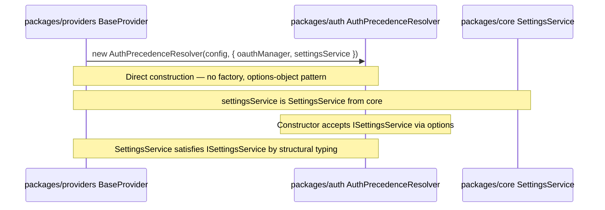

# Integration Contract: Auth Package Extraction

Plan ID: PLAN-20260608-ISSUE1586
Updated: Phase P02b (integration contract definition — REQ/audit cross-references, constructor/factory alignment, provider migration list, public exports, DAG proof)

## Component Interaction Diagram

```mermaid
sequenceDiagram
    participant CLI as packages/cli auth composition
    participant Core as packages/core DI factories
    participant Auth as packages/auth domain
    participant Storage as ISecureStore impl (core)

    CLI->>Core: createAuthPrecedenceResolver(config, settingsService, oauthManager?, ...)
    Core->>Storage: getProviderKeyStorage()
    Core->>Auth: new AuthPrecedenceResolver(config, {oauthManager, settingsService, providerKeyStorage, logger, getActiveRuntimeContext})
    Core-->>CLI: AuthPrecedenceResolver instance
    CLI->>Auth: resolver.resolveAuth(provider, config)
    Auth->>Auth: check auth-key → API key → env → OAuth
    Auth-->>CLI: resolved credentials

    NOTE: getSecureStore()/ISecureStore is NOT part of the AuthPrecedenceResolver flow.
    It belongs exclusively to the createKeyringTokenStore/KeyringTokenStore path (IC-01).
```

## Package Dependency Direction

```text
packages/auth       ⊥  (zero sibling package dependencies)
packages/core       →  packages/auth
packages/providers  →  packages/auth, packages/core
packages/cli        →  packages/auth, packages/core
```

**Acyclic verification (final DAG):** Auth has no sibling package dependencies. Core depends on auth. Providers depends on auth and core. CLI depends on auth and core. No reverse edges exist. No cycles possible.

| Package | May Depend On | Must Not Depend On | Enforcement |
|---------|--------------|--------------------|-------------|
| `packages/auth` | `zod`, Node builtins | `@vybestack/llxprt-code-core`, `@vybestack/llxprt-code`, `@vybestack/llxprt-code-providers` (in both `dependencies` AND `devDependencies`) | `auth/package.json` deps + devDeps, anti-shim scans, shared verifier Check 1 |
| `packages/core` | `@vybestack/llxprt-code-auth` | (none restricted) | `core/package.json` deps |
| `packages/cli` | `@vybestack/llxprt-code-auth`, `@vybestack/llxprt-code-core` | (none restricted) | `cli/package.json` deps |
| `packages/providers` | `@vybestack/llxprt-code-auth`, `@vybestack/llxprt-code-core` | (none restricted) | Imports auth from `@vybestack/llxprt-code-auth`; non-auth from `@vybestack/llxprt-code-core` |

### Enforcement Commands

```bash
# Auth package must not depend on core/cli/providers — canonical import/export specifier scan
# This uses the shared verifier script, which checks import/export specifiers precisely:
node project-plans/issue1586/scripts/verify-auth-extraction-gate.js

# Auth package.json must not declare core/cli/providers as deps OR devDeps
# (Production deps have zero @vybestack/*; devDeps also have zero @vybestack/*
#  unless explicitly justified by a verifier/test-only rule — no such exception exists in this plan)
node -e "const p=require('./packages/auth/package.json'); const deps=Object.keys({...p.dependencies,...p.devDependencies}); ['@vybestack/llxprt-code-core','@vybestack/llxprt-code','@vybestack/llxprt-code-providers'].forEach(k=>{if(deps.includes(k)) {console.error('FORBIDDEN dep:',k);process.exit(1)}})"
```

## AuthPrecedenceResolver Constructor / Factory Alignment

This section documents the unified constructor/factory contract for `AuthPrecedenceResolver`, ensuring alignment between the P02 pseudocode (C-CB-06, C-CB-09) and all integration contracts.

### Options-Object Constructor (C-CB-06)

`AuthPrecedenceResolver` uses an options-object constructor pattern for all DI injection points:

```typescript
class AuthPrecedenceResolver {
  constructor(config: AuthPrecedenceConfig, options?: {
    oauthManager?: OAuthManager,
    settingsService?: ISettingsService,
    providerKeyStorage?: IProviderKeyStorage,
    logger?: IDebugLogger,
    getActiveRuntimeContext?: GetActiveRuntimeContext
  })
}
```

**All four DI-injected dependencies** (ISettingsService, IProviderKeyStorage, IDebugLogger, GetActiveRuntimeContext) are explicitly listed as constructor injection points — no hidden or implicit dependencies.

### Core Factory Function (C-CB-09)

`createAuthPrecedenceResolver` in `packages/core/src/auth-factories.ts` creates instances by supplying core implementations:

```typescript
function createAuthPrecedenceResolver(
  config: AuthPrecedenceConfig,
  settingsService: ISettingsService,
  oauthManager?: OAuthManager,
  getActiveRuntimeContext?: GetActiveRuntimeContext
): AuthPrecedenceResolver {
  const providerKeyStorage = getProviderKeyStorage() // core impl
  const logger = new DebugLogger('llxprt:auth:precedence') // core impl
  return new AuthPrecedenceResolver(config, {
    oauthManager,
    settingsService,
    providerKeyStorage,
    logger,
    getActiveRuntimeContext
  })
}
```

**Unification guarantee:** The factory's options-object matches the constructor's options-object exactly. The factory fills `providerKeyStorage` and `logger` from core implementations and forwards `oauthManager`, `settingsService`, and `getActiveRuntimeContext` from the caller.

### No ISecureStore in AuthPrecedenceResolver Flow

**Contract rule:** `ISecureStore`/`getSecureStore()` is NOT part of the `AuthPrecedenceResolver` construction or resolution flow. It belongs exclusively to the `createKeyringTokenStore`/`KeyringTokenStore` path (IC-01). The `createAuthPrecedenceResolver` factory (C-CB-09) does NOT call `getSecureStore()`. This separation is explicit in both the component interaction diagram and the factory function pseudocode.

**Evidence:** P01 dependency-audit confirms `auth-precedence-resolver.ts` has zero imports from `../storage/`. Its DI dependencies are: ISettingsService, IProviderKeyStorage, IDebugLogger, GetActiveRuntimeContext — none of which are storage interfaces.

### KeyringTokenStore Owns ISecureStore Path

`KeyringTokenStore` is the sole auth consumer of `ISecureStore`. It accepts `{ secureStore: ISecureStore, logger?: IDebugLogger, keySuffix?: string }` in its constructor (C-CB-07). The `createKeyringTokenStore` factory (C-CB-09) creates the `SecureStore` instance from core's `@napi-rs/keyring` implementation and injects it.

## Package Manager Authoritative Decision

**Decision: npm is authoritative** (P00a resolved).

**Evidence:**
- `packageManager` field in root `package.json`: `npm@11.6.2` (updated from stale `pnpm@10.17.0`)
- `package-lock.json` exists (788KB); `pnpm-lock.yaml` does NOT exist
- ALL CI workflows (`ci.yml`, `release.yml`, `e2e.yml`) use npm commands exclusively (zero pnpm commands)
- `pnpm-lock.yaml` has never existed in git history
- `npm run check:lockfile` validates `package-lock.json` integrity

**Impact on integration contracts:** All `npm`-based commands in verification steps are authoritative. No `pnpm` commands appear in any contract verification. The P03 package-manager gate enforces this consistency.

## Dependency DAG Formal Proof

The post-extraction dependency graph is provably acyclic:

```text
auth       → ⊥ (zero @vybestack deps; depends only on zod + node builtins)
core       → auth
providers  → auth + core
cli        → auth + core
```

**Formal argument:**
1. `auth` has zero outgoing edges to any `@vybestack/*` package → it is a leaf.
2. `core` has one outgoing edge to `auth` (a leaf) → no cycle.
3. `providers` has outgoing edges to `auth` (leaf) and `core` (which only reaches `auth`) → no cycle.
4. `cli` has outgoing edges to `auth` (leaf) and `core` (which only reaches `auth`) → no cycle.
5. No reverse edges exist: auth → ⊥, core → auth only, providers/cli → auth+core only.
6. Therefore the graph is a DAG with `auth` as the unique leaf.

**Verification command (cycle detection):**
```bash
node project-plans/issue1586/scripts/verify-auth-extraction-gate.js
# The shared verifier includes a cycle check confirming:
# - auth package.json has zero @vybestack/* in dependencies AND devDependencies
# - No auth production source file imports from any @vybestack/* package
```

## Public Exports Contract

`packages/auth/src/index.ts` MUST export the following symbols as the public API surface:

### Production Exports (types and values)

| Export | Kind | Source File | REQ |
|--------|------|-------------|-----|
| `AuthPrecedenceResolver` | class (value) | `auth-precedence-resolver.ts` | REQ-AUTH-001.4 |
| `flushRuntimeAuthScope` | function (value) | `precedence.ts` | REQ-API-001.4 |
| `KeyringTokenStore` | class (value) | `keyring-token-store.ts` | REQ-AUTH-001.1 |
| `OAuthError` | class (value) | `oauth-errors.ts` | REQ-AUTH-001.3 |
| `OAuthErrorFactory` | object (value) | `oauth-errors.ts` | REQ-AUTH-001.3 |
| `CodexDeviceFlow` | class (value) | `flows/codex-device-flow.ts` | REQ-AUTH-001.1 |
| `ProxyTokenStore` | class (value) | `proxy/proxy-token-store.ts` | REQ-PROXY-001.1 |
| `ProxyProviderKeyStorage` | class (value) | `proxy/proxy-provider-key-storage.ts` | REQ-PROXY-001.1 |
| `ProxySocketClient` | class (value) | `proxy/proxy-socket-client.ts` | REQ-PROXY-001.1 |
| `encodeFrame` | function (value) | `proxy/framing.ts` | REQ-PROXY-001.1 |
| `FrameDecoder` | class (value) | `proxy/framing.ts` | REQ-PROXY-001.1 |
| `mergeRefreshedToken` | function (value) | `token-merge.ts` | REQ-AUTH-001.1 |
| `sanitizeTokenForProxy` | function (value) | `token-sanitization.ts` | REQ-AUTH-001.1 |

### Type-Only Exports

| Export | Source File | REQ |
|--------|-------------|-----|
| `OAuthManager` (interface) | `precedence.ts` | REQ-OAUTH-001.1 |
| `OAuthToken` | `types.ts` | REQ-AUTH-001.3 |
| `TokenStore` | `token-store.ts` | REQ-AUTH-001.3 |
| `AuthPrecedenceConfig` | `precedence.ts` | REQ-AUTH-001.3 |
| `OAuthTokenRequestMetadata` | `precedence.ts` | REQ-AUTH-001.3 |
| `AuthStatus` | `types.ts` | REQ-AUTH-001.3 |
| `BucketStats` | `types.ts` | REQ-AUTH-001.3 |
| `DeviceCodeResponse` | `types.ts` | REQ-AUTH-001.3 |
| `CodexOAuthToken` | `types.ts` | REQ-AUTH-001.3 |
| `RuntimeAuthScopeFlushResult` | `precedence.ts` | REQ-API-001.4 |
| `RuntimeAuthScopeCacheEntrySummary` | `precedence.ts` | REQ-API-001.4 |
| `CodexOAuthTokenSchema` | `types.ts` | REQ-AUTH-001.3 |
| `ISecureStore` | `interfaces/secure-store.ts` | REQ-INTF-001.1 |
| `ISecureStoreError` | `interfaces/secure-store.ts` | REQ-INTF-001.1 |
| `SecureStoreErrorCode` | `interfaces/secure-store.ts` | REQ-INTF-001.1 |
| `ISettingsService` | `interfaces/settings-service.ts` | REQ-INTF-001.2 |
| `IProviderKeyStorage` | `interfaces/provider-key-storage.ts` | REQ-INTF-001.3 |
| `IDebugLogger` | `interfaces/debug-logger.ts` | REQ-INTF-001.4 |
| `IProviderRuntimeContext` | `interfaces/runtime-context.ts` | REQ-INTF-001.5 |

**Verification:** The shared verifier script confirms these exports exist in `packages/auth/src/index.ts` using canonical re-export specifier parsing.

**Not exported from auth:** `OAuthProvider` (stays in CLI — IC-04, IC-05), `BaseTokenStore` (MCP subsystem — no move).

## Provider Migration List

All 9 provider files with auth imports must migrate from `@vybestack/llxprt-code-core/auth/*` deep-path imports to `@vybestack/llxprt-code-auth` main-entry imports:

### Production Files (6)

| File | Current Import Path | Current Symbols | Target Import Path | IC |
|------|--------------------|----------------|--------------------|-----|
| `providers/src/BaseProvider.ts` | `@vybestack/llxprt-code-core/auth/precedence.js` | `AuthPrecedenceResolver`, `AuthPrecedenceConfig`, `OAuthManager` | `@vybestack/llxprt-code-auth` | IC-09 |
| `providers/src/gemini/GeminiProvider.ts` | `@vybestack/llxprt-code-core/auth/precedence.js` | `type OAuthManager` | `@vybestack/llxprt-code-auth` | IC-09 |
| `providers/src/anthropic/AnthropicProvider.ts` | `@vybestack/llxprt-code-core/auth/precedence.js` | `type OAuthManager` | `@vybestack/llxprt-code-auth` | IC-09 |
| `providers/src/openai/OpenAIProvider.ts` | `@vybestack/llxprt-code-core/auth/precedence.js` | `type OAuthManager` | `@vybestack/llxprt-code-auth` | IC-09 |
| `providers/src/openai-vercel/OpenAIVercelProvider.ts` | `@vybestack/llxprt-code-core/auth/precedence.js` | `type OAuthManager` | `@vybestack/llxprt-code-auth` | IC-09 |
| `providers/src/openai-responses/OpenAIResponsesProviderBase.ts` | `@vybestack/llxprt-code-core/auth/types.js` + `core/auth/precedence.js` | `CodexOAuthTokenSchema`, `type OAuthManager` | `@vybestack/llxprt-code-auth` | IC-09 |

### Test Files (3)

| File | Current Import Path | Current Symbols | Target Import Path | IC |
|------|--------------------|----------------|--------------------|-----|
| `providers/src/BaseProvider.test.ts` | `@vybestack/llxprt-code-core/auth/precedence.js` | `type OAuthManager`, `type OAuthTokenRequestMetadata` | `@vybestack/llxprt-code-auth` | IC-09 |
| `providers/src/openai/openai-oauth.spec.ts` | `@vybestack/llxprt-code-core/auth/precedence.js` | `flushRuntimeAuthScope` | `@vybestack/llxprt-code-auth` | IC-09 |
| `providers/src/openai-responses/__tests__/OpenAIResponsesProvider.promptCacheKey.test.ts` | `@vybestack/llxprt-code-core/auth/types.js` | `type CodexOAuthToken` | `@vybestack/llxprt-code-auth` | IC-09 |

**Count:** 6 production + 3 test = 9 files (confirmed by P00a preflight and P01 `rg` scan).

**Structural typing note:** `BaseProvider.ts` constructs `AuthPrecedenceResolver(config, { oauthManager, settingsService })` where `settingsService` is `SettingsService` from `@vybestack/llxprt-code-core`. `SettingsService` satisfies `ISettingsService` by structural typing — no adapter needed.

## Explicit Integration Contracts

### IC-01: Core → Auth DI Factory Contract

**Boundary:** Core provides factory functions that construct auth components with core's implementations injected.

**Owner:** `packages/core` (provides) → `packages/auth` (receives)

**Factory Functions:**
- `createKeyringTokenStore(): KeyringTokenStore` — injects core's `SecureStore` and `DebugLogger`
- `createAuthPrecedenceResolver(config: AuthPrecedenceConfig, settingsService: ISettingsService, oauthManager?: OAuthManager, getActiveRuntimeContext?: GetActiveRuntimeContext): AuthPrecedenceResolver` — injects core's `ProviderKeyStorage`, `DebugLogger`, `GetActiveRuntimeContext`. Forwards optional `oauthManager` from caller to constructor. Does NOT use `getSecureStore()` — that is exclusive to `createKeyringTokenStore`.

**Direction:** `core → auth` (core constructs auth components)

**Behavior:** Factory functions return fully-configured auth instances. Consumers who use factories do not need to know about DI interfaces.

**Verification (fail-safe):**
```bash
# 1. Core auth-factories.ts exports both factory functions
set -euo pipefail
if ! rg -n "export function createKeyringTokenStore\b" packages/core/src/auth-factories.ts; then
  echo "FAIL: createKeyringTokenStore not exported from core auth-factories.ts"; exit 1
fi
if ! rg -n "export function createAuthPrecedenceResolver\b" packages/core/src/auth-factories.ts; then
  echo "FAIL: createAuthPrecedenceResolver not exported from core auth-factories.ts"; exit 1
fi

# 2. Core index re-exports both factory functions
if ! rg -n "createKeyringTokenStore" packages/core/src/index.ts; then
  echo "FAIL: createKeyringTokenStore not re-exported from core index.ts"; exit 1
fi
if ! rg -n "createAuthPrecedenceResolver" packages/core/src/index.ts; then
  echo "FAIL: createAuthPrecedenceResolver not re-exported from core index.ts"; exit 1
fi

# 3. AuthPrecedenceResolver does NOT import ISecureStore (separation rule)
if rg -n "ISecureStore|getSecureStore|secure-store" packages/auth/src/auth-precedence-resolver.ts 2>/dev/null; then
  echo "FAIL: AuthPrecedenceResolver references ISecureStore — separation violated"; exit 1
fi

# 4. KeyringTokenStore IS the sole ISecureStore consumer in auth
if ! rg -n "ISecureStore" packages/auth/src/keyring-token-store.ts; then
  echo "FAIL: KeyringTokenStore does not reference ISecureStore"; exit 1
fi
echo "PASS: IC-01 factory contract verified"
```

### IC-02: CLI → Auth Type Import Contract

**Boundary:** CLI imports auth domain types and interfaces directly from the auth package.

**Owner:** `packages/auth` (exports) ← `packages/cli` (imports)

**Crosses:**
- `OAuthToken`, `TokenStore`, `KeyringTokenStore`, `AuthPrecedenceResolver`
- `OAuthError`, `OAuthErrorFactory`
- `OAuthManager` interface (from precedence.ts)
- `OAuthTokenRequestMetadata`
- `DeviceCodeResponse`, `CodexDeviceFlow` (for codex-oauth-provider)
- `ProxyTokenStore`, `ProxyProviderKeyStorage`, `ProxySocketClient`

**Direction:** `cli → auth`

**Behavior:** CLI imports auth domain types. CLI OAuth providers remain in CLI and implement `OAuthProvider` interface (CLI-owned). CLI proxy orchestration remains in CLI.

**Verification (fail-safe):**
```bash
if rg -n "from ['\"]@vybestack/llxprt-code-core.*auth|from ['\"].*core/src/auth|from ['\"].*core.*OAuthToken" packages/cli/src/auth --glob '*.ts' --glob '!**/*.test.ts' --glob '!**/*.spec.ts' 2>/dev/null; then
  echo "FAIL: CLI still importing auth from core"; exit 1
fi
```

### IC-03: Core Auth Re-export Contract

**Boundary:** Core re-exports select auth types from the auth package for consumer convenience. NOT shims.

**Owner:** `packages/core` (re-exports) ← `packages/auth` (exports)

**Allowed Re-exports:**
- `export { AuthPrecedenceResolver, OAuthManager, type OAuthToken, type TokenStore, KeyringTokenStore, OAuthError, OAuthErrorFactory, flushRuntimeAuthScope, type RuntimeAuthScopeFlushResult, type RuntimeAuthScopeCacheEntrySummary, type OAuthTokenRequestMetadata } from '@vybestack/llxprt-code-auth'`

**Forbidden:**
- Wrapper files that re-implement auth logic
- `V2`/`Compat`/`New` suffixed types
- Re-exporting auth types with different names

**Direction:** `core → auth` (core re-exports, does not wrap)

**Verification (fail-safe):**
```bash
if find packages/core/src/auth -type f 2>/dev/null | grep -q .; then
  echo "FAIL: files remain under packages/core/src/auth/"; exit 1
fi
```

### IC-04: Provider Auth Adapter Registration Contract

**Boundary:** AuthPrecedenceResolver does NOT hard-code provider OAuth logic. Provider-specific adapters are registered.

**Owner:** `packages/auth` (accepts registrations) ← `packages/cli` (registers providers)

**Contract:**
- `AuthPrecedenceResolver` receives `OAuthManager` instance (already the interface from `precedence.ts`)
- CLI registers provider-specific OAuth providers via `ProviderRegistry`
- Auth package defines `OAuthManager` interface; CLI owns `OAuthProvider` interface (used only by CLI adapter classes)

**BaseProvider Direct-Construction Flow:**
`BaseProvider.ts` constructs `AuthPrecedenceResolver(config, { oauthManager, settingsService })` directly — this is NOT a factory call. After DI refactoring, the constructor uses the options-object pattern (unified with C-CB-06/C-CB-09); providers passes `SettingsService` directly in the `settingsService` option field (structural typing satisfies `ISettingsService`). No factory function is needed at the providers layer. The sequence diagram below illustrates this flow:



**Direction:** `cli → auth` (CLI injects implementations); `providers → auth` (providers constructs with direct call); `providers → core` (providers imports SettingsService from core)

**Behavior:** Adding a new provider does not require modifying `packages/auth`.

**Verification (fail-safe):**
```bash
# 1. AuthPrecedenceResolver accepts OAuthManager via options-object constructor
set -euo pipefail
if ! rg -n "oauthManager\?.*OAuthManager" packages/auth/src/auth-precedence-resolver.ts; then
  echo "FAIL: AuthPrecedenceResolver constructor does not accept oauthManager option"; exit 1
fi

# 2. No runtime instanceof checks for type-only OAuthManager interface
if rg -n "instanceof OAuthManager" packages/cli/src/auth packages/providers/src --glob '*.ts' 2>/dev/null; then
  echo "FAIL: runtime instanceof on type-only interface detected"; exit 1
fi

# 3. BaseProvider constructs AuthPrecedenceResolver directly (no factory import)
if rg -n "createAuthPrecedenceResolver" packages/providers/src/BaseProvider.ts 2>/dev/null; then
  echo "FAIL: BaseProvider uses factory instead of direct construction"; exit 1
fi
if ! rg -n "new AuthPrecedenceResolver" packages/providers/src/BaseProvider.ts; then
  echo "FAIL: BaseProvider does not construct AuthPrecedenceResolver directly"; exit 1
fi

# 4. No provider-specific auth logic hard-coded in auth package
if rg -n "AnthropicOAuthProvider|CodexOAuthProvider|GeminiOAuthProvider|QwenOAuthProvider" packages/auth/src --glob '*.ts' 2>/dev/null; then
  echo "FAIL: provider-specific auth types found in auth package"; exit 1
fi
echo "PASS: IC-04 provider adapter registration contract verified"
```

### IC-05: OAuthManager Split Contract

**Boundary:** OAuthManager interface lives in `packages/auth`. Implementation lives in `packages/cli`.

**Owner:** `packages/auth` (interface) ← `packages/cli` (implementation)

**Interface Definition (from precedence.ts):**
```typescript
export interface OAuthManager {
  getToken(provider: string, metadata?: OAuthTokenRequestMetadata): Promise<string | null>;
  isAuthenticated(provider: string): Promise<boolean>;
  getOAuthToken?(provider: string, metadata?: OAuthTokenRequestMetadata): Promise<OAuthToken | null>;
}
```

**CLI Implementation:** `packages/cli/src/auth/oauth-manager.ts` (preflight-verified line count) implements this interface.

**Direction:** `cli → auth` (CLI implements auth interface)

**Behavior:** AuthPrecedenceResolver uses `OAuthManager` interface. CLI passes concrete `OAuthManager` instance.

**Verification (compile-time):**
```bash
# Compile-time type test: CLI oauth-manager structurally implements auth OAuthManager
npx tsc --noEmit -p packages/cli/tsconfig.json
# This confirms structural compatibility at compile time

# Forbidden: no runtime instanceof check for type-only interface
if rg -n "instanceof OAuthManager" packages/cli/src/auth --glob '*.ts' 2>/dev/null; then
  echo "FAIL: runtime instanceof on interface"; exit 1
fi
```

### IC-06: Direct vs Proxy Auth Split Contract

**Boundary:** Auth domain owns proxy infrastructure (framing, socket client, proxy token store, proxy key storage). CLI owns proxy orchestration (server lifecycle, credential factory, OAuth adapter).

**Owner:** `packages/auth` (infrastructure) ← `packages/cli` (orchestration)

**Auth Package Gets:**
- `proxy/framing.ts` — frame protocol
- `proxy/proxy-socket-client.ts` — Unix socket IPC client
- `proxy/proxy-token-store.ts` — TokenStore over proxy
- `proxy/proxy-provider-key-storage.ts` — key storage over proxy

**CLI Retains:**
- `proxy/credential-proxy-server.ts` — server implementation
- `proxy/credential-store-factory.ts` — factory that selects direct vs proxy
- `proxy/sandbox-proxy-lifecycle.ts` — lifecycle management
- `proxy/credential-proxy-oauth-handler.ts` — OAuth over proxy
- `proxy/oauth-session-manager.ts` — session management
- `proxy/proactive-scheduler.ts` — scheduling
- `proxy/proxy-oauth-adapter.ts` — OAuth adapter
- `proxy/refresh-coordinator.ts` — refresh coordination

**Direction:** `cli → auth` (CLI imports proxy infrastructure from auth)

**Behavior:** Proxy infrastructure provides building blocks; CLI composes them into a running proxy system.

**Verification (fail-safe):**
```bash
# Auth package contains proxy infrastructure files
for f in proxy/framing.ts proxy/proxy-socket-client.ts proxy/proxy-token-store.ts proxy/proxy-provider-key-storage.ts; do
  if [ ! -f "packages/auth/src/$f" ]; then
    echo "FAIL: missing proxy infrastructure file packages/auth/src/$f"; exit 1
  fi
done

# CLI retains proxy orchestration files
for f in credential-proxy-server.ts credential-store-factory.ts sandbox-proxy-lifecycle.ts credential-proxy-oauth-handler.ts; do
  if [ ! -f "packages/cli/src/auth/proxy/$f" ]; then
    echo "FAIL: missing CLI proxy orchestration file packages/cli/src/auth/proxy/$f"; exit 1
  fi
done
```

### IC-07: Package Metadata Contract

**Boundary:** npm workspace and package.json dependency declarations enforce architecture.

| File | Required Content | Required Absence |
|------|-----------------|-----------------|
| Root `package.json` | `workspaces` includes `packages/auth` | — |
| `packages/auth/package.json` | `name`: `@vybestack/llxprt-code-auth`; `version`: `0.10.0`; `dependencies`: `{ "zod": "^3.25.76" }` | No core/cli/providers/tools deps |
| `packages/core/package.json` | `dependencies` includes `@vybestack/llxprt-code-auth: "file:../auth"` | — |
| `packages/cli/package.json` | `dependencies` includes `@vybestack/llxprt-code-auth: "file:../auth"` AND `@vybestack/llxprt-code-core: "file:../core"` | — |
| `packages/providers/package.json` | `dependencies` includes `@vybestack/llxprt-code-auth: "file:../auth"` AND `@vybestack/llxprt-code-core: "file:../core"` | — |

**Verification (fail-safe):**
```bash
# 1. Root package.json workspaces array includes packages/auth
set -euo pipefail
if ! node -e "const p=require('./package.json'); if(!p.workspaces.includes('packages/auth')){console.error('FAIL: packages/auth not in workspaces');process.exit(1)}"; then
  exit 1
fi

# 2. Auth package.json: correct name, version, zod-only dep, zero @vybestack deps/devDeps
if ! node -e "const p=require('./packages/auth/package.json'); \
  if(p.name!=='@vybestack/llxprt-code-auth'){console.error('FAIL: wrong name',p.name);process.exit(1)}; \
  if(p.version!=='0.10.0'){console.error('FAIL: wrong version',p.version);process.exit(1)}; \
  const allDeps=Object.keys({...p.dependencies,...p.devDependencies}); \
  const forbidden=allDeps.filter(d=>d.startsWith('@vybestack/')); \
  if(forbidden.length>0){console.error('FAIL: forbidden deps',forbidden);process.exit(1)}; \
  if(!p.dependencies||!p.dependencies.zod){console.error('FAIL: missing zod dep');process.exit(1)}; \
  console.log('OK: auth package.json metadata valid')"; then
  exit 1
fi

# 3. Core package.json depends on auth
if ! node -e "const p=require('./packages/core/package.json'); \
  if(!p.dependencies||!p.dependencies['@vybestack/llxprt-code-auth']){console.error('FAIL: core missing auth dep');process.exit(1)}; \
  console.log('OK: core depends on auth')"; then
  exit 1
fi

# 4. CLI package.json depends on auth and core
if ! node -e "const p=require('./packages/cli/package.json'); \
  if(!p.dependencies||!p.dependencies['@vybestack/llxprt-code-auth']){console.error('FAIL: cli missing auth dep');process.exit(1)}; \
  if(!p.dependencies||!p.dependencies['@vybestack/llxprt-code-core']){console.error('FAIL: cli missing core dep');process.exit(1)}; \
  console.log('OK: cli depends on auth+core')"; then
  exit 1
fi

# 5. Providers package.json depends on auth and core
if ! node -e "const p=require('./packages/providers/package.json'); \
  if(!p.dependencies||!p.dependencies['@vybestack/llxprt-code-auth']){console.error('FAIL: providers missing auth dep');process.exit(1)}; \
  if(!p.dependencies||!p.dependencies['@vybestack/llxprt-code-core']){console.error('FAIL: providers missing core dep');process.exit(1)}; \
  console.log('OK: providers depends on auth+core')"; then
  exit 1
fi

# 6. Root packageManager field specifies npm (authoritative per P00a)
if ! node -e "const p=require('./package.json'); \
  if(!p.packageManager||!p.packageManager.startsWith('npm')){console.error('FAIL: packageManager not npm',p.packageManager);process.exit(1)}; \
  console.log('OK: packageManager is npm')"; then
  exit 1
fi
echo "PASS: IC-07 package metadata contract verified"
```

### IC-08: Anti-Shim Enforcement Contract

**Boundary:** No compatibility shims, wrappers, or V2/Compat files.

**Forbidden:**
- `packages/core/src/auth/` containing wrapper files that forward to `@vybestack/llxprt-code-auth`
- Any `V2`, `New`, `Compat`, `Copy` suffixed auth files in any package
- `packages/auth/package.json` depending on core/cli/providers/tools

**Verification (fail-safe):**
```bash
# 1. No files remain under packages/core/src/auth/ (no wrapper/shim directory)
set -euo pipefail
if find packages/core/src/auth -type f 2>/dev/null | grep -q .; then
  echo "FAIL: files remain under packages/core/src/auth/"; exit 1
fi

# 2. No V2/New/Compat/Copy suffixed auth files in any package
if find packages -type f -name '*auth*V2*' -o -name '*auth*New*' -o -name '*auth*Compat*' -o -name '*auth*Copy*' 2>/dev/null | grep -q .; then
  echo "FAIL: V2/New/Compat/Copy auth files found"; exit 1
fi

# 3. Auth package.json has zero @vybestack/* in deps AND devDeps
if ! node -e "const p=require('./packages/auth/package.json'); \
  const allDeps=Object.keys({...p.dependencies,...p.devDependencies}); \
  const forbidden=allDeps.filter(d=>d.startsWith('@vybestack/')); \
  if(forbidden.length>0){console.error('FAIL: auth depends on',forbidden);process.exit(1)}; \
  console.log('OK: zero @vybestack deps in auth')"; then
  exit 1
fi

# 4. No auth production source imports from @vybestack/* packages
if rg -n "from ['"]@vybestack/llxprt-code-(core|cli|providers|tools)" packages/auth/src --glob '*.ts' 2>/dev/null; then
  echo "FAIL: auth prod source imports from sibling package"; exit 1
fi
echo "PASS: IC-08 anti-shim enforcement contract verified"
```

### IC-09: Providers Import Migration Contract

**Boundary:** Providers package imports auth types from `@vybestack/llxprt-code-auth` instead of `@vybestack/llxprt-code-core/auth/`.

**Owner:** `packages/auth` (exports) ← `packages/providers` (imports)

**Crosses:**
- `AuthPrecedenceResolver`, `AuthPrecedenceConfig`, `OAuthManager` from `precedence.js` → auth package
- `CodexOAuthTokenSchema` from `types.js` → auth package
- `OAuthTokenRequestMetadata` from `precedence.js` → auth package
- `flushRuntimeAuthScope` from `precedence.js` → auth package (used by `openai-oauth.spec.ts`)
- `type CodexOAuthToken` from `types.js` → auth package (used by `OpenAIResponsesProvider.promptCacheKey.test.ts`)

**Direction:** `providers → auth` (auth symbols), `providers → core` (non-auth symbols like `SettingsService`)

**Acyclic property:** Providers has two outgoing edges: auth and core. Neither auth nor core depends on providers. No cycle.

**AuthPrecedenceResolver Construction in BaseProvider:** `BaseProvider.ts` constructs `AuthPrecedenceResolver(config, { oauthManager, settingsService })` where `settingsService` is `SettingsService` from `@vybestack/llxprt-code-core`. After migration, `AuthPrecedenceResolver` uses the options-object constructor accepting `ISettingsService` (DI interface) in the `settingsService` field. `SettingsService` satisfies `ISettingsService` by structural typing — no adapter or wrapper needed. Import paths change (auth symbols from `@vybestack/llxprt-code-auth`, `SettingsService` stays from `@vybestack/llxprt-code-core`), and the constructor call changes from positional to options-object form. This is a direct-construction flow (not a factory call): `BaseProvider` directly instantiates `AuthPrecedenceResolver`, passing `SettingsService` in the options object. No factory function is involved at the providers layer — the factory (`createAuthPrecedenceResolver`) is a core convenience exported from `packages/core/src/auth-factories.ts` for consumers that prefer not to construct `AuthPrecedenceResolver` directly.

**Owner-acceptance decision:** CLI OAuthManager implementation stays in CLI packages, not in auth packages, despite issue #1586 text suggesting otherwise. This is a deliberate design decision: the interface (OAuthManager) moves to auth to make the domain independent, while the implementation stays in CLI to avoid a cycle. The plan records this as a consistent decision across all artifacts. Accepted. This decision is recorded in `execution-tracker.md` completion markers and has been verified consistent across `specification.md`, `analysis/integration-contract.md`, `analysis/final-architecture.md`, and all phase plans.

**Verification (fail-safe):**
```bash
if rg -n "from ['\"]@vybestack/llxprt-code-core/auth" packages/providers/src --glob '*.ts' 2>/dev/null; then
  echo "FAIL: providers still importing from core/auth"; exit 1
fi
```

**Verification (structural compatibility):**
```bash
# Compile-time: providers must typecheck with new imports
npx tsc --noEmit -p packages/providers/tsconfig.json
```

## OAuthProvider Ownership Decision

**Decision: `OAuthProvider` interface stays in `packages/cli/src/auth/types.ts`.**

**Rationale:**
- `OAuthProvider` is used ONLY by CLI adapter classes (`AnthropicOAuthProvider`, `CodexOAuthProvider`, `GeminiOAuthProvider`, `QwenOAuthProvider`).
- `AuthPrecedenceResolver` does NOT reference `OAuthProvider`; it uses `OAuthManager` interface instead.
- The auth domain only needs `OAuthManager` (can you get a token for this provider?), not `OAuthProvider` (how to initiate/refresh for a specific provider).
- If a future cross-package need arises (e.g., `packages/providers` needs `OAuthProvider`), it can be moved to `packages/auth` at that time without breaking changes since it would just be relocating the interface definition.

This decision is consistent across all plan artifacts: integration-contract.md, auth-domain-split.md, final-architecture.md, and all phase plans.

## Out-of-Scope Cross-Reference (see design decision #17 in `plan/00-overview.md`)

Creating `packages/storage` or updating `packages/auth/README.md` and root-level documentation is declared **out of scope** for this plan. The plan produces code changes and verification gates, not user-facing documentation or additional package extractions. A follow-up GitHub issue for README/public API docs must be created as part of P19 completion (tracked in `execution-tracker.md` completion markers).

## packages/storage Absence Statement

`packages/storage` does **not** exist in the current repository. The auth package defines `ISecureStore` and `IProviderKeyStorage` DI interfaces locally in `packages/auth/src/interfaces/` as the intentional interim design. These are authored in auth (not imported from a missing package) because auth owns the contract for what it needs. Core implements and injects these. When `packages/storage` is eventually extracted, these interfaces can migrate there from auth and be wired into auth without changing public auth behavior (they are already injected, not imported). See `analysis/dependency-audit.md` and `analysis/external-dependencies.md` for full details.

**Acceptance Criteria Note:** DI interfaces (`ISecureStore`, `IProviderKeyStorage`) are the interim storage boundary until `packages/storage` exists. The key point: "storage absent" means the *package* doesn't exist yet, not that storage concepts are absent — they are captured locally as DI interfaces in auth.

**Accepted Deviation from Issue #1586:** Issue #1586 states `packages/auth` should depend on `packages/storage`. Since `packages/storage` does not exist in the repository, the plan uses local DI interfaces (`ISecureStore`, `IProviderKeyStorage`) defined in `packages/auth/src/interfaces/` as the interim storage boundary. This is an explicit repository-reality decision, not a design omission. **Preflight evidence:** `ls packages/storage` returns "not found". **Out-of-scope rationale:** Creating `packages/storage` is a separate extraction issue and would expand scope beyond auth package extraction. **Migration path:** When `packages/storage` is extracted, `ISecureStore` and `IProviderKeyStorage` migrate from auth to storage, and auth imports from storage. No auth public API changes required (already injected).

**Explicit acceptance of Node filesystem persistence in auth (Blocker 6):** `KeyringTokenStore` retains Node filesystem builtins (`node:fs/promises`, `node:path`, `node:os`) for file-lock/fallback logic within auth. These are production dependencies of `KeyringTokenStore`, not DI boundary violations. `@napi-rs/keyring` and core's `SecureStore`/`KeyringAdapter` do NOT move into auth — they remain in core and are injected via `ISecureStore`. This interim design is explicitly accepted.

## Behavioral Verification Expectations

### BVE-01: AuthPrecedenceResolver Resolution

**Observable:** AuthPrecedenceResolver resolves credentials in same order: auth-key → API key → env → OAuth.

**Test:** Existing precedence tests pass unchanged from new package location.

### BVE-02: KeyringTokenStore Persistence

**Observable:** Token save/load/delete works identically via ISecureStore injection.

**Test:** Existing KeyringTokenStore tests pass with ISecureStore mock/test double.

### BVE-03: CLI OAuth Flow

**Observable:** OAuth device flow for Anthropic/Gemini/Qwen/Codex works through CLI.

**Test:** CLI behavioral tests for OAuth flows pass after import migration.

### BVE-04: Proxy Auth System

**Observable:** Sandbox proxy credential access works through proxy infrastructure from auth package.

**Test:** Proxy token store and proxy key storage tests pass from auth package location.

### BVE-05: Smoke Test

**Observable:** `node scripts/start.js --profile-load ollamaglm51 "write me a haiku and nothing else"` completes.

**Test:** Phase 19 verification command.

## REQ-* Cross-Reference Mapping

Every formal requirement from `specification.md` MUST be covered by at least one integration contract:

| Requirement | Description | Covering IC(s) | Verification Phase(s) |
|-------------|-------------|-----------------|----------------------|
| REQ-AUTH-001.1 | All auth prod code moves to packages/auth | IC-01, IC-06 | P09–P11 |
| REQ-AUTH-001.2 | packages/auth follows workspace conventions | IC-07 | P03–P05 |
| REQ-AUTH-001.3 | Clean public API via @vybestack/llxprt-code-auth | IC-02, IC-03, Public Exports | P03–P05, P19 |
| REQ-AUTH-001.4 | AuthPrecedenceResolver is primary public entry | IC-01, IC-04, Public Exports | P09–P11, P19 |
| REQ-DEP-001.1 | No cycles between auth/core/cli/providers | DAG Proof, IC-07 | P03, P19 |
| REQ-DEP-001.2 | Auth prod code must not import core/cli/providers | IC-01, IC-07, IC-08 | P06–P08, P18 |
| REQ-DEP-001.3 | Auth depends only on zod + Node builtins | IC-07, DAG Proof | P03, P19 |
| REQ-DEP-001.4 | Core depends on auth | IC-01, IC-03, IC-07 | P08, P19 |
| REQ-DEP-001.5 | CLI depends on auth + core | IC-02, IC-07 | P15–P17 |
| REQ-DEP-001.6 | Providers depends on auth + core | IC-09, IC-07 | P15–P17 |
| REQ-INTF-001.1 | ISecureStore (5 methods + error types) | IC-01, Public Exports | P06–P08 |
| REQ-INTF-001.2 | ISettingsService interface | IC-01, IC-04, Public Exports | P06–P08 |
| REQ-INTF-001.3 | IProviderKeyStorage (instance methods; factory in core) | IC-01, IC-09, Public Exports | P06–P08 |
| REQ-INTF-001.4 | IDebugLogger (4 methods from preflight evidence) | IC-01, Public Exports | P06–P08 |
| REQ-INTF-001.5 | IProviderRuntimeContext interface | IC-01, Public Exports | P06–P08 |
| REQ-OAUTH-001.1 | OAuthManager interface moves to auth | IC-05, Public Exports | P12–P14 |
| REQ-OAUTH-001.2 | CLI OAuthManager implementation stays in CLI | IC-05, IC-04 | P12–P14 |
| REQ-OAUTH-001.3 | Provider adapters registered, not hard-coded | IC-04, IC-05 | P12–P14 |
| REQ-PROXY-001.1 | Core proxy infrastructure moves to auth | IC-06 | P09–P11 |
| REQ-PROXY-001.2 | CLI proxy orchestration stays in CLI | IC-06 | P12–P14 |
| REQ-API-001.1a | Core re-exports via main-index passthrough only | IC-03 | P15–P18 |
| REQ-API-001.2 | Consumers import from @vybestack/llxprt-code-auth | IC-02, IC-09 | P15–P18 |
| REQ-API-001.3 | Existing auth behavior reachable | BVE-01–BVE-05 | P19 |
| REQ-API-001.4 | flushRuntimeAuthScope exported from auth | IC-03, Public Exports | P09–P11, P19 |
| REQ-TEST-001.1 | Integration tests before implementation | BVE-01–BVE-05 | P07, P10, P13, P16 |
| REQ-TEST-001.2 | TDD mandatory | BVE-01–BVE-05 | P07, P10, P13, P16 |
| REQ-TEST-001.3 | Tests prove precedence, token store, OAuth, proxy | BVE-01–BVE-04 | P19 |
| REQ-TEST-001.4 | No reverse testing or mock theater | BVE-01–BVE-05 | All test phases |
| REQ-TEST-001.5 | Auth tests use local DI test doubles only | IC-01, IC-02 | P10, P19 |
| REQ-CLEAN-001.1 | Old auth files removed from core | IC-03, IC-08 | P18 |
| REQ-CLEAN-001.2 | No V2/New/Compat files | IC-08 | P18 |
| REQ-CLEAN-001.3 | Full verification suite passes | BVE-05 | P19 |
| REQ-ADAPTER-001.1 | AuthPrecedenceResolver no hard-coded provider logic | IC-04 | P12–P14 |
| REQ-ADAPTER-001.2 | Provider auth adapters registered/injected | IC-04, IC-05 | P12–P14 |

**Coverage:** All 34 requirement sub-entries map to at least one IC. No orphan REQ entries. No IC covers zero REQs.

## P01 Dependency-Audit Cross-Reference

Every dependency entry from `analysis/dependency-audit.md` maps to at least one integration contract:

### Core Auth Production File Dependencies → IC Mapping

| File | External Dependencies | DI Interface Target | Covering IC |
|------|----------------------|--------------------|----|
| `types.ts` | `zod` (npm) | None (no DI) | IC-07 (zod is sole npm dep) |
| `token-store.ts` | `./types.js` (internal) | None | IC-01 (moves with code) |
| `keyring-token-store.ts` | `node:fs/path/os`, SecureStore→ISecureStore, DebugLogger→IDebugLogger | ISecureStore, IDebugLogger | IC-01 (factory), IC-06 (proxy), DAG Proof (no @vybestack deps) |
| `oauth-errors.ts` | Zero external | None | IC-02 (CLI imports), IC-03 (core re-exports) |
| `token-merge.ts` | `./types.js` (internal) | None | IC-01 |
| `token-sanitization.ts` | `./types.js` (internal) | None | IC-01 |
| `precedence.ts` | SettingsService→ISettingsService, ProviderRuntimeContext→IProviderRuntimeContext, debugLogger→IDebugLogger | ISettingsService, IProviderRuntimeContext, IDebugLogger | IC-01 (factory), IC-04 (providers flow) |
| `auth-precedence-resolver.ts` | `node:fs/path/os`, SettingsService→ISettingsService, ProviderRuntimeContext→IProviderRuntimeContext, getProviderKeyStorage→IProviderKeyStorage, DebugLogger→IDebugLogger | ISettingsService, IProviderRuntimeContext, IProviderKeyStorage, IDebugLogger, GetActiveRuntimeContext | IC-01 (factory), IC-04 (providers flow), IC-09 (BaseProvider construction) |
| `anthropic-device-flow.ts` | `crypto`, `node:url` (builtins) | None | IC-01 |
| `codex-device-flow.ts` | `crypto` (builtin), DebugLogger→IDebugLogger, `zod` (npm) | IDebugLogger | IC-01 |
| `qwen-device-flow.ts` | `crypto` (builtin) | None | IC-01 |
| `proxy/framing.ts` | Zero external | None | IC-06 |
| `proxy/proxy-socket-client.ts` | `node:net`, `node:crypto` (builtins) | None | IC-06 |
| `proxy/proxy-token-store.ts` | `./types.js`, `./token-store.js`, `./proxy-socket-client.js` (all internal) | None | IC-06 |
| `proxy/proxy-provider-key-storage.ts` | `./proxy-socket-client.js` (internal) | None | IC-06 |

**Coverage:** All 15 production files mapped. All DI targets resolve to IC-01 or IC-06.

### DI Interface Subsystems → IC Mapping

| Subsystem | Core Import → DI Interface | Files Requiring Refactor | Covering IC |
|-----------|---------------------------|------------------------|----|
| Storage | SecureStore → ISecureStore | keyring-token-store.ts | IC-01 |
| Storage (keys) | getProviderKeyStorage → IProviderKeyStorage | auth-precedence-resolver.ts | IC-01, IC-09 |
| Debug | DebugLogger/debugLogger → IDebugLogger | keyring-token-store.ts, precedence.ts, auth-precedence-resolver.ts, codex-device-flow.ts | IC-01 |
| Settings | SettingsService → ISettingsService | precedence.ts, auth-precedence-resolver.ts | IC-01, IC-04, IC-09 |
| Runtime | ProviderRuntimeContext → IProviderRuntimeContext | precedence.ts, auth-precedence-resolver.ts | IC-01 |

**Coverage:** All 5 DI subsystems from dependency-audit mapped. Each maps to at least one IC.

### Providers Auth Import Files → IC Mapping

| File | Symbols | Covering IC |
|------|---------|----|
| `BaseProvider.ts` | AuthPrecedenceResolver, AuthPrecedenceConfig, OAuthManager | IC-09, IC-04 |
| `GeminiProvider.ts` | type OAuthManager | IC-09 |
| `AnthropicProvider.ts` | type OAuthManager | IC-09 |
| `OpenAIProvider.ts` | type OAuthManager | IC-09 |
| `OpenAIVercelProvider.ts` | type OAuthManager | IC-09 |
| `OpenAIResponsesProviderBase.ts` | CodexOAuthTokenSchema, type OAuthManager | IC-09 |
| `BaseProvider.test.ts` | type OAuthManager, type OAuthTokenRequestMetadata | IC-09 |
| `openai-oauth.spec.ts` | flushRuntimeAuthScope | IC-09 |
| `OpenAIResponsesProvider.promptCacheKey.test.ts` | type CodexOAuthToken | IC-09 |

**Coverage:** All 9 provider files mapped to IC-09.

### Core Non-Auth Consumers → IC Mapping

| File | Auth Symbol | Covering IC |
|------|-----------|----|
| `core/src/core/StreamProcessor.ts` | flushRuntimeAuthScope | IC-03 (core re-export) |
| `core/src/core/StreamProcessor.unbucketed-auth-failover.test.ts` | flushRuntimeAuthScope | IC-03 |
| `core/src/index.ts` | All auth re-exports | IC-03 |

**Coverage:** All 3 core non-auth consumers mapped to IC-03.