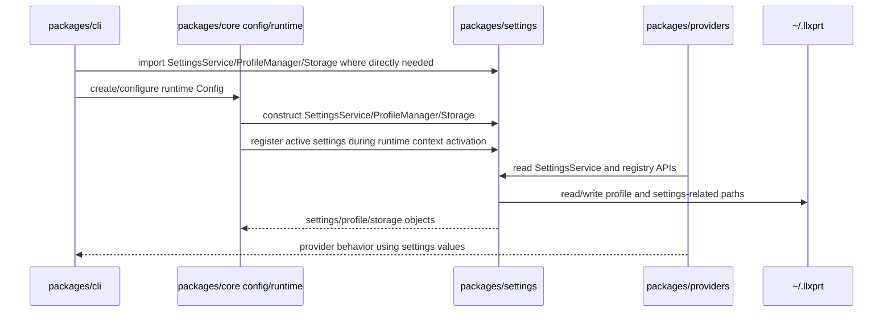

# Integration Contract: Settings Package Extraction

Plan ID: PLAN-20260608-ISSUE1588

## Component Interaction Diagram



## IC-01: Settings Package Public API

**Boundary:** `packages/settings` owns all moved settings/profile/storage APIs.

**Owner:** `packages/settings`

**Crosses:**

- `SettingsService`
- settings types
- settings registry and utility functions
- settings service instance helpers
- `ProfileManager`
- profile/model parameter types and guards
- `Storage`

**Direction:** consumers -> settings

**Behavior:** Consumers import settings APIs directly from `@vybestack/llxprt-code-settings` or documented settings package subpaths. Core does not re-export moved settings APIs for compatibility.

**Verification:** Old core settings/storage/profile imports return zero matches after P09.

## IC-02: Core Runtime Context -> Settings Instance Contract

**Boundary:** Core runtime context activates settings package instance management without settings importing core.

**Owner:** `packages/core` runtime context consumes `packages/settings` instance APIs.

**Contract:**

- `registerSettingsService(settingsService)` stores the active settings service in settings package state ONLY. It does NOT create a core `ProviderRuntimeContext` and does NOT import core.
- `getSettingsService()` returns the currently registered settings service from settings-package-owned state, or throws the current-style error if none is registered.
- `resetSettingsService()` clears the settings-package-owned state. It calls `clear()` on the previous service if current behavior requires it. It does NOT call core runtime context APIs.
- Settings-package tests verify ONLY settings-owned state (singleton get/register/reset). They MUST NOT import or assert anything about core `ProviderRuntimeContext`.
- Core `setActiveProviderRuntimeContext(context)` manages context state only; `settingsRuntimeAdapter.ts` calls `registerSettingsService(context.settingsService)` from settings package when context is activated via the adapter.
- Core `clearActiveProviderRuntimeContext()` manages context state only; `settingsRuntimeAdapter.ts` calls `resetSettingsService()` from settings package when context is cleared via the adapter.
- `providerRuntimeContext.ts` does NOT import or call any settings-package functions. It manages context state only and stays settings-agnostic.

**Behavioral change from current:** Current `registerSettingsService` can create a `ProviderRuntimeContext` when none exists. In the target architecture, settings cannot create core objects. Core-owned adapter code bridges the gap:

- `activateSettingsRuntimeContext(settingsService, runtimeId?)` creates a `ProviderRuntimeContext`, calls `setActiveProviderRuntimeContext()`, and calls `registerSettingsService()`. Defined in `packages/core/src/runtime/settingsRuntimeAdapter.ts`. **Single-owner rule**: this is the ONLY production path that bridges settings registration with runtime context creation.
- `deactivateSettingsRuntimeContext()` calls `clearActiveProviderRuntimeContext()` and `resetSettingsService()`. **Single-owner rule**: this is the ONLY production path that bridges settings reset with runtime context clearing.
- Adapter idempotency: `activateSettingsRuntimeContext(s)` called twice replaces context. `deactivateSettingsRuntimeContext()` called with no active context does not throw.
- Call-count verification: adapter tests track how many times `registerSettingsService` and `resetSettingsService` are called.
- **`providerRuntimeContext.ts` does NOT import or call settings-package singleton functions** — it is agnostic of the settings package. The adapter is the sole bridge. This prevents double-registration.

The only production call site that relied on `registerSettingsService` creating a context is `configConstructor.ts`. It must be updated to use `activateSettingsRuntimeContext()` in **P06** (P03b creates the adapter module but does NOT wire configConstructor — the production call-site switch is a P06 task). All other call sites use `registerSettingsService`/`resetSettingsService` for singleton or test-cleanup purposes and migrate directly to settings-package imports.

See `analysis/call-site-migration-matrix.md` for full call-site classification and per-site migration actions.

**Direction:** `core -> settings`

**Behavior:** `getSettingsService()` from settings returns the currently active settings service for provider code, preserving existing runtime behavior without settings importing provider runtime context.

**Verification:** Runtime isolation tests exercise two settings services and prove no stale cross-context reads. Additional tests cover register-before-context and context-activation semantic changes documented in `analysis/final-architecture.md` Singleton/Runtime-Context Replacement Semantics section.

## IC-03: Core Config -> Settings Classes Contract

**Boundary:** Core config remains core-owned but stores settings-owned classes.

**Owner:** core config hierarchy

**Crosses:**

- `SettingsService`
- `ProfileManager`
- `Storage`

**Direction:** `core -> settings`

**Behavior:** Existing `Config` methods such as `getSettingsService()` and `storage` accessors continue to work, but their concrete classes come from settings package.

**Verification:** Existing config tests pass and import scans show core config imports settings package, not core-local moved files.

## IC-04: Providers -> Settings Contract

**Boundary:** Provider implementations use settings package APIs for settings lookup and registry metadata.

**Owner:** providers consume settings

**Crosses:**

- `SettingsService` types/classes
- `getSettingsService`, `resetSettingsService`, `registerSettingsService`
- `SETTINGS_REGISTRY` and `getProviderConfigKeys`

**Direction:** `providers -> settings`

**Behavior:** Provider model/base URL/auth/header/tool format behavior remains the same. Providers no longer import core settings deep paths.

**Verification:** Provider package tests pass and forbidden old import scan returns zero.

## IC-05: ProfileManager -> Storage/Profile Types Contract

**Boundary:** ProfileManager reads/writes profile JSON through settings-owned storage paths and settings-owned profile types.

**Owner:** settings package

**Crosses:** filesystem under `~/.llxprt/profiles`

**Direction:** settings -> filesystem only

**Behavior:** Profile JSON formats and paths are unchanged. `ProfileManager` does not import core model types.

**Verification:** Migrated profile manager tests use a temp home/profile directory and assert actual JSON content and path behavior.

## IC-06: CLI Partial Migration Contract

**Boundary:** CLI imports moved settings APIs directly but CLI-specific schema/runtime settings stay in CLI until god-object decomposition.

**Owner:** CLI for CLI-specific behavior; settings for moved shared APIs.

**Direction:** `cli -> settings`, `cli -> core`, `cli -> providers`

**Behavior:** CLI commands and startup continue to work. This issue does not move UI command logic or CLI-only schema code unless P01 proves it is dependency-clean and the plan is updated.

**Verification:** CLI smoke command and targeted profile/settings tests pass.

## IC-07: No Shim Contract

**Boundary:** Old core settings/config paths disappear after migration.

**Owner:** core cleanup phase (P09)

**Direction:** `consumers -> settings` (no backward path through core)

**Behavior:** Consumers cannot accidentally continue importing moved APIs from core. Build and tests pass only because consumers were migrated to settings. No core re-export wrappers, no compatibility shims, no forwarding files. Old core files are independent duplicates during P05-P08, then deleted in P09.

**Forbidden patterns after P09:**
- No core re-export of moved symbols (`SettingsService`, `ProfileManager`, `Storage`, `ModelParams`, `Profile`, `getSettingsService`, `registerSettingsService`, `resetSettingsService`, `SETTINGS_REGISTRY`, etc.)
- No core subpath exports for moved modules (`./types/modelParams.js`, `./settings/*`, `./config/storage.js`, `./config/profileManager.js`)
- No `packages/core/src/settings/` directory
- No compatibility-named files (`SettingsServiceV2`, `ProfileManagerCompat`, etc.)

**Verification:** Anti-shim scans from `analysis/anti-shim-policy.md` pass. Boundary verification script checks 10, 11, 12, 13, 14, 15, 18 pass (enforced in P09+; report-only before P09).

## IC-08: a2a-server / LSP / test-utils Dependency Decision

**Boundary:** Non-core consumer packages that may or may not need direct settings dependencies.

**Owner:** per-package decision documented here

**a2a-server decision:** No direct `@vybestack/llxprt-code-settings` dependency. a2a-server defines its own `Settings` interface and `loadSettings()` function in `packages/a2a-server/src/config/settings.ts` for reading user/workspace settings JSON — entirely independent of the core `SettingsService` being moved. Its only relevant core import is `LLXPRT_CONFIG_DIR` from `memoryTool.ts`, which is not a settings-package symbol (it stays in core). Verified false positives: `Storage` hits are from `@google-cloud/storage` (GCS SDK), `AsyncLocalStorage` from Node built-in — not our `Storage` class.

**LSP decision:** No direct `@vybestack/llxprt-code-settings` dependency expected. LSP uses settings indirectly through core. Must be scanned explicitly in P08 preflight; if direct imports are found, add dependency then.

**test-utils decision:** Conditional — add `@vybestack/llxprt-code-settings` dependency only if P08 preflight scan finds direct imports of moved symbols. Currently expected to have no direct imports.

**Direction:** a2a-server `-> core` (indirect settings access); LSP `-> core` (indirect); test-utils `-> settings` (conditional)

**Behavior:** These packages continue working without direct settings package imports unless their code directly references moved symbols. If they do, they get direct dependencies in P08.

**Verification:**

```bash
# a2a-server: no direct settings symbol imports
rg -n "import.*Storage|import.*SettingsService|import.*ProfileManager|import.*getSettingsService|import.*registerSettingsService|import.*resetSettingsService|import.*SETTINGS_REGISTRY" packages/a2a-server/src --glob '*.ts' && echo "FOUND: a2a-server imports settings symbols" || echo "OK: no direct settings imports"

# LSP: no direct settings/config/profile/storage imports
rg -n "@vybestack/llxprt-code-core/settings|@vybestack/llxprt-code-core/config/(storage|profileManager)|import.*SettingsService|import.*ProfileManager" packages/lsp --glob '*.ts' && echo "FOUND: LSP imports" || echo "OK: no direct settings imports"
```

## IC-09: Boundary Verification Script Contract

**Boundary:** All boundary enforcement must be consistent, auditable, and automated.

**Owner:** `scripts/check-settings-boundary.js` (authoritative); inline scans in phase files are supplemental

**Crosses:** All IC-01 through IC-08 boundaries

**Behavior:** The boundary verification script (`scripts/check-settings-boundary.js`) defined in `analysis/boundary-verification-script.md` is the SINGLE AUTHORITATIVE SOURCE for boundary enforcement logic. It replaces ad-hoc inline shell snippets across phases. If there is a discrepancy between inline scans and the script, the script wins.

The script must be created in P03 (mandated artifact) and used in P08, P09, P10 as the primary boundary enforcement mechanism. It implements 20 checks covering:

1. Settings source forbidden imports
2. Settings all-files forbidden imports
3. Settings package metadata forbidden dependencies
4. tsconfig.json forbidden references
5. vitest.config.ts forbidden aliases (warn only)
6. Export map style verification
7. Old-path import scan
8. Root-barrel moved-symbol import scan
9. Anti-shim/compatibility file scan
10. Core re-export scan (post-P09)
11. Core modelParams subpath export scan (post-P09)
12. Core relative settings import scan (post-P09)
13. Core relative config/storage import scan (post-P09)
14. vi.mock path scan (post-P08)
15. Dynamic import path scan (post-P09)
16. ProviderRuntimeContext settings-agnostic rule
17. No packages/storage verification
18. Core barrel shim export scan (post-P09)
19. settingsRuntimeAdapter single-owner bridge scan
20. Lockfile verification

**Phase applicability:** Checks 10-15, 18 enforce zero matches only after P09. Check 7 enforces zero after P08. Use `--phase pre-p09` or `--phase pre-p08` for report-only mode. The script supports `--check` flag for individual check selection.

**Verification:** `node scripts/check-settings-boundary.js --check all` exits 0 on clean boundaries (post-P09). Pre-P09/P08 phases use `--phase` flag for report-only mode on relevant checks.

## IC-10: Core Config / ConfigConstructor Staged Wiring Boundary

**Boundary:** Core config hierarchy stores settings-owned classes; configConstructor bridges to settings at a controlled point in the implementation timeline.

**Owner:** `packages/core` config hierarchy (P03b adapter stub → P06 production wiring)

**Crosses:**

- `Config.getSettingsService()` method
- `Config.storage` accessor
- `configConstructor.ts` — the sole production call site for `registerSettingsService` that currently creates runtime context
- `settingsRuntimeAdapter.ts` — the sole bridge between settings singleton and runtime context

**Direction:** `core config -> settings package`

**Staged lifecycle:**

1. **P03b (minimal adapter stub):** `settingsRuntimeAdapter.ts` is created with `NotYetImplemented` stubs for `activateSettingsRuntimeContext` and `deactivateSettingsRuntimeContext`. `configConstructor.ts` is NOT modified — it still calls `registerSettingsService` directly (which still creates runtime context). The adapter is a transparent no-op.

2. **P06 (production wiring):** `settingsRuntimeAdapter.ts` gets full implementation. `configConstructor.ts` switches from `registerSettingsService` to `activateSettingsRuntimeContext`. This is the ONLY production call-site change in P06 for this boundary. After P06, `configConstructor.ts` imports `activateSettingsRuntimeContext` from the adapter, NOT `registerSettingsService` from settings.

3. **P09 (cleanup):** Old `registerSettingsService` in settings package no longer creates runtime context. `providerRuntimeContext.ts` never imports settings functions. The adapter is the sole bridge.

**Behavior:** Existing `Config` methods (`getSettingsService()`, `storage` accessors) continue to work throughout. Concrete classes come from settings package via imports. `configConstructor.ts` does NOT re-export moved APIs — it uses them for construction and wiring only.

**Verification:**

```bash
# P03b: adapter stub exists, configConstructor unchanged
test -f packages/core/src/runtime/settingsRuntimeAdapter.ts && echo "OK: adapter exists"

# P06: configConstructor uses adapter, not direct registerSettingsService
rg -n "activateSettingsRuntimeContext" packages/core/src/config/configConstructor.ts && echo "OK: configConstructor uses adapter"
rg -n "registerSettingsService" packages/core/src/config/configConstructor.ts && echo "FAIL: configConstructor still uses registerSettingsService directly" || echo "OK: configConstructor migrated"

# P09: providerRuntimeContext is settings-agnostic (boundary verification script check 16)
node scripts/check-settings-boundary.js --check provider-runtime-context
```

## IC-11: Runtime Settings Instance Lifecycle Contract

**Boundary:** Settings service instance registration, retrieval, and reset follow explicit lifecycle rules across packages.

**Owner:** `packages/settings` (singleton state) + `packages/core` adapter (context bridging)

**Lifecycle states and transitions:**

```
[No service registered]
       |
       | registerSettingsService(s1)   [settings-package-only, no context]
       v
[Singleton state: s1]
       |
       | activateSettingsRuntimeContext(s2)  [adapter: creates context + registers]
       v
[Runtime context active: s2]
       |
       | deactivateSettingsRuntimeContext()  [adapter: clears context + resets state]
       v
[No service registered]
```

**Rules per owner:**

| Operation | Owner | Crosses context? | Notes |
|-----------|-------|-------------------|-------|
| `registerSettingsService(s)` | settings | No | Stores in settings-package state only; no `ProviderRuntimeContext` creation |
| `getSettingsService()` | settings | No | Returns from settings-package state; throws if none registered |
| `resetSettingsService()` | settings | No | Clears settings-package state; calls `.clear()` on previous service; does NOT call `clearActiveProviderRuntimeContext()` |
| `activateSettingsRuntimeContext(s)` | core adapter | Yes | Creates context + registers settings; sole production bridge |
| `deactivateSettingsRuntimeContext()` | core adapter | Yes | Clears context + resets settings; sole production bridge |
| `setActiveProviderRuntimeContext(ctx)` | core | No | Context state only; does NOT call settings functions |
| `clearActiveProviderRuntimeContext()` | core | No | Context state only; does NOT call settings functions |

**Phased implementation:**

- **P03b:** Adapter stubs exist (`NotYetImplemented`); `settingsServiceInstance.ts` logic still in core with old behavior. No behavioral change.
- **P04-P05:** Settings package implements `registerSettingsService`, `getSettingsService`, `resetSettingsService` with settings-only state. Tests verify singleton identity/isolation without importing core context.
- **P06:** Adapter gets full implementation. `configConstructor.ts` switches to `activateSettingsRuntimeContext`. `providerRuntimeContext.ts` becomes settings-agnostic. Single-owner bridge scan passes.
- **P09:** Old `settingsServiceInstance.ts` in core deleted. All consumers use settings-package imports.

**Behavioral invariants:**

1. `registerSettingsService(s)` when no context exists registers `s` in settings state only.
2. `activateSettingsRuntimeContext(s)` creates context AND registers `s`. After this, `getSettingsService()` returns `s`.
3. `getSettingsService()` returns the most recently registered/activated service. Context activation overrides singleton registration.
4. `resetSettingsService()` clears settings state. It does NOT clear runtime context.
5. `deactivateSettingsRuntimeContext()` clears both context and settings state.
6. Two contexts with different settings: activating B after A means `getSettingsService()` returns B's service, not A's.

**Verification:**

```bash
# After P06: verify adapter is sole bridge
node scripts/check-settings-boundary.js --check adapter-single-owner

# After P06: verify providerRuntimeContext is settings-agnostic
node scripts/check-settings-boundary.js --check provider-runtime-context

# Behavioral tests (P04/P05/P06 per phase):
# - BVE-06a: register-before-context
# - BVE-06b: context-activation-updates-settings
# - BVE-06c: core-owned adapter
# - BVE-06d: reset-settings-state-only vs full-deactivation
```
