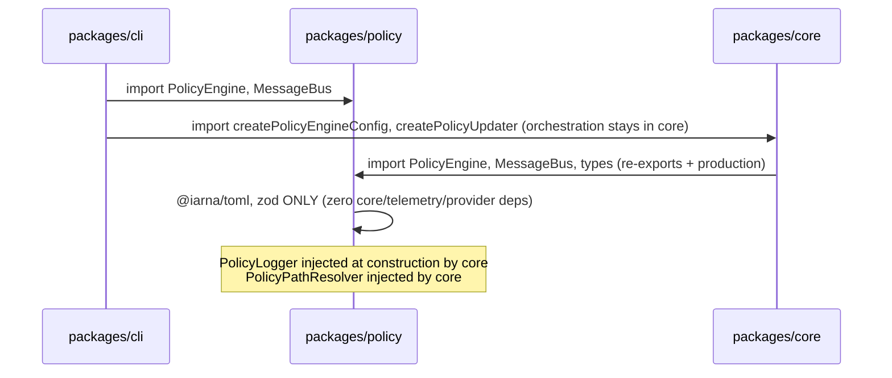

# Integration Contract: Policy Package Extraction

Plan ID: PLAN-20260609-ISSUE1591

## Component Interaction Diagram



## Package Dependency Direction

```
packages/policy  →  @iarna/toml, zod ONLY (ZERO core/telemetry/provider deps)
packages/policy  ⊥  @vybestack/llxprt-code-core (FORBIDDEN)
packages/policy  ⊥  @vybestack/llxprt-code-telemetry (FORBIDDEN)
packages/policy  ⊥  @google/genai (FORBIDDEN — PolicyFunctionCall replaces)
packages/cli     →  packages/policy
packages/cli     →  packages/core
packages/core    →  packages/policy (re-exports + production imports — allowed direction)
```

| Package | May Depend On | Must Not Depend On | Enforcement |
|---------|--------------|--------------------|-------------|
| `packages/policy` | `@iarna/toml`, `zod` ONLY | `@vybestack/llxprt-code-core`, `@vybestack/llxprt-code-telemetry`, `@google/genai`, `@vybestack/llxprt-code-providers`, `@vybestack/llxprt-code-cli` | `policy/package.json` deps, import scans |
| `packages/core` | `@vybestack/llxprt-code-policy` (re-exports + production imports) | (none restricted) | Import scan: `core → policy` allowed |
| `packages/cli` | `@vybestack/llxprt-code-policy`, `@vybestack/llxprt-code-core` | (none) | `cli/package.json` deps |

### Enforcement Commands

```bash
# Policy must not import core, providers, cli, tools, telemetry, @google/genai
rg -n "from.*@vybestack/llxprt-code-core|from.*@vybestack/llxprt-code-telemetry|from.*@google/genai" packages/policy/src --glob '*.ts' --glob '!**/*.test.ts'
# Expected: zero matches

# Policy must not import providers/cli/tools
rg -n "from.*providers|from.*@vybestack/llxprt-code$|from.*tools/(?!tool-confirmation)" packages/policy/src --glob '*.ts' --glob '!**/*.test.ts'
# Expected: zero matches

# Core re-exports from policy
rg -n "@vybestack/llxprt-code-policy" packages/core/src/index.ts
# Expected: re-export lines present
```

---

## Explicit Integration Contracts

### IC-01: Policy Package Public API

**Boundary:** `packages/policy` exports all policy and confirmation-bus types and implementations.

**Owner:** `packages/policy/src/index.ts`

**Exports:**
- `PolicyDecision`, `ApprovalMode`, `PolicyRule`, `PolicyEngineConfig`, `PolicySettings` (types)
- `PolicyEngine` (class)
- `DEFAULT_CORE_POLICIES_DIR`, `DEFAULT_POLICY_TIER`, `USER_POLICY_TIER`, `ADMIN_POLICY_TIER` (constants)
- `getPolicyDirectories`, `getPolicyTier`, `formatPolicyError`, `migrateLegacyApprovalMode` (utilities — pure, no Storage/coreEvents deps)
- `loadPoliciesFromToml`, `loadPolicyFromToml`, `loadDefaultPolicies` (TOML loading)
- `stableStringify`, `stableParse` (serialization)
- `escapeRegex`, `buildArgsPatterns` (regex utilities)
- `MessageBus` (class — with injected `PolicyLogger`)
- `MessageBusType` (enum)
- All message interfaces (`ToolConfirmationRequest`, `ToolConfirmationResponse`, `ToolPolicyRejection`, etc.)
- `MessageBusMessage` (union type)
- `SerializableConfirmationDetails` (type)
- `ConfirmationOutcome` (enum — replaces `ToolConfirmationOutcome`)
- `ConfirmationPayload` (interface — replaces `ToolConfirmationPayload`)
- `PolicyFunctionCall` (interface — new, replaces `FunctionCall`)
- `PolicyToolCallState` (interface — new, replaces `ToolCall` in `ToolCallsUpdateMessage`)
- `PolicyPathResolver` (interface — for storage path injection by core)
- `PolicyLogger` (interface — for debug logging injection by core)
- `ToolCallsUpdateMessage<T = unknown>` (generic — no scheduler dep)

**NOT exported from policy (stays in core):**
- `createPolicyEngineConfig` — stays in core (Storage, coreEvents deps)
- `createPolicyUpdater` — stays in core (Storage, coreEvents deps)
- `persistPolicyToToml` — stays in core

**Direction:** `cli → policy`, `core/index.ts → policy` (re-exports)

**Verification:**
```bash
node -e "import('@vybestack/llxprt-code-policy').then(m => { console.log(Object.keys(m).length + ' exports') })"
```

### IC-02: Policy Package Isolation Contract

**Boundary:** Policy production code has ZERO imports from core, telemetry, providers, CLI, or `@google/genai`. All cross-boundary concerns are injected via interfaces.

**Allowed Imports:**
- `@iarna/toml` (TOML parsing)
- `zod` (validation)
- Node.js built-ins (`fs`, `path`, `os`, etc.)

**Injected Interfaces (core provides implementations at wiring time):**
- `PolicyPathResolver` — provides storage paths (replaces `Storage` import)
- `PolicyLogger` — provides debug logging (replaces `debugLogger` from core/telemetry)

**Direction:** `core → policy` (core injects). `policy ⊥ core` (zero imports).

**Forbidden Imports:**
- `@vybestack/llxprt-code-core` (ANY path — deep or shallow)
- `@vybestack/llxprt-code-telemetry`
- `@google/genai`
- `@vybestack/llxprt-code-providers`
- `@vybestack/llxprt-code-cli`

**Verification:**
```bash
rg -n "from.*@vybestack/llxprt-code|from.*@google/genai" packages/policy/src --glob '*.ts' --glob '!**/*.test.ts'
# Expected: zero matches
```

### IC-03: Core Re-Export and Production Import Contract

**Boundary:** Core `index.ts` re-exports policy package types for backward compatibility. Core production files may import from `@vybestack/llxprt-code-policy` for both types and runtime classes. The direction `core → policy` is allowed.

**Owner:** `packages/core/src/index.ts` (re-exports), various core files (production imports)

**Re-exports in core/index.ts:**
```typescript
export {
  PolicyEngine, PolicyDecision, ApprovalMode, PolicyRule,
  type PolicyEngineConfig, type PolicySettings,
  MessageBus, MessageBusType, MessageBusMessage,
  ConfirmationOutcome, type ConfirmationPayload,
  type SerializableConfirmationDetails,
  DEFAULT_CORE_POLICIES_DIR, DEFAULT_POLICY_TIER,
  USER_POLICY_TIER, ADMIN_POLICY_TIER,
  getPolicyDirectories, getPolicyTier, formatPolicyError, migrateLegacyApprovalMode,
  PolicyFunctionCall, PolicyToolCallState,
  // ... all other exported names
  // Backward-compat aliases:
  ConfirmationOutcome as ToolConfirmationOutcome,
  type ConfirmationPayload as ToolConfirmationPayload,
} from '@vybestack/llxprt-code-policy';

// Orchestration stays in core:
export { createPolicyEngineConfig, createPolicyUpdater, persistPolicyToToml } from './policy/config.js';
```

**Production imports in core files (allowed):**
- `configBaseCore.ts`: `PolicyEngine` type
- `configConstructor.ts`: `PolicyEngine` class
- `configTypes.ts`: `PolicyEngineConfig` type
- `confirmation-coordinator.ts`: `PolicyDecision`, `MessageBus`
- All 25+ tool files: `MessageBus` type
- All subagent/core/hook files: `MessageBus` type
- `policy/config.ts`: `PolicyEngine`, types (but keeps orchestration functions)
- `policy/policy-helpers.ts`: `PolicyEngine`, `PolicyDecision`, `MessageBus` (stays in core)

**Direction:** `core → policy` (allowed for both re-exports and production imports)

**Verification:**
```bash
# Verify core imports resolve to policy package
rg -n "@vybestack/llxprt-code-policy" packages/core/src --glob '*.ts' | head -20
# Expected: re-export lines in index.ts + production imports in various files
```

### IC-04: Confirmation Type Decoupling Contract

**Boundary:** Policy package owns confirmation primitives. Core tools import them from policy.

**Moved to Policy:**
- `ToolConfirmationOutcome` enum → `packages/policy/src/confirmation-types.ts`
- `ToolConfirmationPayload` interface → `packages/policy/src/confirmation-types.ts`

**New in Policy:**
- `PolicyFunctionCall` interface → replaces `FunctionCall` from `@google/genai`
- `PolicyToolCallState` interface → replaces `ToolCall` from `scheduler/types.ts`

**Direction:** `core → policy` (for these types), `policy ⊥ @google/genai`

**Behavioral Expectation:**
- `FunctionCall` usages in message-bus/types are replaced with `PolicyFunctionCall`
- `ToolCall` usage in `ToolCallsUpdateMessage` is replaced with `PolicyToolCallState`
- Core maps `FunctionCall` → `PolicyFunctionCall` at publish boundary
- Core maps `ToolCall` → `PolicyToolCallState` at publish boundary

**Verification:**
```bash
rg -n "@google/genai" packages/policy/src --glob '*.ts' --glob '!**/*.test.ts'
# Expected: zero matches

rg -n "from.*scheduler/types" packages/policy/src --glob '*.ts' --glob '!**/*.test.ts'
# Expected: zero matches
```

### IC-05: Policy Helpers Decoupling Contract

**Boundary:** `policy-helpers.ts` stays in core. It imports `PolicyEngine`, `PolicyDecision`, `MessageBus` from `@vybestack/llxprt-code-policy`. It does not move to the policy package due to hard dependencies on tool invocation types.

**Owner:** `packages/core/src/policy/policy-helpers.ts` (stays in core, updated imports)

**Imports from policy:**
- `PolicyEngine` type from `@vybestack/llxprt-code-policy`
- `PolicyDecision` from `@vybestack/llxprt-code-policy`
- `MessageBus` type from `@vybestack/llxprt-code-policy`
- `MessageBusType` from `@vybestack/llxprt-code-policy`

**Stays in core (cannot move):**
- `getPolicyContextFromInvocation` — needs `AnyToolInvocation`, `BaseToolInvocation`, `ToolCallRequestInfo`
- `evaluatePolicyDecision` — needs `PolicyContext` from scheduler, `ToolCallRequestInfo`
- `handlePolicyDenial` — needs `ToolCallResponseInfo`, `ToolErrorType`, `createErrorResponse`
- `publishConfirmationRequest` — needs `PolicyContext`

**Direction:** `core → policy` (helpers use policy types)

**Verification:**
```bash
rg -n "from.*@vybestack/llxprt-code-policy" packages/core/src/policy/policy-helpers.ts
# Expected: present (imports from policy package)
```

### IC-06: CLI Import Migration Contract

**Boundary:** CLI imports policy types from `@vybestack/llxprt-code-policy` directly.

**Owner:** `packages/cli/src/config/policy.ts`, UI hooks, commands

**Changes:**
- `cli/src/config/policy.ts`: imports from `@vybestack/llxprt-code-policy`
- `cli/src/ui/commands/policiesCommand.ts`: imports `PolicyDecision` from policy
- `cli/src/ui/commands/authCommand.ts`: imports `MessageBus` from policy
- `cli/src/ui/hooks/useHookDisplayState.ts`: imports `MessageBusType`, `MessageBus` from policy
- `cli/src/ui/hooks/useReactToolScheduler.ts`: imports `MessageBus` type from policy
- `cli/src/ui/hooks/geminiStream/*.ts`: imports `MessageBus` type from policy

**Direction:** `cli → policy`

**Verification:**
```bash
rg -n "PolicyDecision|PolicyEngine|MessageBus|PolicySettings|createPolicyEngineConfig" packages/cli/src --glob '*.ts' | grep 'from.*@vybestack/llxprt-code-core'
# Expected: zero matches (all migrated to @vybestack/llxprt-code-policy)
```

### IC-07: Config Boundary Injection Contract

**Boundary:** `createPolicyEngineConfig` and `createPolicyUpdater` stay in core. Pure config utilities (`getPolicyDirectories`, `getPolicyTier`, `migrateLegacyApprovalMode`) moved to policy package with storage paths injected as parameters. Policy package defines `PolicyPathResolver` interface; core provides the implementation.

**Owner:** Policy package defines the interface; core provides the implementation at wiring time.

**Injection Interface (in policy package):**
```typescript
export interface PolicyPathResolver {
  getUserPoliciesDir(): string;
  getSystemPoliciesDir(): string;
}
```

**Pure utilities moved to policy (accept params, no Storage import):**
```typescript
// In policy package:
export function getPolicyDirectories(userPoliciesDir: string, adminPoliciesDir: string): string[]
export function getPolicyTier(dir: string, userPoliciesDir: string, adminPoliciesDir: string): number
```

**Orchestration stays in core:**
```typescript
// In core config.ts:
import { Storage } from './storage.js';
import { getPolicyDirectories, getPolicyTier, PolicyPathResolver } from '@vybestack/llxprt-code-policy';

// Core creates the resolver
const pathResolver: PolicyPathResolver = {
  getUserPoliciesDir: () => Storage.getUserPoliciesDir(),
  getSystemPoliciesDir: () => Storage.getSystemPoliciesDir(),
};
```

**Direction:** `policy` owns pure utilities and interface; `core` provides implementation and orchestration

**Behavioral Expectation:** Policy paths resolve identically. Tier calculation is unchanged.

**Verification:**
```bash
# Policy must not import Storage or coreEvents
rg -n "Storage|coreEvents|debugLogger" packages/policy/src --glob '*.ts' --glob '!**/*.test.ts'
# Expected: zero matches

# Core config.ts must keep createPolicyEngineConfig
rg -n "createPolicyEngineConfig" packages/core/src/policy/config.ts
# Expected: present
```

---

## Behavioral Verification Expectations

### BVE-01: Policy Evaluation

**Observable Behavior:** `PolicyEngine.evaluate()` returns correct `PolicyDecision` for all rule types, priorities, and shell command patterns.

**Test Locations:** `packages/policy/src/policy-engine.test.ts` (moved from core)

### BVE-02: TOML Loading

**Observable Behavior:** TOML policy files load correctly across tiers with proper priority transformation, error handling, and mode filtering.

**Test Locations:** `packages/policy/src/toml-loader.test.ts` (moved from core)

### BVE-03: MessageBus Confirmation

**Observable Behavior:** `MessageBus.requestConfirmation()` correctly integrates with `PolicyEngine`, publishes requests, and resolves based on user response.

**Test Locations:** `packages/policy/src/confirmation-bus/message-bus.test.ts` (moved from core)

### BVE-04: Dynamic Policy Updates

**Observable Behavior:** `createPolicyUpdater` subscribes to `MessageBus` updates and adds dynamic rules at priority 2.95, optionally persisting to TOML.

**Test Locations:** `packages/policy/src/config.test.ts` (moved from core)

### BVE-05: CLI Smoke Test

**Observable Behavior:** `node scripts/start.js --profile-load ollamakimi "write me a haiku and nothing else"` completes without error.

**Test Locations:** Phase 11 command

### BVE-06: No Forbidden Dependencies

**Observable Behavior:** Policy package has zero imports from providers, CLI, or concrete tool implementations.

**Verification:** Multiple import scans

---

## Existing Files That Must Be Touched

### New Files
- `packages/policy/package.json`
- `packages/policy/tsconfig.json`
- `packages/policy/vitest.config.ts`
- `packages/policy/index.ts`
- `packages/policy/src/index.ts`
- All policy/bus source files (moved from core)

### Modified Files
- `package.json` (add `packages/policy` to workspaces)
- `package-lock.json` (workspace metadata)
- `packages/core/src/index.ts` (replace direct exports with re-exports from policy)
- `packages/cli/src/config/policy.ts` (import from policy package)
- `packages/cli/package.json` (add policy dependency)
- `packages/core/src/scheduler/types.ts` (import SerializableConfirmationDetails from policy)
- `packages/core/src/tools/tool-confirmation-types.ts` (re-export from policy or remove)
- `packages/core/src/scheduler/confirmation-coordinator.ts` (import from policy)
- All 25+ tool files (import MessageBus from policy)
- All 5+ subagent files (import MessageBus from policy)
- All config files (import MessageBus from policy)

### Deleted Files
- `packages/core/src/policy/` (entire directory after migration)
- `packages/core/src/confirmation-bus/` (entire directory after migration)

## P01 Verification Notes (2026-06-10)

Cross-referenced all integration contracts against actual code. Key findings:

### IC-01 (Public API): VERIFIED
All listed types, classes, and utilities confirmed present at expected locations.

### IC-02 (Isolation): VERIFIED
Policy source files (types.ts, stable-stringify.ts, utils.ts) have zero external imports. policy-engine.ts only imports from policy/* and utils/shell-utils. toml-loader.ts only imports from policy/*, @iarna/toml, zod, and node built-ins.

### IC-03 (Core Re-Export): VERIFIED
- `core/index.ts:15` re-exports `policy/index.js` (which re-exports types, policy-engine, stable-stringify, config, toml-loader, policy-helpers)
- `core/index.ts:16` re-exports `PolicyEngine` from `policy/policy-engine.js`
- `core/index.ts:23` re-exports policy types
- `core/index.ts:34` re-exports from `policy/config.js`
- `core/index.ts:50-51` re-exports `confirmation-bus/types.js` and `confirmation-bus/message-bus.js`

### IC-04 (Confirmation Types): VERIFIED
- `tool-confirmation-types.ts`: 29 lines, exports ToolConfirmationOutcome enum (8 values) and ToolConfirmationPayload interface (2 fields: newContent, editedCommand)
- `confirmation-bus/types.ts:1`: imports FunctionCall from @google/genai → replaced by PolicyFunctionCall
- `confirmation-bus/types.ts:6`: imports ToolCall from scheduler/types → replaced by PolicyToolCallState
- `ToolCallsUpdateMessage`: currently `readonly toolCalls: readonly ToolCall[]` — needs generic parameter

### IC-05 (Policy Helpers): VERIFIED
- `policy-helpers.ts` imports: FunctionCall (@google/genai), AnyToolInvocation, BaseToolInvocation (tools/tools), PolicyContext (scheduler/types), ToolCallRequestInfo, ToolCallResponseInfo (scheduler/types), ToolErrorType (core/index), createErrorResponse (utils), PolicyEngine, PolicyDecision, MessageBus, MessageBusType
- All core dependencies confirmed — file must stay in core

### IC-06 (CLI Migration): VERIFIED
Production CLI files importing from @vybestack/llxprt-code-core:
- `config/policy.ts`: PolicyEngineConfig, ApprovalMode, PolicyEngine, MessageBus, PolicySettings, createPolicyEngineConfig, createPolicyUpdater
- `config/intermediateConfig.ts`: PolicyEngineConfig
- `config/profileBootstrap.ts`: MessageBus
- `config/configBuilder.ts`: PolicyEngineConfig
- `ui/commands/policiesCommand.ts`: PolicyDecision
- `ui/commands/authCommand.ts`: DebugLogger, MessageBus
- `ui/hooks/useHookDisplayState.ts`: MessageBusType, MessageBus
- `ui/hooks/useReactToolScheduler.ts`: MessageBus (via core re-export)
- `ui/hooks/geminiStream/*.ts`: MessageBus (via core re-export)
- `runtime/runtimeContextFactory.ts`: MessageBus (constructs new MessageBus)
- `commands/skills/list.ts`: MessageBus
- `auth/oauth-manager.ts`: MessageBus
- `auth/auth-flow-orchestrator.ts`: MessageBus
- `auth/types.ts`: MessageBus
- `providers/providerManagerInstance.ts`: MessageBus

### IC-07 (Config Boundary): VERIFIED
- `getPolicyDirectories` (config.ts:53) calls `Storage.getUserPoliciesDir()` and `Storage.getSystemPoliciesDir()` — must be refactored to accept params
- `getPolicyTier` (config.ts:75) calls `Storage.getUserPoliciesDir()` and `Storage.getSystemPoliciesDir()` — must be refactored to accept params
- `migrateLegacyApprovalMode` (config.ts:179) uses `ApprovalModeEnum` from `../config/config.js` (same values as policy/types.ts) — needs import swap
- `createPolicyEngineConfig` (config.ts:224) uses Storage, coreEvents, debugLogger — stays in core
- `persistPolicyToToml` (config.ts:573) is a private function using Storage, coreEvents, debugLogger — stays in core

### Additional CLI import site:
- `commands/skills/list.ts:8` imports `MessageBus` from core — not listed in original IC-06. Added above.

**Integration contract accuracy: PASS — all contracts verified against actual codebase**
