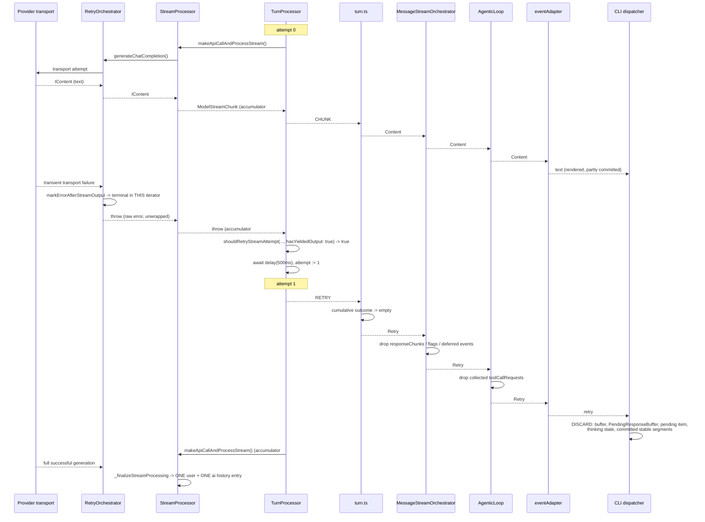

# Feature Specification: Safe retry after partial model output (discard-and-restart)

Issue: [#3048](https://github.com/acoliver/llxprt-code/issues/3048)
Plan ID: `PLAN-20260806-ISSUE3048`
Generated: 2026-08-06
Branch: `issue3048`
Follow-up to: #3034 / PR #3047. Related transport behaviour: #3049, #3094.

---

## 1. Purpose

A provider stream that fails **after** content has already crossed the boundary
to the consumer is unrecoverable today: it ends the turn with an API error and
stops the agentic loop. #3034 fixed the cases where the failure happens *before*
any content crosses. This is the residual half.

The fix is a **discard-and-restart contract**: when a transient transport failure
kills an attempt that had already emitted output, every layer that accumulated
state for that attempt throws it away, and the turn is restarted from a clean
boundary under a bounded budget. Nothing from the abandoned attempt reaches
durable history, the model's next request, the scheduler, or the rendered
transcript.

---

## 2. Architectural decisions

### AD-1 — The restart boundary is the turn attempt, not the provider iterator

`RetryOrchestrator.yieldStreamUnprotected`
(`packages/providers/src/RetryOrchestrator.ts`) marks any error raised after a
chunk was yielded with `markErrorAfterStreamOutput` and refuses to retry inside
the same iterator, because doing so would splice two generations into one
`IContent` stream. **That behaviour is correct and stays.** Retrying inside one
iterator is precisely the failure mode #3049 is removing from the HTTP/SSE path;
re-introducing it here would contradict both.

`TurnProcessor._runStreamAttempt` (`packages/agents/src/core/TurnProcessor.ts`)
already has the property the restart needs: **each attempt calls
`StreamProcessor.makeApiCallAndProcessStream` afresh**, which builds a new
provider stream, a new `StreamOutputAccumulator`, and a new history-recording
closure. It is the only place in the stack where "discard everything and start
over" is expressible without splicing.

> **Consequence:** the provider layer gets *fence tests*, not behaviour changes.
> Weakening `markErrorAfterStreamOutput` is a plan-level violation.

### AD-2 — The discard signal already exists end-to-end; only the consumers are missing

`StreamEventType.RETRY` (`packages/core/src/core/chatSessionTypes.ts`) is
documented as "The UI should discard any partial content from the attempt that
just failed". It is emitted by `TurnProcessor._runStreamAttempt` at the start of
every attempt after the first, mapped by `turn.ts` to `AgentEventType.Retry`
(which already resets the cumulative response outcome), and mapped by
`eventAdapter.ts` to the public `{ type: 'retry' }` event.

**No new event type, no new protocol field.** The work is to make each consumer
that accumulates per-attempt state honour the signal.

### AD-3 — After output, only a *transport* condition may restart

Before any output, the existing classification is unchanged: `InvalidStreamError`
and `EmptyStreamError` (content-validity verdicts) plus transient network errors
retry. After output, only `isNetworkTransientError` qualifies. A content-validity
verdict about output that is being **discarded** is not a transport failure, and
widening the post-output path to include it would exceed the issue's stated
scope. See preflight F8.

### AD-4 — Abort is checked before, and independently of, the retry classification

`isAbortError` already covers three independent signals (`name === 'AbortError'`,
`code === 'ABORT_ERR'`, and `params.config?.abortSignal?.aborted === true`) and is
applied on the post-output path exactly as on the pre-output path. An abort is
never reclassified as a retryable transport failure, at any layer.

### AD-5 — The bound is the existing turn budget; nothing new is introduced

`INVALID_CONTENT_RETRY_OPTIONS = { maxAttempts: 2, initialDelayMs: 500 }`
(`packages/core/src/core/chatSessionTypes.ts`) gives `withinBudget = attempt < 1`:
**exactly one restart per turn.** When that restart also fails, the error
propagates unchanged to `AgentEventType.Error` and the loop stops, as today.

Each restart legitimately obtains a fresh provider transport budget (a restart is
a new request). Worst-case transports for one turn are therefore
`2 × retries` — bounded, deterministic, and stated here so it is not mistaken for
an unbounded spiral (preflight F4).

### AD-6 — Discard is applied at every layer that accumulates per-attempt state

The contract is only sound if *every* accumulator is enumerated and given an
explicit decision. §6 is that enumeration. Silence is not an acceptable answer
for any row.

### AD-7 — `StreamOutputAccumulator` needs no `reset()`

Every turn attempt constructs its own accumulator inside `processStreamResponse`,
and `_finalizeStreamProcessing` — the sole history-recording site — runs only when
the stream loop completes normally. A failed attempt's accumulator is simply
dropped with the generator. Adding `reset()` would create a dead, untested state
transition. Issue item 2 is obsolete; preflight F1 records the evidence.

### AD-8 — Prefer fail-fast; no fallback layers

No `try/catch`-and-continue around discard, no optional/defaulted discard
callbacks, no "best effort" flags. A discard handler that cannot reach the state
it must clear is a wiring bug that must fail the type checker, not degrade
silently at run time.

---

## 3. Technical environment

- **Type:** CLI tool + agent engine (monorepo, npm workspaces, Bun toolchain)
- **Runtime:** Bun (tests, scripts, dev start), Node ≥ 20 for the published CLI
- **Language:** TypeScript, strict mode
- **Test framework:** `bun:test` only. Agents suites import the
  `packages/agents/src/testApi.ts` facade; CLI/providers suites import
  `bun:test` directly. Discovery is structural — no manifest entry is required
  for a new test file (preflight C1).
- **New third-party dependencies:** none.

---

## 4. Data and event flow



**Ordering guarantee that AC3 depends on:** `RETRY` is yielded by
`_runStreamAttempt` *before* the new provider call is made
(`TurnProcessor.ts:256-266`), so every consumer receives the discard signal
strictly before the first chunk of the replacement attempt. Consumers must not
assume the reverse.

**Deliberate non-change:** `RETRY` is emitted *after* the backoff delay, not at
the moment the retry decision is taken. Moving it earlier would change the
existing pre-output retry sequencing for no acceptance-criterion benefit. The
visible effect is that the abandoned text lingers for `initialDelayMs` before it
disappears. If an abort lands during that window no `RETRY` is emitted, the
partial text is committed by the existing cancellation path, and the user sees
exactly the "cancelled mid-response" rendering they see today — which is correct,
because there is no second attempt to duplicate it.

---

## 5. Integration points (mandatory)

### 5.1 Existing code that will USE this feature

| File | Symbol | Role |
|------|--------|------|
| `packages/agents/src/core/TurnProcessor.ts` | `_runStreamAttempt` | Decides the restart; already owns the fresh-attempt boundary |
| `packages/agents/src/core/turnAbortHelpers.ts` | `shouldRetryStreamAttempt` | Retry/stop policy, extended with the post-output rule |
| `packages/agents/src/core/agenticLoop/AgenticLoop.ts` | `streamAndCollect` | Drops abandoned tool-call requests |
| `packages/agents/src/core/MessageStreamOrchestrator.ts` | `_processStreamIteration` | Drops abandoned per-attempt accumulators |
| `packages/a2a-server/src/agent/executor.ts` | `#processAgentTurnLoop` | Drops abandoned tool-call requests (second scheduler) |
| `packages/cli/src/ui/hooks/agentStream/agentEventDispatcher.ts` | `dispatchAgentEvent` | Routes `'retry'` to the discard handler |
| `packages/cli/src/ui/hooks/agentStream/useStreamEventHandlers.ts` | `useStreamHandlers` | Owns the discard handler |
| `packages/cli/src/ui/hooks/agentStream/contentEventProcessor.ts` | `processContentEvent` / `applySplitResult` | Records retractable committed segments |
| `packages/cli/src/nonInteractiveCliSupport.ts` | `dispatchAgentEvent` | Drops abandoned non-interactive text |

### 5.2 Existing code to be REPLACED / corrected

| What | Where | Why |
|------|-------|-----|
| `!hasYieldedChunk &&` guard | `TurnProcessor.ts:306-311` | The single blocker; replaced by an explicit post-output policy branch |
| `_applyRetryTemperature` private method (lines 316-330, sole call site line 263) | `TurnProcessor.ts` | Relocated to `turnAbortHelpers.ts` — pure retry policy, and `TurnProcessor.ts` has 3 effective lines of `max-lines` headroom (preflight F3) |
| `case 'retry':` no-op | `agentEventDispatcher.ts:354-361` | Becomes an explicit discard |
| Three "does not retry after output" assertions | `chatSession.issue2150.test.ts` | Encode the pre-#3048 contract (preflight F7) |
| `Retry` = log-only | `packages/a2a-server/src/agent/task-support.ts` classification stays; the *executor* stops treating collected tool calls as durable | AC4 applies to every scheduler |

### 5.3 User access points

- Interactive CLI: any turn whose provider stream drops mid-response.
  Observable as: the partial response disappearing and being replaced by one
  complete response, instead of `[API Error: ...]` ending the turn.
- Non-interactive CLI (`--output-format json` / `--quiet`): the emitted result
  contains only the successful attempt's text.
- ACP/Zed and a2a-server: the loop continues instead of stopping; a2a
  additionally never schedules abandoned tool calls.

### 5.4 Migration requirements

None. No persisted data, settings schema, or wire format changes. The
`retries` / `retrywait` ephemerals keep their meaning.

---

## 6. The discard contract — complete accumulator audit

Every per-attempt accumulator reachable from a model stream, with an explicit,
source-grounded decision. This table satisfies issue item 5.

| # | Accumulator | Location | Decision | Rationale |
|---|-------------|----------|----------|-----------|
| 1 | `StreamOutputAccumulator` | `streamOutputAccumulator.ts` | **No change** | Fresh instance per attempt; never observed across the boundary (preflight A7, F1) |
| 2 | `HistoryService` entries | `_finalizeStreamProcessing` → `recordHistoryWithUsage` | **No change** | Only reached on normal completion; a failed attempt writes neither the user nor the AI turn (preflight A8). Pinned by a behavioural test |
| 3 | `currentPromptEnvelopeEstimate` | `StreamProcessor._convertIContentStream` catch | **No change** | Already nulled on stream error |
| 4 | `compressionHandler.lastPromptTokenCount` | `trackPromptTokens` | **No change** | Overwritten by the successful attempt with the same prompt's value |
| 5 | API-response telemetry + `recordActualTokenUsage` | `StreamProcessor._logTelemetry` | **No change** | Runs only after the stream loop completes; an abandoned attempt logs no response and no actual token usage |
| 6 | Finalized prompt-envelope estimate | `recordFinalizedPromptEnvelopeEstimate` | **No change** | Re-recorded per attempt under the same `promptId`; last (successful) write wins |
| 7 | `eagerlyRecordedToolResponseCallIds` | `StreamProcessor` / `TurnProcessor` | **No change — deliberately NOT reset** | These record tool responses the *client* already put in history before the send. They belong to the turn, not the attempt. Clearing them on discard would make the successful attempt re-record duplicates via `prepareHistoryUserInput` |
| 8 | Per-chunk AfterModel hooks | `StreamProcessor._processAfterModelHook` | **No change** (documented) | Hooks are user-authored side effects already executed; `packages/core/src/hooks/types.ts` has no compensating event. Identical to today's contract for any mid-stream failure. Follow-up candidate (§8) |
| 9 | `cumulativeOutcome` | `turn.ts:474-478` | **Already correct** | Reset to `createEmptyResponseOutcome()` on `RETRY` |
| 10 | `ctx.responseChunks` | `MessageStreamOrchestrator` | **CHANGE — truncate to entry baseline on Retry** | Feeds the AfterAgent hook's `responseText`. The array is shared across internal-loop iterations, so a Retry truncates to the length captured at `_processStreamIteration` entry (not zero), preserving text contributed by earlier successful internal-loop iterations while discarding the abandoned attempt's text |
| 11 | `hadContent` / `hadThinking` / `hadToolCallsThisTurn` | `MessageStreamOrchestrator._processStreamIteration` | **CHANGE — reset on Retry** (`hadToolCallsThisTurn` back to `hadToolCallsPrior`) | They gate `canRetryFailedStream` and post-turn evaluation; an abandoned attempt must not contribute |
| 12 | `deferredEvents` | same | **CHANGE — clear on Retry** | `shouldDeferStreamEvent` defers `Finished` and `Citation`; an abandoned attempt can emit deferred citations |
| 13 | `finishedOutcome` | same | **No change** | Only set by `AgentEventType.Finished`, which an abandoned (throwing) attempt never reaches |
| 14 | `AgenticLoop` `toolCallRequests` | `AgenticLoop.streamAndCollect` | **CHANGE — clear on Retry, keep `shouldScheduleTools === true`** | AC4. The successful attempt must still schedule its own tools |
| 15 | a2a-server `toolCallRequests` | `executor.#processAgentTurnLoop` | **CHANGE — clear on Retry** | Second scheduler; AC4 is a property of the system, not of one consumer |
| 16 | `LoopDetectionService` content/tool tracking | `loopDetectionService.addAndCheck` | **CHANGE — checkpoint/restore on Retry** | `MessageStreamOrchestrator._processStreamIteration` captures a `LoopDetectionService.checkpoint()` at iteration entry (after `turnStarted`) and calls `restore()` on every transport Retry, so abandoned Content/ToolCallRequest cannot contaminate the detector. The snapshot covers only attempt-mutable state (`lastToolCallKey`, repetition count, `streamContentHistory`, deep-copied `contentStats`, `lastContentIndex`, `loopDetected`, `inCodeBlock`); prompt identity and `turnsInCurrentPrompt` are explicitly preserved. With `toolCallLoopThreshold=2`, an abandoned tool A + Retry + replacement tool A is no longer rejected as a loop |
| 17 | `TodoContinuationService.recordModelActivity` | `MessageStreamOrchestrator` loop | **No change** | Only reacts to `ToolCallResponse`, which `turn.run()` never emits |
| 18 | `TodoContinuationService.lastTodoSnapshot` / `lastTodoToolTurn` / `consecutiveComplexTurns` | `_handleTodoToolCall` | **CHANGE — checkpoint/restore on Retry** | `_handleTodoToolCall` mutates all three before a possible Retry. `MessageStreamOrchestrator._processStreamIteration` captures a `TodoContinuationService.checkpoint()` at iteration entry and calls `restore()` on every transport Retry. The snapshot covers exactly these three attempt-local values (the todo snapshot is cloned on both capture and restore to prevent aliasing); prompt identity, reminder level and activity counters are excluded. An abandoned `todo_write` no longer shifts reminder cadence for the replacement attempt |
| 19 | CLI `agentBufferRef` | `useSubmitQuery.useProcessAgentEvent` | **CHANGE — reset to `''`** | AC3 |
| 20 | CLI `PendingResponseBuffer` | `useStreamState` | **CHANGE — `reset()`** | AC3; holds the sanitiser's unstable tail plus the retained stable text |
| 21 | CLI pending history item | `pendingHistoryItemRef` / `setPendingHistoryItem` | **CHANGE — drop WITHOUT flushing, AI-content items only** | Flushing would commit the abandoned text. A `tool_group` pending item belongs to the scheduler, not to the model attempt, and must be left alone |
| 22 | CLI thinking state | `thinkingBlocksRef`, `setThought` | **CHANGE — clear** | Abandoned thinking must not be attached to the successful message |
| 23 | CLI committed stable segments | `contentEventProcessor.applySplitResult` → `addItem` | **CHANGE — retract** | Preflight F5. Without this, any multi-paragraph partial response is duplicated on screen and AC3 fails |
| 24 | CLI displayed tool state | scheduler `onToolCallsUpdate` → `replaceToolCalls` | **No change — no pre-scheduling state exists** | `dispatchAgentEvent` treats `'tool-call'` as a no-op; tool rows appear only from scheduler callbacks, and abandoned tool calls are never scheduled (row 14). Verified against `agentEventDispatcher.ts:354-361` |
| 25 | Non-interactive `responseText` / `quietTextBuffer` / `thoughtBuffer` | `nonInteractiveCliSupport.ts` | **CHANGE — reset on retry, discarding the emoji filter's held buffer** | `--output-format json` and `--quiet` emit these as the final result |
| 26 | Non-interactive already-written stdout / `stream-json` deltas | same | **No change — documented limitation** | Bytes already on stdout cannot be retracted |
| 27 | Zed/ACP already-sent `agent_message_chunk` | `zed-agent-event-handler.ts`, `zed-stream-batcher.ts` | **No change — documented limitation + follow-up** | ACP `SessionUpdate` has no retraction primitive; dropping only the un-flushed batch would be timing-dependent (preflight F9) |

---

## 7. Formal requirements

### [REQ-3048-001] Provider boundary stays terminal after output

**Full text:** `RetryOrchestrator` MUST NOT retry inside a single provider
iterator once an `IContent` has been yielded, and MUST propagate the original
error object so the turn layer can classify it.

- **GIVEN** a provider whose stream yields one `IContent` and then throws a
  transient transport error
- **WHEN** the stream is consumed through `RetryOrchestrator`
- **THEN** the wrapped provider's `generateChatCompletion` is invoked exactly once
- **AND** the consumer observes exactly the one yielded `IContent` followed by a
  rejection
- **AND** the rejected value is the same error object the transport threw
  (no `RetriesExhaustedError` wrapper, `isRetryable` still absent)
- **AND** `isTerminalRetryError(error)` is `true` in the **providers** module and
  `false` in the **agents** module

**Why this matters:** the anti-mixing rule is what makes the turn-level restart
safe. If the orchestrator ever spliced two generations into one iterator, the
turn layer could not tell them apart and history would concatenate them.

### [REQ-3048-002] Transient transport failure after output restarts the turn

**Full text:** When a turn attempt has already emitted output and then fails with
a transient transport error, and the abort signal is clear and the turn retry
budget has room, the turn MUST be restarted from a fresh attempt instead of
ending in an error.

- **GIVEN** a provider that, on attempt 1, yields `text: 'partial'` and then
  throws `Error('Connection error.')` (no HTTP status), and on attempt 2 yields
  `text: 'recovered response'`
- **WHEN** the caller consumes `chat.sendMessageStream(...)` to completion
- **THEN** the provider's `generateChatCompletion` is invoked exactly twice
- **AND** the stream completes without throwing
- **AND** a `StreamEventType.RETRY` event is emitted exactly once, strictly before
  any chunk of attempt 2
- **AND** the same holds when the abandoned attempt emitted a `tool_call` block
  or a hidden `thinking` block instead of text

**Why this matters:** this is the whole point of the issue — a dropped connection
mid-answer currently kills the agentic loop.

### [REQ-3048-003] The restart is bounded, and exhausted or non-transient failures still fail

**Full text:** At most one restart per turn is permitted
(`INVALID_CONTENT_RETRY_OPTIONS.maxAttempts`). A non-transient error after output
MUST NOT restart. A second failure MUST propagate.

- **GIVEN** a provider that yields `text: 'partial'` and then throws
  `Error('Connection error.')` on **every** attempt
- **WHEN** the caller consumes the stream
- **THEN** `generateChatCompletion` is invoked exactly twice
- **AND** the stream rejects with `Connection error.`
- **GIVEN** a provider that yields `text: 'partial'` and then throws an error with
  `status: 400`
- **WHEN** the caller consumes the stream
- **THEN** `generateChatCompletion` is invoked exactly once and the stream rejects
  with `Bad request`
- **GIVEN** the same provider but throwing `InvalidStreamError` or
  `EmptyStreamError` after output
- **THEN** `generateChatCompletion` is invoked exactly once and the stream rejects
  (post-output restart is transport-only — AD-3)

**Why this matters:** an unbounded or indiscriminate restart converts a hard
failure into a silent retry loop that burns quota.

### [REQ-3048-004] Abort wins and is never confused with a retry

**Full text:** A user/system abort MUST terminate the turn immediately, whether it
is signalled by `name === 'AbortError'`, `code === 'ABORT_ERR'`, or
`params.config.abortSignal.aborted`, and regardless of whether output was already
emitted or the error text matches a transient phrase.

- **GIVEN** a provider that yields `text: 'partial'` and then throws an error with
  `name = 'AbortError'`, `code = 'ABORT_ERR'`
- **WHEN** the caller consumes the stream
- **THEN** `generateChatCompletion` is invoked exactly once and the stream rejects
- **AND** no `StreamEventType.RETRY` event is emitted
- **GIVEN** a provider that yields `text: 'partial'`, aborts the request's own
  signal, and then throws `Error('terminated')` (a transient-matching phrase with
  no abort name or code)
- **THEN** `generateChatCompletion` is invoked exactly once and no `RETRY` is
  emitted

**Why this matters:** transient-error phrasing overlaps with abort phrasing
("request aborted", "terminated"); the classifier alone would restart a
cancellation the user just requested.

### [REQ-3048-005] Durable history contains only the successful attempt

**Full text:** After a discard-and-restart, `HistoryService` MUST contain exactly
one AI entry for the turn — the successful attempt's — and exactly one copy of the
user turn, with no text from the abandoned attempt.

- **GIVEN** the REQ-3048-002 provider (partial → transport failure → success)
- **WHEN** the stream completes and `chat.waitForIdle()` resolves
- **THEN** `history.getAll().filter(c => c.speaker === 'ai')` has length 1
- **AND** that entry's text is exactly `'recovered response'` and does not contain
  `'partial'`
- **AND** `history.getAll().filter(c => c.speaker === 'human')` has length 1

**Why this matters:** a concatenated assistant entry poisons every subsequent
request in the conversation.

### [REQ-3048-006] Abandoned tool calls are never scheduled

**Full text:** Tool-call requests collected during an abandoned attempt MUST be
discarded by every consumer that schedules tools, while the successful attempt's
own tool calls MUST still be scheduled.

- **GIVEN** an `AgenticLoop` whose model stream emits
  `ToolCallRequest(callId: 'abandoned')`, then `Retry`, then
  `ToolCallRequest(callId: 'kept')`, then ends
- **WHEN** the loop runs one turn
- **THEN** the scheduler receives exactly one request, with `callId === 'kept'`
- **GIVEN** a stream that emits `ToolCallRequest(callId:'abandoned')`, then
  `Retry`, then ends with no further tool call
- **THEN** the scheduler is never invoked and the loop terminates normally
- **AND** the same two properties hold for
  `packages/a2a-server/src/agent/executor.ts`

**Why this matters:** scheduling a tool call from a generation that was thrown
away executes side effects the model never actually committed to.

### [REQ-3048-007] Message-stream per-attempt accumulators are discarded

**Full text:** On `AgentEventType.Retry`, `MessageStreamOrchestrator` MUST discard
the current attempt's accumulated response text, output flags and deferred
events.

- **GIVEN** a model stream that emits `Content('abandoned ')`, a deferred
  `Citation`, then `Retry`, then `Content('kept')` and finishes
- **WHEN** the AfterAgent hook fires at the end of the message stream
- **THEN** the hook's `responseText` argument is exactly `'kept'`
- **AND** the abandoned attempt's deferred citation is not emitted
- **GIVEN** a stream that emits `Content('abandoned')`, `Retry`, then only a
  `ToolCallRequest` and finishes
- **THEN** the iteration result reports `hadContent === false`

**Why this matters:** `responseChunks` is what user-authored AfterAgent hooks see;
the flags gate post-turn recovery decisions.

### [REQ-3048-008] The interactive CLI discards the abandoned attempt's pending render state

**Full text:** On the public `{type:'retry'}` event, the CLI MUST reset the agent
message buffer, the `PendingResponseBuffer`, the pending AI history item (without
committing it) and the thinking state, and MUST leave a pending `tool_group` item
untouched.

- **GIVEN** an active turn that has rendered `'abandoned partial'`
- **WHEN** `processAgentEvent({type:'retry'}, ts, signal)` is routed
- **THEN** the next `{type:'text', text:'kept'}` event renders a pending item whose
  text is exactly `'kept'`
- **AND** no history item containing `'abandoned partial'` was added
- **AND** `pendingResponse.stableText` is `''` immediately after the retry
- **AND** `thinkingBlocksRef.current` is `[]` and `setThought(null)` was applied
- **GIVEN** the pending history item is a `tool_group`
- **WHEN** the retry event is routed
- **THEN** the pending item is unchanged

**Why this matters:** without it the retry appends to the abandoned text and the
user reads a spliced answer.

### [REQ-3048-009] The interactive CLI retracts stable segments committed by the abandoned attempt

**Full text:** Stable prefixes of an in-flight assistant message that were
committed to the static history list during an attempt MUST be removed when that
attempt is discarded, and only those.

- **GIVEN** an active turn whose streamed text contains a markdown-safe paragraph
  break, so `contentEventProcessor` committed one or more `gemini` /
  `gemini_content` items to history
- **WHEN** the retry event is routed
- **THEN** those items are no longer present in `history`
- **AND** items added before this assistant message (the user turn, earlier tool
  groups, earlier assistant messages) are untouched
- **GIVEN** a completed assistant message followed by a *new* turn that is then
  discarded
- **THEN** the completed message's committed items are untouched

**Why this matters:** preflight F5 — a `\n\n` in the partial response is enough to
make part of it unretractable today, which would make the retry visibly duplicate
text and fail AC3.

### [REQ-3048-010] The non-interactive CLI discards abandoned buffered output

**Full text:** On `{type:'retry'}`, the non-interactive consumer MUST reset the
buffered response text, the quiet-mode buffer and the thought buffer, and MUST
discard the emoji filter's held-back partial chunk.

- **GIVEN** `--output-format json` and a stream emitting `text:'abandoned'`,
  `retry`, `text:'kept'`, `done`
- **WHEN** the stream is processed
- **THEN** the emitted JSON result's response text is exactly `'kept'`
- **GIVEN** `--quiet` and the same stream
- **THEN** the emitted text is exactly `'kept'`

**Why this matters:** the JSON result is a machine-consumed artifact; a spliced
answer is silently wrong.

### [REQ-3048-011] Audited no-change decisions are pinned

**Full text:** The accumulators listed as "No change" in §6 MUST have their
behaviour pinned by test or by an explicit statement in this specification, so a
future edit cannot silently break the contract.

- **GIVEN** the discard-and-restart scenario
- **THEN** `eagerlyRecordedToolResponseCallIds` is not cleared (pinned by a test
  that a tool response recorded eagerly before the send is still de-duplicated
  after a restart)
- **AND** `StreamOutputAccumulator` has no `reset` method (pinned by REQ-3048-005)
- **AND** the remaining rows are documented decisions with rationale in §6

---

## 8. Non-goals and documented limitations

- **Not** re-enabling retry inside a single provider iterator. #3049 removes that
  from the HTTP/SSE path; this issue must not restore it elsewhere.
- **Not** accepting a truncated response as success. A discarded attempt is
  discarded, never committed.
- **Not** Codex WebSocket connection-lifecycle recovery (#2771) or connection
  metadata / idle timeout (#2772).
- **Not** changing the retry-temperature policy. `applyRetryTemperature` bumps
  temperature on every turn restart, which conflates content retries with
  transport retries. That conflation predates this issue (it already applies to
  pre-output transient retries) and regeneration is non-deterministic regardless.
  **Follow-up candidate.**
- **Limitation — Zed/ACP:** already-sent `agent_message_chunk` updates cannot be
  retracted; ACP has no such primitive. **File a follow-up issue** proposing
  either an ACP-level retraction or an explicit user-visible notice.
- **Limitation — non-interactive stdout / `stream-json`:** bytes already written
  cannot be recalled. The buffered artifacts (`json` result, `--quiet` text) are
  fixed by REQ-3048-010.
- **Limitation — per-chunk AfterModel hooks:** already-fired hooks are not
  compensated. **Follow-up candidate:** an "attempt abandoned" hook event.

---

## 9. Constraints

- TDD is mandatory: every production edit is made in response to a failing
  behavioural test written first.
- `bun:test` only. No new or modified Vitest/Node suites. The one exception is
  mechanical argument threading at existing call sites forced by a signature
  change (§11) — no assertion, framework or semantics change.
- No `eslint-disable`, no `@ts-expect-error`/`@ts-ignore`, no threshold or
  exclusion changes anywhere. `TurnProcessor.ts` sits 3 effective lines under
  `max-lines: 800`; the fix is the relocation in §5.2, not a suppression.
- No mock theater: tests drive the real components. Test doubles are limited to
  infrastructure boundaries (the provider transport, `fetch`, React host state)
  and every assertion is on observable output.
- Immutability and strict typing per `dev-docs/RULES.md`. No `any`, no type
  assertions to paper over the new deps.
- New files carry `Copyright 2026 Vybestack LLC` (guard:
  `scripts/check-copyright-year.ts`).

---

## 10. Example data

```jsonc
// Transient transport failure (Anthropic SDK shape: no HTTP status)
{ "message": "Connection error.", "status": undefined }

// Non-transient failure that must NOT restart
{ "message": "Bad request", "status": 400 }

// Abort shapes that must NOT restart
{ "message": "Request aborted", "name": "AbortError", "code": "ABORT_ERR" }
{ "message": "terminated" }  // with params.config.abortSignal.aborted === true

// Attempt 1 chunk (abandoned)
{ "speaker": "ai", "blocks": [{ "type": "text", "text": "partial" }] }

// Attempt 2 chunk (durable)
{ "speaker": "ai", "blocks": [{ "type": "text", "text": "recovered response" }] }

// Abandoned tool call that must never be scheduled
{ "speaker": "ai", "blocks": [{ "type": "tool_call", "id": "abandoned",
  "name": "read_file", "parameters": { "file_path": "README.md" } }] }
```

---

## 11. Contracts introduced or changed

```ts
// packages/agents/src/core/turnAbortHelpers.ts  (CHANGED signature)
export interface StreamAttemptContext {
  /**
   * True when the attempt already yielded model output (non-empty text,
   * thinking, or a tool call) to the consumer. Post-output restarts are
   * discard-and-restart and are restricted to transient transport failures.
   */
  readonly hasYieldedOutput: boolean;
}

export function shouldRetryStreamAttempt(
  error: unknown,
  params: SendMessageParams,
  attempt: number,
  context: StreamAttemptContext,
): boolean;

// packages/agents/src/core/turnAbortHelpers.ts  (RELOCATED from TurnProcessor)
export function applyRetryTemperature(
  params: SendMessageParams,
  attempt: number,
): SendMessageParams;

// packages/cli/src/ui/hooks/agentStream/committedSegmentLedger.ts  (NEW)
/**
 * Ids of static history items committed for the assistant message currently
 * being streamed. Owned per stream (same lifetime as PendingResponseBuffer)
 * so a discard can retract exactly this attempt's committed prefixes.
 */
export class CommittedSegmentLedger {
  /** Starts a new assistant message; drops any ids from the previous one. */
  begin(): void;
  /** Records a static history item id committed for the current message. */
  record(id: number): void;
  /** Returns and clears the ids recorded for the current message. */
  drain(): readonly number[];
  /** Ids recorded so far, for assertions and rendering decisions. */
  readonly ids: readonly number[];
}

// packages/cli/src/ui/hooks/useHistoryManager.ts  (CHANGED)
export interface UseHistoryManagerReturn {
  // ... existing members ...
  /** Removes the given item ids. Unknown ids are ignored; order is preserved. */
  removeItems: (ids: readonly number[]) => void;
}

// packages/cli/src/ui/hooks/agentStream/useStreamEventHandlers.ts  (NEW handler)
interface StreamEventHandlersResult {
  // ... existing members ...
  /**
   * Discards everything rendered for the model attempt that was just
   * abandoned: agent message buffer (via the dispatcher's return value),
   * PendingResponseBuffer, pending AI history item (WITHOUT committing it),
   * thinking state, and the stable segments this attempt committed to history.
   * A pending tool_group item is left untouched.
   */
  handleStreamAttemptDiscarded: () => void;
}

// packages/cli/src/ui/hooks/agentStream/agentEventDispatcher.ts  (CHANGED deps)
export interface AgentEventDeps {
  // ... existing members ...
  handleStreamAttemptDiscarded: () => void;
}
```

**Rejected alternatives for REQ-3048-009**

| Alternative | Why rejected |
|-------------|--------------|
| Accept the duplicated static text | Fails AC3 for any multi-paragraph partial response — the common case |
| Stop committing stable prefixes mid-stream | Undoes the #2852 optimisation; a growing string re-renders every Ink frame |
| Buffer committed prefixes as extra *pending* items | Same re-render cost as above — `<Static>` is the whole point |
| Blank the items via `updateItem` instead of removing | Same plumbing cost, and leaves empty rows in the scrollback |
| Optional/defaulted `removeItems` so call sites need not change | A silent no-op fallback; violates AD-8 fail-fast |

---

## 12. Acceptance-criteria mapping

| Issue AC | Requirement(s) | Primary proving test |
|----------|----------------|----------------------|
| AC1 — transient transport failure after partial output is retried, one provider path, bounded budget | REQ-3048-002, REQ-3048-003 | `chatSession.issue3048.discardRestart.test.ts` → "restarts the turn after a transient transport failure that followed partial output" |
| AC2 — exactly one assistant history entry, no concatenation | REQ-3048-005 | same file → "records only the successful attempt in history" |
| AC3 — UI shows no duplicated or interleaved abandoned text | REQ-3048-008, REQ-3048-009, REQ-3048-010 | `useSubmitQuery.retryDiscard.bun.tsx` → "renders only the successful attempt's text" + "retracts stable segments committed by the abandoned attempt" |
| AC4 — abandoned tool calls are never scheduled | REQ-3048-006 | `agenticLoop/__tests__/agenticLoop.retryDiscard.test.ts` + `a2a-server/src/agent/executor.retryDiscard.bun.ts` |
| AC5 — abort still wins | REQ-3048-004 | `turnRetryPolicy.discardRestart.test.ts` + the preserved abort cases in `chatSession.issue2150.test.ts` |
| AC6 — non-transient and post-budget failures still fail clearly | REQ-3048-003 | `chatSession.issue3048.discardRestart.test.ts` → budget-exhaustion and 400 cases |
| AC7 — behavioural provider/agents/CLI tests incl. end-to-end content→failure→success | REQ-3048-001 … REQ-3048-010 | `RetryOrchestrator.partialOutputBoundary.bun.ts` (provider), the agents integrated suite (P02), the CLI suites (P09-P12) |
| Issue item 5 — defined story for hooks, telemetry, eager tool responses, other consumers | REQ-3048-007, REQ-3048-011, §6, §8 | `messageStreamOrchestrator.retryDiscard.test.ts` + §6 audit table |

---

## 13. Success metrics

- All ten requirements covered by behavioural tests that fail before the
  corresponding production edit and pass after it.
- `npm run test`, `npm run lint`, `npm run typecheck`, `npm run format`,
  `npm run build` clean.
- `bun scripts/start.ts --profile-load stepfun-37 "write me a haiku and nothing else"`
  succeeds (live smoke).
- Zero `eslint-disable` / TS-suppression additions; zero threshold or exclusion
  changes (`npm run lint:eslint-guard`).
- No new Vitest/Node test file; every new test discovered by structural
  discovery (`npm run lint:test-file-coverage`, `npm run lint:cli-test-discovery`).
