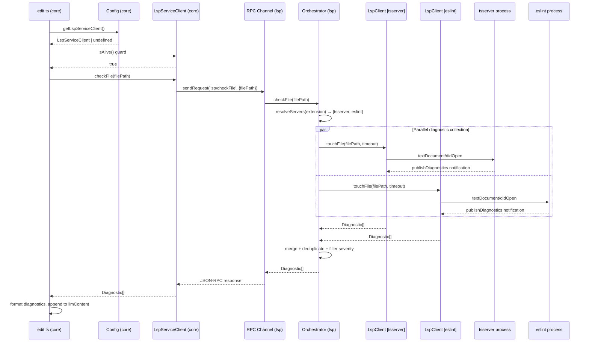
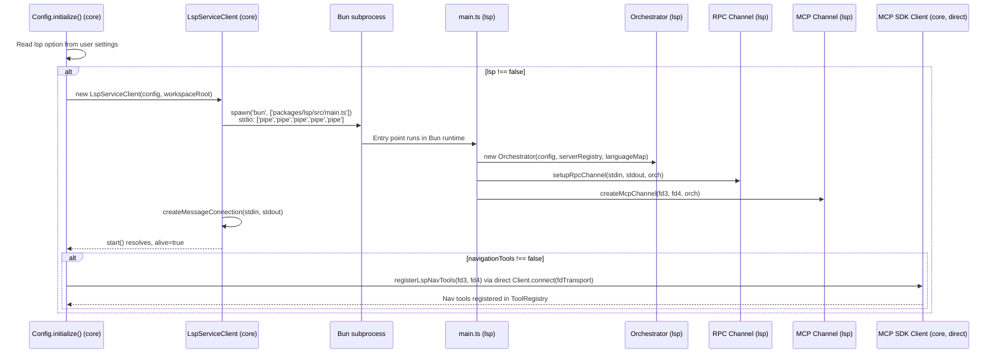
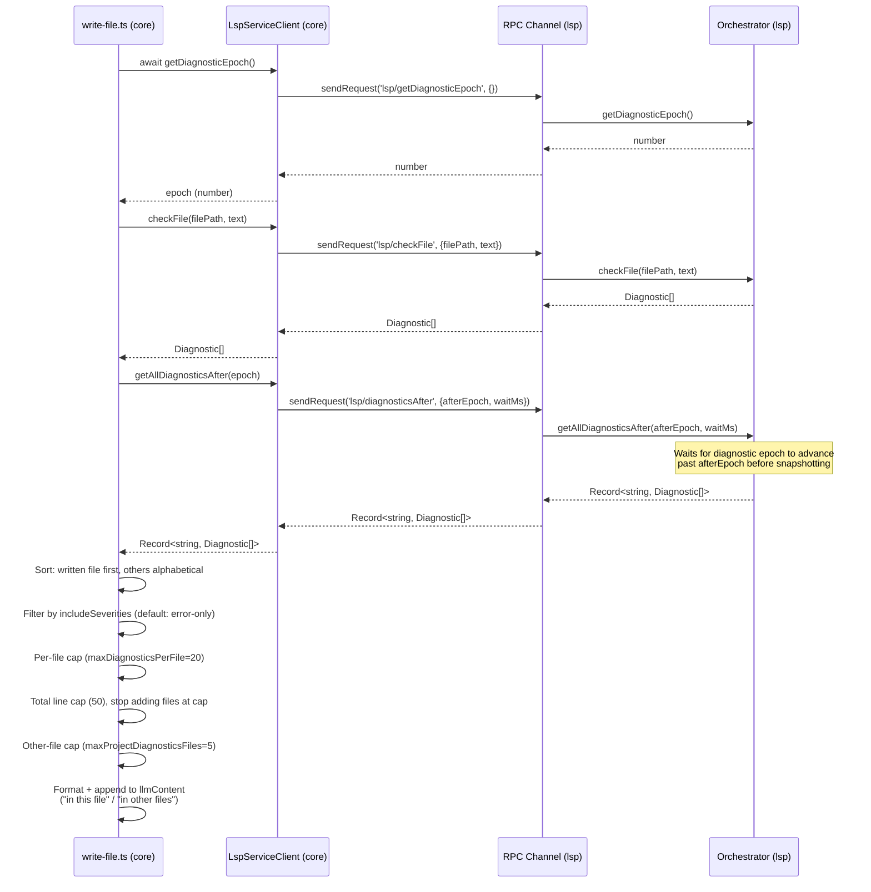
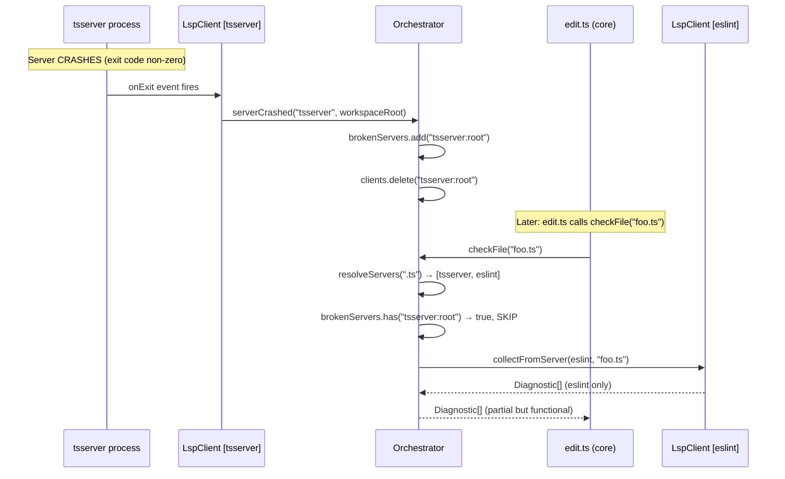

# Integration Contracts: LSP Feature (P02.5)

## Phase ID
`PLAN-20250212-LSP.P02.5`

## Prerequisites Verification
- Verified required completion marker exists: `project-plans/issue438/.completed/P02a.md`
- Verified prior phase marker exists: `project-plans/issue438/.completed/P02.md`
- Source plan reviewed: `project-plans/issue438/plan/02.5-integration-contracts.md`

## Component Interaction Flows

### Flow 1: Diagnostic Collection (Edit Tool)



### Flow 2: LSP Service Startup



### Flow 3: Write Tool Multi-File Diagnostics



### Flow 4: Server Crash Recovery



## Interface Boundary Contracts

### Contract 1: Core ↔ LSP Service (JSON-RPC)

```typescript
// Wire format: JSON-RPC 2.0
// Transport: stdin/stdout of spawned Bun process

interface CheckFileParams {
  filePath: string;
  text?: string;
}

interface DiagnosticsAfterParams {
  afterEpoch: number;
  waitMs?: number;
}

// Requests
// - lsp/checkFile(CheckFileParams) -> Diagnostic[]
// - lsp/diagnostics({}) -> Record<string, Diagnostic[]>
// - lsp/getDiagnosticEpoch({}) -> number
// - lsp/diagnosticsAfter(DiagnosticsAfterParams) -> Record<string, Diagnostic[]>
// - lsp/status({}) -> ServerStatus[]
// - lsp/shutdown({}) -> void

// Notification
// - lsp/ready (no response)

// Abort semantics
// AbortSignal cancels waiting locally. Best-effort partial/empty results are returned
// rather than throwing abort errors across boundaries.
```

### Contract 2: Core ↔ LSP MCP Navigation (fd3/fd4)

```typescript
// Wire format: MCP protocol over JSON-RPC
// Transport: fd3/fd4

// Tools and responses
// - lsp_goto_definition({ file, line, character })
//   -> { locations: Array<{ file, line, character }> }
// - lsp_find_references({ file, line, character })
//   -> { locations: Array<{ file, line, character }> }
// - lsp_hover({ file, line, character })
//   -> { content: string } | { content: null }
// - lsp_document_symbols({ file })
//   -> { symbols: Array<{ name, kind, range }> }
// - lsp_workspace_symbols({ query })
//   -> { symbols: Array<{ name, kind, file, range }> }
// - lsp_diagnostics({})
//   -> { diagnostics: Record<string, Array<{ line, character, severity, message, code? }>> }
```

### Contract 3: Orchestrator ↔ LspClient

```typescript
interface LspClientContract {
  touchFile(filePath: string, timeoutMs: number, text?: string, signal?: AbortSignal): Promise<Diagnostic[]>;
  getCurrentDiagnostics(): Map<string, Diagnostic[]>;
  gotoDefinition(file: string, line: number, char: number): Promise<Location[]>;
  findReferences(file: string, line: number, char: number): Promise<Location[]>;
  hover(file: string, line: number, char: number): Promise<HoverResult | null>;
  documentSymbols(file: string): Promise<DocumentSymbol[]>;
  isInitializing(): boolean;
  getPid(): number | undefined;
  onCrash(callback: () => void): void;
  shutdown(): Promise<void>;
  getDiagnosticEpoch(): number;
  waitForDiagnosticEpoch(target: number, timeoutMs: number): Promise<boolean>;
}

// Orchestrator responsibilities:
// - composite-keyed client map (serverId:workspaceRoot)
// - single-flight startup guard
// - parallel collection via Promise.allSettled
// - broken server tracking and skip behavior
// - per-client operation queue
// - known file diagnostic source tracking
```

### Contract 4: Config ↔ LspServiceClient

```typescript
// Config fields and accessors
// - private lspServiceClient?: LspServiceClient
// - getLspServiceClient(): LspServiceClient | undefined
// - getLspConfig(): LspConfig | undefined

// Tool usage boundaries
// - isAlive() gate before LSP operations
// - checkFile(path, text?) -> Diagnostic[]
// - getDiagnosticEpoch() -> Promise<number>
// - getAllDiagnosticsAfter(epoch) -> Promise<Record<string, Diagnostic[]>>
// - getAllDiagnostics() -> Promise<Record<string, Diagnostic[]>>
// - getUnavailableReason() -> string | undefined
```

## Lifecycle Contracts

### Startup Order
1. `Config.initialize()` executes.
2. Base tool and extension initialization completes.
3. LSP config is read.
4. If enabled, instantiate `LspServiceClient`.
5. `start()` spawns Bun LSP service.
6. `lsp/ready` notification must be observed before `alive=true`.
7. If navigation tools enabled, register MCP tools over fd3/fd4.
8. Startup failures degrade gracefully to non-LSP mode.

### Diagnostic Collection Order
1. Tool writes file changes.
2. Success message body starts.
3. LSP availability is checked (`isAlive`).
4. Write tool captures epoch (`getDiagnosticEpoch`).
5. `checkFile` triggers diagnostics refresh.
6. Write tool requests `getAllDiagnosticsAfter(epoch)`.
7. Diagnostic formatting and caps are applied.
8. Diagnostic content is appended to tool response.
9. Failures are non-fatal and do not block primary tool success path.

### Shutdown Order
1. Config cleanup calls `lspServiceClient.shutdown()` and awaits it.
2. `lsp/shutdown` RPC attempted first.
3. Timeout fallback kills process group (`-pid`) to include child language servers.
4. Client reference cleared.

## Vertical Slice Integration Test Strategy

1. **Edit → Diagnostics**: exercise end-to-end edit path and assert appended diagnostics.
2. **Write → Multi-file diagnostics**: assert ordering, severity filtering, and caps.
3. **Graceful degradation**: verify no hard failures when LSP disabled/unavailable.
4. **Crash recovery**: verify broken server is skipped and flow remains functional.
