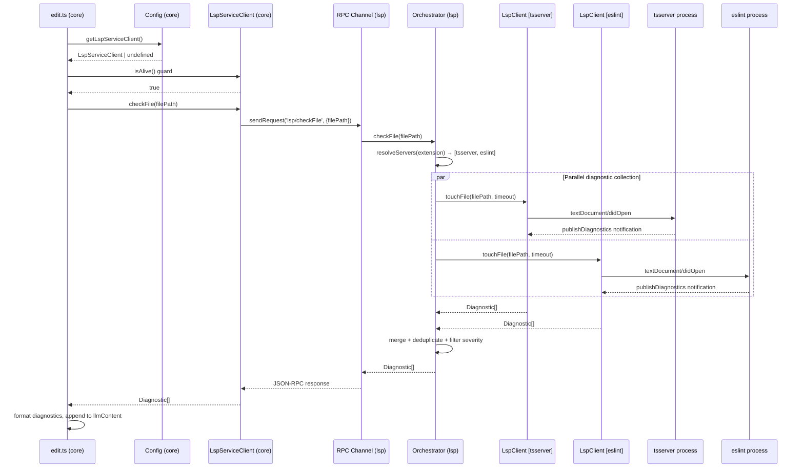
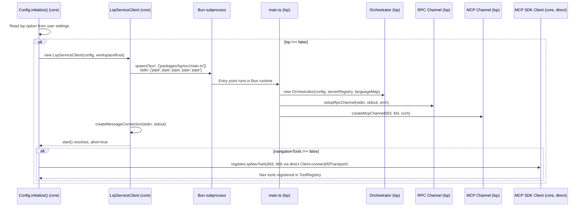
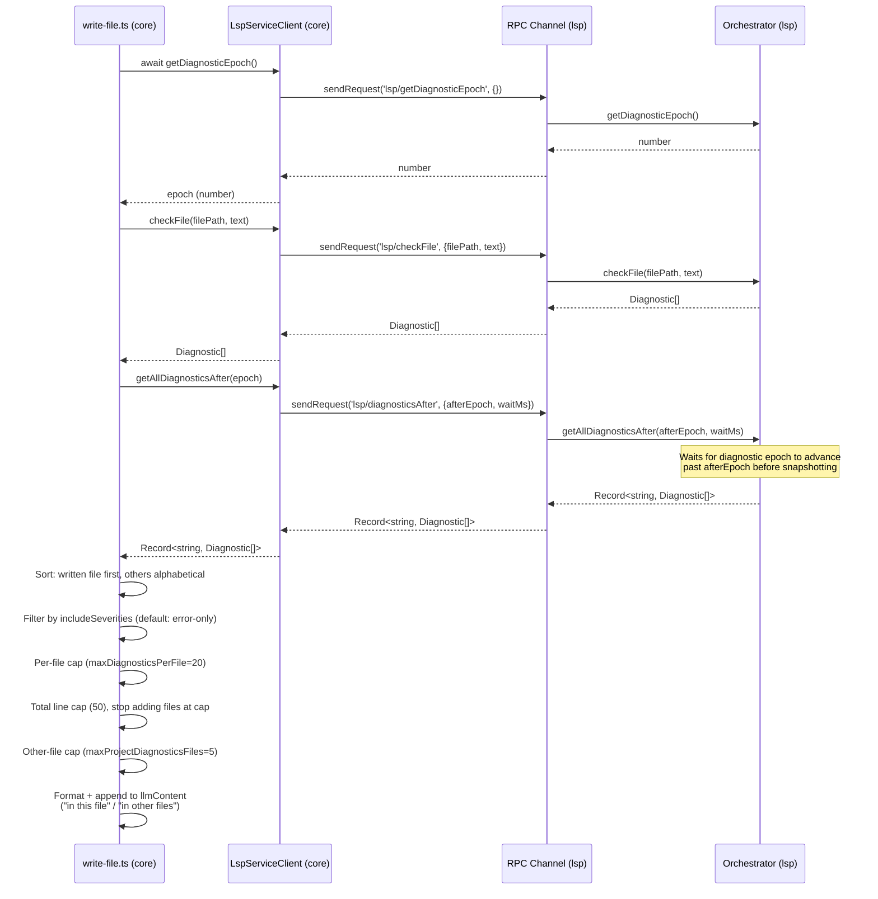
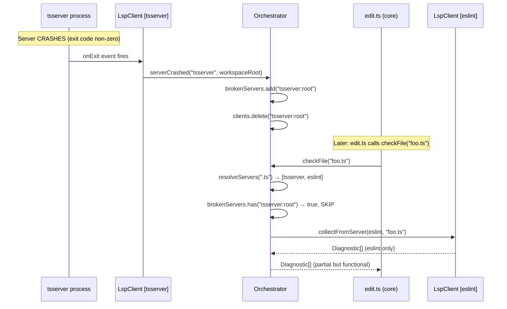

# Phase 02.5: Integration Contract Definition

## Phase ID
`PLAN-20250212-LSP.P02.5`

## Prerequisites
- Required: Phase 02a pseudocode verification completed
- Verification: `test -f project-plans/issue438/.completed/P02a.md`

## Purpose

This feature involves 14 components across 2 packages. Integration contracts must be defined BEFORE implementation to prevent contract mismatches discovered late.

## Component Interaction Flows

### Flow 1: Diagnostic Collection (Edit Tool)



**Detailed step reference:**

```
Step  Component                    Action                                    Data
────  ─────────────────────────    ─────────────────────────────────────     ────────────────────────────
 1    edit.ts (core)               config.getLspServiceClient()              → LspServiceClient | undefined
 2    edit.ts (core)               lspClient.isAlive() guard                 → boolean
 3    edit.ts (core)               lspClient.checkFile(filePath)             → sends JSON-RPC request
 4    LspServiceClient (core)      connection.sendRequest('lsp/checkFile')   → { filePath: string }
 5    RPC Channel (lsp)            handler receives request                  → delegates to orchestrator
 6    Orchestrator (lsp)           resolveServers(extension)                 → [tsserver, eslint]
 7    Orchestrator (lsp)           PARALLEL: collectFromServer × N           → Promise.allSettled
 8a   LspClient [tsserver]        touchFile(filePath, timeout)              → textDocument/didOpen
 8b   LspClient [eslint]          touchFile(filePath, timeout)              → textDocument/didOpen
 9a   tsserver process            publishDiagnostics notification            → Diagnostic[]
 9b   eslint process              publishDiagnostics notification            → Diagnostic[]
10    Orchestrator (lsp)           merge + deduplicate + filter severity      → Diagnostic[]
11    RPC Channel (lsp)            JSON-RPC response                         → Diagnostic[]
12    LspServiceClient (core)      connection receives response              → Diagnostic[]
13    edit.ts (core)               format diagnostics, append to llmContent  → "<diagnostics>..."
```

### Flow 2: LSP Service Startup



**Detailed step reference:**

```
Step  Component                    Action                                    Notes
────  ─────────────────────────    ─────────────────────────────────────     ────────────────────────────
 1    Config.initialize() (core)   Read lsp option from user settings        lsp: false | LspConfig | absent
 2    Config (core)                If lsp !== false: new LspServiceClient()  Pass LspConfig + workspaceRoot
 3    LspServiceClient (core)      start(): spawn Bun subprocess             stdio: ['pipe','pipe','pipe','pipe','pipe']
                                   env includes LSP_BOOTSTRAP JSON           [RESEARCH DD-2] Single env var
                                   detached: true (own process group)        Enables process.kill(-pid, signal) at shutdown
 4    Bun subprocess               Entry: packages/lsp/src/main.ts           Runs in Bun runtime
 5    main.ts (lsp)                Parse LSP_BOOTSTRAP env var               [RESEARCH DD-2] { workspaceRoot, config }
 5a   main.ts (lsp)                new Orchestrator(config, serverRegistry, languageMap)  Single shared instance
 6    main.ts (lsp)                setupRpcChannel(stdin, stdout, orch)       JSON-RPC on fd0/fd1
 7    main.ts (lsp)                createMcpChannel(fd3, fd4, orch)           MCP on fd3/fd4
 7a   main.ts (lsp)                Send lsp/ready notification on stdout      [RESEARCH DD-1] Ready handshake
 8    LspServiceClient (core)      Wait for lsp/ready notification (10s)      [RESEARCH DD-1] Blocks until ready
 8a   LspServiceClient (core)      alive = true after ready received          JSON-RPC client ready
 9    Config (core)                If navigationTools !== false:              Register MCP nav tools from fd3/fd4
10    Config (core)                Create MCP SDK Client directly,            [RESEARCH Source 4] Direct Client.connect(transport),
                                   connect with custom Transport on fd3/fd4   NOT McpClientManager — bypasses it entirely
10a   Config (core)                Register discovered tools in ToolRegistry  Nav tools in LLM tool list
```

### Flow 3: Write Tool Multi-File Diagnostics



**Detailed step reference:**

```
Step  Component                    Action                                    Data
────  ─────────────────────────    ─────────────────────────────────────     ────────────────────────────
 1    write-file.ts (core)         const epoch = await lspClient.getDiagnosticEpoch()  → number
                                                                               Capture epoch BEFORE checkFile (ASYNC RPC call
                                                                               to lsp/getDiagnosticEpoch — no local epoch mirror)
 2    write-file.ts (core)         const diags = await lspClient.checkFile(filePath, text)  → Diagnostic[]
                                                                               checkFile returns Diagnostic[] (simple)
                                                                               Side effect: orchestrator increments its epoch
 3    write-file.ts (core)         const allDiags = await lspClient.getAllDiagnosticsAfter(epoch)  → Record<string, Diagnostic[]>
                                                                              Waits for epoch to advance past captured value,
                                                                              then snapshots all known-file diagnostics
 4    write-file.ts (core)         Sort: written file first, others alpha     Deterministic ordering
 5    write-file.ts (core)         Filter by includeSeverities               Default: error-only
 6    write-file.ts (core)         Per-file cap (maxDiagnosticsPerFile=20)    Per file, within budget
 7    write-file.ts (core)         Total line cap (50)                        Stop adding files at cap
 8    write-file.ts (core)         Other-file cap (5)                         Max 5 non-written files
 9    write-file.ts (core)         Format + append to llmContent              "in this file" / "in other files"
```

### Flow 4: Server Crash Recovery



**Detailed step reference:**

```
Step  Component                    Action                                    Result
────  ─────────────────────────    ─────────────────────────────────────     ────────────────────────────
 1    tsserver process             CRASHES (exit code non-zero)               Process dies
 2    LspClient (tsserver)         onExit handler fires                       Detects crash
 3    LspClient → Orchestrator     serverCrashed(serverId, workspaceRoot)     Callback invocation
 4    Orchestrator                 brokenServers.add(clientKey)               Permanently marked broken
 5    Orchestrator                 clients.delete(clientKey)                  Reference cleaned up

      --- Later: edit.ts calls checkFile("foo.ts") ---

 6    Orchestrator                 resolveServers(".ts") → [tsserver, eslint] Both configured
 7    Orchestrator                 brokenServers.has("tsserver:root") → true  tsserver SKIPPED
 8    Orchestrator                 collectFromServer(eslint, filePath)        eslint only
 9    Orchestrator                 Returns eslint diagnostics only            Partial but functional
```

## Interface Boundary Contracts

### Contract 1: Core ↔ LSP Service (JSON-RPC)

```typescript
// Wire format: JSON-RPC 2.0
// Transport: stdin/stdout of spawned Bun process

// REQUEST: lsp/checkFile
interface CheckFileParams {
  filePath: string;  // absolute path
  text?: string;     // [RESEARCH — Design Decision 3] optional file content, authoritative if present
  // NOTE: signal?: AbortSignal can be used client-side to abort the RPC request wait.
  // The signal is NOT sent over the wire — it cancels the local Promise.
}
// RESPONSE: Diagnostic[] — from packages/core/src/lsp/types.ts
// INVARIANT: lsp/checkFile always returns Diagnostic[]. The epoch is obtained via
// separate lsp/getDiagnosticEpoch call. These two contracts must not be merged.

// REQUEST: lsp/diagnostics
interface DiagnosticsParams {}
// RESPONSE: Record<string, Diagnostic[]> — keys are relative paths, sorted alphabetically

// REQUEST: lsp/getDiagnosticEpoch
// No params
// RESPONSE: number — current orchestrator diagnostic epoch
// NOTE: This is the ONLY way to obtain the epoch. LspServiceClient has NO local epoch
// mirror — getDiagnosticEpoch() always makes this RPC call to the server. This eliminates
// divergence between client-side and server-side epoch on error/abort/empty-result paths.

// REQUEST: lsp/diagnosticsAfter
interface DiagnosticsAfterParams {
  afterEpoch: number;   // epoch value captured before checkFile
  waitMs?: number;      // max ms to wait for propagation (default 250)
}
// RESPONSE: Record<string, Diagnostic[]> — keys are relative paths, sorted alphabetically

// REQUEST: lsp/status
interface StatusParams {}
// RESPONSE: ServerStatus[]

// REQUEST: lsp/shutdown
interface ShutdownParams {}
// RESPONSE: void

// NOTIFICATION: lsp/ready (lsp → core, no response expected)
// [RESEARCH — Design Decision 1: Startup handshake]
// Sent by Bun process on stdout after all setup is complete.
// LspServiceClient waits for this before setting alive=true.
// If not received within 10s, service is marked dead.
// Wire format: {"jsonrpc":"2.0","method":"lsp/ready","params":{}}
```

// ABORT SEMANTICS (all layers): When AbortSignal fires, each layer returns its
// best-effort result immediately (empty array or partial diagnostics). No layer
// rejects on abort. This is consistent from edit.ts → LspServiceClient → RPC →
// Orchestrator → LspClient. AbortSignal is translated to JSON-RPC CancellationToken
// at the LspServiceClient boundary for server-side early return.

### Contract 2: Core ↔ LSP MCP Navigation (fd3/fd4)

```typescript
// Wire format: MCP protocol over JSON-RPC
// Transport: fd3 (read) / fd4 (write) of spawned Bun process

// Tools exposed with precise return types:

// lsp_goto_definition({ file: string, line: number, character: number })
//   → { locations: Array<{ file: string, line: number, character: number }> }

// lsp_find_references({ file: string, line: number, character: number })
//   → { locations: Array<{ file: string, line: number, character: number }> }

// lsp_hover({ file: string, line: number, character: number })
//   → { content: string } | { content: null }

// lsp_document_symbols({ file: string })
//   → { symbols: Array<{ name: string, kind: string, range: { startLine: number, startChar: number, endLine: number, endChar: number } }> }

// lsp_workspace_symbols({ query: string })
//   → { symbols: Array<{ name: string, kind: string, file: string, range: { startLine: number, startChar: number, endLine: number, endChar: number } }> }

// lsp_diagnostics({})
//   → { diagnostics: Record<string, Array<{ line: number, character: number, severity: string, message: string, code?: string }>> }
```

### Contract 3: Orchestrator ↔ LspClient

```typescript
// LspClient exposes:
interface LspClientContract {
  touchFile(filePath: string, timeoutMs: number, text?: string, signal?: AbortSignal): Promise<Diagnostic[]>;
  getCurrentDiagnostics(): Map<string, Diagnostic[]>;
  gotoDefinition(file: string, line: number, char: number): Promise<Location[]>;
  findReferences(file: string, line: number, char: number): Promise<Location[]>;
  hover(file: string, line: number, char: number): Promise<HoverResult | null>;
  documentSymbols(file: string): Promise<DocumentSymbol[]>;
  isInitializing(): boolean;
  getPid(): number | undefined;
  onCrash(callback: () => void): void;
  shutdown(): Promise<void>;
  // [RESEARCH FIX — Bug 2] Diagnostic epoch API for freshness tracking
  getDiagnosticEpoch(): number;
  waitForDiagnosticEpoch(target: number, timeoutMs: number): Promise<boolean>;
}

// Orchestrator manages:
// - Map<string, LspClient> keyed by serverId:workspaceRoot (composite key)
// - Lazy startup via server registry with single-flight guard (startupPromises)
// - Parallel diagnostic collection from multiple clients via Promise.allSettled
// - Broken server tracking (permanent for session)
// - Per-client operation queue (ClientOpQueue) for write/read serialization
// - Known-files tracking (knownFileDiagSources) keyed by serverId:workspaceRoot
```

### Contract 4: Config ↔ LspServiceClient

```typescript
// Config stores:
//   private lspServiceClient?: LspServiceClient
//
// Config exposes:
//   getLspServiceClient(): LspServiceClient | undefined
//   getLspConfig(): LspConfig | undefined
//
// Tools call:
//   config.getLspServiceClient()?.isAlive()  // guard check
//   config.getLspServiceClient()?.checkFile(path)  // diagnostic trigger → Diagnostic[]
//   await config.getLspServiceClient()?.getDiagnosticEpoch()  // epoch before checkFile (write tool, ASYNC RPC call)
//   config.getLspServiceClient()?.getAllDiagnosticsAfter(epoch)  // multi-file with freshness
//   config.getLspServiceClient()?.getAllDiagnostics()  // multi-file result (no freshness wait)
//   config.getLspServiceClient()?.getUnavailableReason()  // why LSP is disabled (REQ-STATUS-035)
```

## Lifecycle Documentation

### Service Startup Order

1. Config.initialize() runs (ASYNC)
2. Tool registry, MCP servers, extensions initialized (ASYNC)
3. LSP config is read from options (SYNC)
4. If lsp !== false: create LspServiceClient (SYNC)
5. Call lspServiceClient.start() (ASYNC) — spawns Bun subprocess
6. If start succeeds AND isAlive(): store client reference (SYNC)
7. If navigationTools !== false: register MCP server from fd3/fd4 (ASYNC)
8. If any step fails: log debug, continue without LSP (NON-FATAL)

### Diagnostic Collection Order

1. Edit/write tool writes file to disk (SYNC)
2. Build success message in llmSuccessMessageParts (SYNC)
3. Check config.getLspServiceClient()?.isAlive() (SYNC)
4. For write tool: capture epoch = await lspClient.getDiagnosticEpoch() (ASYNC RPC call)
5. Call checkFile(filePath, text?) — returns Diagnostic[], triggers LSP update (ASYNC, timeout-bounded)
6. For write tool: call getAllDiagnosticsAfter(epoch) (ASYNC) — waits for propagation
7. Format diagnostics, apply severity→perfile→total caps (SYNC)
8. Append to llmSuccessMessageParts (SYNC)
9. Any failure in steps 3-8: catch, silently continue (SYNC)

### Session Shutdown Order

1. Config cleanup/dispose is called (ASYNC)
2. If lspServiceClient exists: call shutdown() (ASYNC)
3. shutdown() sends lsp/shutdown JSON-RPC request (ASYNC, brief timeout)
4. If no response in timeout: kill subprocess forcefully via process group (SYNC)
   - Subprocess MUST be spawned with `detached: true` so it gets its own process group
   - Kill uses `process.kill(-subprocess.pid, 'SIGTERM')` — negative PID targets entire process group
   - Fallback after 2s: `process.kill(-subprocess.pid, 'SIGKILL')`
   - Guard: `if (subprocess.pid)` before kill calls (pid may be undefined if spawn failed)
   - This ensures child LSP server processes (tsserver, gopls, etc.) spawned by the Bun service are also terminated
5. Set lspServiceClient = undefined (SYNC)

**WARNING**: Step 2 MUST be awaited. Fire-and-forget will leave zombie LSP processes.

**WARNING**: Step 4 kill MUST target the process group (child process may have spawned language server subprocesses). Always use `process.kill(-pid, signal)`, never `subprocess.kill(signal)`.

## Integration Test Strategy (Vertical Slice)

### Test 1: Edit → Diagnostics Flow
- Create fake LSP server fixture (minimal server that returns canned diagnostics)
- Spawn LSP service with the fake server
- Edit a file through the tool invocation path
- Assert diagnostics appear in llmContent
- **Components exercised**: edit.ts → Config → LspServiceClient → RPC Channel → Orchestrator → LspClient → Fake Server → back

### Test 2: Write → Multi-File Diagnostics Flow
- Same fake server, configured to return diagnostics for multiple files
- Write a file through the write tool invocation path
- Assert multi-file diagnostics appear with correct ordering and caps
- **Components exercised**: write-file.ts → Config → LspServiceClient → RPC Channel → Orchestrator → LspClient → Fake Server → back

### Test 3: Graceful Degradation
- Start with LSP disabled (lsp: false)
- Edit a file
- Assert no diagnostics, no errors
- Start with LSP enabled but Bun not available
- Edit a file
- Assert no diagnostics, no errors

### Test 4: Crash Recovery
- Start LSP service with a server that crashes after first request
- Edit a file (server crashes)
- Edit same file again
- Assert second edit succeeds with no diagnostics (server is broken)

## Phase Completion Marker
Create: `project-plans/issue438/.completed/P02.5.md`
