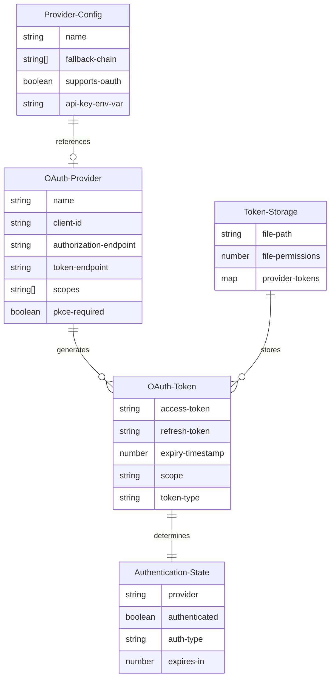
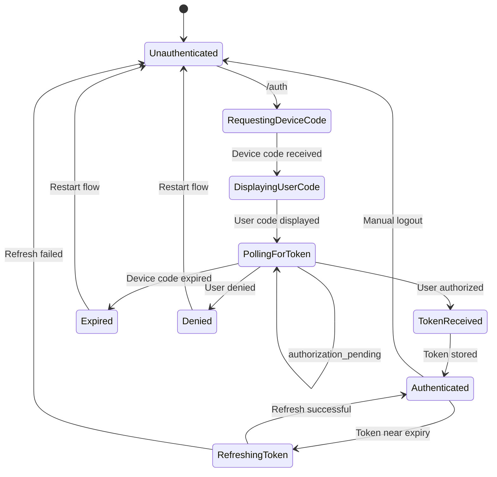

# Qwen OAuth Integration: Domain Model Analysis

## Executive Summary

This document provides a comprehensive domain model analysis for integrating Qwen OAuth authentication into the llxprt-code system. The analysis examines entity relationships, state transitions, business rules, and security considerations based on existing Gemini OAuth patterns and the requirements defined in REQ-001 through REQ-006.

## 1. Domain Entities and Relationships

### 1.1 Core Domain Entities



### 1.2 Entity Definitions

#### OAuth Provider
- **Purpose**: Configuration metadata for OAuth-enabled AI providers
- **Key Properties**:
  - `name`: Unique identifier ("gemini", "qwen")
  - `clientId`: OAuth 2.0 client identifier
  - `authorizationEndpoint`: Device authorization endpoint URL
  - `tokenEndpoint`: Token exchange endpoint URL
  - `scopes`: Required OAuth scopes array
  - `pkceRequired`: PKCE enforcement flag

#### OAuth Token
- **Purpose**: Secure access credentials for authenticated sessions
- **Key Properties**:
  - `accessToken`: Bearer token for API authentication
  - `refreshToken`: Long-lived token for renewal (optional)
  - `expiryTimestamp`: Unix timestamp for expiration
  - `scope`: Granted permissions scope
  - `tokenType`: Always "Bearer" per OAuth 2.0 spec

#### Authentication State
- **Purpose**: Runtime representation of provider authentication status
- **Key Properties**:
  - `provider`: Provider name reference
  - `authenticated`: Current authentication validity
  - `authType`: Authentication method ("oauth", "api-key", "none")
  - `expiresIn`: Seconds until token expiry

### 1.3 Relationships and Cardinalities

- **One-to-Many**: Provider → Tokens (historical token versions)
- **One-to-One**: Active Token → Authentication State
- **Many-to-One**: Providers → Token Storage (shared storage layer)

## 2. State Transitions and Flows

### 2.1 OAuth Device Flow State Machine



### 2.2 State Transition Rules

#### From Unauthenticated
- **Trigger**: `/auth <provider>` command
- **Conditions**: Valid provider name, network connectivity
- **Actions**: Initialize device authorization flow
- **Next State**: RequestingDeviceCode

#### From RequestingDeviceCode
- **Trigger**: HTTP response from authorization endpoint
- **Conditions**: Valid device_code response
- **Actions**: Parse user_code and verification_uri
- **Next State**: DisplayingUserCode

#### From DisplayingUserCode
- **Trigger**: User code display complete
- **Conditions**: QR code generated, polling interval set
- **Actions**: Start background polling timer
- **Next State**: PollingForToken

#### From PollingForToken
- **Multiple Transitions**:
  - **authorization_pending**: Continue polling
  - **access_denied**: User rejected → Unauthenticated  
  - **expired_token**: Device code expired → Unauthenticated
  - **Token granted**: Tokens received → TokenReceived

#### From TokenReceived
- **Trigger**: Token validation successful
- **Conditions**: Token stored with correct permissions (0600)
- **Actions**: Cache authentication state
- **Next State**: Authenticated

#### From Authenticated
- **Automatic Transitions**:
  - **Token expires in 30s**: → RefreshingToken
  - **Manual logout**: → Unauthenticated
  - **Token validation fails**: → Unauthenticated

### 2.3 Critical State Invariants

1. **Token Consistency**: Active tokens must have valid expiry timestamps
2. **File Security**: Token files must maintain 0600 permissions
3. **State Coherence**: Authentication state must reflect actual token validity
4. **Polling Respect**: Device flow polling must honor server-specified intervals

## 3. Business Rules and Provider Selection

### 3.1 Authentication Precedence Hierarchy (REQ-004)

#### OpenAI Provider Chain
1. **Explicit --key parameter** (highest precedence)
2. **OPENAI_API_KEY environment variable**
3. **OAuth token** (lowest precedence)

#### Gemini Provider Chain  
1. **Explicit --key parameter** (highest precedence)
2. **Vertex AI credentials** (GOOGLE_APPLICATION_CREDENTIALS)
3. **GEMINI_API_KEY environment variable**
4. **OAuth token** (lowest precedence)

### 3.2 Authentication Method Resolution

```typescript
interface AuthMethodResolution {
  resolveAuthMethod(provider: string, context: AuthContext): AuthMethod;
}

type AuthMethod = {
  type: 'explicit-key' | 'env-var' | 'oauth' | 'vertex-ai';
  credential: string;
  priority: number;
}
```

### 3.3 Business Rule Enforcement

#### Rule: OAuth Command Separation (REQ-001)
- `/auth` command exclusively handles OAuth flows
- API key setup moved to separate commands
- Provider-specific OAuth: `/auth gemini`, `/auth qwen`

#### Rule: Token Refresh Buffer (REQ-002.5)
- Refresh tokens 30 seconds before expiry
- Prevent API call failures due to token expiration
- Automatic background refresh when possible

#### Rule: Backward Compatibility (REQ-006)
- Existing API key methods remain functional
- Current Gemini OAuth unaffected by Qwen addition
- ServerToolsProvider maintains Gemini exclusivity

### 3.4 Provider-Specific Business Rules

#### Qwen Provider Rules
- **Client ID**: Fixed to "f0304373b74a44d2b584a3fb70ca9e56"
- **PKCE Required**: SHA-256 code challenge mandatory
- **Endpoint**: https://chat.qwen.ai/api/v1/oauth2/device/code
- **Scope**: "openai" for OpenAI SDK compatibility

#### Gemini Provider Rules
- **OAuth Precedence**: Lower than Vertex AI and API keys
- **Scope**: Google Cloud Platform and user profile access
- **Token Storage**: Separate from MCP OAuth tokens
- **Client Registration**: Static client ID/secret

## 4. Edge Cases and Error Scenarios

### 4.1 Network and Connectivity Issues

#### Network Failure During Device Flow
- **Scenario**: Internet connection lost during polling
- **Handling**: 
  - Retry with exponential backoff
  - Respect polling interval on recovery
  - Timeout after 15 minutes per REQ constraints

#### DNS Resolution Failures
- **Scenario**: OAuth endpoints unreachable
- **Handling**:
  - Clear error message to user
  - Fallback to alternative auth methods
  - No infinite retry loops

### 4.2 Token Management Edge Cases

#### Concurrent Token Refresh
- **Scenario**: Multiple processes attempt token refresh simultaneously
- **Handling**:
  - File-based locking on token storage
  - Last-writer-wins with timestamp validation
  - Atomic file operations for consistency

#### Corrupted Token Files
- **Scenario**: Token file becomes unreadable or malformed
- **Handling**:
  - Graceful fallback to unauthenticated state
  - User notification of authentication reset needed
  - Automatic cleanup of corrupted files

#### Clock Skew Issues
- **Scenario**: System clock significantly out of sync
- **Handling**:
  - 5-minute buffer for token expiry checks (existing pattern)
  - Server token validation as authoritative
  - Warning messages for significant clock drift

### 4.3 User Experience Edge Cases

#### Browser Launch Failures
- **Scenario**: No browser available or launch fails
- **Handling**:
  - Display complete OAuth URL with clear copy instructions
  - Provide manual navigation instructions
  - QR code as alternative access method

#### User Code Entry Errors
- **Scenario**: User enters incorrect verification code
- **Handling**:
  - Clear error messages from OAuth server
  - Allow retry without restarting full flow
  - Timeout handling with restart option

### 4.4 Security Edge Cases

#### State Parameter Mismatch
- **Scenario**: CSRF attack or browser hijacking attempt
- **Handling**:
  - Immediate flow termination
  - Security event logging
  - User notification of potential security issue

#### Token Leakage Prevention
- **Scenario**: Tokens exposed in logs or error messages
- **Handling**:
  - Token redaction in all logging
  - Secure memory handling
  - No token persistence in temporary files

## 5. Security Considerations

### 5.1 OAuth 2.0 Security Best Practices

#### PKCE Implementation (REQ-002.2)
- **Code Verifier**: Cryptographically random, 128-bit entropy minimum
- **Code Challenge**: SHA-256 hash of verifier, base64url encoded
- **State Parameter**: Unique per flow, CSRF protection
- **Redirect URI**: Localhost loopback only for security

#### Token Security
- **Storage**: File permissions 0600 (owner read/write only)
- **Transport**: HTTPS mandatory for all OAuth endpoints
- **Scope Limitation**: Request minimal required scopes only
- **Expiry**: Honor server-specified expiration times

### 5.2 Threat Mitigation

#### Authorization Code Interception
- **Threat**: Malicious app intercepting redirect
- **Mitigation**: PKCE prevents code reuse, localhost-only redirect

#### Token Theft
- **Threat**: File system access by malicious process
- **Mitigation**: Restrictive file permissions, encrypted storage consideration

#### Replay Attacks
- **Threat**: Reuse of intercepted authorization codes
- **Mitigation**: PKCE code verifier validation, one-time use codes

#### Session Fixation
- **Threat**: Attacker fixes user's OAuth state
- **Mitigation**: Cryptographically random state parameter per session

### 5.3 Privacy Considerations

#### Token Minimization
- **Principle**: Store only necessary token information
- **Implementation**: Remove tokens immediately on logout
- **Audit**: Regular cleanup of expired tokens

#### Scope Limitation
- **Qwen**: Request only "openai" scope for API access
- **Gemini**: Minimize Google profile access to essential only

#### Data Retention
- **Policy**: No indefinite token storage
- **Implementation**: Automatic cleanup on extended inactivity
- **User Control**: Clear logout and data deletion options

## 6. Requirements Mapping

### REQ-001: OAuth Command Separation ✓
- **Domain Impact**: Command routing logic separated from authentication logic
- **Entity Changes**: AuthCommand entity with provider-specific routing
- **State Changes**: Command state machine independent of OAuth state machine

### REQ-002: Qwen OAuth Implementation ✓
- **Domain Impact**: New QwenOAuthProvider entity with device flow support
- **Entity Changes**: Qwen-specific OAuth configuration and token entities
- **State Changes**: Device authorization flow state machine

### REQ-003: Multi-Provider Token Storage ✓
- **Domain Impact**: Provider-keyed token storage with secure file handling
- **Entity Changes**: TokenStorage entity with provider mapping
- **Security**: File permission entity enforcing 0600 permissions

### REQ-004: Provider Authentication Fallback ✓
- **Domain Impact**: Hierarchical authentication resolution business rules
- **Entity Changes**: AuthPrecedenceResolver entity
- **Logic**: Provider-specific fallback chain implementation

### REQ-005: User Experience ✓
- **Domain Impact**: UX state tracking and progress indication
- **Entity Changes**: UIState entity for progress and error display
- **Interactions**: QR code generation and polling progress entities

### REQ-006: Backward Compatibility ✓
- **Domain Impact**: Existing authentication patterns preserved
- **Entity Changes**: Legacy auth method entities maintained
- **Migration**: Gradual transition support in domain logic

## 7. Implementation Considerations

### 7.1 Domain Service Architecture

```typescript
interface OAuthDomainServices {
  deviceFlowService: DeviceAuthorizationFlowService;
  tokenStorageService: MultiProviderTokenStorageService;
  authResolutionService: AuthenticationResolutionService;
  securityService: OAuthSecurityService;
}
```

### 7.2 Domain Events

- `TokenRefreshed`: Successful token renewal
- `TokenExpired`: Token reached expiry threshold
- `AuthenticationFailed`: Authentication attempt failed
- `ProviderSwitched`: User changed active provider

### 7.3 Invariant Enforcement

The domain model must enforce these critical invariants:
1. **Token expiry consistency**: Stored expiry must match actual token validity
2. **File security**: Token files must maintain secure permissions
3. **State synchronization**: Authentication state must reflect token validity
4. **Provider isolation**: Provider tokens must not interfere with each other

## Conclusion

This domain model provides a comprehensive foundation for implementing Qwen OAuth integration while preserving existing Gemini OAuth functionality. The analysis addresses all specified requirements while maintaining security best practices and ensuring robust error handling for production use.

The multi-provider architecture supports future OAuth provider additions through well-defined entity relationships and business rule patterns. State transition management ensures reliable authentication flows with appropriate error recovery mechanisms.