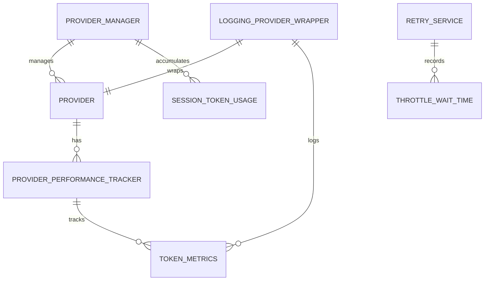

# Token Usage Tracking Domain Analysis

## Entity Relationships

## State Transitions

1. **ProviderPerformanceTracker State Transitions:**
   - Provider registered → Performance tracker initialized
   - Request begins → Token metrics reset for request
   - Streaming chunk received → ChunksReceived incremented, timing updated
   - Request completed → Token metrics recorded and aggregated
   - 429 error handled → ThrottleWaitTimeMs incremented
   - Metrics queried → Current metrics returned

2. **ProviderManager State Transitions:**
   - Provider registered → SessionTokenUsage initialized for provider
   - Token usage reported → SessionTokenUsage updated with new values
   - Metrics queried → Cumulative session metrics returned

3. **LoggingProviderWrapper State Transitions:**
   - Provider wrapped → Conversation ID and turn number initialized
   - Request processed → Token tracking initiated
   - Stream processed → Token metrics logged throughout streaming
   - Tool call invoked → Token usage attributed to tool category
   - Response completed → Token metrics finalized

## Business Rules

1. **Token Rate Calculation:**
   - Tokens per second = (input tokens + output tokens) / request duration (seconds)
   - Burst tokens per second = peak token generation rate within 1-second window
   - Both metrics should be updated for every API request

2. **Throttle Tracking:**
   - Wait time from 429 errors should be accumulated per provider per session
   - Retry mechanism should capture explicit wait time and contribute to metric
   - Time-based backoff (without explicit retry headers) should also be tracked

3. **Session Token Accumulation:**
   - ProviderManager should maintain cumulative token counts per provider
   - Token usage should be categorized as: input, output, cache, tool, thought
   - Total count should be maintained as sum of all categories

4. **Telemetry Integration:**
   - All enhanced token metrics should be logged through existing telemetry system
   - Logging should continue to respect redaction configuration
   - Metrics should be accessible through logging query interfaces

## Edge Cases

1. **Zero Duration Requests:**
   - If request duration is zero or near zero, tokens per second calculation should return 0 or handle gracefully
   - Burst calculation should use a minimum reasonable window

2. **Partial Token Usage Information:**
   - Not all providers may provide detailed token usage information
   - System should handle missing categories gracefully (default to 0)

3. **Long-Running Sessions:**
   - Session token usage might accumulate to very large numbers
   - Should not overflow integer limits in storage or calculations

4. **Concurrent Requests:**
   - Multiple concurrent requests to the same provider should not interfere with each other's metrics
   - Session cumulative counts should be thread-safe

## Error Scenarios

1. **Provider Response Format Changes:**
   - If provider's response format changes (e.g., token counting fields), the system should handle gracefully
   - Should fallback to estimation methods if precise token counts not available

2. **Logging Failures:**
   - Failure to log token metrics should not affect API request completion
   - System should warn but proceed normally

3. **Retry Logic Failures:**
   - If retry mechanism fails to capture wait times, throttle metrics should not be artificially inflated
   - System should log retry failures without breaking metric tracking

4. **Metrics Storage Issues:**
   - Should handle memory limitations gracefully
   - Should periodically flush metrics if logging to disk

## Requirements Coverage

This analysis covers all requirements from specification.md:
- [REQ-001.1] Track average tokens per second for each request
- [REQ-001.2] Track peak token generation rates (bursts) within short time windows
- [REQ-001.3] Track cumulative wait time due to 429 throttling errors
- [REQ-001.4] Track session-wide cumulative token usage including input, output, cache, tool and thought tokens
- [REQ-001.5] Maintain compatibility with existing token tracking systems